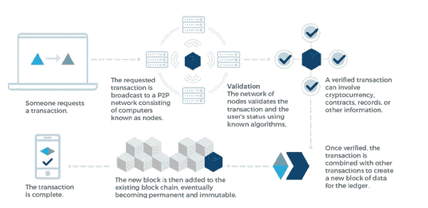

# 区块链——技术如何影响我们迈向可持续未来的旅程？

> 原文：<https://medium.datadriveninvestor.com/blockchain-how-can-technology-impact-our-journey-to-a-sustainable-future-7fb8934be355?source=collection_archive---------15----------------------->

Image via NASA on Unsplash

## 区块链技术可以应用于经常被误认为同义的加密货币之外。相反，这篇文章着眼于区块链在可持续发展和增强社会信任方面的应用。

区块链技术——一种可与互联网的崛起相媲美的新兴范式转变:[【1】](#_ftn1)承诺权力、透明度和安全性的去中心化，超过 10 亿美元的风险投资资金已经投资于区块链相关公司。[【2】](#_ftn2)技术让组织重新思考我们的治理模式，以及共享和存储信息。

## 简单回顾一下——什么是区块链？

区块链是一种跨越多个参与者的网络托管的*分布式数据库*。它提供了一种以快速、可跟踪和安全的方式共享信息和转移数字资产的方式(Ko & Verity，2016)。世界经济论坛(2017)将区块链技术定义为“分布式，而非集中式(不像互联网)；公开，不隐藏；包容，不排斥；不可变的，不可改变的；而且安全。”

此外，区块链上的信息或资产是可问责的、防篡改的——交易不会受到影响、黑客攻击或逆转。由于加密技术取代了中央实体，这些特性得以实现。存储在区块链上的信息可以是任何有价值的象征或共享数据价值。因此，它可以是任何东西，从货币支付到知识产权和个人数据(Ko & Verity，2016)。

## 它是如何工作的？

本质上，区块链技术*允许参与者在没有中央实体的情况下交换信息*。相反，它会自动创建和维护一个分布式网络。区块链网络由许多被称为“矿工”的个人计算机组成，这些计算机构成了网络的供应方。

信息被打包成块并密封起来。然后将每个块添加到前一个块上，形成一个链。通过使用分布式分类帐技术,“块链”不是集中存储，而是在整个参与者网络中复制和分发——可能是个人、非政府组织、公共机构、企业。每当有人向链中添加一个新块，它就被同时添加到每个人的副本中。[【3】](#_ftn1)

Transaction process on a blockchain. [[3]](#_ftn1)

## 信任——重要的社会结构

区块链通常被称为“无信任”或“信任最小化”。这是由于其固有的性质——基于密码技术和共识算法的*——区块链技术是*分散、透明和可验证的*。这反过来又在群体中的行动者、个人或组织之间创造了信任，因为信任不再是一个问题。[【3】](#_ftn1)*本质上，透明性、不变性、弹性和去中心化的结合创造了一个安全的空间，其中整个系统的完整性——每个参与者和每个交易——由网络支持。**

很大程度上， [*社会可持续发展原则*](https://www.diva-portal.org/smash/get/diva2:852857/FULLTEXT02.pdf) 的一个基本方面强调了信任的重要性。充满活力和弹性的社会结构有几个基本要素。信任显得尤为重要。

信任可以被看作是将社会系统结合在一起的粘合剂。它与低水平的腐败、民主稳定和相对的经济平等联系在一起。当人们相互信任，不受性别、年龄、文化和能力的影响时，就更容易合作和一起创新。而且，当人们信任公共机构时，建立一个运转良好的社会就变得更加容易。反之亦然，当信任受到侵蚀时，我们会遇到越来越多的问题，例如隔离、腐败、冲突和犯罪率上升。[【4】](#_ftn1)

因此，区块链可以在促进建立有弹性的社会结构方面发挥重要作用。这意味着更多的包容性和平等的权力。由于信息分散，每个人都可以透明地访问存储在区块链上的信息。这反过来又会导致一个更透明、更负责任的社会。

## 区块链和可持续发展

区块链允许人们直接相互交易和分享信息，消除了对中间人的需求，创造了一个去中心化的网络。因此，不出所料，中央集权机构、传统机构和政府对这项技术犹豫不决，甚至怀有敌意。特别是，随着中国和越南在 2017 年禁止加密货币，加密货币正在受到关注。[【5】](#_ftn1)

> 然而，这个问题还有另一面。根据联合国开发计划署最近的出版物:
> 
> “区块链技术的变革力量不应被视为对现有治理体系的威胁；相反，它应被视为一个机会，让国家和国际机构捍卫它们所代表的那些人的权利，并加快我们实现联合国可持续发展目标的集体进展。"

此外，作者认为区块链可以给复杂、不透明和腐败的系统带来透明度。该技术能够为商业流程提供可验证性。重要的是，它可以确保个人隐私，同时保证自主权，并为脆弱的基础设施带来安全性和弹性。区块链可以促进各种可持续发展、人道主义和环境倡议，充分发挥其潜力。[【3】](#_ftn1)

因此，区块链有许多应用程序为更可持续的世界创造了机会:

1.增加不透明的复杂供应链的透明度；关于个人和集体行动的透明信息。

2.减少官僚作风和权力不对称；强化问责循环。

3.用目标驱动的令牌激励对社会负责和环境友好的行为。[【第六期】](#_ftn2)

让我们看一个基于区块链的可持续发展应用的例子。

## 案例:塑料回收的证明——将塑料垃圾变成数字货币

[塑料银行](https://www.plasticbank.com/)——一家位于加拿大温哥华的社会企业，旨在利用回收来减少海洋塑料和全球贫困。该企业始于 2013 年，目前在海地运营，最近在菲律宾运营，并计划扩展到巴西和印度尼西亚。

该公司鼓励人们收集塑料垃圾，并将其运送到当地的处理中心。

> 塑料银行的创始人大卫·卡茨解释说:“我意识到我们必须挑战我们对塑料的看法，使它成为一种太有价值的商品，而不是简单地扔进河流或小溪中”。

因此，作为奖励，收藏者可以获得现金支付，或者其他改变生活的奖励，比如孩子上学、食物或电话充值。最近，另一种支付形式成为可能，因为塑料银行与 IBM 合作推出了另一项创新。[【7】](#_ftn1)*区块链技术用于跟踪回收塑料从收集、信贷、补偿到交付给公司再利用的整个周期*。基于*区块链动力代币奖励*的系统支持塑料废物的回收，并鼓励收集塑料以换取有价值的商品。

Image via The Plastic Bank.

这项发明主要针对塑料收集者，使他们能够跟踪他们收集了多少。然而，这项技术也提供了一个数字钱包，通过它他们可以存储他们的收入。这对那些由于某种原因没有也不能有银行账户的人来说尤其重要，对他们来说随身携带现金是很危险的。

值得注意的是，区块链科技还允许企业合作伙伴跟踪项目的每一笔投资，并跟踪下游，直到他们支持的当地回收企业家。因此，他们见多识广，能够看到对世界上最贫穷社区的积极影响和自己的贡献。

## 区块链是工具，不是银弹

最终，建设一个可持续的未来和实现可持续发展目标将需要大量的创新和试验，更重要的是，需要一个超越各自为政的“政府整体”方法。区块链技术如果使用正确，可以加速和促进这种转变，并带来对共同目标的共同理解，并自动信任，这要归功于其去中心化和分布式的性质。

然而，重要的是要记住，区块链技术不能强迫人们以有益于社会和环境的方式行事。一个更加可持续发展的世界不会自动发生变化。区块链技术和令牌发明机制有很大的潜力来促进过渡。然而，该技术只是一种工具，而不是银弹。[【第六期】](#_ftn2)

> *最后，正如使用区块链的开放合作平台 BLOC 的首席执行官 Deanna Macdonald 所说:*“所有应对气候变化的因素与区块链没有太大关系。这项技术能做的是为消费者、零售商和生产商提供选择可持续做法的机会，但责任仍在人们自己身上。”[【9】](#_ftn3)

[【1】](#_ftnref1)[https://hacker noon . com/95 percent-区块链-科技-d28673e55673](https://hackernoon.com/95percent-blockchain-technology-d28673e55673)

[【2】](#_ftnref2)[https://www.coindesk.com/bitcoin-venture-capital/](https://www.coindesk.com/bitcoin-venture-capital/)

[【3】](#_ftnref1)[http://www . UNDP . org/content/UNDP/en/home/library page/corporate/the-future-is-decentralized . html](http://www.undp.org/content/undp/en/home/librarypage/corporate/the-future-is-decentralised.html)

[【4】](#_ftnref1)米西默 M (2015)。战略性可持续发展框架内的社会可持续性。布莱金格理工学院战略可持续发展系。ISBN978–91–7295–307–9

[【5】](#_ftnref1)[https://www . mirror . co . uk/tech/why-banks-hate-比特币-加密货币-11433562](https://www.mirror.co.uk/tech/why-banks-hate-bitcoin-cryptocurrency-11433562)

[【6】](#_ftnref2)[https://medium . com/crypto 3 economics/区块链-可持续发展-7d1dd90e9db6](https://medium.com/crypto3conomics/blockchain-sustainability-7d1dd90e9db6)

[【7】](#_ftnref1)[https://www.ibm.com/case-studies/plastic-bank](https://www.ibm.com/case-studies/plastic-bank)

[【8】](#_ftnref2)[https://www . Forbes . com/sites/Anne field/2017/11/29/the-plastic-bank-using-plastic-to-create-a-global-currency-for-the-poor/# 4f 961 b 547433](https://www.forbes.com/sites/annefield/2017/11/29/the-plastic-bank-using-plastic-to-create-a-global-currency-for-the-poor/#4f961b547433)

[【9】](#_ftnref3)[https://www . eco-business . com/news/the-promise-and-peril-of-区块链/](https://www.eco-business.com/news/the-promise-and-peril-of-blockchain/)