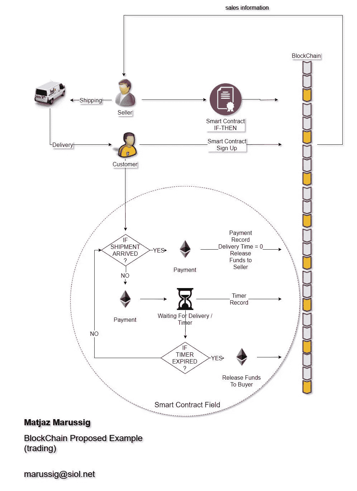

# 区块链:如何避免中介、购物实验

> 原文：<https://medium.datadriveninvestor.com/blockchain-how-to-avoid-intermediaries-shopping-experiment-be035c7e90f9?source=collection_archive---------16----------------------->

Image source: Tumisu, pixabay.com

我们的经济关系可以追溯到大约一万年前，从人类农业开始，那时人类开始交换股票。200 年前，随着工业革命，相对缓慢的技术进步开始迅速加速。但是仅仅 20 年前，另一场革命开始了——互联网。比方说，我们现在正处于最新的革命中，也就是区块链。

区块链的想法基于加密货币技术。这是一个再好不过的想法了，它让其他一切都处于边缘状态。这就是为什么我们大多数人都非常肯定这真的是一场革命(源自拉丁语 revolution，“一次转变”)或范式转变。

让我尽可能简单地为那些还不熟悉这一行的人解释一下。顾名思义，区块链是一个包含加密记录的块链。这个不断增长的记录列表，称为块，是链接在一起的。每个块通常包含一个散列指针，作为到前一个块、时间戳和事务数据的链接。根据设计，区块链天生就能抵抗数据修改数据。区块链可以作为“一个开放的、分布式的分类账，以可验证的、永久的方式有效地记录双方之间的交易。为了用作分布式分类帐，区块链通常由共同遵守用于验证新块的协议的对等网络来管理。一旦记录，任何给定块中的数据都不能在不改变所有后续块的情况下被追溯性地改变，这需要网络多数的合作( [Ref](https://en.wikipedia.org/wiki/Blockchain) )。

这里的矿工以很少的费用将所有的块放在一起，但是这对于本文的目的来说并不重要。信息链中的信息总是正确的、最新的和相关的，并且是加密的，每个人都可以看到。这个链是一系列的信息记录。

该系统根据海盗湾技术的原理工作。如果我们以加密货币以太为例，整个以太坊网络是一个巨大的计算机(节点)群，它们作为以太坊虚拟机相互连接。该网络中的所有交易都被自动更新并记录在一个开放的分布式分类账中([参考](https://blockgeeks.com/guides/ethereum-token/))。

我无意解释比特币或以太的整个故事，而是关于如何将区块链模型从加密货币转移到我们的现实世界的方法论。

为什么这如此重要？因为在我们 10，000 年的人类历史中，有那么一个时刻，我们不再需要任何中介。这是因为我们有足够的技术来负担所有这些。正如我们所见所闻，有许多区块链的拥护者。另一方面，我们可以在 LinkedIn 上看到无数的企业家，以及学生和求职者，他们在个人资料中写下诸如“区块链爱好者”等词。这意味着只有一件事，那就是革命即将开始。

该模型的主要思想是两个人(点对点)，或者两个对象，或者两个进程等之间的直接通信。例如，两个人之间的传统关系是卖方和买方之间的关系。但是这里就出现了一个问题，因为买家需要去信任的第三方，所谓的银行，取出钱付给买家。此外，如果他们想做生意，所有相关人员都需要出示他们的姓名、税号等等。在加密货币的世界里，这是不必要的。

问题是如何将这个模型映射到我们的日常生活中。

让我们看一个简单的例子。假设我们想买一本书。卖家会告诉我们，一定要签所谓的“智能合约”。这是一堆用计算机语言写的代码。在我们注册后，算法会从我们的钱包中取出一些比特币或乙醚，并将相关记录发送到一个可用的区块链。智能合同说，如果卖家不把书寄给我们，那么我们的钱包会把钱拿回来。这肯定会发生，因为矿工看到同样的记录，他们竞争成为第一个在计时器到期后将我们的钱推回我们钱包的人。第一个这样做的人将在他的钱包里得到一小笔费用。

计算机越强大，矿工的工资就越高。这就是电脑农场不断增长的原因。

如果我们按时拿到书，我们的资金将会发放给卖家。

这个被提议的模型对全球社会意味着什么？这意味着全新的 It 方法、更低的成本和更少的费用。我无意讨论这对税收政策意味着什么，但正如我们所看到的，我们的社会将自上而下发生变化。

在这个提议的模型中，所有的交易平台都将消失。我们可以免除 20%甚至更多的亚马逊费用、阿里巴巴年度会员费、贝宝费用，讽刺的是，甚至是云数据库、应用程序，以及几乎所有现存的大型平台，以分享我们的经济。当然，也许我错了。

Blockchain Algorithm
Image source: Matjaz Marussig

作者[马特加斯·马鲁西格](https://goo.gl/ZWrK9f)

这里最初发表[的](https://www.linkedin.com/pulse/blockchain-how-avoid-intermediaries-shopping-matjaz-marussig/)。

**参考文献**

伊坎 G. (2017)。区块链:理解区块链技术的完整指南。【Kindle DX 版】。从 Amazon.com 取回

Reed J. (2017)。区块链:理解区块链革命的基本指南。【Kindle DX 版】。从 Amazon.com 取回

盖茨 M. (2017)。区块链:理解区块链、比特币、加密货币、智能合约和货币未来的终极指南。【Kindle DX 版】。从 Amazon.com 取回

区块链到底是什么？，斯蒂芬·安东内尔，可在:[https://www . LinkedIn . com/pulse/what-exactly-区块链-斯蒂芬-欧-唐纳/](https://www.linkedin.com/pulse/what-exactly-blockchain-stephen-o-donnell/)[2017 年 11 月 25 日访问]。

维基百科。(2017).区块链，可在 https://en.wikipedia.org/wiki/Blockchain【2017 年 11 月 25 日访问】。

什么是以太币:初学者终极指南。(2017).可在:【https://blockgeeks.com/guides/ethereum-token/ 【2017 年 11 月 25 日获取】。

区块链到底是如何运作的？我做了一个应用程序给你看。(2017).可在:[https://medium . freecodecamp . org/how-does-区块链-really-work-I-build-a-app-to-show-you-6b 70 CD 4 caf 7d](https://medium.freecodecamp.org/how-does-blockchain-really-work-i-built-an-app-to-show-you-6b70cd4caf7d)【2017 年 11 月 25 日访问】。

比特币和加密货币技术的真正价值——区块链解释。(2017).视频。可在:[https://www.youtube.com/watch?time_continue=1&v = yivalusl 9 su](https://www.youtube.com/watch?time_continue=1&v=YIVAluSL9SU)【2017 年 11 月 25 日获取】。

什么是区块链。(2017).视频。可用地点:[https://www.youtube.com/watch?v=93E_GzvpMA0&t = 2s](https://www.youtube.com/watch?v=93E_GzvpMA0&t=2s)【2017 年 11 月 25 日获取】。

微软对区块链的愿景— BRK2177。(2017).视频。可用位置:[https://www.youtube.com/watch?time_continue=172&v =-DJs 6 HC 29 VG](https://www.youtube.com/watch?time_continue=172&v=-dJS6hc29vg)【2017 年 11 月 25 日获取】。

什么是区块链技术？初学者循序渐进指南。(2017).视频。可在:[https://block geeks . com/guides/what-is-区块链-technology/](https://blockgeeks.com/guides/what-is-blockchain-technology/)【2017 年 11 月 25 日访问】。

区块链技术可用于商业的 10 种方式。(2017).可在:[https://blog . pass kit . com/10-ways-区块链-technology-can-used-in-business/](https://blog.passkit.com/10-ways-blockchain-technology-can-be-used-in-businesses/)【2017 年 11 月 25 日获取】。

区块链研究所。(2017).可在:【https://www.blockchainresearchinstitute.org/ 【2017 年 11 月 25 日进入】。