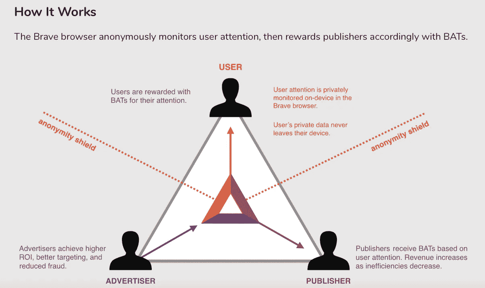

# 2030 年的区块链

> 原文：<https://medium.datadriveninvestor.com/blockchain-in-the-year-2030-e4fb9d9b7e36?source=collection_archive---------0----------------------->

*十年后我们的生活将如何改变的 3 种方式*

虽然很容易被比特币甚至区块链技术的看跌市场情绪席卷，但有一点是肯定的。

区块链和比特币都将继续存在。

 [## 5 行业转型区块链应用|数据驱动投资者

### 除非你一直生活在岩石下，否则我相信你现在已经听说过区块链了。而区块链…

www.datadriveninvestor.com](https://www.datadriveninvestor.com/2019/02/13/5-real-world-blockchain-applications/) 

在这个恐惧和不确定的时代，我想关注区块链在未来十年可能给我们的生活带来的新可能性。更确切地说，在 2030 年。

当然，没有人确切知道区块链和去中心化的 web 会给我们带来什么样的改变。因此，我想在这篇文章中集中讨论各种可能性，而不是猜测这一切将如何实现。

请继续阅读，了解区块链信仰！

# 分散的网络

私人信息的数据泄露。向广告买家出售你的信息。赚取高额交易费的平台，随着越来越多这样的事件不断发生，这些骇人听闻的事件开始看起来很普通。

有了区块链技术，解决所有这些问题的去中心化网络成为可能。

在一个理想的去中心化网络中，**用户可以保持匿名，他们的数据不会被收集。不是用户通过接收广告成为产品，而是用户在观看广告时得到补偿。**

到目前为止，市场上有一些产品正在努力使分散式互联网成为现实。

**勇者浏览器+ BAT Token**
对于一个去中心化互联网的大部分粉丝来说，第一个想到的项目就是勇者浏览器和基本的注意力 Token。在这个项目中，广告被屏蔽，用户数据也不会被收集用于商业化。

这个项目的独特之处在于，用户因关注广告而获得基本注意力令牌(BAT)奖励。

Taken from [BAT website](https://basicattentiontoken.org)

据勇者战队报道，“*..当你看到勇敢者为你挑选的广告时，你将获得广告商支付的 70%的收入，这是有保证的。*

这是朝着对用户、出版商和广告商更公平的补偿迈出的一步。

另一个旨在提供下一个去中心化互联网平台的相对较新的项目是 Osiris 浏览器。它们的独特之处在于，除了提供一个提供隐私和无广告的浏览器之外，它们还打算更进一步。

他们希望通过整合 [Dapp 商店](https://www.decenternet.com/Dappstore.php)、[网络挖掘解决方案](https://www.decenternet.com/spycehash_dnet.php)和他们[自己的钱包](https://www.decenternet.com/mercury.php)来建立一个围绕浏览器的生态系统。

虽然我们不能肯定地说所有这些产品是否以及何时会被交付，但是看看这个团队将如何推动他们的产品被采用将会很有趣。

毕竟，一个生态系统的成长速度取决于它被采纳的速度。随着采用，Decenternet 生态系统看起来是一个去中心化互联网的综合解决方案。

# 分散金融-人民的钱

具有讽刺意味的是，比特币的底层技术区块链被用来创造即将推出的中国虚拟货币。

许多比特币支持者喜欢宣扬的一个流行观点是，比特币是一种让每个人对自己的钱拥有财务控制权的货币。

政府不再拥有增加货币供应的权力，这种权力会导致委内瑞拉等国的大规模通胀。为什么会这样呢？

因为比特币是不可变的，它不能被任何中央机构控制。

虽然比特币价格波动太大，无法成为一种分散的全球货币，但大公司已经探索了推出这种货币的途径，最著名的是脸书的 Libra。

这些货币被批评为过于集中，因为它们背后的公司将完全控制货币。

尽管如此，一种真正分散的货币代表全球一篮子货币，在分散的交易所交易，也不是完全不可能的。

或者至少，全球公民对法定货币及其控制水平的看法会有很大不同。

# 收入不平等(部分)得到解决

区块链技术解决收入不平等的概念根本不可能，但它的某些方面有助于解决这个问题。

例如，腐败的慈善组织将捐款用于个人支出的情况在每个国家都有发现。

通过在区块链上存储捐款收据或接受加密货币捐款，确保了这一领域的透明度。这反过来又导致受益人收到捐款，是朝着解决不平等问题迈出的一步。

拥有一种全球货币，来自世界不同地区的双方可以使用它进行交易，而无需昂贵的佣金，这为欠发达国家的工人提供了机会。

# 最后

诚然，这些未来场景可能看起来过于理想，或者像是出自科幻小说。考虑一下这个——我们通常高估了我们短期能做的事情，低估了长期能做的事情。

再加上密码市场在短时间内的巨大收益，用户会变得更加不耐烦。我们是否会在 2030 年看到这些变化还有待观察，但我相信这个行业将会大不相同，而且会变得更好。

# 联系我

喜欢你读的吗？如果你正在寻找一个自由区块链内容作家为你写内容，请联系我！

网址:[www.blockconstellation.com](http://www.blockconstellation.com)
邮箱:jiayung@blockconstellation.com