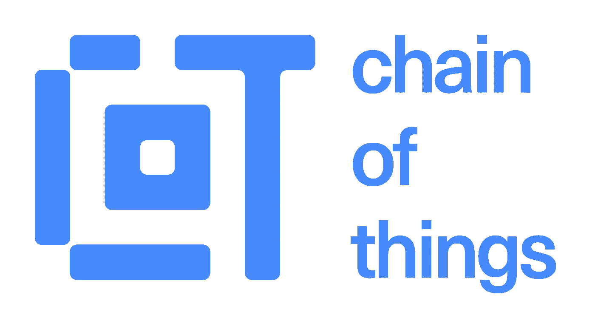

# 区块链一体化&物联网的机遇

> 原文：<https://medium.datadriveninvestor.com/blockchain-integration-opportunities-for-iots-ef3001660b80?source=collection_archive---------10----------------------->

***物联网(IOT)可能是对区块链技术的革命性整合。有许多热心的公司和个人已经在设计和实践非常大规模的应用程序和实验，而且在最近的小项目和应用程序中已经被实践证明，这两者结合起来可以做什么…***

***物联网是一个术语，表示较小的设备，这些设备内部有预编程的 CPU，具有决策能力或选择可用的条件选项。手机是一个很明显的例子，除此之外，汽车上的 GPS，感应灯，喇叭，警报器等都连接到互联网上，这个网络可以广泛地与区块链编程一起使用，探索人工智能的可能性的极限，减少人类在我们周围的大多数常规实践中的参与，在社会中。***

你能想象金融服务会评判你的决定，并且永远不会忘记，直到你想要改变吗？支付账单、支付保险费、异地费用、学费、停车费、停车罚单、其他罚款等。会处于一种自我发生的模式，直到你选择它以其他方式发生。最重要的是，不需要你去申请，就能得到一份自己索赔的保险怎么样？

***一旦 IOT 与区块链的融合达到预定的水平，所有这些都是可能的，都是可以考虑的。让我们先来看看这将如何进行，以及一旦它真正开始发生，前景将会如何。***

****

***任何需要交易的事情，都可以在区块链的帮助下实现自动化，并将它与 IOT 整合，就可以使大多数例行或有条件的事件，成为一个自动化的、自我发生的过程。***

***例如，保险和 it 索赔、物品和服务的账单支付、预付费服务的支付。***

***分散式多节点验证可应用于雇佣的第三方验证流程***

*****IOT 与区块链应用程序的集成将使酒店、机票预订、酒店和客户服务行业更上一层楼。*****

*****借助 IOT 与区块链的整合，软件外包可以是有限的，核心设计也可以。*****

*****运动员、汽车、机械等的绩效跟踪、改进方案建议和执行。可以通过 IOT 与区块链的集成实现自动化。*****

*****通过多个节点的参与和验证，可以规划最短、最具成本效益的基础设施设计。*****

*****通过在更大范围内将对等连接和验证技术集成到物联网中，可以非常容易和快速地完成大型项目，如为大众净化饮用水、使宜居土地适于居住、设计&建设城市等。*****

**物联网上的简单编码可以使术前程序自动化，消除人为错误的发生/可能性。**

**通过区块链建立一个庞大的互联物联网网络，监控问题/漏洞可以永远得到解决。**

*******通过简单地将区块链技术应用于物联网，选举、理事会会议、公众审核、调查和其他类似的大众参与和参与实践可以被分散化，从而被简化并变得快速而完美。*******

*******物联网已经成为我们生活中不可或缺的一部分。通过区块链集成和预先计划的人工智能开发，我们可以识别和增强它的使用和效用到下一个水平。随着每一次发生和练习，这将变得更聪明和更有经验。*******

*******智能合约，简单易用，基于“多数优先”的不同账户验证将是完美的。随着信息在物联网上的不断发送和接收，出现缺陷的可能性极小，甚至在不久的将来也不会明显。*******