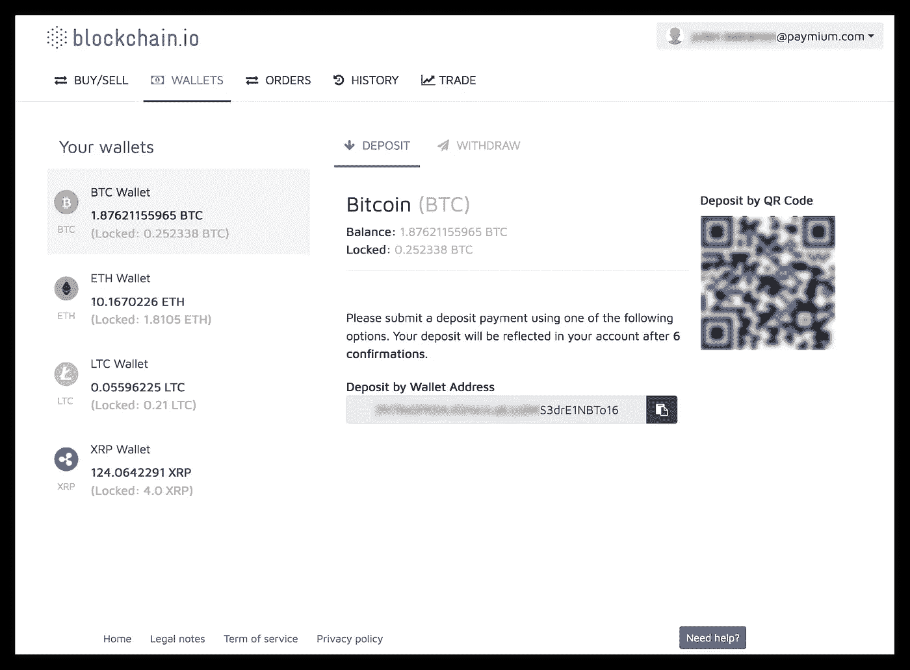
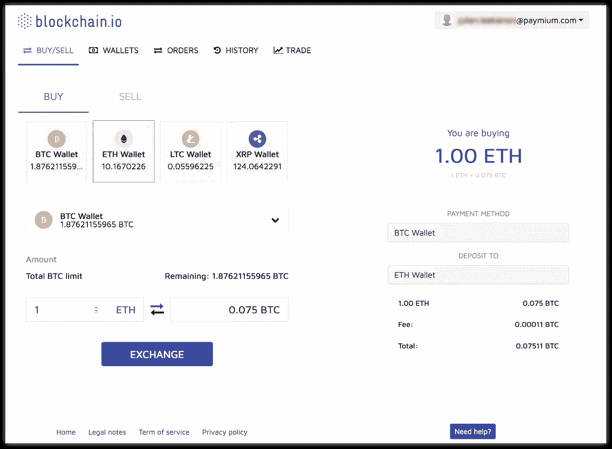
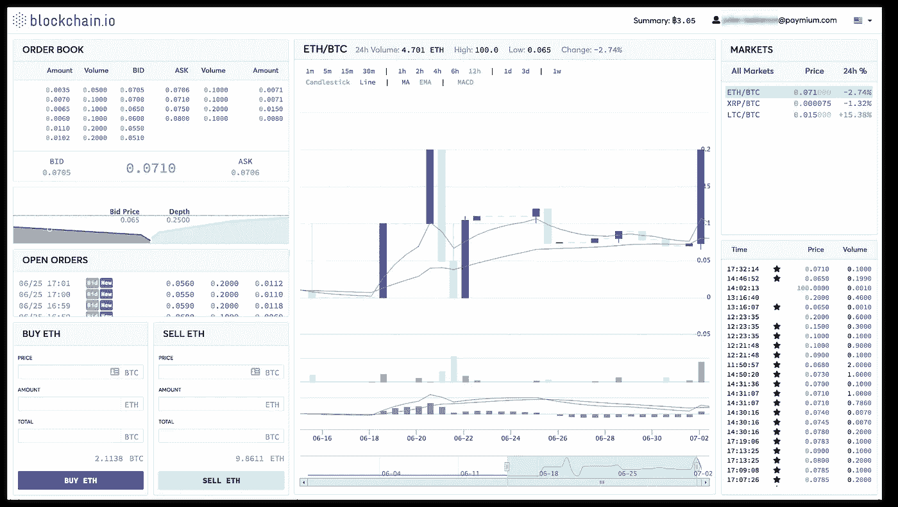

# Blockchain.io 发布在即

> 原文：<https://medium.datadriveninvestor.com/blockchain-io-launch-looms-c72c70f86d72?source=collection_archive---------2----------------------->

block chain . io MVP——由 Paymium 支持的欧洲首家加密货币交易所即将推出的平台界面初探。

2018 年 7 月 4 日， [Blockchain.io](https://blockchain.io/) 团队宣布推出[他们的 MVP](https://medium.com/blockchainio/blockchain-io-mvp-is-now-live-e61169328e08) (也被称为“最小可行产品”)。MVP 将是该平台的第一个版本，它将使早期采用者能够开始使用 blockchain.io 团队构建的功能，当真正的客户开始使用他们的工具时，该团队将根据他们看到的工作(和不工作)在平台上迭代。

该平台尚未上线，但该团队提供了对平台方向和各种设计决策的宝贵见解，将为 2018 年晚些时候推出的最终产品提供信息。

MVP 潜行高峰的特点是查看用于存储和交换加密货币的钱包、用于购买和销售的订单簿以及市场详情页面。在该平台上线之前，我们可以期待一些变化，但许多人对他们目前所看到的感到兴奋。

我们来看看吧！

# Blockchain.io 钱包

Wallet page

目前，MVP 钱包支持比特币(BTC)、以太币(ETH)、莱特币(LTC)和 Ripple (XRP)的存取款。在发布时，blockchain.io 团队承诺支持比特币现金、Blockchain.io 令牌(BCIO)和精选 ERC20 令牌。

你可能已经注意到，在余额下面还有一个“锁定”资金的标签。这将代表当前参与未结订单的基金。锁定资金以外的资金可以提取。

# 订单簿

订单簿将用于通过下面的简单界面在您的钱包之间交换(或买卖)受支持的加密货币，而无需进入市场页面。通过此页面发出的订单将有效地成为交易所的市价订单。

这个页面真的是为快速简单的交易和不想处理复杂的市场页面的入门用户准备的。它将使主流用户能够安全地交换加密货币。

Buy/Sell order pad

# 市场详情页面

Market detail page

对于想要了解详细信息的用户，这将是市场页面，在这里您可以跟踪 blockchain.io 市场中所有订单的详细信息。市场详情页面正在大力开发中，因此在发布之前可能会有很大变化，但上面的图像代表了干净的界面，这是 blockchain.io 团队的目标。他们也在努力增加一些功能，使用户能够根据自己的喜好个性化市场页面。您将能够按照自己喜欢的方式构建自己的市场界面！

与市场中其他市场详细信息页面的标准产品相比，个人定制可能会改变游戏规则，特别是对于那些每天花大部分时间仔细研究市场推动者和震动者的高级交易者。对于那些高级用户来说，市场详情页定制将是一个神送！