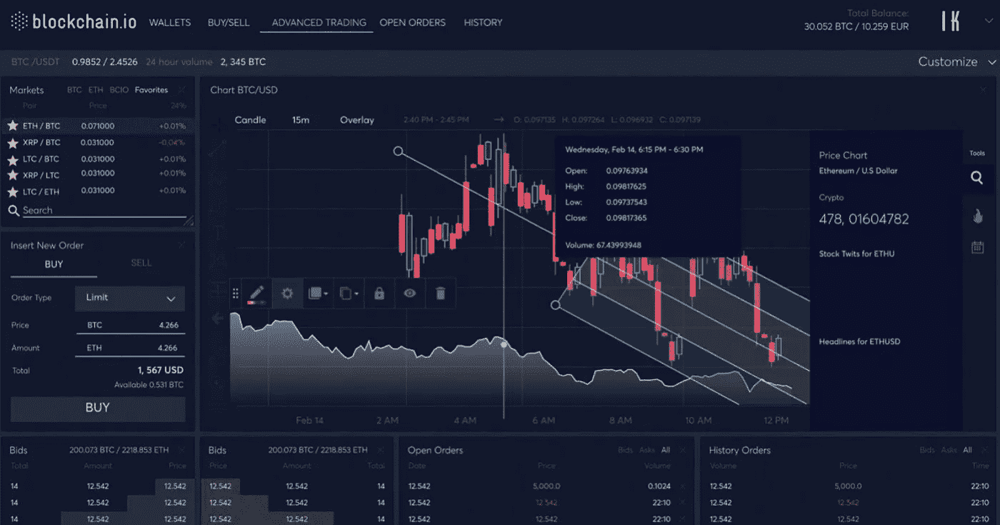
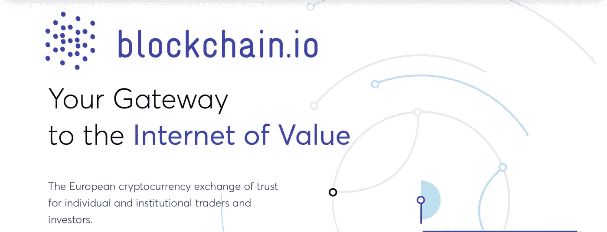
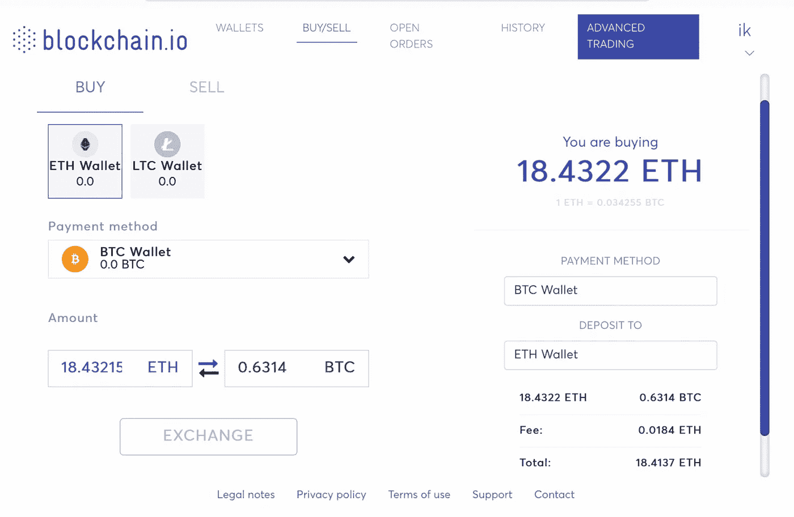
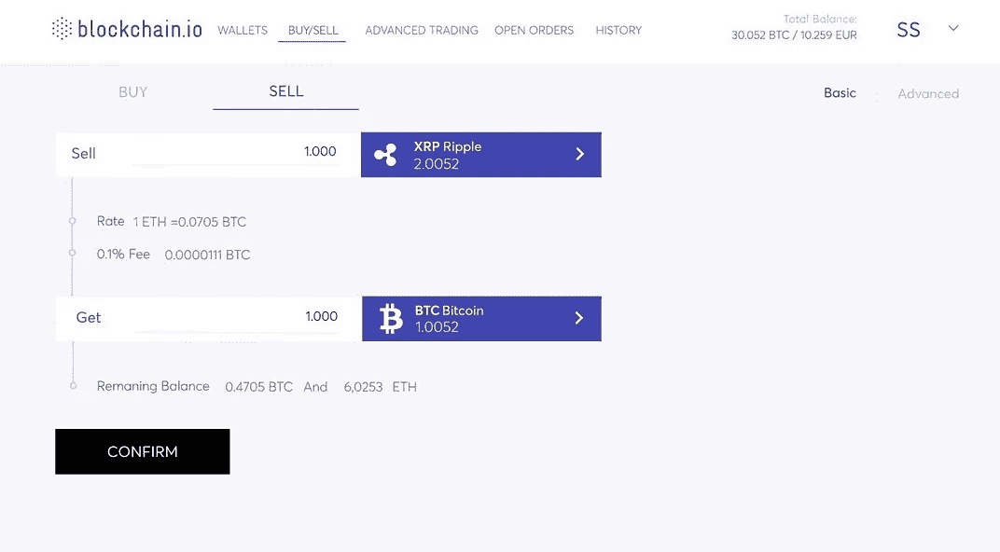
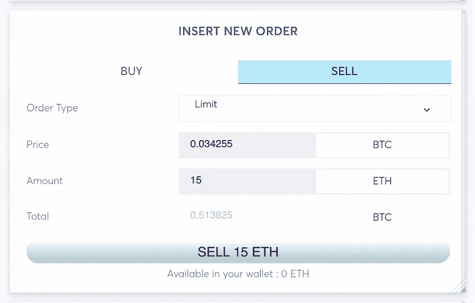
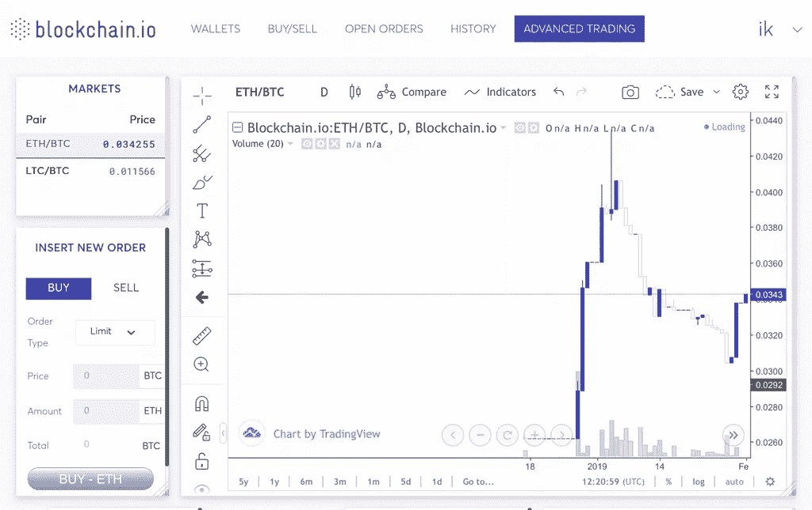
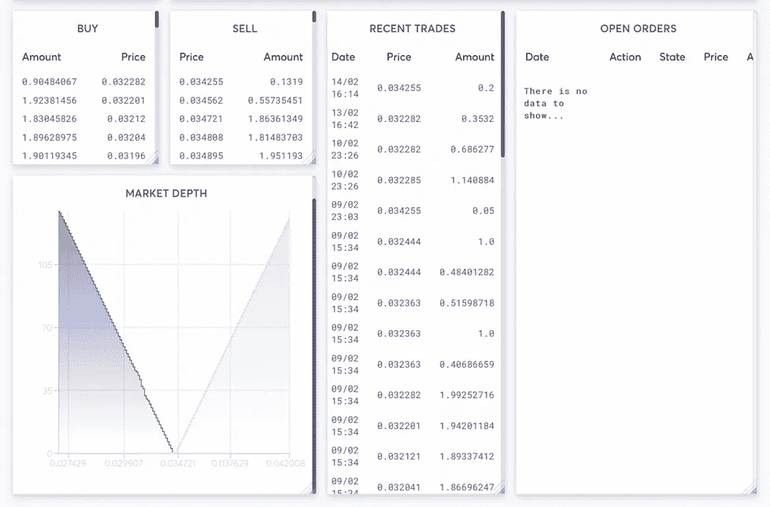
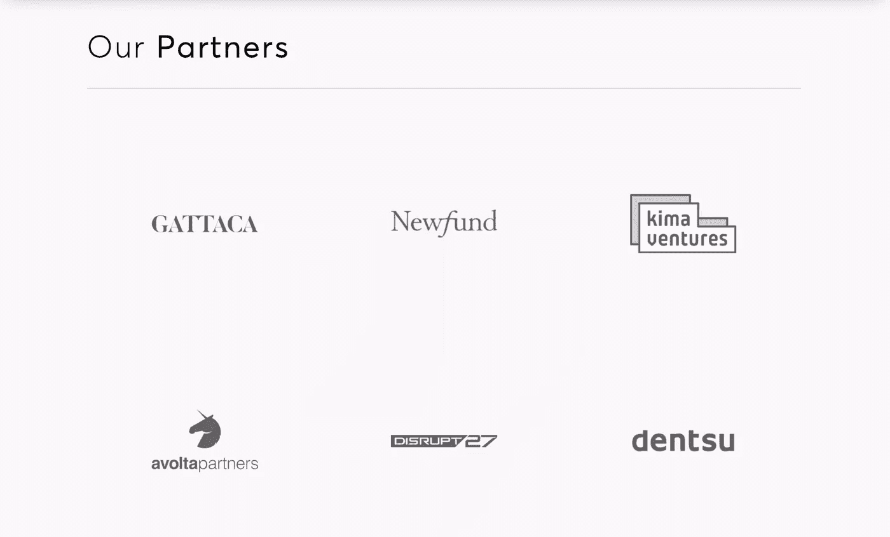

# Blockchain.io 推出首个加密混合交易平台。

> 原文：<https://medium.datadriveninvestor.com/blockchain-io-launches-the-first-ever-crypto-hybrid-trading-platform-82266bd55501?source=collection_archive---------14----------------------->

Blockchain.io 自 2018 年 9 月 27 日发起活动以来，在过去的几个月里一直很有弹性，该活动以奖金竞赛和奖励池开始。作为个人和机构交易者和投资者的加密货币信任交易所，Blockchain.io 是欧洲加密到法定交易所 Paymium 的升级版，因为它们都有相同的理想主义作为支持，因为它们有一个类似的首席执行官 Pierre Noizat。

# 高级交易功能

As Blockchain.io UI/UX 设计用户友好，易于使用。这是一个基于网络的移动响应交易平台，因为有计划在不久的将来推出移动应用版本(Android 和 IOS)。与大多数同行不同，该交易所启动时不需要任何 KYC，因为它已经拥有超过 17 万用户的现有客户。交易没有最大提款或存款限制，至少在推出的前几周，允许 100 万美元及以上的交易。该平台最初与比特币(BCIO/BTC)、以太(BCIO/ETH)和莱特币(BCIO/LTC)等其他加密货币交易对一起推出，未来计划长期包括 Ripple(BCIO/XRP)和比特币现金(BCIO/BCH)。

# 存款和取款

在平台上存款是免费的，但是取款会产生手续费。每对的最低交易量如下所列。

BTC 联邦理工学院:0.02 联邦理工学院

长期护理/BTC:0.1 长期护理

BCIO/BTC: 10 个 BCIO

# 最低交易费

混合交易所是建立在 2013 年就已经存在的技术之上的。因此，平台运行的交易费用是在平台上发起的任何交易的 0.1%(除了 BCIO/BTC 对，这是一个出价订单免费)。如前所述，该平台允许无限量交易，最低取款费是该团队确保未来公平透明交易的众多措施之一。提款的最低金额和费用如下:

BTC:最低:0.002 BTC/费用:0.0005 BTC，

ETH:最低:0.02 ETH/费用:0,01 ETH，

LTC:最低:0.002 LTC/费用:0,001 LTC，

XRP:最低:22 XRP /费用:0.25 XRP(即将推出)

BCH:最低:0.002 BCH/费用:0.001 BCH。(即将推出)

**注意**:上述特性只是暂时的，因为团队保留在未来包含或排除额外平台功能的权利。

**网址:**

【https://blockchain.io/】T5[T6](https://blockchain.io/)

**中等:**

[*https://medium.com/blockchainio*](https://medium.com/blockchainio)

**白皮书:**

[*https://block chain . io/WP-content/uploads/2018/09/BCIO _ 白皮书. pdf*](https://blockchain.io/wp-content/uploads/2018/09/BCIO_Whitepaper.pdf)

**社区:**

*https://t.me/Blockchain_io——官方*

*https://t.me/blockchainioFrance—法国社区*

*https://t.me/blockchain_io_vietnam—越南社区*

*https://t.me/bciospanish—西班牙社区*

*https://t.me/blockchainiochinese——华人社区*

*https://open.kakao.com/o/g2L3zeT—韩国社区*

*http://t.me/joinchat/Dks0eER07MitZSAR8JICMw—菲律宾*

# DDI 特色区块链课程:

*   [**认证以太坊开发者**](http://go.datadriveninvestor.com/ethdev/mb)
*   [**智能合约开发者**](http://go.datadriveninvestor.com/smartcontract/mb)
*   [**密码交易员**](http://go.datadriveninvestor.com/cryptotrader)

**DDI 可能会从这些链接中收取会员佣金。我们感谢你一直以来的支持。*