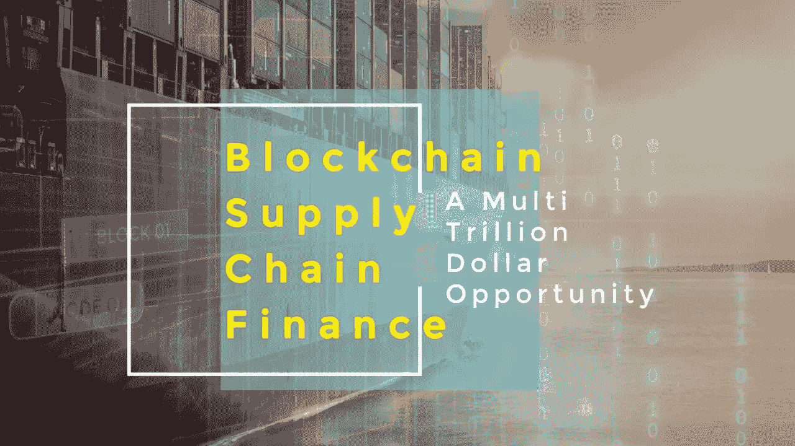
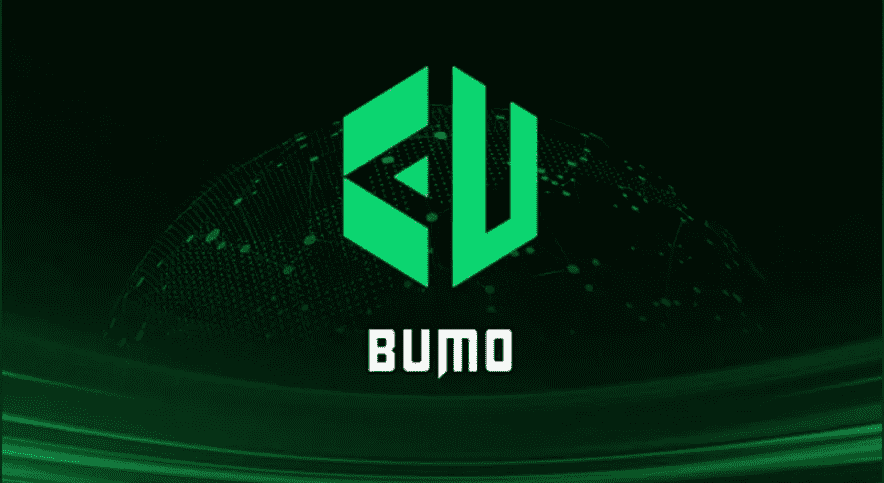

# 区块链、物联网和人工智能——供应链金融的万亿美元三连胜

> 原文：<https://medium.datadriveninvestor.com/blockchain-iot-and-artificial-intelligence-a-trillion-dollar-trifecta-for-supply-chain-finance-ae5d4a347161?source=collection_archive---------4----------------------->

## 区块链供应链金融(SCF)——数万亿美元的商机。

*一份 2015 年的* [*麦肯锡报告*](https://www.mckinsey.com/~/media/McKinsey/Industries/Financial%20Services/Our%20Insights/Supply%20chain%20finance%20The%20emergence%20of%20a%20new%20competitive%20landscape/MoP22_Supply_chain_finance_Emergence_of_a_new_competitive_landscape_2015.ashx) *显示，SCF 潜在的全球
收入池为 200 亿美元，而 2017 年中国供应链金融行业预计到 2020 年* [*将达到*](https://www.scmp.com/business/companies/article/2116221/supply-chain-finance-smes-becomes-new-growth-engine-chinese)*2.27 万亿美元。*

供应链金融(SCF)，也称为供应商金融，是一套解决方案，旨在帮助弥合全球行业中采用的买方和供应商之间的融资差距，以优化营运资本，加快整个供应链的流程，实现各种形式的融资解决方案并提高流动性。

 [## 2019 年成为主流的 7 大区块链挑战及更多...-数据驱动型投资者

### 教训是永远不要停止学习和成长。关于技术、金融、工作场所、生产力和…

www.datadriveninvestor.com](https://www.datadriveninvestor.com/2019/03/25/top-7-blockchain-challenges-to-go-mainstream-in-2019-more/) 

企业可以利用供应链融资，通过提供短期信贷来优化所有参与者的营运资本，降低货币风险并最终提高流动性，从而与供应商建立更牢固的关系。

在银行普遍服务不足的情况下，供应链金融(SCF)公司正迅速成为 MSME(微型、小型和中型企业)领域的贷款解决方案合作伙伴。由于当前供应链系统的复杂性和缺乏透明度，MSME 的采用并没有达到预期的效果。然而，随着 SCF 解决方案集成区块链、物联网和人工智能等新兴技术来解决这些缺陷和其他问题，该行业将迎来爆炸式增长。

## 区块链、物联网和人工智能——万亿美元的三连胜

将区块链、人工智能和物联网整合到供应链金融中可以以多种方式改善 SCF。利用区块链可以使每一笔支付和每一笔供应链交易更加透明、可管理和易于验证，从而创建端到端的实时供应链可见性。物联网提供了一个集成的设备网络，可以连接和交换数据，实现实时“跟踪和追踪”，降低风险并提高融资效率。人工智能提供数据，帮助企业就其营运资本做出更明智的决策，简化决策过程。

*“根据 IDC(国际数据公司)半年度全球物联网支出报告，物联网正在经历两位数的增长，到 2022 年将超过 1 万亿美元。物联网将越来越多地由智能合同电网管理，智能合同电网隔离在与人工智能(AI)交互的区块链上，并优化、分散、&连接利用(DLT 分布式账本技术)。物联网将成为无数行业的核心，包括制造、运输、能源生产和分配。考虑到近 80%的企业总支出来自采购，全球贸易&贸易融资正成为这些新兴技术的主要受益者，这些技术正变得与古老的格言“总和大于部分”交织在一起。*

*中国在区块链投资方面领先全球(25%；investinblockchain.com***)，物联网支出(1591 亿美元；IDC)，而且，考虑到全球超过 20%的商品是在中国制造的(布鲁金斯学会)，贸易融资和供应链越来越成为这些新兴技术的目标。中国现在有几个利用 DLT 的供应链解决方案平台，最显著的是供应链融资，将应收账款转化为健康的现金流、高效的库存和新的直接融资贷款机会&，特别是对中小企业。小型制造商不再需要等待六个月、一年，有时甚至更长时间才能收到付款，这极大地助长了不健康的供应链生态系统。现在，即使是大型供应商生态系统中的小供应商，也可以通过使用信用证 DLT 凭证来维持健康的资产负债表。**

**这只是众所周知的这些大规模破坏性和最终平等主义技术工具的冰山一角。”**

*[**—兰迪·麦奎尔，流动账簿首席执行官**](https://www.linkedin.com/in/randy-mcguire-a61428/)*

**

*Liquid Ledgers — Transforming and Enriching Digital Asset Ecosystems*

> *“对于 [BUMO](https://www.bumo.io/) 来说，区块链供应链金融解决方案最吸引人的地方在于，区块链解决了传统供应链金融的关键痛点，即金融机构和小供应商之间对小供应商的还款能力缺乏信任。利用 DLT 的信任机制，信誉可以从大买家转移到底层供应商，这将有利于整个生态系统。从 BUMO 上的一个成功故事中，我们可以看到小企业以一种迅速而低成本的方式获得了他们迫切需要的资金。大型买家可以与他们的供应商协商更好的条件(更多折扣或更长的应付账款天数)，银行可以接触到更多的客户(其中一家银行的客户群大大增加了[5 倍])，他们的融资服务量也大幅增加(SCF 业务增加了 11 倍)。”—凯文·刘，布莫基金会主任*

**

*这些新兴技术仍处于萌芽阶段，但它们所代表的巨大前景已经被实现，可以解决对全球经济至关重要的供应链中的广泛问题。随着技术变得更加综合、创新和完善，它们将成为全球贸易各个方面的组成部分。随着这种转变和进化达到临界质量，量子计算将足够成熟，足以支持和扩展日益庞大的计算需求。*

*供应链金融的迷人未来正在展现。*

*奥黛丽·奈斯比特*

*[螺旋营销&公关](http://www.spinspirational.com)*

*[奥黛丽·奈斯比特在 Linkedin 上](https://www.linkedin.com/in/audrey-nesbitt-0388a52a/)*

*[@ audreynesbit 11 在推特上](https://twitter.com/AudreyNesbitt11)*