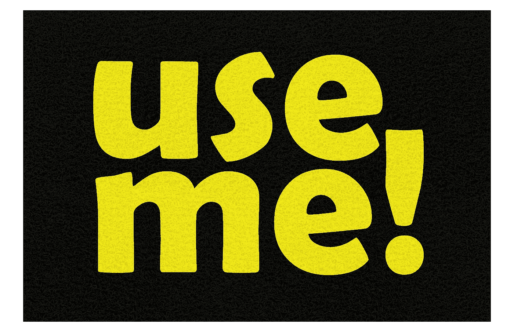
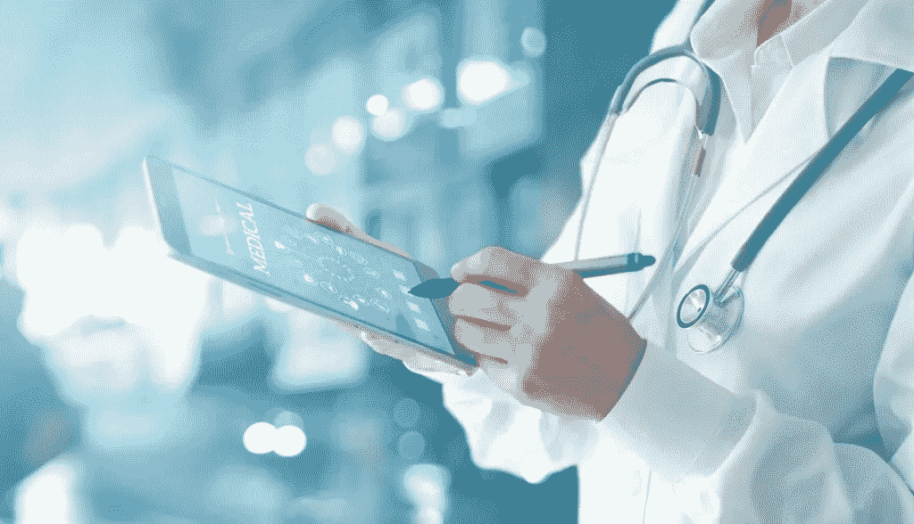
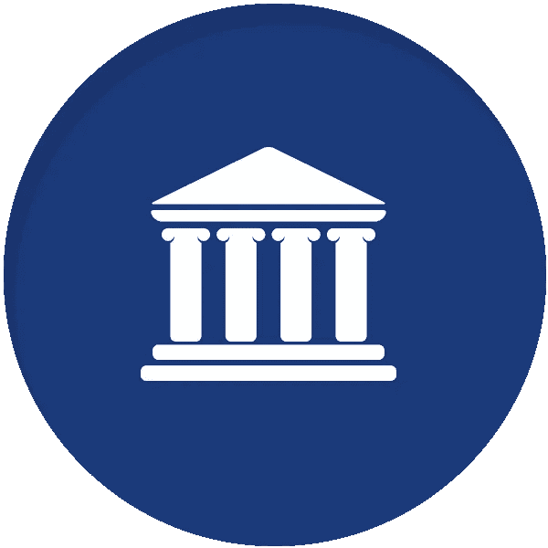
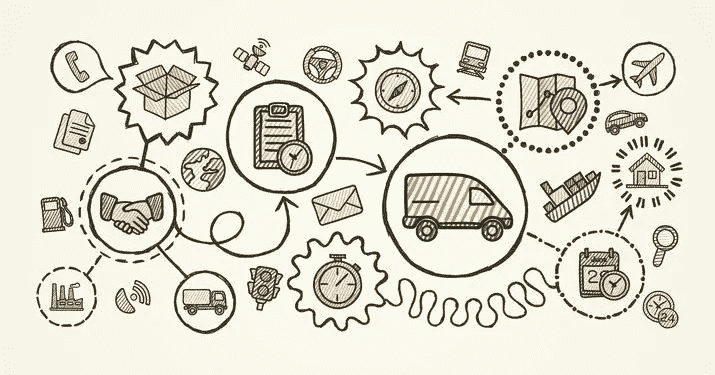

# 区块链不仅仅是一种支付手段！

> 原文：<https://medium.datadriveninvestor.com/blockchain-is-so-much-more-than-just-a-means-to-send-payments-4514909e7214?source=collection_archive---------2----------------------->

当有人听到区块链这个词时，他们通常会将这个词与比特币和一种新的无边界的电子货币收发方式联系起来。但是这项技术不仅仅是把钱从 A 地送到 b 地。

一个区块链就是一个[分布式账本](https://en.wikipedia.org/wiki/Distributed_ledger)，一个记录信息的列表。它是可验证的，一旦数据被记录到区块链，就不能被修改或删除。正因为如此，区块链可以广泛应用于各种行业。

# **区块链在医疗保健中的应用**

区块链可用于以安全、可靠且可广泛访问的形式存储患者的电子病历。医疗记录的问题在于，每个诊所和每个医生都有不同的存储方式。随着年龄的增长，每次看医生，病历都会变长。但是，如何同步这些记录，如何确保您访问的所有医疗机构的记录都是最新的？你的家庭医生怎么知道你去看了私人医生，你的病历有什么变化？你看，一个医疗机构无法获得在另一个机构创建和存储的病历。

 [## 创新提醒:区块链 3.0、Terra 协议、ICO 门户和更多|数据驱动的投资者

### 尽管过去几个月加密货币的价格波动很小，但这项技术并没有停止发展…

www.datadriveninvestor.com](https://www.datadriveninvestor.com/2019/03/16/innovation-alert-blockchain-3-0-terra-protocol-an-ico-portal-more/) 

现在想象一下，你正在访问一个外国国家，你需要医疗援助。新医生这辈子没见过你，怎么知道你的病史？当然，他可以联系你的家庭医生，要求查看你的医疗记录或进行一些测试，但当他获得所有重要信息时，可能已经太晚了。

答案在于区块链技术的使用。区块链允许患者医疗数据的不同副本彼此同步，即使在一个医疗机构中进行更新和存储，每个副本也将自动更新为最新信息。这些数据不能被修改，不能被删除或移动，并且在创建时有一个精确的时间戳。这意味着使用区块链技术的每一个医疗机构和每一个医生都可以在患者同意的情况下获得有价值的医疗记录。

# **区块链用于政府服务**

区块链有许多方法可以提高政府服务的效率。例如选举过程。区块链可以确保一个安全的在线投票系统。区块链的不变性确保了数据一旦被验证并成为公开分类账的一部分，就不能再被篡改。操纵选举过程将不再可能，因为原始日志保存在区块链上，每个人都可以验证。

人们不信任他们的政府，因为政府不透明。没有办法证实我们政府发布的信息。这是因为政府记录是集中的。它们可以很容易地被少数能够访问所述数据的实体操纵、省略和破坏。区块链可以为政府提供所需的去中心化。权力将不再掌握在少数人手中。操纵、欺诈和数据泄露将永远被记录下来，有罪的一方很容易被找到。

这可以使执法官员的任务容易得多，因为他们有一条明确的道路可循。证据就在保存着所有腐败和滥用记录的区块链上。但也可以反过来。区块链可以作为明确的证据，证明政府官员没有实施他被怀疑实施的欺诈行为。怎么会？由于区块链记录的不可逆性。区块链不会说谎，它不会掩盖任何错误，也不会保护它的伙伴和朋友。这些数据很容易被执法部门审核，并公之于众，供任何人检查和验证该官员是无辜的。

# **区块链在供应链中的应用**

区块链技术可以让[供应链](https://whatis.techtarget.com/definition/supply-chain)更加安全和可验证。现有供应链服务的问题在于，很难核实产品的来源、生产中使用的部件以及商品是真是假。药品和处方药经常被假冒，并以比正品更低的价格出售。不知情的消费者购买这些廉价药物，不知道会对他们的健康产生什么后果。

像沃尔玛这样的公司已经依靠区块链来追踪他们产品的来源。在区块链的帮助下，沃尔玛可以追溯所有购买的猪肉和蔬菜，以防供应链中的某个地方出现问题。这就是区块链的魅力所在——可追溯性和随时可查的公共记录。

在验证昂贵的手表和珠宝等奢侈品时，供应链也有很大的帮助。伪造是这些行业的一个大问题，如果双方之间没有信任，那么就需要一个可信的中间人，也就是区块链来展示某一特定手表的整个历史。从生产过程中使用的零件、参与运输的公司到手表从工厂到商店的销售路线。

# **教育中的区块链**

区块链可以用于教育行业的一个重要方法是提供文凭真实性的证明。当你申请一份工作的时候，你经常需要在申请过程中提交你的原始文件。这些文件可能会被盗、损坏或丢失，这可能会产生许多问题，因为只有一个原始副本。解决方案是创建文凭的数字副本，其中包含指向颁发者和出生地的信息。这个数字拷贝可以被发送并用作文凭真实性的确凿证据。

来源:

 [## 区块链用例|币安学院

### 区块链背后的想法早在 1991 年就有了，但直到 2009 年比特币被开发出来…

www.binance.vision](https://www.binance.vision/blockchain/blockchain-use-cases)