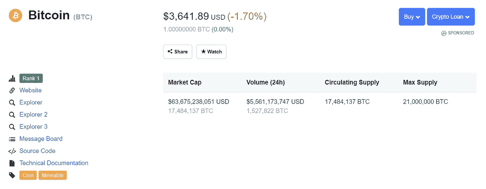
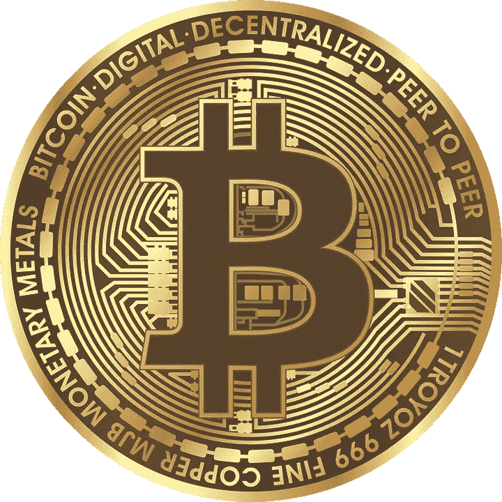

# 新手的区块链行话

> 原文：<https://medium.datadriveninvestor.com/blockchain-jargon-for-newbies-ca9e3ad00334?source=collection_archive---------21----------------------->

*这篇文章是写给那些想了解区块链和比特币，但不知道从哪里开始，也不知道其中一些单词是什么意思的人的。*

Block-chain

**区块链** —区块链被认为是一种最初为数字货币——比特币创造的技术。这项技术的特点是，它允许数据被分发和免费获取，但同时它又足够强大，可以防止数据被复制或盗版。“区块链”这个名字的由来是因为大量的交易以区块链的形式出现。块由一个块头和多个事务组成(例如:500 事务)。每个块包含前一个块的散列，并且它包含直到区块链的第一个块。

> “区块链是一个不朽的经济交易数字账本，可以通过编程不仅记录金融交易，还记录几乎所有有价值的东西。”
> 唐&亚历克斯·塔普斯科特，《区块链革命》作者(2016)

虽然这项技术是从加密货币开始的，但它能够对许多行业产生影响。据称，它将为创建智能合同提供空间，从版权到资产所有权登记、治理、物联网、数据管理，包括反洗钱和了解客户系统，到如此多的流。

就区块链架构而言，它基本上是一个由对等网络构成的分布式分类账系统，可以记录交易，通过数字签名(协议、公钥和私钥)验证和确认交易。区块链技术的设计是这样的，一个计算机网络共同管理区块链，不能由一个单独的实体控制，导致它是一个分散的技术。更详细的描述参见'**总账**。

> 每个块包含前一个块的[加密哈希](https://en.wikipedia.org/wiki/Cryptographic_hash_function)、时间戳[和事务数据(通常表示为](https://en.wikipedia.org/wiki/Trusted_timestamping) [merkle 树](https://en.wikipedia.org/wiki/Merkle_tree)根哈希)维基百科(一个基于 wiki 技术的多语言的百科全书协作计划ˌ也是一部用不同语言写成的网络百科全书ˌ 其目标及宗旨是为全人类提供自由的百科全书)ˌ开放性的百科全书

**比特币** —比特币只是区块链的一个衍生品或分支。它是一种数字货币，属于加密货币的范畴。

Bitcoin market performance ([https://coinmarketcap.com/currencies/bitcoin/](https://coinmarketcap.com/currencies/bitcoin/))

它使用区块链技术进行交易。因此，不存在中央管理机构，也不需要任何中介机构在比特币网络中交换比特币。比特币可以与其他货币进行交易和兑换。尽管某些金融机构和管理实体尚未接受比特币作为货币。Bitcoin.org 成立于 2008 年。然而，据记录，比特币软件作为开源代码于 2009 年 1 月发布。

由于这是一个开源项目，因此从比特币核心衍生出了其他几种比特币类型。这些被称为“叉子”。比特币分叉的几种类型是比特币现金、比特币 XT、比特币无限和平价比特币。

Bitcoin

中本聪——这不是一个科技术语，但你可能会经常听到这个名字。中本聪是比特币的创造者，也是比特币白皮书的作者，他的身份不明且匿名。尚未确定它是一个个体还是一群个体。中本聪可能是一个变位词或一些加密文本。据说中本聪的个人资产为 994 亿美元，在世界富豪榜上排名第 44 位。

你可以点击这个链接找到他/她/他们撰写的研究:[比特币:一个点对点的电子现金系统](https://bitcoin.org/bitcoin.pdf)。

**分类账** —分类账是一个会计术语，从根本上说，总有一个借方分录对应一个贷方分录，反之亦然，结转余额、结转余额、账户类型等。区块链使用分布式分类账系统来维护和促进其交易。

> “……分布式分类帐是一个由大型网络中的每个参与者(或节点)独立持有和更新的数据库。这种分布是独一无二的:记录不是由一个中央机构传送到各个节点，而是由每个节点独立构造和保存。也就是说，网络上的每一个节点处理每一笔交易，得出自己的结论，然后对这些结论进行投票，以确保大多数人同意这些结论。一旦有了这种共识，分布式账本就更新了，所有节点都维护着自己的一模一样的账本副本。”硬币台

因此，由于分布式分类账系统，它使得任何人都难以操纵，因为有几个节点维护一个交易记录。

**挖矿** —挖矿和投资比特币一样受欢迎。这是因为比特币对挖矿实体是有奖励的。

挖掘保存交易发生的记录，并最终将它们分组。然后将向整个网络广播。挖掘需要大量的处理能力。当创建新块时，通过广播进行垂直和水平验证，以验证和同意类似于投票系统。多数人的数据会被接受。因此，这将防止对块的操纵。

> 所有交易都被广播到网络上，通常在 10-20 分钟内开始确认，通过一个叫做 [*挖掘*](https://bitcoin.org/en/vocabulary#mining) 的过程。

**密码术** —这可以被称为将纯文本转换成不可读的文本，该文本可以通过使用用于安全目的的算法的密钥来解密。

**加密货币** —一种数字交易媒介，通过加密技术构成高安全性机制，确保交易安全，防止/最大限度减少欺诈行为。

**FinTech** — FinTech 是推动金融业数字化并以创新与传统模式竞争的新技术、概念、流程和应用。

**成因区块** —成因区块是区块链的第一个区块。它目前被称为数据块 0，但以前的版本将其标识为数据块 1。

**Hashcash** — Hashcash 由 Adam 于 1997 年引入，类似于 Dwork 和 Naor 引入的协议，称为“定价函数”。它被用作限制垃圾邮件和拒绝服务攻击的系统。它因被用于比特币的挖掘算法而再次受到欢迎。

> hashcash 戳构成了一个工作证明，它需要为发送方计算一个可参数化的工作量。

比特币使用 SHA256 算法，有 256 位，有点类似 Hashcash。

**Merkle tree** — Merkle tree 定义了区块链数据的组织结构，用于数据的安全验证。这被定义为一个块中的所有散列列表的二叉树，该块是通过链接节点以创建一个节点而得到的。这是区块链不可或缺的一部分，对区块链用户和比特币矿工极其有用。

> Merkle 树是通过重复散列节点对直到只剩下一个散列(此散列称为根散列或 Merkle 根)来创建的[https://hackernoon.com/merkle-trees-181cb4bc30b4](https://hackernoon.com/merkle-trees-181cb4bc30b4)

优点是它只占用较少的空间，而计算更容易，因此更快。

这也用于简化的支付验证，一种在不检查整个块的情况下验证某些交易是否包括在块中的机制。

………………………………………………………….

*区块链不再仅仅是一个有趣的概念。这项技术将会在未来影响更多的行业。所有行业都必须了解区块链将为有效利用这一概念/技术提供什么。*

………………………………………………………….

***来源***

 [## BTCMANAGER |比特币、区块链和加密货币新闻

### 你的比特币、区块链、以太坊和金融科技新闻之家。每天访问或订阅更新，以掌握…

btcmanager.com](https://btcmanager.com/)  [## 比特币-维基百科

### 交易由网络节点通过加密进行验证，并记录在一个名为 a…

en.wikipedia.org](https://en.wikipedia.org/wiki/Bitcoin)  [## 比特币的神秘发明者现在是世界上最富有的 50 个人之一

### 根据……的数据，比特币在周末几乎触及 20，000 美元，昨天达到 19，771 美元的高点

qz.com](https://qz.com/1159188/bitcoin-price-approaches-20000-making-satoshi-nakamoto-worth-19-4-billion/)  [## 什么是区块链技术？初学者的循序渐进指南

### 您的浏览器不支持音频元素。最后更新:2018 年 9 月 13 日(什么是区块链技术？一个…

blockgeeks.com](https://blockgeeks.com/guides/what-is-blockchain-technology/)  [## 什么是分布式分类账？-硬币台

### 分类账是会计的基础，与文字和货币一样古老。他们的媒介是粘土、木制的小圆桶…

www.coindesk.com](https://www.coindesk.com/information/what-is-a-distributed-ledger)  [## Merkle 树

### Merkle 树是区块链技术的基础部分。merkle 树是一种结构，允许有效的…

hackernoon.com](https://hackernoon.com/merkle-trees-181cb4bc30b4)  [## 比特币是如何运作的？-比特币

### 交易是包含在区块链中的比特币钱包之间的价值转移。比特币钱包…

bitcoin.org](https://bitcoin.org/en/how-it-works)  [## 比特币维基

### 比特币是第一个成功实现的分布式加密货币，1998 年，戴伟…

en .比特币. it](https://en.bitcoin.it/wiki/Main_Page)