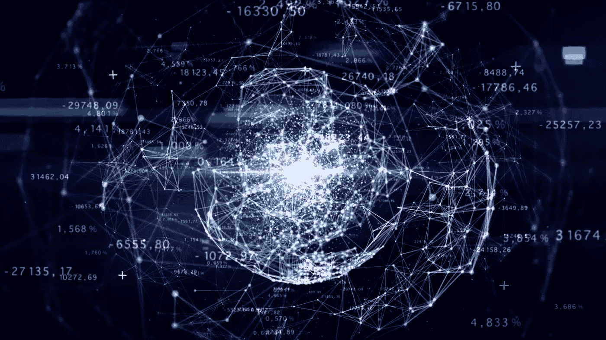
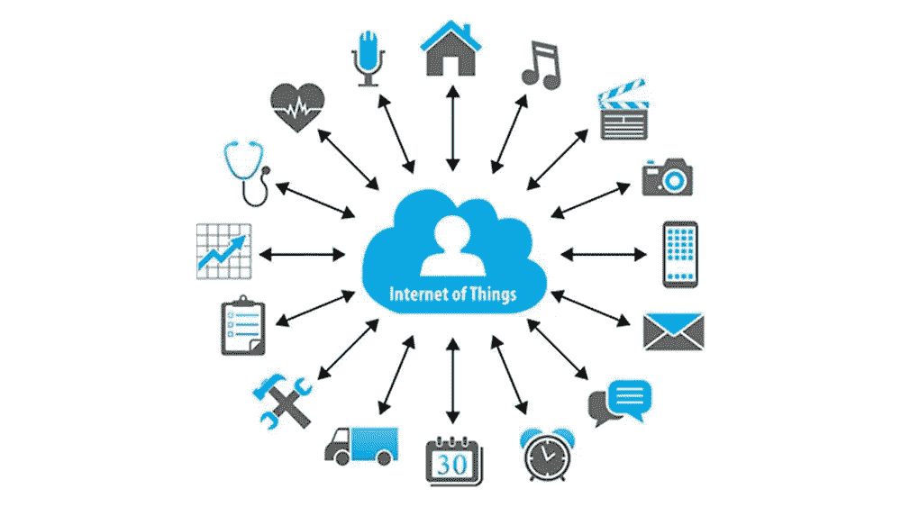
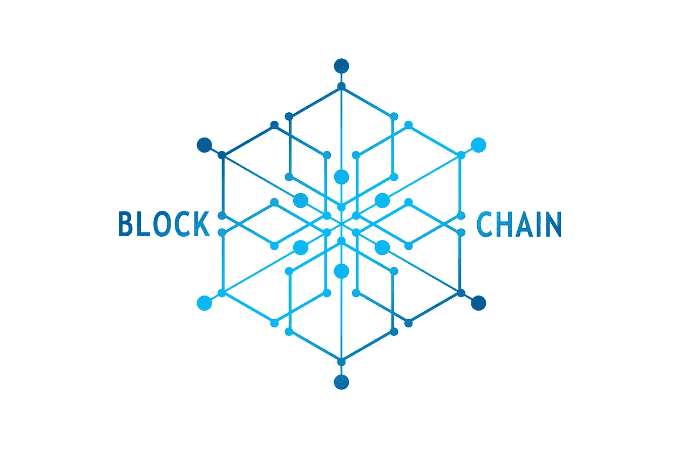
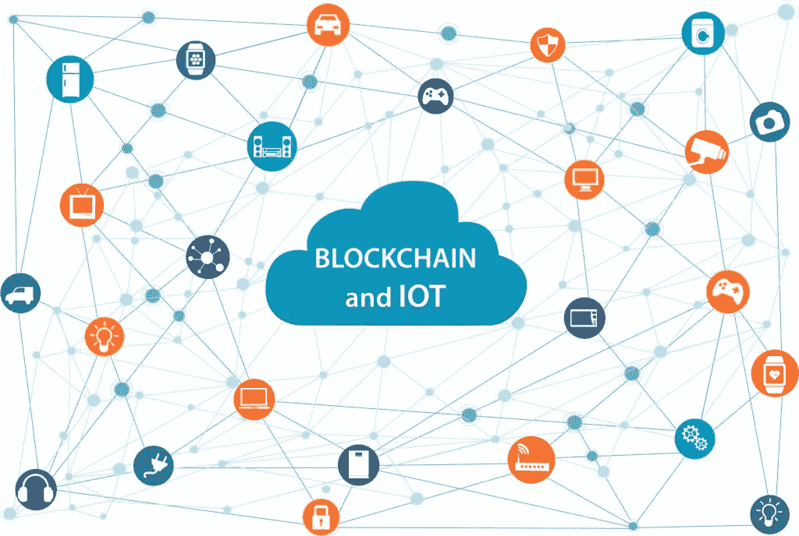
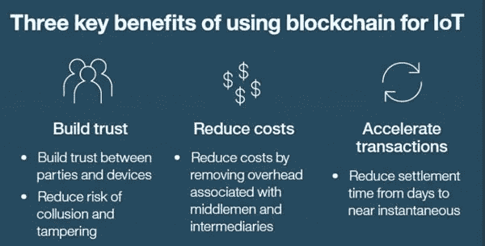

# 区块链加入物联网！简单的 BIOT

> 原文：<https://medium.datadriveninvestor.com/blockchain-joins-iot-simply-biot-30a1db6226c9?source=collection_archive---------6----------------------->

## 听说过 BIoT 吗？

你们很多人可能听说过 IoT。然而，BIoT 可能是一个陌生的术语，因为它来自未来。是物联网的拓展吗？这是大多数科技爱好者的疑问。是的，这是一种扩展。简单来说，BIoT 是区块链加入 IoT 的地方！但随着时间的推移，安全问题限制了物联网的重要性。谁能保证我们互联设备的安全呢？这就是行业专家提出将区块链与物联网相结合的概念的原因！

## IoT 是什么？

物联网是一个处理物理设备网络的概念。我们的一系列设备，如手机、计算设备、安全设备等，都将配备一套智能传感器。此后，它们将通过互联网连接在一起，形成一个单一的平台，通过数据交换产生信息。智能系统使用这些信息来检测模式、提出建议、检测可能的问题并采取相应的措施。

 [## 5 行业转型区块链应用|数据驱动投资者

### 除非你一直生活在岩石下，否则我相信你现在已经听说过区块链了。而区块链…

www.datadriveninvestor.com](https://www.datadriveninvestor.com/2019/02/13/5-real-world-blockchain-applications/) 

物联网的定义有[种，其中安永(EY)](https://informationmatters.net/internet-of-things-definitions/) [用最简单的术语描述了](https://www.ey.com/Publication/vwLUAssets/ey-m-e-internet-of-things/%24FILE/ey-m-e-internet-of-things.pdf)物联网:

> “物联网(IoT)描述了使用嵌入式软件和传感器将设备(任何设备)连接到互联网，以相互通信、收集和交换数据。”

# 放聪明点！

这种实现看起来非常聪明！因此，大多数关于物联网概念的倡议都带有“智能”一词。智能家居系统、智能停车系统是商业世界中出现的物联网概念的一些主流吸引力。一大群人非常激动地拥抱了他们。

> 研究和咨询公司 Gartner [估计](https://www.gartner.com/en/newsroom/press-releases/2017-02-07-gartner-says-8-billion-connected-things-will-be-in-use-in-2017-up-31-percent-from-2016)到 2020 年，已安装的物联网设备数量将达到 204 亿，BI Intelligence [预测](https://www.businessinsider.com/there-will-be-34-billion-iot-devices-installed-on-earth-by-2020-2016-5?IR=T)将接近 240 亿，而全球市场情报和咨询服务提供商 [IDC](https://www.ibm.com/blogs/internet-of-things/enterprise-scale-iot-platform-watson/) 估计，到 2020 年将有大约 300 亿台联网设备。
> 
> IDC 还预测，到 2019 年底，物联网收入将达到 3570 亿美元，管理咨询公司贝恩公司预计，到 2020 年底，物联网收入将增加到 4500 亿美元。另一家国际管理咨询公司麦肯锡公司估计，到 2025 年，物联网将对全球经济产生 11.1 万亿美元的影响。

很明显，这已经是一个庞大的行业，在未来十年甚至更长时间内将呈指数级增长。

# 物联网到底是如何工作的？

通信设备或传感器嵌入在日常物品中，例如电话、电视、室内气候系统、电器、汽车、交通灯和工业设备。这些传感器不断发射有关连接设备工作状态的数据，并允许它们通过云(互联网)相互发送和接收数据。

然后，物联网平台将分析数据，提取有价值的信息，并与其他设备共享，以启动特定的命令或行动。结果是更好的人类体验、更高的自动化程度和更高的效率。

例如，在制造业，工厂中所有不同的组件和机器都可以安装传感器，不断将系统健康数据传输回运营商的移动应用程序。潜在的问题可以在故障发生之前被识别和修复，从而节省公司的时间和金钱。

如果我们看一个直接面向消费者的产品，如空调，设备可以嵌入一个传感器，发出有关系统健康和温度的数据。数据将在物联网网络中持续下载和分析。如果出现问题，甚至在您知道有问题之前，就可以联系客户支持进行维修。

物联网的使用案例几乎是无止境的，从保持患者体内的医疗设备处于良好工作状态，到对抗全球雨林中的 T2 森林快速砍伐。

但是物联网网络并不完美。设备不断地在互联网上来回共享关键信息，这使得互联网成为黑客的主要目标。因此，隐私和安全是主要问题。

一些更臭名昭著的物联网攻击包括 [Mirai 未来组合僵尸网络](https://www.csoonline.com/article/3258748/security/the-mirai-botnet-explained-how-teen-scammers-and-cctv-cameras-almost-brought-down-the-internet.html)，这是一种 [DDoS](https://cointelegraph.com/tags/ddos) (分布式拒绝服务)攻击，影响了几乎整个美国东海岸的互联网服务，包括 Twitter、网飞和 Reddit。

还有计划中的对一辆吉普车的黑客攻击，以暴露汽车物联网设备的一些漏洞以及被入侵时可能产生的灾难性后果，以及 2017 年 9 月非常真实的 FDA 召回 50 万台物联网起搏器，因为发现了安全漏洞，可能允许黑客篡改植入患者体内的医疗设备。

## 区块链背后的概念是什么？

该技术用于跟踪数十亿台互联设备，并以更可信的方式实现设备间的交易和协调过程。这些事务中的每一组都是一个“块”。每个块包含一个时间戳和一个到前一个块的链接，这就是这个“块链”是如何创建的。在最基本的层面上，分散化方法及其值得信赖的方法恰好是行业专家将区块链与物联网融合的一些关键原因。

## 是什么让区块链成为一个值得信赖的概念？

可以这样简单解释。在块链中，所有块都以特殊方式加密。每个参与者都可以访问所有的信息，但是只有拥有被称为私钥的特殊密钥的用户才能向特定的链添加新的记录。旧数据块将被永久保留，新数据块将被不可逆转地添加到分类帐中，这使得它成为一种跟踪数据随时间变化的非破坏性方法。关于 BIoT，很明显，如果网络内部出现问题，这种值得信赖的块链方法可以轻松识别薄弱环节，并采取补救措施。

块链的分散方法伴随着每个块与链中前一个块和后一个块的连接。当做出改变时，整个链被更新。不再需要第三人来管理流程。就 BIoT 而言，由于这种分散化的方法，关键利益相关者网络之间的数据共享将会发生。这将防止未经授权的设备破坏物联网连接设备的网络。

# 已知的区块链物联网平台

随着行业变得越来越大，一些专注于物联网的区块链平台正在涌现。

IOTA 是首批区块链物联网平台之一。它专为物联网而设计，为互联设备提供交易结算和数据传输层。

其他一些以物联网为重点的区块链平台有:

[维琴](https://cointelegraph.com/tags/vechain)，[沃顿琴](https://www.reddit.com/r/waltonchain/)，[飘带](https://www.forbes.com/sites/astanley/2018/05/16/streamr-partners-with-nokia-and-osisoft-on-iot-data-sharing/#10e8fb26a1da)

这只是区块链物联网平台的一个小样本，随着行业的发展，这个列表还会继续增长。其他项目包括[ambroses](https://cointelegraph.com/news/gavin-wood-helps-launch-blockchain-food-tracking-startup)，物联网链，Atonomi，物联网链， [IoTeX](https://twitter.com/iotex_io/status/1013926719667896320) ，[origin tiil](https://cointelegraph.com/news/us-fourth-largest-railway-company-joins-blockchain-in-transport-alliance)， [Slock.it](https://cointelegraph.com/news/slockit-dao-token-ious-to-go-on-sale-thursday) ， [BlockMesh](https://twitter.com/blockmesh_io/status/951556026469355520) ，[氦](https://cointelegraph.com/tags/jason-cassidy)， [Moeco](https://cointelegraph.com/news/new-partnership-for-global-iot-connectivity) ，FOAM，Fysical， [Grid+](https://cointelegraph.com/news/decentralized-electricity-could-be-blockchains-trojan-horse) 和[电力台账](https://cointelegraph.com/news/australian-real-estate-major-to-trial-blockchain-powered-solar-energy-management-solution)。

## 生物与未来

前段时间，区块链和物联网是两个截然不同的话题，分别影响着行业。今天，令人惊讶的是，它们如何融合在一起，成为基于区块链的物联网(BIoT)，在商业界创造了许多兴奋。可以肯定的是，这两种趋势技术在未来几年将变得不可分割。

这只是对这项新兴技术的简单解释。如果你感兴趣，别忘了阅读更多关于 BIoT 的内容。干杯！