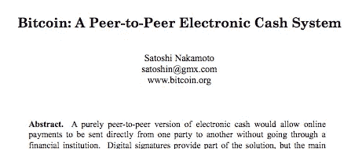

# 区块链:下一代互联网

> 原文：<https://medium.datadriveninvestor.com/blockchain-next-generation-of-the-internet-ec0089ce2b69?source=collection_archive---------17----------------------->

2008 年 10 月，一个名为中本聪的个人或团体发表了一份题为“比特币:点对点电子现金系统”的白皮书。我们一点也不知道，白皮书描述了一个系统，它将成为自互联网本身以来最具破坏性的技术的支柱。

## 白皮书里有什么？

白皮书描述了第一个点对点分散货币系统及其背后的技术。看起来，中本聪对我们金融系统的现状并不满意。2008 年的金融危机表明，传统模式是多么无效，中本聪希望创建一个系统，在这个系统中，不需要可信的第三方来执行交易。他照做了。它被称为比特币。

## 那么比特币到底是什么，它是如何工作的？

理解比特币的最佳方式是将其视为一种不为任何人所有的互联网货币。它与传统货币没有太大区别，但它确实做了一些不同的事情。两个主要区别是:

*   与传统货币不同，没有中央机构控制交易。没有中介就意味着费用更低或者不收费。
*   交易是匿名进行的。比特币使用加密技术对每一笔交易进行加密。

## 什么是区块链？

区块链是为比特币提供动力的技术。但也有很多。

对许多人来说，区块链是一个复杂的主题，令人难以置信。简而言之，它是一个分布式分类账(由一群人维护)，交易以加密格式记录和保存。称之为账本可能有点过于简单了，但本质上，它就是账本。

毫无疑问，比特币是这项技术最成功的实现，但它远非唯一的实现。

## 为什么这么重要？

区块链风靡全球，因为它打开了大量新的大门。去中心化的点对点系统(区块链就是这样)并不新鲜，但这种技术的现实应用及其可行性从未在大型主流平台上真正测试过(当然，直到比特币)。

理解区块链的真正潜力可能很难，但可以这样想——发明轮子的人能想象他的发明会影响多少人的生活吗？

## 互联网的现状

我们当前的互联网模式的工作原理是与网络上的不同用户共享相同数据的多个副本。你加入像 Twitter 这样的网络，与成百上千的人分享你的照片。每个人都可以访问你的数据副本。这个想法扩展到互联网上的一切。从电子邮件，YouTube 上的视频，或任何其他相关数据。

这个模型的问题是它能做的事情有限。您可以共享照片、视频等数据。别人有一份拷贝也没问题，但是当涉及到具有真实货币价值的真实世界的资产时呢？

例如，你付给某人 10 美元现金，这个人拿了钱，你就不再有这 10 美元了。但在互联网上，除非你有一个中间人或一些验证系统，否则你可以向某人支付 10 美元的数字现金，但仍然拥有原来的 10 美元，因为在我们当前的互联网模式下，我们只是共享数据的副本。这就是所谓的重复支出问题。区块链旨在解决这一问题，同时消除对中间人的需求。

## 区块链和重复支出问题

重复花费的问题简单来说就是指拥有某样东西的两个副本的问题，这种东西应该是独一无二的。想想房子、汽车或任何现实世界的资产——你不会希望其他人继续拥有你刚刚支付的房子，对吗？

区块链利用密码学解决了双重花费的问题。它为每笔交易创建一个唯一的 ID，由一组称为矿工的人进行验证。只有当小组中的每个人都解决了一个谜语，交易才是有效的，如果交易是合法的，他们都会得到相同的答案，此时，交易会被记录在分类账中。一旦被记录，就不能进行更改，因此，每个事务只能有一个副本。

## 下一代互联网

区块链技术被许多专家称为下一代互联网，这是有充分理由的。重复消费是数字货币发展的主要障碍之一，2008 年的某一天，它不再是一个问题。人们现在可以在没有中介的情况下使用数字货币转移资金、交易证券、买卖资产等等。但最重要的是使用数字货币的安全性和便利性。

我没有任何比特币或任何数字货币的投资。事实上，我认为投资加密货币对我来说压力太大了，但我确实认为这是一个令人兴奋和重要的新前景，但大多数人并没有很好地理解。我打算谈论更多的区块链的其他应用，使它如此有趣和多才多艺。

## 正在总结…

下一步是将区块链融入主流互联网。我们的数据需求(在医疗、金融、技术等领域。)正在迅速变化。这种变化需要互联网的发展——让它更好地适应这个新世界。

区块链利用互联网，使其成为一个平台，可以做以前不可能做的事情。这类似于 1993 年互联网首次向公众开放时发生的事情。

是的，现在的技术有它的局限性，但是 1993 年的互联网也是如此。

局限性是可以克服的，这正是创造区块链的理念。

在[http://thewriterman.com](http://thewriterman.com)阅读更多