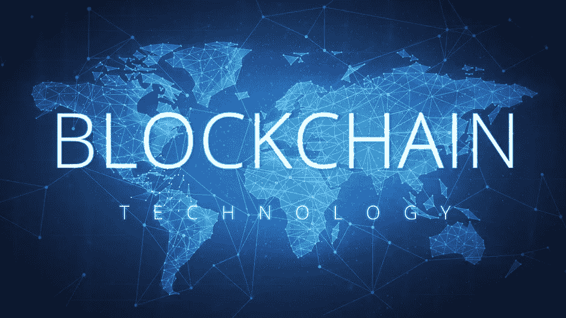
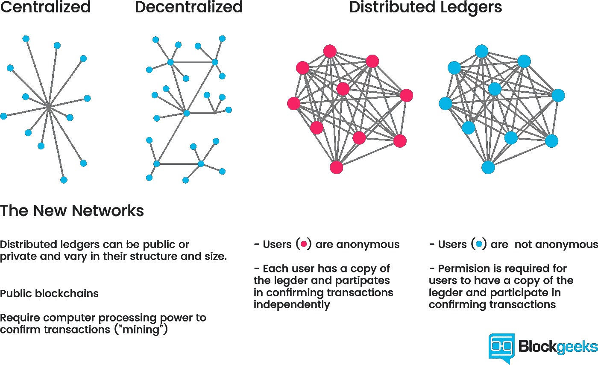
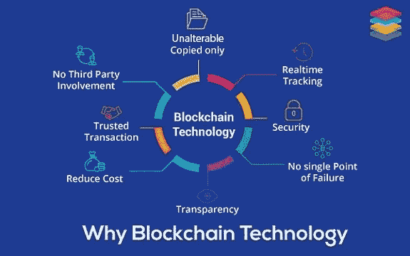
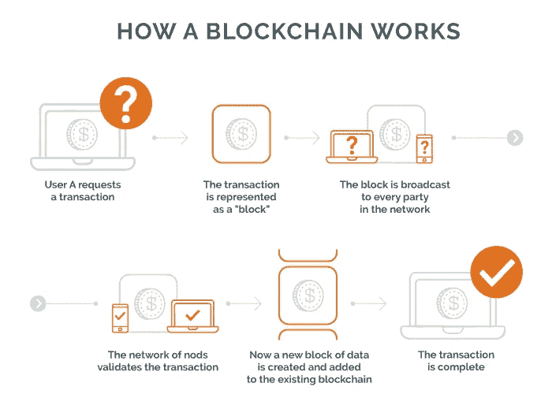
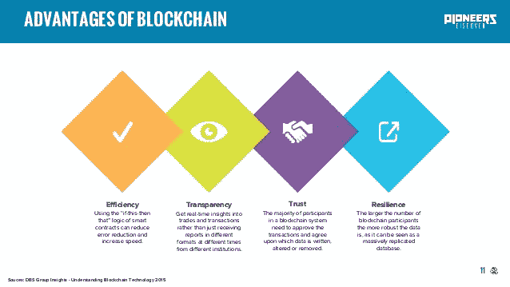

# 区块链过于简化:区块链初学者指南。

> 原文：<https://medium.datadriveninvestor.com/blockchain-oversimplified-a-beginners-guide-to-blockchain-47f605d7d2a6?source=collection_archive---------1----------------------->

# ***区块链历史***

*首先，让我们谈谈区块链的历史。在它被用于加密货币之前，它最初只是计算机科学中的一个概念，特别是在密码学和数据结构领域。*

*区块链的最原始形式是哈希树，也称为 Merkle 树。这种数据结构由 Ralph Merkle 于 1979 年申请了专利，其功能是在计算机系统之间验证和处理数据。在计算机的对等网络中，验证数据对于确保数据在传输过程中不会被修改或改变是至关重要的。它还有助于确保不发送虚假数据。本质上，它用于维护和证明共享数据的完整性。*

*1991 年，Merkle 树被用来创建一个“安全的块链”——一系列数据记录，每一个都连接到前一个。这个链中的最新记录将包含整个链的历史。就这样，区块链诞生了。*

*2008 年，中 mato 提出了分布式区块链的概念。它将包含数据交换的安全历史，利用对等网络对每一笔交易进行时间标记和核实，并且可以在没有中央机构的情况下自主管理。这成为了比特币的支柱。因此，我们今天所知的区块链诞生了，还有加密货币的世界。*

**

# *什么是区块链？*

*不可否认，区块链是一个巧妙的发明——是化名中本聪的一个人或一群人的心血结晶。但从那以后，它演变成了更有意义的东西，每个人都在问的主要问题是:什么是区块链？*

*对于不熟悉加密货币世界的投资者来说，最令人不知所措和困惑的方面之一可能是区块链。区块链技术是推动和支持数字货币空间的力量，许多分析师认为它包含许多可行的应用程序，并在加密货币之外使用。*

*通过允许数字信息被分发但不被复制，区块链科技创造了一种新型互联网的主干。最初是为数字货币比特币设计的，技术社区现在正在寻找这项技术的其他潜在用途。*

*通过分布式时间戳服务器和对等网络，安全性被构建到区块链系统中，结果是以分散方式自主管理的数据库。这使得区块链非常适合记录事件(如医疗记录)、交易、身份管理和证明出处。它必然提供了贸易和交易处理的大规模非中介化的潜力。*

**

# *区块链科技能做什么？*

*对此不要有任何误解。区块链是一项极具颠覆性的技术，有望改变我们所知的世界。这项技术不仅改变了我们使用互联网的方式，也彻底改变了全球经济。*

*通过实现资产的数字化，区块链技术正在推动从信息互联网到价值互联网的根本性转变，在信息互联网上，我们可以即时查看、交换和交流信息，在价值互联网上，我们可以即时[交换资产](https://biditex.com/)。一个新的直接价值转移的全球经济正在形成，在这个经济中，大型中介不再发挥重要作用——在这个经济中，信任不是由中央中介建立的，而是通过共识和复杂的计算机代码建立的。*

*区块链有潜力改变交易、货币和全球经济的本质。这项技术的应用远远超出了数字货币和资金转移等表面现象。从电子投票、智能合同和数字记录的财产资产，到患者健康记录管理和数字内容的所有权证明。*

*区块链将深刻颠覆数百个依赖中介的行业，包括银行、金融、学术、房地产、保险、法律、医疗保健和公共部门等。这将导致失业和整个行业的彻底转变。但总体而言，取消中介带来的好处大多是正面的。例如，银行和政府通常会阻碍业务的自由流动，因为处理交易和监管要求需要时间。*

*区块链技术将使越来越多的人和企业能够更加频繁和高效地进行交易，极大地促进当地和国际贸易。区块链技术还将消除昂贵的中介费用，这些费用已经成为个人和企业的负担，特别是在汇款领域。*

**

# *它是如何工作的？*

*比特币区块链是“分散的”，这意味着它不受一个中央机构的控制。*

*虽然传统货币由中央银行发行，但比特币没有中央权威。相反，比特币区块链是由一个被称为矿工的网络维护的。*

*这些“矿工”，有时被称为网络上的“节点”，是运行专门构建的计算机的人，这些计算机竞相解决复杂的数学问题，以使交易得以进行。*

*例如，假设很多人在进行比特币交易。每笔交易都源自一个有“私钥”的钱包这是一个数字签名，提供了交易来自投资组合所有者的数学证明。*

*现在想象一下，世界各地正在进行大量的交易。这些单独的事务被分组到一个块中，由严格的密码规则组织。该区块被发送到比特币网络，该网络由运行高性能计算机的人组成。这些计算机通过试图解决复杂的数学难题来验证交易。*

*获胜者将获得比特币形式的奖励。*

*然后，将这个经过验证的块添加到前面的块上，创建一个称为区块链的块链。*

**

# *区块链有什么好处？*

**

*出于各种原因，区块链对一些不同的群体具有吸引力，其中包括:*

*对中央机构的要求的缺乏使其成为合资企业和附属关系的理想分类账和结算解决方案，合资企业和附属关系通常是在平等或 50/50 的基础上建立的，没有仲裁员或经理的规定。事实上，让计算机验证交易并进行结算消除了对票据交换所和其他结算代理的需要，在商业安排中提供了非中介化，并且通常降低了成本，同时提高了进行、验证、结算和记录交易的速度。*

*数字签名和验证使得人们很难想象一个糟糕的行为者会导致欺诈，并带来消除和解决成本高昂的问题。整个未决交易的加密完整性，以及区块链体系结构的多个节点的检查，防止了技术的威胁和恶意使用。(值得注意的是，这种安全保护在市场上大多未经测试，尽管热衷于理论基础，但对于这种保护在我们今天生活的数字经济现实中的表现如何，仍然存在疑问。*

*区块链的概念在跟踪资产如何通过供应链，通过某些供应商和工厂，传输和运输线路，并进入其最终位置方面非常有效。*

***参考文献:***

> *什么是区块链技术？初学者指南。(2018 年 7 月 16 日)。检索自[https://nisanthvijy . WordPress . com/2018/07/16/what-is-区块链-technology-a-guide-for-初学者/](https://nisanthvijay.wordpress.com/2018/07/16/what-is-blockchain-technology-a-guide-for-beginners/)*
> 
> *c .汤普森(2018 年 09 月 05 日)。区块链是如何运作的？角。1.检索自[https://www . site point . com/how-do-the-区块链-work-pt-1/](https://www.sitepoint.com/how-does-the-blockchain-work-pt-1/)*
> 
> *新泽西州赖夫(2018 年 6 月 15 日)。区块链是如何工作的？从 https://www.investopedia.com/tech/how-does-blockchain-work/[取回](https://www.investopedia.com/tech/how-does-blockchain-work/)*
> 
> *加利福尼亚州拉法耶&仙黛尔公司。(2018 年 9 月 27 日)。什么是区块链技术？初学者简易指南(2018)。检索自[https://www . investinblockschain . com/what-is-区块链-technology/](https://www.investinblockchain.com/what-is-blockchain-technology/)*
> 
> *哈塞尔，J. (2016 年 4 月 14 日)。什么是区块链，它是如何工作的？检索自[https://www . CIO . com/article/3055847/security/what-is-the-Washington-and-how-it-work . html](https://www.cio.com/article/3055847/security/what-is-blockchain-and-how-does-it-work.html)*

**如果您想了解更多，请访问 BIDITEX 页面并提出您的问题，关注我们的*[*Twitter*](https://twitter.com/biditex_com)*，* [*脸书*](https://www.facebook.com/biditex/) *，* [*中型*](https://medium.com/@biditex) *，* [*电报*](https://t.me/biditex%20%28edited%29) *，* [*LinkedIn* 投标变更用](https://www.linkedin.com/company/biditex)**。***