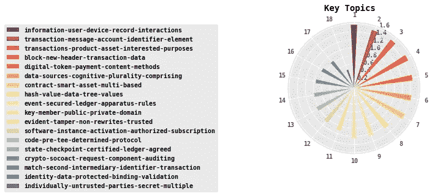
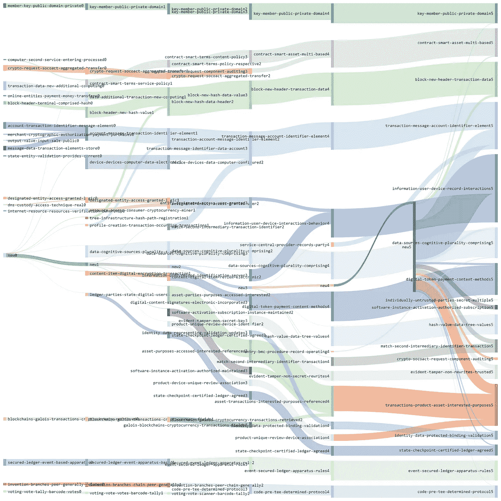
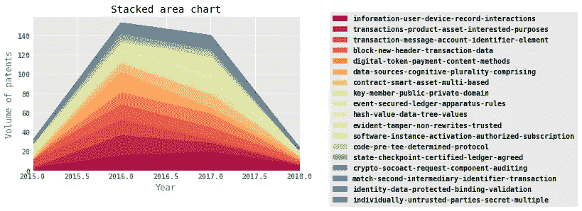
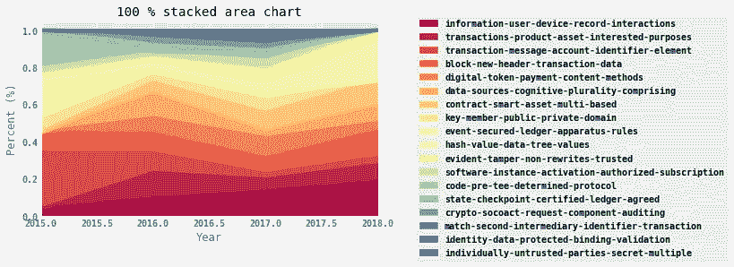
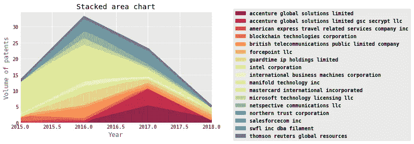
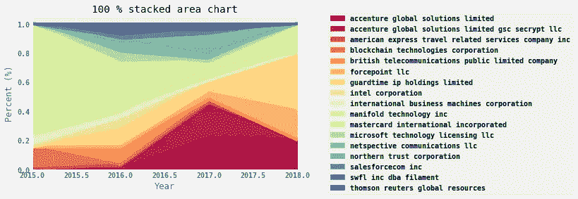

# 区块链专利分析:由人工智能自动执行和叙述

> 原文：<https://medium.datadriveninvestor.com/blockchain-patent-analysis-auto-performed-narrated-by-ai-7c7fc21513d8?source=collection_archive---------22----------------------->

区块链技术的专利景观，包括下面的图表和叙述，是由具有人工智能(AI)的机器自动生成的。要了解其背后的技术，请阅读我之前关于清理生活的博客([人工智能清理生活](https://medium.com/datadriveninvestor/ai-to-de-clutter-life-fc9c11d84776))，其他具体应用请参见[“人工智能可以清理在线市场中的群体智慧”](https://medium.com/datadriveninvestor/ai-can-de-clutter-crowd-wisdom-in-online-marketplaces-329e251ed3de)

从这一行开始，一切都是由代码和人工智能自动生成的。

**区块链专利分析**

Machine 分析了 2015 年 3 月 13 日 00:00:00 到 2018 年 5 月 4 日 00:00:00 之间提交的 342 项专利

注意:由于自上次提交专利以来，今年还有 241 天 00:00:00 小时，图表将在 2018 年显示下降

**储存库中包含 18 个主题**

已申请专利的主题列表按降序排列为
1 信息-用户-设备-记录-交互
2 交易-消息-账户-标识符-元素
3 交易-产品-资产-感兴趣的目的
4 块-新-标题-交易-数据
5 数字-令牌-支付-内容-方法
6 数据源-认知-多元-包含
7 合同-智能-资产-基于多元的
8 散列值-数据-树-值【值

话题是如何演变的？

申请专利的前 5 个主题是
1 交易-数据-新-附加-计算
2 安全-分类帐-基于事件-设备
3 账户-交易-标识符-消息-元素
4 加密-请求-soco act-聚合-传输
5 块-报头-终端-包含-散列

今天，正在申请专利的前 5 个主题是
1 信息-用户-设备-记录-交互
2 交易-消息-账户-标识符-元素
3 交易-产品-资产-相关目的
4 块-新-报头-交易-数据
5 数字-令牌-支付-内容-方法

在谈话流程中，是否有人们应该注意的关键话题？

*   主题:事务-数据-新-附加-计算-在块 0 / 6 中发现，当时很突出，但后来合并或拆分了
*   主题:block-new-hash-data-header —在块 2 / 6 中发现，当时很突出，但后来合并或拆分了
*   主题:交易-消息-标识符-数据-帐户-在块 3 / 6 中找到，当时很突出，但后来合并或拆分了
*   主题:block-new-hash-data-value —在区块 3 / 6 中发现，当时很突出，但后来合并或拆分了

让我们来看看对话中的趋势

*   信息——用户——设备——记录——交互达到高峰，但活动比过去减少了
*   交易——产品——资产——兴趣——达到峰值，活动比过去减少
*   交易-消息-帐户-标识符-元素-已达到峰值，活动比过去减少
*   block-new-header-transaction-data—已达到峰值，活动量比过去有所减少

**一些话题的排名发生了显著变化**

*   交易-产品-资产-相关目的在此期间显著提高了其地位
*   事务-消息-帐户-标识符-元素在时间范围内显著降低了它的位置
*   数字代币支付内容方法已经大大提高了它在这个时间段的地位
*   合同智能资产多基础在这段时间内显著提高了它的地位
*   事件安全分类帐设备规则在时间范围内显著降低了它的位置
*   显而易见-篡改-非重写-可信在这段时间内显著提高了它的地位
*   代码-tee-determined-protocol 在时间范围内显著降低了其位置
*   州检查点认证账本同意在时间范围内大幅降低其地位

**排名前五的发明家是:**
1 Manoj Saxena[' None ']
2 Richard Knuszka[' None ']
3 Matthew Sanchez[' None ']
4 David Treat['埃森哲全球解决方案有限公司，GSC Secrypt，LLC']
5 Michael t . Chiaramonte['埃森哲全球解决方案有限公司，GSC Secrypt，LLC ']

**排名前五的创新公司是:**
1 万事达卡国际有限公司
2 guard time IP holdings limited
3 埃森哲全球解决方案有限公司
4 埃森哲全球解决方案有限公司、gsc secrypt，llc
5 英国电信公共有限公司

让我们看看创新公司的趋势
注意:随着没有公司受让人的专利被丢弃，图表形状可能会改变

*   英国电信公共有限公司——已经达到高峰，业务活动比过去减少
*   guard time IP holdings limited——已达到峰值，但活动比过去减少
*   万事达卡国际公司——已经达到顶峰，但活动比过去减少了

一些主题已经显著改变了它们的排名

*   埃森哲全球解决方案有限公司在此期间显著提高了其地位
*   埃森哲全球解决方案有限公司 gsc secrypt llc 在此期间显著提高了其地位
*   区块链技术公司在这段时间内已经大大降低了它的立场
*   forcepoint llc 在此期间显著提高了其地位
*   guardtime ip holdings limited 在这段时间内显著提高了其地位
*   国际商业机器公司在这段时间内大幅降低了它的地位
*   manifold technology inc .在此期间显著提高了其地位
*   在此期间，北方信托公司显著改善了其地位

**机器给你先睹为快的前 5 大话题:**

2 交易-消息-账户-标识符-元素
————————
一种用于授权区块链交易的方法包括:存储账户简档，每个简档包括账户标识符、法定金额和区块链金额；接收交易消息，所述交易消息基于交易消息标准被格式化，并且包括包含特定账户标识符的第一数据元素和包含网络标识符和交易金额的保留给私人使用的第二数据元素；识别包括特定账户标识符的特定账户概况；基于交易金额和法定金额和区块链金额中的至少一个来识别风险值；基于所识别的风险值来确定交易的授权；基于授权确定修改交易消息；以及发送修改的交易消息。

4 block-new-header-transaction-data
一种使用区块链传播配置数据的方法包括:存储由多个块组成的区块链，每个块由具有时间戳的块头和一个或多个配置事务组成；接收一个或多个配置数据项；为每个配置数据项生成新的配置事务；散列基于包括在相应块报头中的时间戳识别的最近块，以生成先前块散列值；散列新配置事务和/或与之相关联的数据的组合，以生成当前块散列值；生成新的块报头，该新的块报头包括当前时间戳、先前块散列值、当前块散列值和数字签名；生成包括新块头和每个新配置事务的新块；以及通过附加新块来更新区块链。

这里描述的系统和方法可以生成与支付者用户相关联的数字支付令牌，指示支付者用户的支付义务的状态。该系统和方法可以生成包含数字支付令牌的第一块，并将该第一块附加到区块链。该系统和方法可以从第三方交易服务器接收付款人用户已经全部或部分履行他或她的支付义务的确认消息。基于确认消息，系统和方法可以检索包含数字支付令牌的块，并更新数字支付令牌以生成更新的数字支付令牌。该系统和方法可以生成包含更新的数字支付令牌的第二块，以取代第一块，并将第二块附加到区块链。更新的数字支付令牌可以指示数字支付令牌已经过期。

3 交易-产品-资产-相关目的
—————
交易的区块链可用于各种目的，并可在以后由相关方访问以进行分类账核实。一种示例性操作方法可以包括以下一项或多项:识别与产品相关联的生产日期，基于区块链的一个或多个块的散列创建唯一代码来表示生产日期和产品，以及将唯一代码转发给验证服务器以验证产品。

1 信息-用户-设备-记录-交互
公开了一种用于生成网络行为简档的方法、系统和计算机可用介质，包括:监视用户和信息处理系统之间的用户交互；将用户交互和关于用户的信息转换成表示用户交互的电子信息；基于表示用户交互的电子信息和关于用户的信息，生成唯一的网络行为简档；以及在行为区块链中存储与唯一网络行为简档相关的信息。

—文件结束—

> 数据掌握着真理。代码+AI 可以解锁。在人工智能的世界里，数据很重要，情报也很重要。

注意:有兴趣获得定制报告或在其组织/产品中实施上述知识产权的公司可以通过 [Linkedin](https://www.linkedin.com/in/harshaangeri/) 联系