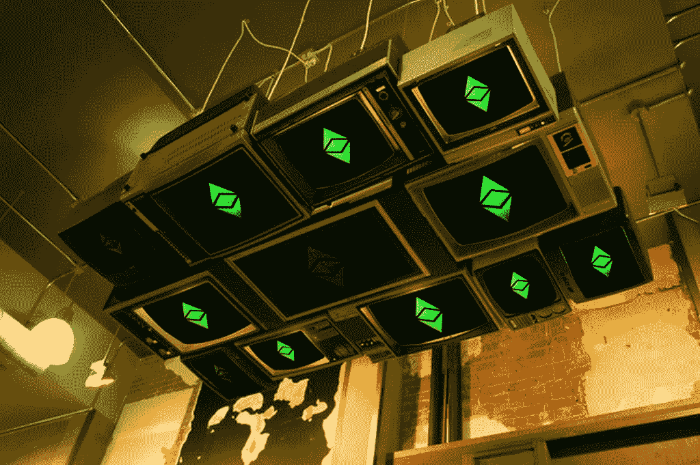

# 区块链驱动的物联网

> 原文：<https://medium.datadriveninvestor.com/blockchain-powered-iot-fa247c8698d0?source=collection_archive---------1----------------------->

Ethereum Classic (ETC) Logo on Old TVs

## 大众化数据价值

数据一直是经济的驱动力。在当今世界，我们看到每天每时每刻都会产生大量数据。有大公司利用个人的行为和模式，通过向零售商出售推断的利益，试图用直接聚焦的广告击中他们的目标市场。欧盟的**通用数据保护条例**，通常简称为 **GDPR** ，已经传出了很多消息。这只是一个旁注，强调了数据在当今世界的重要性，而不是本文的主题。

## 黑镜物联网

The Verge’s 2018 Review on this recently [leaked internal Google video from 2016](https://www.youtube.com/watch?v=2hxs__6US5U)

这个视频描绘了一个在不久的将来的反乌托邦科幻小说，带有一种怪异的黑色基调。它描绘了一幅**谷歌**使用用户数据分类账来瞄准和设计定制的**物联网**产品的画面，其目标是增强分类账的主动性。他们使用非常令人毛骨悚然的语言，暗示用户数据就像基因代码，有自己的自我意识，自私的账本。谷歌想知道你的体重，所以他们为你定制了一个体重秤，它的设计在视觉上很吸引人，而且价格也是他们知道的。

> “我们理解这是否令人不安——这是故意的。这是设计团队多年前的一个思想实验，使用一种被称为“投机设计”的技术来探索令人不舒服的想法和概念，以引发讨论和辩论。它与任何当前或未来的产品都没有关系。”— [谷歌的回应岌岌可危](https://www.theverge.com/2018/5/17/17344250/google-x-selfish-ledger-video-data-privacy)

Whether Google uses the mentality portrayed in that video or not, it’s still creepy to know they made that video.

> 嗯嗯，当然…

如果你看看视频或评论，你会觉得这基本上已经发生了。所以数据法规是一件好事。

**GDPR** 是为了保护消费者，并试图将他们的数据控制权掌握在他们手中。就物联网设备而言，监控和隐私都是令人担忧的问题。随着**物联网**连接传感器，尤其是智能摄像机和机器人的发展，数据监管和治理的这些变化至关重要。

人们开始意识到他们的数据正在被获取以获取利润，并要求控制他们的数据如何被使用。随着 HBO 的硅谷在最新一季中描绘了一个 ICO，加密货币趋势已经成为主流。**区块链**技术是通过去中心化信任实现数据价值民主化的新数据革命的驱动力。

> 区块链技术的核心是为人们而非组织提供支持— [Eric Piscini，LLP 德勤咨询公司负责人](https://www.coindesk.com/2018-year-democratize-blockchain/)

像**区块链**驱动的**物联网**这样的分布式信息和处理系统将把云连接几乎完全排除在**物联网**方程式之外。**物联网**，指连接到网络的设备。传统上，这意味着增加 WiFi 和一个基本的处理过程，将遥测数据发送到云端。[智能锁](https://www.liftmaster.com/for-homes/myq-connected-home)、[汽车](https://www.tesla.com/)、 [crockpots](https://www.crock-pot.com/crock-pot/crock-pot-6.0-quart-smart-slow-cooker-with-wemo/SCCPWM600-V2.html) 、[摄像头](https://nest.com/cameras)、[门铃](https://ring.com/)、[车库门开启器](https://www.liftmaster.com/for-homes/myq-connected-home)都使用这种连接到云 API 的基本概念，允许用户从提供商托管的集中式 API 访问数据。这并不意味着他们*必须*依赖云来为他们的人工智能、数据存储或处理提供服务。事实上，它将使智能设备能够离线决策。

## 公共可编程区块链共识网络

[**以太坊**](https://www.ethereum.org/) 是目前最受大众欢迎的**区块链**方案。它使任何人都能够通过象征性的经济学来建立一个开放的公共参与生态系统。**以太坊**是一个**可编程区块链**，所以它不仅分发一个数据分类帐，而且提供一个机制给开发者使用**以太坊虚拟机** ( **EVM** )来开发和执行**智能合约**。**智能合约**被部署到 **EVM** 上，分散的应用程序可以与之交互。消费者可以通过被称为 **DApps** 的**分散式** **区块链**应用来买卖代币以及与**智能合约**互动。

令牌通常与同名的所有其他令牌具有相同的。还有**特有代币**的**智能合约**称为 [**收藏品**](http://erc721.org/) 具有彼此独立的价值。 [**CryptoKitties**](https://www.cryptokitties.co/) 是[非常受欢迎的](https://www.coindesk.com/loveable-digital-kittens-clogging-ethereums-blockchain/)这种可收集代币的例子。虽然每个加密资产都是一只猫，但这只猫有确定其价值的特征和逻辑。每个代币代表一只特定的有独特价值的小猫。在 [Sea Foam Media](https://www.seafoam.media/) 我领导了[blipdf](http://blipdfs.com/)的构建，它将扩展 [crypto final four](http://cryptofinalfour.com/) 项目的理念，并为所有运动提供一个梦幻阵容 dapp。每个阵容都有独特的价值，这是由玩家在特定游戏中的数据决定的。

让我们从物联网的角度来考虑收藏品

## 区块链私营“企业”中值得信赖的同行

举几个例子来说，有许多隐私加密货币**和 [**永旺**](https://www.aeon.cash/) 。这些区块链平台提供交易隐私。这些是企业对消费者和 P2P 货币平台，但它们不是可编程的区块链解决方案。**

**[**Quorum**](https://github.com/jpmorganchase/quorum) 和 [Hyperledger](https://www.hyperledger.org/) 是两个流行的可编程区块链解决方案，它们通过添加隐私层扩展了 **EVM** 的核心概念。摩根大通为我们带来了 quorum，一个专注于企业的区块链。由于 **Quorum** 是从**以太坊**更新的直接分支，所以它由[松露开发框架](http://truffleframework.com/tutorials/building-dapps-for-quorum-private-enterprise-blockchains)支持。**

**企业解决方案通常关注组织而不是个人。让我们来解开这个以企业为中心的陈述。 **Quorum** 支持一组被允许参与的已知对等体之间的区块链事务。这些交易本身可以对专用区块链网络公开，也可以仅对交易方公开。**

**一个新颖的例子是在银行分行的专用 ATM 节点上运行的银行间分类账。Quorum 支持事务级隐私和网络级透明，可根据业务需求进行定制。摩根大通利用了**企业**的时髦词汇，但它真正要做的是利用 **P2P** 以太坊的交易性质，并启用一些简洁的 **B2B** 隐私功能。**

****企业**，以及依靠私人信任网络运营的中小型组织，如**大麻产业**是私人**区块链**解决方案的完美用例，如**法定人数**。这创造了一个新的可能性世界，企业可以使用可信的事务逻辑来传输数据价值。企业可以建立私有的**智能合同**来涵盖物流，否则将需要第三方中介的参与。企业可以就流程达成一致，并将逻辑编程到一个**智能合同**中，该合同将用于根据合同向组织承诺未来的交易。**

****法定人数**给**以太坊** **区块链**增加了一层宽容的隐私。这意味着法定人数**的区块链**不公开**矿业**、**智能合约**或 **dapps** 。只有授权的对等体才能参与网络活动。通过提供分散的私有数据执行和事务，这不仅对企业，而且对参与私有社区的用户都是很好的。**

## **其他人也有类似的想法**

**事实上，Coindesk 比我早了一天发表了一篇关于区块链必须如何适应在物联网领域建立信任的文章。**

** [## 区块链必须适应在物联网中建立信任- CoinDesk

### Mic Bowman 是英特尔的首席工程师，也是 CoinDesk 顾问委员会的成员。卡米尔·莫哈特是导演…

www.coindesk.com](https://www.coindesk.com/blockchain-must-adapt-build-trust-internet-things/) 

> 来自加密货币世界的纯粹主义者会认为“许可的区块链”是一种矛盾修饰法；然而，加入网络的参与者需要某种形式的身份验证，这样他们才能信任*事物*贡献给集体的信息。

许可区块链将成为物联网的未来基础设施，它依赖可信的可识别设备来报告关键指标。

> **物联网(IoT)存储、计算和管理:**连接到互联网的设备可以使用区块链作为持久且高度可用的存储解决方案，可以使用智能合约来提供全球分布式计算能力，并且可以依赖区块链作为安全通道来接收关于软件和配置更新以及动态授权访问控制(包括物理访问控制，用于锁定设备)的信息。

区块链和物联网的未来似乎有巨大的潜力来创造更智能更灵活的设备。**区块链**驱动的**物联网**设备有潜力成为去中心化人工智能的门户。它不仅将推动智能设备的未来，还将赋予这些设备的所有者前所未有的力量。你可以在我的另一篇博客文章中阅读更多关于**物联网**和公共/私人**可编程** **区块链**大麻行业解决方案的信息。**