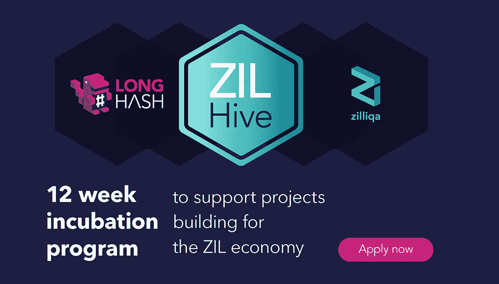

# 区块链项目加速器计划:ZILHive

> 原文：<https://medium.datadriveninvestor.com/blockchain-project-accelerator-programme-zilhive-5bae65c2f7ad?source=collection_archive---------10----------------------->

*Source:* [*https://longhash.com.sg/program*](https://tinyurl.com/ZILHIVE)

ZILHive 是一个创业加速器项目，旨在帮助高潜力的区块链创业公司。该计划得到了全球区块链协议 Zilliqa 和全球区块链孵化器 LongHash 的联合支持。作为 Zilliqa 生态系统资助计划的延伸，五个选定的项目将在孵化计划完成后获得 20，000 美元的资助。

**区块链的出现**

基于区块链的商业利用网络提供的分布式信任，在几分钟内执行和结算交易，而不是传统模式中的几天。这种技术上的突破将能够提供新的手段来进行国际商务，而不依赖于一个集中的中介。无论是通过分散融资(DeFi)解决金融不平等，通过广告转型振兴媒体，还是将游戏资产与现实世界联系起来，区块链的商业都将为所有小企业提供令人兴奋的竞争环境，因为他们可以实现前所未有的成本节约，并以前所未有的速度加快结算流程。

 [## 金融科技初创公司正在颠覆全球银行业|数据驱动的投资者

### 传统的实体银行从未真正从金融危机后遭受的重大挫折中恢复过来…

www.datadriveninvestor.com](https://www.datadriveninvestor.com/2018/10/20/fintech-startups-are-disrupting-the-banking-industry-around-the-world/) 

**节目**

ZILHive 项目将从 6 月 18 日到 7 月 31 日接受申请，并将于 10 月 1 日**开始。作为 [Zilliqa 生态系统资助计划](https://blog.zilliqa.com/buildonzil-introducing-the-zilliqa-ecosystem-grant-programme-6ccb98892712)的延伸，**五个**入选项目将在孵化计划完成后获得**20，000** 美元的非稀释性资助。**

孵化器还将接触到一系列结构化的技术教程、广泛的导师网络，以及最重要的一系列融资机会。向来自世界各地的参与者开放，ZILHive 的这些选定的**五个团队**将负责在**三个月**的过程中创造一个产品，并实现**三个**关键里程碑，包括创造:

*   最低可行产品(MVP)
*   收集基于用户的产品反馈的 Alpha 程序
*   Zilliqa 社区的一个测试程序，用于启动产品的发布

在孵化计划结束时，团队将有机会在**演示日**向风险投资公司、天使投资人和家族办公室推销他们的成品，在那里他们可以寻求进一步的融资机会。

请使用此链接注册孵化项目，或访问 https://longhash.com.sg/program

***ZILHive 是给谁的？***

像 ZILHive 这样的程序对于今天在我们周围出现的新的数字化经济生态系统非常重要。这个世界需要有远见的领导人和技术上的突破，这将为新的和更好的国际商业方法铺平道路。区块链驱动的商业就是这样一个领域，我们可以利用和开发强大的基础设施，如 Zilliqa 的平台。

*如果你对 ZILHive 有任何疑问，你可以对本文发表评论，或者将问题提交给*[*admin.sg@longhash.com*](mailto:admin.sg@longhash.com)