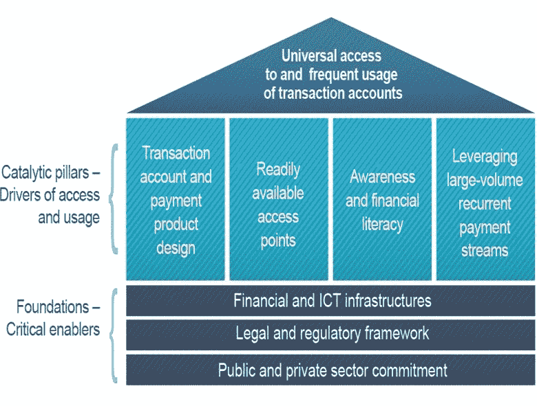
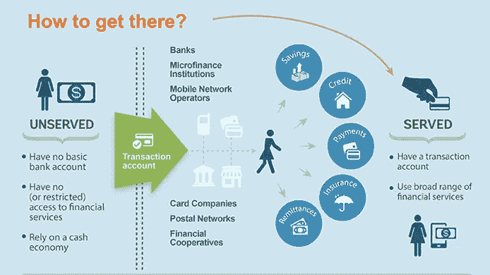
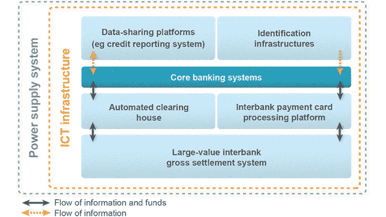
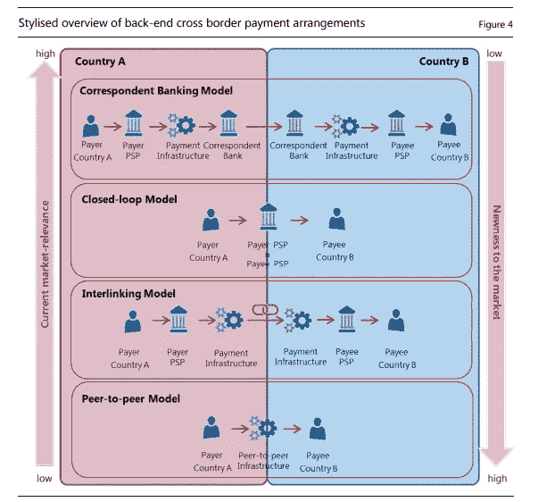
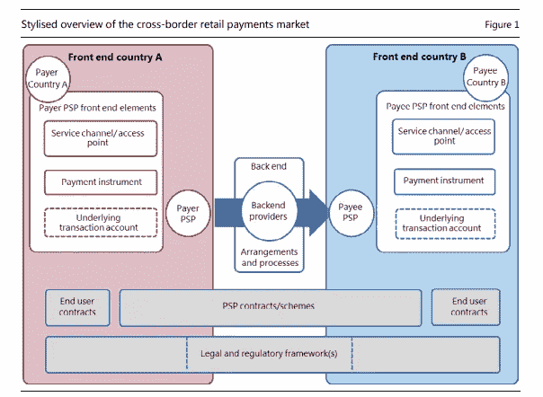

# 区块链与联合国可持续发展目标的相关性

> 原文：<https://medium.datadriveninvestor.com/blockchain-relevance-for-sustainable-development-goals-1-no-poverty-2-zero-hunger-and-10c-reduce-dc69c9615b95?source=collection_archive---------4----------------------->

区块链首先使用比特币来存储和跟踪交易。然而，SDG 还可以有其他的用途和实现。这些区块链应用程序包括:建立难民身份、跟踪与身份相关的信息(健康、社会福利、教育等)、资源分配、追踪货物及其内容/原始来源等。选择这些例子是为了展示利用区块链支持可持续发展目标的可能性。

**可持续发展目标 1:没有贫困——消除各地一切形式的贫困**

世界各地没有银行账户的人获得金融服务至关重要。在全球范围内，59%没有账户的成年人认为缺乏足够的资金是一个关键原因，这意味着金融服务还负担不起或不适合低收入用户。开户的其他障碍包括远离金融服务提供商、缺乏必要的文件、对金融服务提供商缺乏信任以及宗教信仰。根据 2017 年全球 Findex 数据库，约有 20 亿人仍然无法获得金融服务，因此，为了提高人民的生活水平，以金融包容性为目标是必要的第一步。它提供了更大的储蓄可能性、购买房产和创业的机会。

可持续发展目标具体目标 1.4 特别提到，需要确保所有男子和妇女、穷人和弱势群体平等获得适当的新技术和金融服务，包括小额信贷。

具体目标 1。a 指需要确保调动资源，以便为发展中国家提供充足的手段来执行消除贫困的方案。

ufa 2020(2020 年普及金融服务)设想世界各地的成年人——无论男女——都将能够使用交易账户或电子工具来存储资金、发送付款和接收存款，作为管理其金融生活的基本构件。

印度和中国的无银行账户人口比例最大，合计约占 32%。其余的重点国家包括:孟加拉国、巴西、哥伦比亚、科特迪瓦、刚果民主共和国、埃及、埃塞俄比亚、印度尼西亚、肯尼亚、墨西哥、摩洛哥、莫桑比克、缅甸、尼日利亚、巴基斯坦、秘鲁、菲律宾、卢旺达、南非、越南、坦桑尼亚、土耳其和赞比亚。

**金融包容性方法集中在:**

*   创建监管环境以允许访问交易账户，
*   扩大接入点，
*   提高金融知识，并通过大规模政府项目(如社会转移支付)将规模和生存能力引入这些交易账户
    。
*   关键组成部分:公共和私营部门的承诺、有利的法律和监管框架，以及支持金融和信通技术基础设施

虽然世界上很大一部分人可能没有银行账户，但移动电话的使用已经急剧增加，甚至在金融排斥程度很高的国家也是如此，而这些都可以成为消除贫困的有用工具。区块链应用可以开发用于移动设备。对于通常很难接触到金融机构的农村穷人来说，区块链移动货币是一个改变游戏规则的工具，对于他们来说，去最近的银行在旅行或工作时间损失方面的成本太高。

数十亿人被排除在增长和积累其资本之外，导致了社会、政治和经济不稳定，同时也使世界创造价值的巨大潜力丧失殆尽。

**非正式网络和现有解决方案**

早在国际金融机构出现之前，[社区就已经在提供自己的金融服务](http://www.premiumtimesng.com/opinion/165014-esusu-adashe-ajo-lessons-for-corporate-nigeria.html)。例如， [Esusu 是尼日利亚约鲁巴人部落的一种古老的金融习俗](https://www.jstor.org/stable/2844040)，在那里，人们向关系密切的人捐款/借款。像哈瓦拉这样的网络被用来在人与人之间转移资金，或者购买黄金等商品作为财富储存手段。

尽管这些特设网络在服务水平低下的地区更便宜、更容易获得，但它们是脆弱的，并且难以发展壮大，因为它们依靠个人声誉运作。

另一方面，银行需要有担保的资产、流动性和正式身份来确定信誉。大多数银行还要求账户最低限额和费用，以确保盈利能力。在非洲和南亚等地，这意味着只有富人才能享受银行服务，而且只有在大都市地区。因为银行在农村地区看不到利润，住在那里的人必须花几个小时去转账。

正如在东非看到的那样，移动支付解决方案在帮助银行失败的人方面取得了惊人的成绩，但大多数都是在容易被黑客攻击的集中式数据库上运行的。集中化为互操作性制造了障碍，因为每个移动货币运营商都必须跨银行和商户进行整合，这意味着他们不能扩展到核心地理区域或国家之外。

其他很多区块链项目理论上都很神奇。但是，在地面上的障碍，如缺乏电力，互联网接入，从农村到城市地区的无障碍道路，以及对新技术的恐惧，使它们无法被广泛采用。

获得信贷是区块链可以为可持续发展目标 1 下的目标做出贡献的另一个领域。一个道德投资平台，投资者可以访问'*高利润的积极影响项目'*,并与没有银行账户的生产者联系。这可以通过一个国际众筹贷款平台来实现，该平台将没有银行账户、得不到充分服务的人群联系起来，这些人群经常向贷款人(主要是小农)支付高额利息，而社会责任投资者则使用区块链。另一个例子，涉及普遍获得信贷，这是区块链的分散应用程序，可以建立和这些应用程序希望连接投资者和借款人在较低的利率和较高的回报，可以通过银行或其他现有的信贷机构获得。

交易账户可以为那些目前被排除在银行系统之外的人打开通道，为更广泛的金融包容性提供一个基本的切入点或途径。

使用交易账户从现金转移到数字支付，使其更容易成为正式金融系统的一部分，即使实体银行距离太远或不愿为穷人服务。

交易账户过去仅指银行账户。如今，交易账户可以是银行账户、移动钱包、支付卡或类似的电子工具。

拥有一个交易账户为其他正规金融服务打开了大门，如储蓄、支付、信贷和保险。获得和使用适当的金融服务可以帮助人们更好地管理风险，摆脱贫困，建设更美好的生活。

1.  人们可以更安全、更方便地储蓄。
2.  穷人可以更容易、更安全地获得福利。
3.  企业家可以获得建立小企业所需的金融服务，并接触新的市场。
4.  没有经验的客户可以更有能力使用正规的金融服务。

**可持续发展目标 2:零饥饿——消除饥饿，实现粮食安全，改善营养，促进可持续农业**

区块链技术在约旦被用作试点，以使基于现金的转账快速、安全且成本更低。世界粮食计划署(WFP)正在广泛开展工作，为难民营中的难民提供支付食物费用的有效方式。难民通过区块链的一个系统支付他们的食物。该系统使用生物统计注册数据进行认证。这些数据是由联合国难民署提供的，它使难民能够使用眼睛扫描技术在当地超市购物，而不是现金或信用卡支付。这是降低欺诈可能性和第三方昂贵干预的一个例子，*它还允许更好的受益人数据和更好的金融风险控制，以及在紧急情况发生后更快速的反应。*

这些努力预计将有助于在不久的将来实现可持续发展目标 2，特别是旨在确保所有人，特别是穷人和弱势群体获得安全、营养和充足食物的具体目标 2.1。

**SDG 10。c .到 2030 年，将移民汇款的交易成本降至 3%以下，并取消成本高于 5%的汇款通道**

SDG 10。C.1 汇款费用占汇款金额的比例

支付和市场基础设施委员会(CPMI)的一份新报告显示，个人和企业跨境支付的基础设施仍有改善空间。支付、清算和结算服务的全球标准制定者。

从一个司法管辖区发送到另一个司法管辖区的零售支付通常被视为比同一司法管辖区内的支付更慢、更贵、更不透明。与国内支付相比，跨境支付确实涉及更多的风险、复杂性和规则，但这种差异往往让人感觉不相称。

尽管移动或电子银行等竞争和创新让这些支付变得更加便利，但跨境支付的大部分清算和结算仍通过传统的代理行进行，这些代理行难以处理数量更大、价值更低的零售支付。

然而，替代清算和结算安排正在出现，这可能会提高跨境零售支付市场的效率。这些新的安排包括国家支付基础设施和要求付款人和收款人都持有账户的公司之间的联系。

“安全高效的跨境支付对于增长和金融普惠至关重要。跨境加密货币的出现和使用向央行发出信号，表明我们当前的支付系统过于昂贵和缓慢。需要采取行动，做出更好的安排，”CPMI 主席贝诺特·库雷说

“如果金融科技公司和金融机构能够利用分布式账本技术来满足苛刻的法律、运营和风险管理要求，分布式账本技术可能会成为支付、清算和结算活动的游戏规则改变者，”CPMI 委员会主席 benot curé说

尽管技术的使用也将限制外汇交易的手续费、佣金和收益，这将对收入造成压力，它补充说。

分布式分类账系统(DLT)，即广为人知的区块链，是由计算机网络通过加密审计跟踪维护和验证的交易数字记录。分布式分类账意味着没有像票据交换所这样的单一机构需要验证或执行交易。

由于区块链不区分交易规模，低交易成本将允许一个全新的人群参与跨境支付领域。

相反，参与者自己拥有充当网络中“节点”的计算机，这些计算机添加带有时间戳的事务块，形成一个不变的链(因此，区块链)。

构成交易成本的因素很多，可以通过应用区块链来消除。这些汇款流动缓慢，迫使银行对冲波动和外汇风险。它还迫使银行解决由于大量资金被转移而产生的流动性需求。这些成本还包括遵守法规和要求，如巴塞尔协议 III 和资本比率。整个过程中的众多中介通过各种佣金增加了成本。

区块链通过其去中心化账本、共识协议以及使用数字资产和“智能合同”来帮助解决这些问题。

分布式数字分类账:传统上，资产和交易信息存储在实体账本中，以独立引用内部和外部以前的操作。随着技术的进步，实体书被转化为数字账簿。区块链消除了中央实体存储和处理这些分类账的需要。相反，分类帐在对等网络中的许多不同节点之间复制，用唯一签名的加密私钥保护每笔交易。这消除了跨境支付中各方之间的对账需求。由于所有交易都被永久记录，因此在建立审计跟踪时没有任何操纵的余地。

共识机制:一种认证和验证交易的方法，无需依赖单一权威机构。这些交易是根据商定的安排进行验证和执行的，而无效的交易会被立即丢弃。它允许相互联系的组织作为一个团体一起工作，即使一些成员失败，这个团体也能生存下来。承受个人失败的能力是一个很大的优势，有助于提高系统的完整性和效率，同时也为其他验证者，如各种利益相关公司、互联网服务提供商和其他此类机构留下了空间。交易验证(目前通过人工输入系统完成)是自动化的，因此可以实时跟踪交易。该流程允许对交易采取基于风险的方法，而不是对每一笔交易进行筛选。

数字资产:数字资产的使用解决了多种货币的问题，并提高了流动性和资本合规成本，同时还允许小额支付的可能性。银行不需要对各种货币进行套期保值，而只需要管理数字令牌，从而降低了维护不同货币的多个借记/贷记账户的运营成本。交易的快速性消除了银行可能必须对冲的任何类型的流动性风险，并实现了银行间几乎实时的结算。

智能合同:智能合同是自动执行的合同，基于多方之间协议条款的履行。写入代码行的条款和条件存在于分布式分类帐网络中。因此，只要双方同意的条件和监管要求得到满足，财务协议就可以自动执行。它将合规性从交易后转变为即时和按需。一个基于区块链的支付解决方案的例子是，萨摩亚的农民能够与印度尼西亚的买方签订合同，并使用区块链记录从农民的抵押品到信用证再到支付的一切。

与任何新技术一样，采用区块链也有一些困难。即使有这么多好处，这项技术也带来了加密货币(数字货币的俗称)的恶名。自诞生以来，比特币(最大的加密货币)由于其所有权匿名性，一直与贩毒和勒索等非法活动联系在一起。虽然最近交易所被迫实施 KYC(了解你的客户)和反洗钱(反洗钱)规范，但匿名方面仍然存在。

DLT 有潜力提供转移和记录数字资产所有权的新方法；永久安全地存储信息；提供身份管理；、以及通过对等网络、对参与者之间的分布式但公共的分类帐的访问、以及密码术的其他演进操作。支付、清算、
和结算的潜在用例包括跨境支付和证券的交易后清算和结算。这些用例可以解决围绕现有服务的运营和财务摩擦。尽管如此，业界对这项技术的理解和应用仍处于起步阶段，利益相关者正在采取各种方法来开发这项技术。鉴于该技术处于早期阶段，开发和采用仍面临许多挑战，包括围绕商业案例的问题，
解决了技术可扩展性和稳定性障碍、法律考虑和风险管理考虑。

后端清算和结算安排更加多样化，可能会导致跨境零售支付更快、更便宜、更透明。这种多样性可以包括改进的传统代理银行系统、国内支付基础设施之间更好的互操作性以及闭环专有系统之间更好的互操作性。

参考

 [## UFA2020 概述:到 2020 年普及金融服务

### 获得金融服务和金融包容性是减少世界贫困和增加繁荣的必要条件…

www.worldbank.org](http://www.worldbank.org/en/topic/financialinclusion/brief/achieving-universal-financial-access-by-2020)  [## 跨境零售支付

### 支付与市场基础设施委员会(CPMI)发布的跨境零售支付报告…

www.bis.org](https://www.bis.org/cpmi/publ/d173.htm)  [## 支付、清算和结算中的分布式分类帐技术——一个分析框架

### 支付、清算和结算中的分布式分类帐技术-委员会发布的分析框架…

www.bis.org](https://www.bis.org/cpmi/publ/d157.htm) 

支付、清算和结算中的分布式分类帐技术，美联储银行

 [## 主页|全球搜索

### 编辑描述

globalfindex.worldbank.org](https://globalfindex.worldbank.org/)  [## 利用区块链进行跨境支付:对印度的启示

### 跨境支付是银行业尚未受益于数字化最新进展的一部分…

www.orfonline.org](https://www.orfonline.org/research/utilising-blockchain-for-cross-border-payments-implications-for-india/)