# 区块链零售|区块链上的供应链

> 原文：<https://medium.datadriveninvestor.com/blockchain-retail-supply-chain-on-the-blockchain-6572bb857c60?source=collection_archive---------8----------------------->

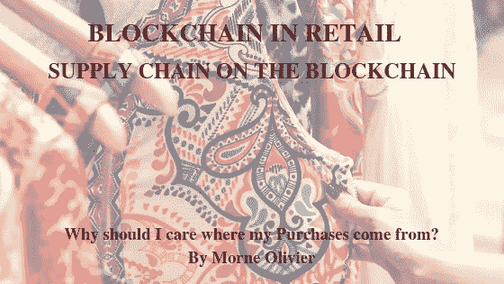

Why should I care where my Purchases come from?

10/04/2019

我为什么要关心我的采购来自哪里？改进的供应链将如何帮助我？

我觉得我不得不写这篇文章，因为我在零售业处理供应链不足加上虚假营销。谁来承担责任？这些产品到底来自哪里？这些产品是在什么条件下生产的？所有的变量混合在一起:人、动物、政府、立法、管理机构、金钱、化学品、自然、污染、记录保存。

 [## 如何创建自己的加密货币，让您的企业为未来做好准备-数据驱动…

### 加密货币是如何工作的？如何制作加密货币？如何推出我的加密货币？所有这些问题必须…

www.datadriveninvestor.com](https://www.datadriveninvestor.com/2019/03/25/how-to-create-your-own-cryptocurrency-and-make-your-business-ready-for-the-future/) 

我们怎么能相信产品上的一个标签包含了我们做出是否应该购买该产品的明智决定所需的所有信息呢？这是不可能的，但是我们被教导去相信它，相信“存在的力量”，

> [无童工(世界反对童工日——2019 年 6 月 12 日)](https://www.ilo.org/ipec/Campaignandadvocacy/wdacl/lang--en/index.htm)，他们生产那件衣服时使用的，
> 
> 当他们测试那些化妆品的时候没有使用动物[，](https://www.cosmeticsdesign-europe.com/Article/2019/03/05/Global-ban-on-animal-testing-where-are-we-in-2019)
> 
> [鱼是在合法条件下捕捞的](https://stopillegalfishing.com/press-links/hidden-details-in-controversial-fisheries-agreement/)，
> 
> 用于喷洒蔬菜作物的化学物质的数量和配方都在限制范围内，或者如果你买的是有机的，那真的是有机的吗？

我很幸运拥有自己的皮革厂、山羊奶酪农场、管理一个蔬菜农场，并为大型零售商包装。我知道大规模经营是如何屈服于在一定时间内和一定价格范围内生产优质产品的巨大压力的，这不可避免地导致生产者或消费者遭受决策失误的冲击。

***我的观点*** ，我知道我们不会在一夜之间改变这种对工业的负面看法，但肯定的是，自 90 年代以来，这种负面看法已经有所发展，但我相信有一种新技术肯定会帮助我们在如何生产和如何采购商品方面做出明智的决定。我相信，在购买产品时做出这些决定，最终会迫使非法生产商遵守他们所遵守的行为准则。另一方面，生产商或供应商需要认识到这项新技术将带来的巨大准确性和成本效益。

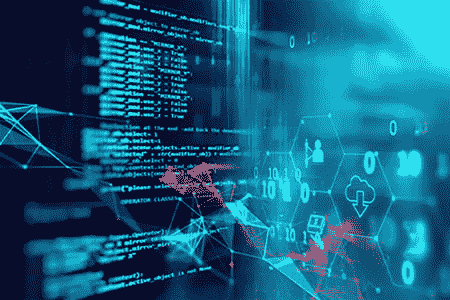

The Immutable Blockchain Ledger

这项新技术被称为 T**he 区块链 。这里是我最喜欢的了解区块链[Blockgeeks.com](https://blockgeeks.com/author/25840/)的途径。我采纳了一句谚语“知识就是力量”，为此，如果你想知道互联网的未来会为你安装什么，我建议你学习一下区块链。Blockgeeks 有开放的文章，如果你在一个办公室团队环境中，并且想要将你的公司带入一个知识丰富的未来，还会提供课程。**

***集权统治*** :“我们信任别人给我们信息。”我们生活在一个中央集权的世界里，在那里我们被告知该相信什么。 ***这就要改*** *了。*

区块链将如何帮助我们做出明智的决策？区块链 ***是一种去中心化的技术*** 简而言之，这意味着你将负责通常情况下你永远无法了解或信任的信息。这个信息是不可变的，意味着你不能改变它。2019 年将看到二维码扫描蓬勃发展。区块链已经采用了二维码方法来检索和共享信息。这意味着你将能够扫描产品的二维码，并检索你想看到的所有信息。

这怎么可能？区块链是一个分类帐，上面加载了一个紧凑的信息链，而不是一台服务器。与我们当前可以更改分类账的互联网不同，区块链技术为我们提供了一个信任度更低的不可变信息链，因为一旦信息被加载并“签署”，没有人能够更改它。这将意味着，当公司开始将业务转移到区块链上时，所有信息都将可见，但这一次不能被篡改。例如，如果我们正在购买一件衣服，我们将能够扫描二维码，看看是谁在什么条件下制作的。对我来说，在未来几年，没有整合到区块链的公司将被视为信誉不佳，并将难以生存，因为消费者正在扩大他们知道自己购买什么的权利。

从另一方面来看，企业转向不信任账本的好处将是巨大的。通过减少管理和第三方参与来节约成本。自始至终蔓延到供应链中的未披露的错误，加上公司必须处理的人为错误，必须是足够的理由来考虑至少了解它！

现在，我们对区块链以及它将如何改变供应链有了更多的了解，让我们找出我对供应链行业的前 3 名区块链竞争者。

****“记住区块链实际上只是新互联网上的一个账本，它将使在其上捕获的数据不可改变”*，所以没什么可怕的。***

**区块链的去中心化状态:品类——供应链**

那么，我认为哪个区块链能给我们的供应链带来准确性，一种无法改变的准确性呢？

**在这一点上，我要提醒你我的**[**#免责声明**](https://medium.com/@morneolivierblog/disclaimer-c22bc70d7a29) **，我不是财务顾问。**

像往常一样，我们去我们的中间人那里寻求安全

作为一个快速参考，我去了 Coinmarketcap。我可以快速浏览图表，了解价格和排名的变化，以及市值等信息。如果我不确定官方网站和社交媒体链接，我也会使用它来确保我最终找到了正确的地方。他们的图表是区块链和加密货币的总体表现。在 Coinmarketcap 上，我总是只看“全部”图表来快速浏览。兽医排名 23。

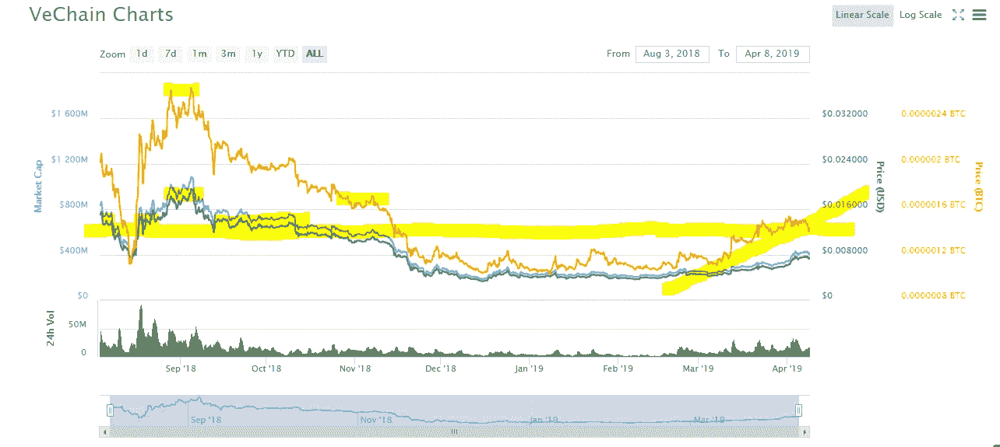

A simplistic version of chart trend

如果你一直关注我的文章，你会知道这是我第一次介绍图表。我不想用出色的图表技巧压倒任何人，成为一夜成功的交易者。就像 a 说的，如果你想赶上进度，这是一个快速参考，我可以在这里快速学到的是:

1.  我强调了三个方面。首先，我可以看到这 8 个月期间 VET 获得的最高值。

2.在中间，它向我展示了 altcoin 花了一些时间横向移动的区域。这些区域通常是值得关注的好区域，如果令牌清空该区域并继续向上移动，这将向我表明阻力的突破，这意味着更高的价格即将到来。令牌也依赖于这一区域的支持，如果它在这种情况下在平均 0.0117 美元的价值上停止支持，这将表明支持的中断，这将意味着更低的价格即将到来。我把黄色标记拖过来，给你们看兽医现在的位置，和我刚才说的有关。

3.我认为第三个亮点是上升趋势，但我仍然保持谨慎，因为正如刚才解释的那样，VET 尚未突破这一阻力位。因此，我不能断定它会在一段时间内持续到以前的高点，但我可以说，我对上升趋势和我在 3 月份所做的投资持积极态度。因此，我会密切关注 VET，如果它能打破阻力线，将阻力线变为支撑位，我会继续做多。

1.  # VeChain(#兽医)

[**关于 VeChain**](https://www.vechain.org/enterprise/#usecases)

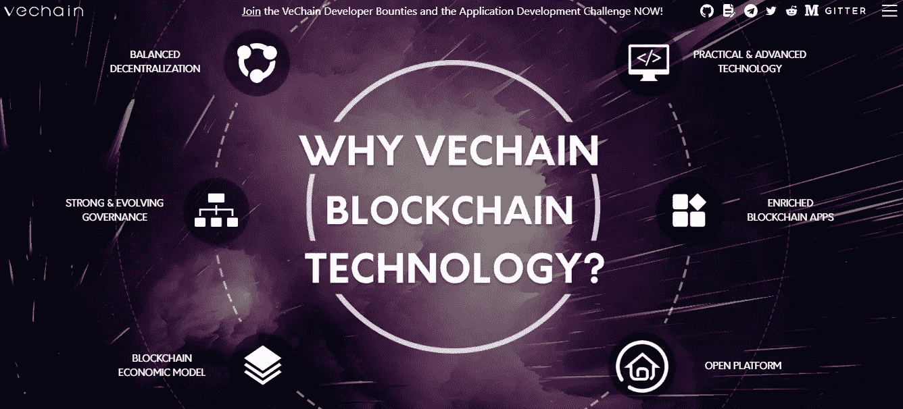

VeChain

启动于 2015 年 6 月的 ***VeChain 是一个区块链*** ，旨在通过其强大的区块链#Ledger 将区块链技术与现实世界联系起来，从而完善供应链管理数据。VeChain 旨在为制造商在平台上分配具有唯一标识符的产品，从而允许参与者跟踪#SupplyChain 中产品的移动和来源。这些是目前承保的类别。

> ***" #冷链物流*** *VeChain 的冷链物流解决方案使用专有物联网设备来跟踪整个旅程中的关键指标。VeChain 将数据管理和共享嵌入每个流程，使冷链物流透明、规范、安全、可靠。*
> 
> ***#汽车*** *VeChain 创建了一个车辆的数字护照，记录了车辆整个生命周期中的所有数据，包括维修历史、保险、注册甚至驾驶员行为。VeChain 将数据交到所有者手中，使数据管理变得全面、可访问和透明。*
> 
> ***# Medical&health care****VeChain 的区块链解决方案可以跟踪端到端的生产流程和医疗设备的使用情况。在患者授权的情况下，VeChain 可以使患者安全地与医生共享他们的生物特征数据，以实现实时监控。VeChain 使医疗设备的生产和使用更加安全、规范、高效*
> 
> ***#奢侈品&时尚*** *VeChain 将智能芯片嵌入奢侈品内部，因此品牌可以实时监控其销售渠道，以防止非法积压交易。同时，消费者可以验证奢侈品的真实性。VeChain 将控制权放回品牌手中，让奢侈品之路变得透明、无缝和数据驱动。*
> 
> ***# Liqour****VeChain 为酒瓶创建了一个跟踪&认证平台，生产过程中每一步的葡萄酒数据都存储在区块链上。它还允许物流供应商和分销商在货物到达目的地之前存储相关数据。这个平台带来了巨大的价值和信任，最重要的是杜绝了非法活动。只需扫描二维码或 NFC 芯片，即可保护消费者权益。二维码或 NFC 芯片可为从源头、存储和物流过程开始的整个时间线提供真实、有价值的信息。*
> 
> ***# Agriculture****VeChain 提供区块链使能的云服务解决方案，用于环保和有机农产品的认证。在整个生产过程中，物联网传感器和移动设备反馈气候和土壤条件，然后更新到云中进行实时监控，这些数据是加密的和不可改变的，同时，相关方可以通过适当的授权和私钥轻松访问。数据收集可以帮助农业公司做出更好的决策。他们可以改进种植方法，提高作物的数量和质量，增加产品利润。此外，它可以最大限度地减少化肥和农药对环境的负面影响。”*

哪些公司信任他们的区块链技术？

为了让 VeChain 成为一个全球商业生态系统，我们需要与可靠、创新的合作伙伴合作。正是基于这种认识，我们选择了最具影响力的创新公司作为核心合作伙伴。

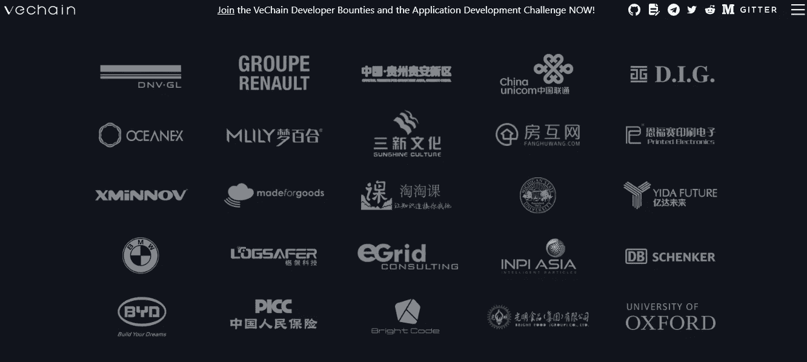

VeChain has international operations in Singapore, Luxembourg, Tokyo, Shanghai, Paris, Hong Kong, San Francisco’ and growing

为什么 VeChain 的评分是我的第一名？# PassiveCryptoIncome # PCI**当然是有政府支持的经验丰富的团队！**

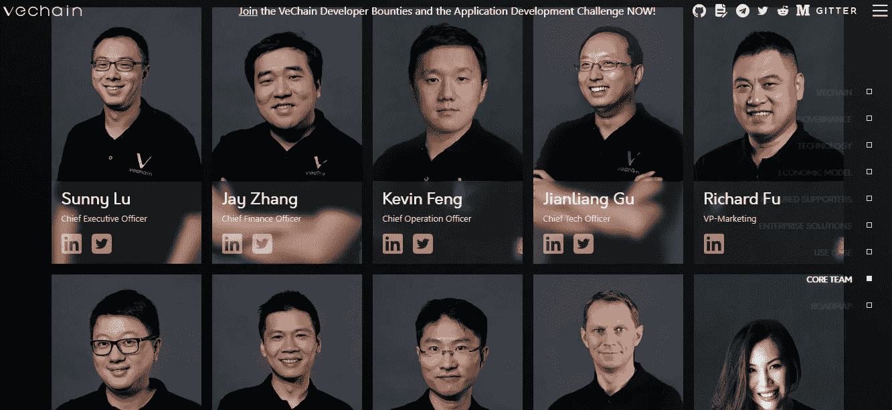

The VeChain Team

我的#PCI。点击此处阅读关于 [VeChainThor 钱包](http://Get VTHO Rewards When the VeChainThor node program is available, node program participants can manage their node status and get VeThor token (VTHO) rewards in the VeChainThor wallet.)的信息。

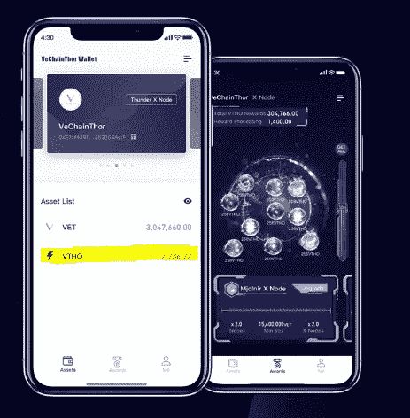

VeChain Wallet UI

如果你决定投资 VET 区块链，你将需要#DigitalWallet 来保存你的投资，同时在#VTHO 中为我最喜欢的#PassiveCryptoIncome 或#PCI 中为你提供每日奖励，因为你除了持有它什么也不做#HODLE，正如你在上面的例子中看到的黄色。我也喜欢这个钱包独特的外观，非常耐人寻味。

我最喜欢的#DigitalExchange 或#DEX 是 [Kucoin](https://www.kucoin.com/ucenter/signup?rcode=Hfw75w) 你可以在这里阅读我的文章:[如何购买 BTC，ETH & Alt 的](https://medium.com/@morneolivierblog/how-to-buy-bitcoin-ethereum-and-cryptocurrencies-in-2019-20e4397eca43)

2)[coin market cap](https://coinmarketcap.com/currencies/insolar/)的第 298 名

INS Stability

有些人可能会说这张图表正在慢慢消失。我认为这是纯粹的稳定，同时建立一个业务，一个坚实的技术健全的业务，超越 Web 3 的未来。考虑到这一点，我认为 Insolar 采取了利用他人的错误和缺点的方法。随着这一供应链类别随着竞争者的增加而增长，他们正确保关注必须超越竞争对手的目标，并具有看到自己错误的优势。

从投资组合的角度来看，这对我来说很好，因为我将我的上升趋势延伸到了我其他一些已经开始上涨的投资的末尾。实际上是为了让我的投资组合的正增长持续更长时间。

[**关于 Insolar**](https://insolar.io/)

Insolar (INS)是一家在开源区块链平台上构建 Insolar 的技术公司。

> “Insolar 的第四代架构融合了云、区块链和分布式技术的精华，创造了成本效益，开辟了新的收入来源，并推动了变革性的商业模式；它安全、可扩展、可互操作、经济实惠且易于部署。除了该平台，Insolar 还提供全面的区块链咨询和产品开发服务，以加速公司从概念验证到生产的过程。”

我想给你另一个关于 INS 的视角，因此决定将这篇关于 Insolar 的文章加入我对区块链和互联网发展方向的观点。您还将了解他们与联合利华等顶级品牌的良好合作关系，以及区块链如何改变购物和成本效益的未来。享受阅读。

 [## 零售革命？顶级品牌通过 INS 数字计划直接销售给消费者| net important…

### 英国最大的食品和家庭用品品牌已经签署了一项新的购物服务，声称它可以削减…

www.netimperative.com](http://www.netimperative.com/2017/11/retail-revolution-top-brands-sell-directly-consumers-via-ins-digital-scheme/) 

另一个网站上关于区块链的信息是[dprating.com](https://www.dprating.com/en/rating/report/69?)在这里你会发现一些关于这种神奇的 Web 4 技术的更深入的信息，这种技术甚至还没有开始展示其潜力，但已经签署了协议，以确保未来，

> **供应链&物流**
> 
> 为全球货物和商品的流动带来透明度和问责制。
> 
> **能源&公用事业**
> 
> 简化整个公用事业价值链的交易，以降低管理成本，开发新服务，并在供应商和消费者之间建立直接联系。
> 
> **零售&消费品**
> 
> 通过对产品和流程的实时、全面了解，培养更大的信任和协作。
> 
> **汽车**
> 
> 推动创新的移动服务、可追溯性和更安全的金融交易。"

3) # [Te-Food ( #TFD )](https://ico.tefoodint.com/index.html) 在 Coinmarketcap 上排名 508

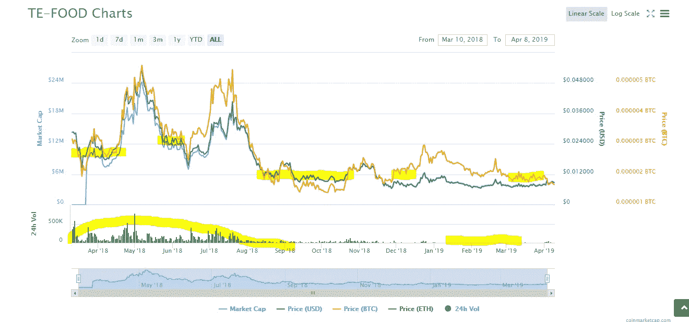

TFD Chart overview

快速浏览一下 Te 食物图表，对我来说，它看起来有点零星，就像价值和技术无法找到对方。在图表的底部，你可以看到交易量下降了。INS 也变得很小，但没有不稳定性。另一方面，VET 正在增加交易量，准备进入实物市场。

Te Food 是一个真实的案例。前面提到的区块链正在开发中，并有幸签署了一些大合同，以使它们成为大型供应链公司的解决方案，这些公司正在引入区块链的概念。

你必须记住，我们目前的全球 100 强公司(我希望)都在以某种方式教育自己如何加入这些区块链，以及哪些公司最适合他们的需求。一些人已经公开表示他们正在这样做，但一些人仍然非常怀疑和害怕这个空间，因为加密货币在过去的不稳定性和他们政府的立场。

我写文章的部分目的就是要告诉大家这一点:

1.  任何公司都可以在区块链上，不一定要成为令牌的一部分，也不一定要在区块链上拥有自己的加密货币，(只需将账本用作不可改变的功能。)

2.加密货币应该被重新命名为数字资产，这样我们就可以摆脱“加密”的污名，建立在区块链能力上。

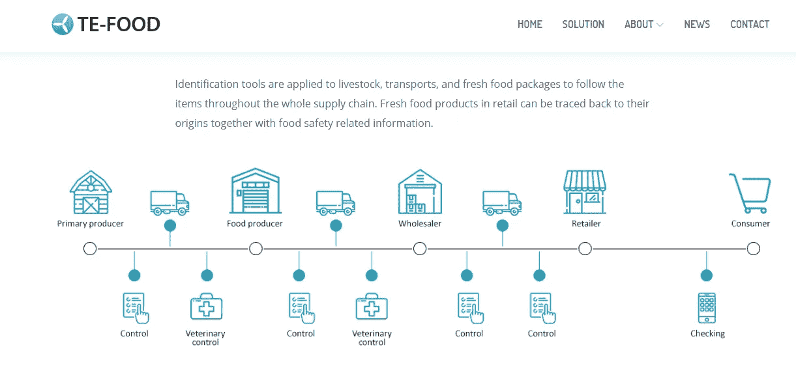

Te Food Traceability Roadmap

从我的角度来看，Te Foods 在完成基础工作方面无疑是最好的，它实际上参与了农场，并遵循供应链的流程来评估产品或肉类是如何以及从哪里来的。Te Food 或 TFD 是以太坊区块链上的 ERC20 令牌，计划在稍后阶段使用名为卡路里的令牌移动到他们自己的区块链。

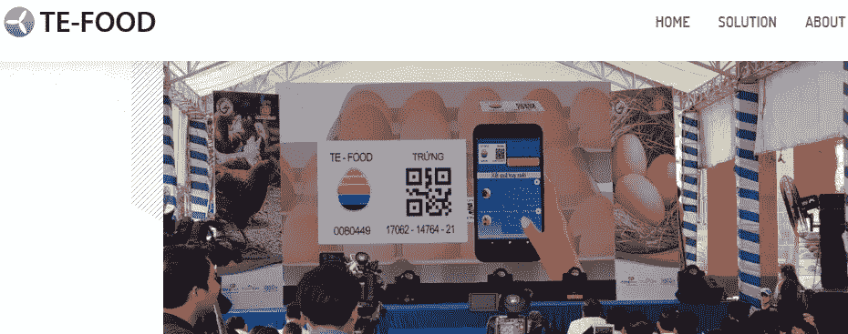

TeFood Presentation

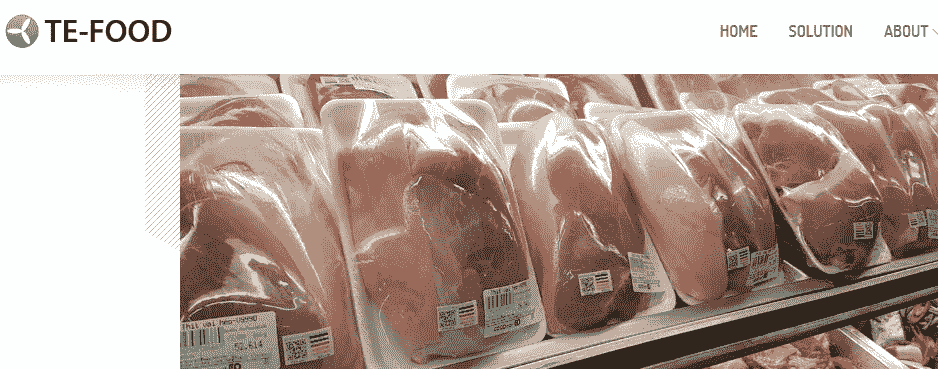

TeFood fully functional

他们在食品和供应链领域拥有强大的专家团队。他们在 DAPP 中添加了 QR 扫描功能，因此现在可以对其控制下的产品进行视觉扫描，以实现可追溯性。

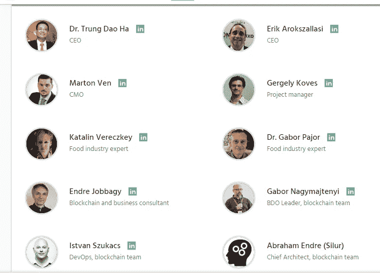

Te Food Team

这三家公司为我们提供了特定的技术和不同的方法。他们对供应链行业都有一个共同的目标，我们有幸成为见证这些技术在不久的将来如何在我们的日常生活中形成的一份子。

如果你想以一种非常简单的方式了解区块链是什么，请看看这个 TEDx 演讲，它非常值得！[Richie etwa ru 大规模简化的区块链。](https://www.youtube.com/watch?v=k53LUZxUF50)

*******************************************************************

我使用推荐链接为您节省成本和安全的目的。从链接中获得的任何被动收入对你此后的收入没有影响。

**了解我的重要链接:**

[关于莫纳奥里维](https://medium.com/@morneolivierblog/mornes-bio-a-little-bit-about-me-before-i-start-my-writing-journey-84c0bf463ba)

[#免责声明](https://medium.com/@morneolivierblog/disclaimer-c22bc70d7a29)

[#被动收入](https://medium.com/@morneolivierblog/passive-income-5-01-2019-ac2b1bfdbb62)

[中等](https://medium.com/@morneolivierblog)

[推特](https://twitter.com/Morneolivierhc1)

[被动收入电报](https://t.me/BlockchainPCI)

[领英](https://www.linkedin.com/in/morne-olivier-20406989/)

[电报](https://t.me/MorneOlivier)

[小野](https://www.ono.chat/ono/m3-invite/page1.html?uid=100278429&lang=en)

[杂音](https://play.google.com/store/apps/details?id=com.murmurdapp)

[STEEMit](https://steemit.com/@morneolivier)