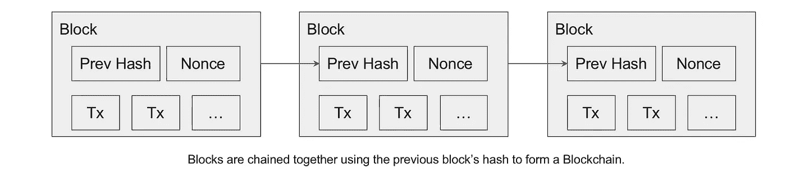
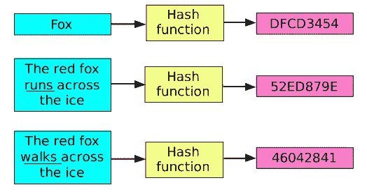

# 区块链简化

> 原文：<https://medium.datadriveninvestor.com/blockchain-simplified-2bb867630371?source=collection_archive---------35----------------------->


*A Random Papa John’s Pizza*

如果我们相信 Quartz 在 2018 年 5 月 22 日发表的[文章](https://qz.com/1285209/bitcoin-pizza-day-2018-eight-years-ago-someone-bought-two-pizzas-with-bitcoins-now-worth-82-million/)，一个程序员在 2010 年用 1 万个比特币购买了两个大的棒约翰披萨，当时价值约 30 美元，2018 年的当前年份价值 8200 万美元。

## **什么是比特币？**

比特币是一种数字货币或加密货币，它基于通过消除涉及中央系统(如银行)要求的复杂性来简化交易的技术。

除了比特币，其他几种数字货币如莱特币、以太币、Dash、Ripple 等。从此就被发明了。

## 谁可以使用加密货币进行交易？

任何拥有正常互联网连接的个人都可以购买、拥有和兑换这些加密货币。这种交换背后的技术或架构是区块链。但是它是如何工作的，是什么让它如此具有革命性？

## 什么是区块链？

区块链可以定义为交易的数字记录，它包含按顺序排列的所有交易的日志。

考虑一个银行交易，其中发送方和接收方之间的交易由中央机构(即银行本身)监控、记录和验证。同样，区块链还通过互联网连接的公共计算机网络记录、监测和验证所有交易，从而消除了对中央机构的需要。

> 每一个事务都被称为块，每个块都与前一个块相连，形成一个区块链。

## 在没有中央授权的情况下如何验证块？

区块链包含网络中的许多成员，他们定期检查以确保每笔交易的有效性。每个成员代表一台存有区块链拷贝的电脑。每当添加一个新块时，所有的计算机都会交叉验证它们的副本，从而使系统变得分散。添加新块的阈值是网络所有成员的 51%有效。当块被验证为有效事务时，它被添加到每个成员的区块链副本中。这种方法消除了对中央机构的需要，因此自动完成了事务并确保了高度的安全性(我们将回到安全性部分:P)。

> 网络成员合作验证交易从而消除对中央机构的需求的方法被定义为分散化。

## **什么是街区？**



一个块代表区块链环境中的一个事务或一组事务。块包含以下信息:

1.  时间戳:创建块的时间
2.  数据:特定块的交易信息
3.  先前散列:这是对区块链中的先前块的引用。
4.  哈希:这是一个独特的数字指纹，它是通过组合块中的所有内容而产生的。

## 哈希是什么？

哈希是区块链架构中固有的一种加密形式。它将任何形式的数据转换成唯一的文本字符串。这种转换是使用哈希函数实现的。

根据[维基百科](https://en.wikipedia.org/wiki/Hash_function)，哈希函数被定义为可以用来将任意大小的数据转换为固定类型数据的任何方法或函数。



***Source****:* [Brilliant.org](https://brilliant.org/wiki/secure-hashing-algorithms/) **Title**: Demonstration of Hash Function

> 哈希不应该和加密混淆。加密是一个两步的过程，我们有能力加密和解密一个函数。而区块链中的散列是确定性的并且是单向的，即相同的输入将总是产生相同的散列，但是输出不能用于产生原始输入。

到目前为止，我们知道区块链中的每个块或事务通过前一个块的散列被“*链接到前一个块。如果前一个块的内容被篡改，它的散列会改变，链会断开。但是前面没有块的第一块呢？因此，第一个区块不同于其余区块，被称为**成因区块**。*

> 为了解决 Genesis 块没有对前一个块的引用(散列)的问题，我们用零硬编码前一个散列值。

## 如何处理区块链交易？

让我们假设我们有一个有多个交易的区块链。

1.  随着交易的进行，它们被放置在所有交易的保留区。这个特殊的位置或区域称为内存池。
2.  mempool 中的最新交易会广播给所有区块链成员。
3.  每个成员将这些事务收集到一个新的块中，每个块都有一个事务数量限制。当块达到其阈值时，下一组事务在 mempool 中等待。此时，成员的块处于未确认状态，其中的事务无效。

我们知道，区块链网络的成员是匿名的，如果指望他们诚实地核实所有交易，那是错误的。
为了解决这个问题，我们在区块链中提供了一项安全功能，称为工作证明。

## 工作证明

工作证明提出了一个计算困难的数学问题，它相当复杂，即使是计算机也需要时间来解决。因此，成员，也称为矿工，现在需要解决计算问题，以获得足够的资格来广播他们的块。

> 计算工作证明以开采新区块的成员是矿工。


成员使用一个任意的数字，然后与块的内容相结合，并重复这个过程，直到生成所需的散列。第一个解决问题的矿工或成员用解决问题的正确的任意数字广播他/她的未确认块。网络的其他成员验证这一计算，如果他们中的大多数人同意，则可以说区块的工作证明是完整的。

到目前为止，我们了解了区块链的基本情况。让我们通过自己最喜欢的编程语言 Python 来构建一个属于自己的小区块链吧。

# 用 Python 实现

下面是脚本 say ***Block.py*** 其中我们将块表示为对象，打印一个区块链的所有块，并为每个块生成一个哈希。

```
# To represent a block in python we can create a bigger dictionary and store our data inside this dictionary# But we know that blocks can be represented as objects, we will create a Block class which we can use further to create new blocks# Every Block in the blockchain has a timestamp associated with it. In order to  dynamically generate a timestamp, we must import a Python module that returns the current date and time.**# Importing datetime module from datetime library**from datetime import datetime
from hashlib import sha256class **Block**:
  def __init__(self, transactions, previous_hash, nonce = 0):
    self.timestamp = datetime.now()
    self.transactions = transactions
    self.previous_hash = previous_hash
    self.nonce = nonce
    self.hash = self.generate_hash()

  def **print_block**(self):
    # prints block contents
    print("timestamp:", self.timestamp)
    print("transactions:", self.transactions)
    print("current hash:", self.generate_hash())

  def **generate_hash**(self):
    # hash the blocks contents
    block_contents = str(self.timestamp) + str(self.transactions) + str(self.previous_hash) + str(self.nonce)
    block_hash = sha256(block_contents.encode())
    print(block_hash)
    return block_hash
```

接下来，我们创建一个脚本，比如， ***Blockchain.py，*** 其中创建一个 genesis 块，并添加、验证和打印一个区块链的所有块。

```
# Each computer participant has their own copy of the blockchain. Ideally, each copy of the blockchain should have the same properties and functionality to add and validate blocks.#imports the Block class from block.py
from block import Blockclass Blockchain:
  def __init__(self):
    self.chain = []
    self.all_transactions = []
    self.genesis_block()def **genesis_block**(self):
    transactions = {}
    genesis_block = Block(transactions, "0")
    self.chain.append(genesis_block)
    return self.chain# prints contents of blockchain
  def **print_blocks**(self):
    for i in range(len(self.chain)):
      current_block = self.chain[i]
      print("Block {} {}".format(i, current_block))
      current_block.print_contents()    

  # add block to blockchain `chain`
  def **add_block**(self, transactions):
    previous_block_hash = self.chain[len(self.chain)-1].hash
    new_block = Block(transactions, previous_block_hash)
    proof=self.proof_of_work(new_block)
    self.chain.append(new_block)# Iterate through the entire blockchain and validate if the previous hash value of current block matches with the hash value inside our previous block def **validate_chain**(self):
    for i in range(1, len(self.chain)):
      current = self.chain[i]
      previous = self.chain[i-1]
      if(current.hash != current.generate_hash()):
        print("The current hash of the block does not equal the generated hash of the block.")
        return False
      if(current.previous_hash != previous.generate_hash()):
        print("The previous block's hash does not equal the previous hash value stored in the current block.")
        return False
    return Truedef **proof_of_work**(self,block, difficulty=2):
    proof=block.generate_hash()
    # Create a loop that increments the nonce value until the hash with the required difficulty has been generated
    while proof[:difficulty] != '0'*difficulty:
      block.nonce += 1
      proof = block.generate_hash()
    block.nonce = 0
    return proof
```

最后，我们创建一个脚本，比如说 ***script.py*** ，它创建一组虚拟的事务，并使用所有的函数来添加和验证区块链中的块。

```
from blockchain import Blockchainblock_one_transactions = {"sender":"Romeo", "receiver": "Juliet", "amount":"50"}
block_two_transactions = {"sender": "Juliet", "receiver":"Mafia", "amount":"25"}
block_three_transactions = {"sender":"Romeo", "receiver":"Mafia", "amount":"35"}
fake_transactions = {"sender": "Juliet", "receiver":"Mafia, Romeo", "amount":"25"}local_blockchain = Blockchain()
local_blockchain.print_blocks()local_blockchain.add_block(block_one_transactions)
local_blockchain.add_block(block_two_transactions)
local_blockchain.add_block(block_three_transactions)
local_blockchain.print_blocks()
local_blockchain.chain[2].transactions = fake_transactions
local_blockchain.validate_chain()
```

上面的脚本演示了本文开头讨论的区块链的一个基本实现。如有任何疑问，请随时联系我。