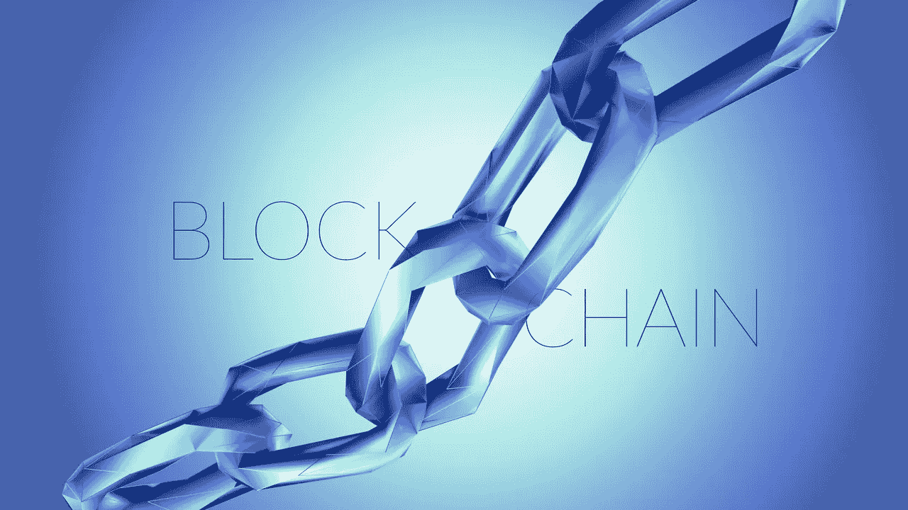

# 区块链——这意味着加密货币，这难道没有风险吗？

> 原文：<https://medium.datadriveninvestor.com/blockchain-so-that-means-cryptocurrency-and-isnt-that-risky-30078ca9af8c?source=collection_archive---------14----------------------->

# 为什么会存在？

有一种神话认为区块链意味着加密货币，或者更具体地说是比特币。假新闻，但了解它的过去，解释了神话。了解它的作用表明它如何在一个更快、更安全和开放的世界中造福全球人民。

2008 年，一个名叫中本聪的人发布了一份白皮书，描述了点对点电子现金的概念/愿景。比特币是基于白皮书的第一个实现。所有这些新工作都是建立在 20 世纪 80 年代和 90 年代进行的加密货币的早期(失败)尝试基础上的，但现在我们有了可以让它成功的系统。

 [## 你对智能凭证了解多少，J-Coin & c-闪电-数据驱动型投资者

### 无数区块链/加密项目在我们周围涌现，承诺不同的真实世界用例。正在搜索…

www.datadriveninvestor.com](https://www.datadriveninvestor.com/2019/03/06/what-do-you-know-about-smart-credentials-j-coin-c-lightning/) 

比特币的概念需要一个安全的数字基础设施，可以在公共场所记录重要信息，并且不允许删除。在点对点的开放世界中，这要求它必须是可信的、有日期和时间戳的、透明的和分散的(点对点)。

*区块链*就是那个基础设施的实现。没有它，比特币就不可能存在，但区块链不仅仅是比特币的载体。正如唐&阿历克斯·泰普斯科特所言，“区块链是一个不朽的经济交易数字账本，它不仅可以记录金融交易，还可以记录几乎所有有价值的东西。”

# 这是什么？

为《金融时报》撰稿的莎莉·戴维斯写道:“区块链之于比特币，犹如互联网之于电子邮件。一个大的电子系统，你可以在其上构建应用程序。货币只是其中之一。”

在古语言中，它是一个分类账，如果你愿意，你可以称它为数据库，你可以在其中记录任何你喜欢的交易。关键的区别在于，它不是在单个(或多个)私有服务器上，而是分布在一个巨大的共享网络上。传统主义者担心的是“分配”或“去中心化”,因为他们担心公开信息会被篡改。

戴维·杰拉德写道:“这是一个会计账本，你只能添加——你不能删除任何东西……该系统是防篡改的，这要归功于所谓的加密哈希认证——一长串唯一的数字，有助于验证共享的数据是一致的。”

顾名思义，这是因为事务存储在块中，这些块使用专门创建的散列键链接在一起，以便知道链中的下一个元素存储在哪里。如果区块链中的任何一位发生变化，那么该链中的所有哈希都会失效。这就是保持一致性和完整性的方法。

公共链跨互联网上的许多关键服务器维护，每个服务器都有自己的副本。这意味着，即使其中一个服务器受到攻击，区块链被修改，它也会被提取出来，因为它现在与其他服务器上的其他副本不同。因此它不会受到单个公司的破坏和攻击。

*因此，基本上，它是不同组织拥有的跨多个地点的多个系统中存在的交易的防篡改记录。正是这一点使得它在金融界前所未有。*

与所有新技术一样，它有自己的语言和方言，给它一种神秘的极客色彩。但是去掉这些神奇的词语，它只是使用互联网作为传输系统，以安全的方式存储和共享信息的下一步发展。

# 如果它真的那么好，为什么不是每个人都在使用它呢？

本质上，我们都相信我们知道的，不相信我们不知道的。随着技术及其应用的发展，我们将会更加了解它的局限性和优势。

区块链是基于透明性和密码学(是的，我在这里简化了它)。透明性允许人们使用构成数据的规则进行查看和验证，加密机制有助于数据完整性，确保数据不被篡改。

与金融的许多领域一样，监管有助于信任，但监管总是落后于创新。这就是为什么 Arkadia Lending 正在采取积极措施，寻求进入 FCA 沙盒，以测试其对数字技术的使用。

区块链要求公司维护他们参与的区块链的副本。跨多个系统分散使用数据是一个优势，但也有弱点。不变性是有代价的。数据存储变得非常大。随着它的增长，交易变得越来越慢。请记住，数千个地点的所有副本都必须更新。这需要高速通信、大量计算能力和大量电力。都很贵。

Arkadia Lending 在其设计和实施中解决了所有这些问题。

# Arkadia 为什么在用以太坊借贷？

为了产生一种有效的、可延展的解决方案，在不断增长的市场中扰乱借贷系统，必须解决上一节中提出的问题。

这就是以太坊的用武之地。这是一个公共区块链，但可以记录货币以外的资产。管理贷款和合同的能力是环境所固有的。它是为了处理智能合同而建立的，智能合同可以设置标准并自动处理。

既定的区块链实现使用复杂的算法，需要大量的电力和计算能力。随着需求的增长，公司会发现这既慢又贵。这被称为工作证明(PoW)。下一代解决了这个问题，使用了一种叫做利益证明(PoS)的技术。以太坊的完全 PoS 路线图与 Arkadia Lending 的增长计划相配合，最大限度地提高效率，并将成本保持在最低水平。

使用公共区块链也会影响速度和成本。这就是 Arkadia Lending 使用私有区块链存储关键敏感数据和公共区块链来维护透明度和验证的算法和函数的原因。对私有或公共端的数据进行任何未经授权的修改都会引起一个问题，这个问题能够并且将会得到解决

以太坊允许我们实施流程和程序，这意味着我们可以建立机制，使我们受到 FCA 的监管。

# Arkadia Lending 用区块链做什么？

Arkadia Lending 旨在为个人和组织提供一种对社会负责、有影响力、经济高效的方式来获得贷款，并让贷款人看到他们的投资如何惠及他人。

我们使用数字平台、安全不变的数据和消除中间商，在不断增长的市场中提供更低成本的贷款，并为贷方提供更好的回报和关于社会影响的准确反馈。Arkadia 是第一个也是唯一一个提供这种投资机会的平台。这意味着您可以从大量业务中进行选择，选择最合适的业务来满足您的影响投资要求。

# 还有谁用？

区块链技术正在改变我们保护数据的方式，并知道细节是可信的。这就是为什么摩根大通、瑞士瑞信银行、丰业银行和万事达卡等机构也在投资如何利用这项技术来造福自己。

Arkadia Lending 非常自豪能够将道德贷款能力作为其核心。我们旨在支持新兴和发展中国家的可行企业。我们都将看到结果，整个社区和社会都将受益。

凯瑞·弗莱特是阿卡迪亚借贷公司([www.arkadialending.com](http://www.arkadialending.com/))的联合创始人兼首席技术官