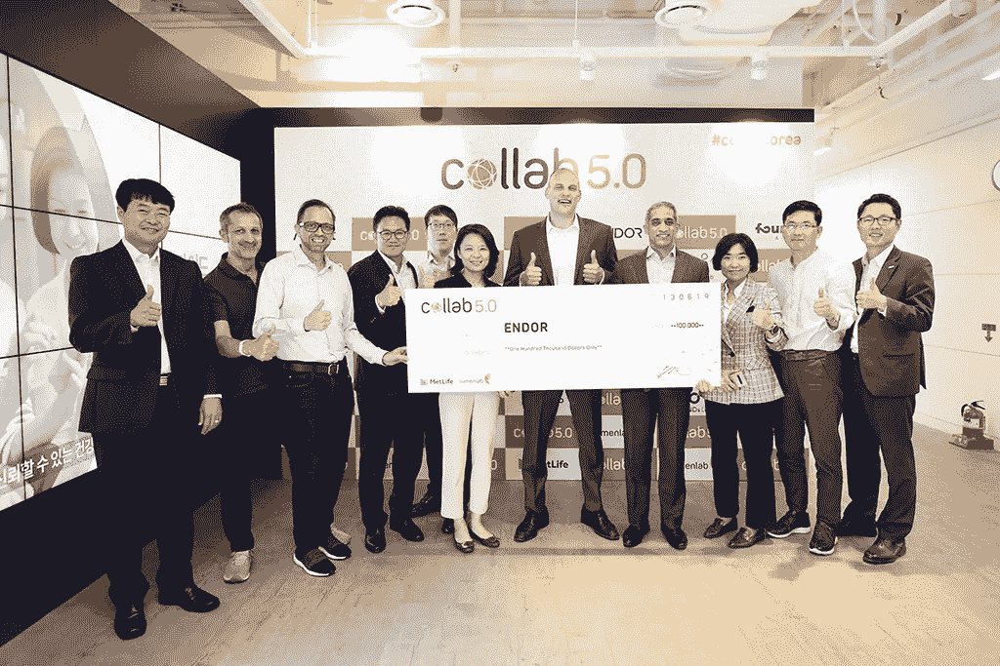
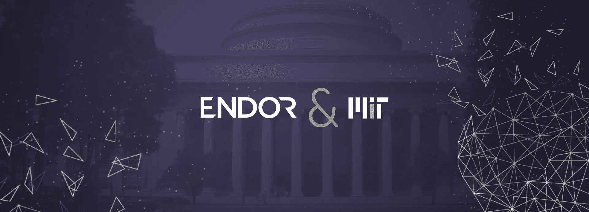
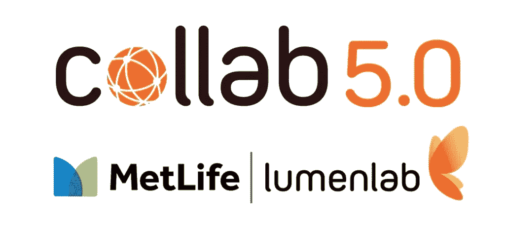

# 区块链初创公司 Endor 赢得 MetLife 韩国合同！！

> 原文：<https://medium.datadriveninvestor.com/blockchain-startup-endor-wins-metlife-korea-contract-19bab6e81691?source=collection_archive---------5----------------------->

2019 年 6 月 13 日，大都会人寿韩国公司宣布区块链初创公司“Endor”成为其开放创新计划 [collab 5.0](https://collab.lumenlab.sg/) 的获胜者。Endor 击败了所有其他六名决赛选手，赢得了一份 10 万美元的合同。

作为奖励，Endor 赢得了一份合同，为大都会人寿韩国分公司的整个保险价值链提供价值 10 万美元的人工智能和预测分析服务。保险服务提供商希望使用 Endor 的服务来提升其客户参与质量、销售流程和运营效率，并在整个公司范围内采用试点项目。

 [## 为什么数据将改变投资管理——数据驱动的投资者

### 有人称之为“新石油”虽然它与黑金没有什么相似之处，但它的不断商品化…

www.datadriveninvestor.com](https://www.datadriveninvestor.com/2019/01/25/why-data-will-transform-investment-management/) 

# 恩多，“谷歌预测分析”。

Endor 是一家总部位于以色列的初创公司，由一群博士、数据科学家和产品专家于 2014 年创立，由联合创始人兼首席执行官 Yaniv Altshuler 博士领导。

Endor 被称为“预测分析的谷歌”,这是正确的，因为它是作为一种工具创建的，为企业主提供自动、准确的预测，而不需要事先了解编码或数据科学。

基于区块链技术，Endor 正在利用人工智能和麻省理工学院开发的[社会物理学](http://socialphysics.media.mit.edu/)的理念。根据新的社会物理学，任何事件，无论大小，都包含数据中特定的人类活动模式。如果人们可以检测到这些模式，我们就可以创建比正常的机器学习更准确的预测分析。这进而有助于企业主分析大数据，以确定趋势、预测事件并做出明智的业务决策。

Endor 还重视数据隐私，它可以在不解密的情况下分析加密数据，并且符合 GDPR 标准。许多全球品牌，如可口可乐、万事达卡和其他财富 500 强公司，目前都在使用 Endor 来改善决策过程。

# 飞速发展

Endor Senior Director EMEA, Steve McNickle at TCS Innovation Forum in London

按照路线图，Endor 最近向公众发布了其 [Endor 协议](https://www.endor.com/protocol) v.1。Endor 协议通过允许用户在分散的网络上共享数据集，引入了另一层数据完整性和安全性。参与者可以利用恩多的 ERC-20 [EDR 令牌](https://coinmarketcap.com/currencies/endor-protocol/)访问区块链并执行网络操作。Endor 认为，将预测作为一种服务来提供可以降低许多障碍，这些障碍以前使预测分析只适用于最大的公司。

# collab 5.0

collab 5.0 是由 LumenLab 开发的大都会人寿亚洲的创新部门，旨在让大都会人寿高管和行业利益相关者注意到保险科技行业最具创新性的想法。LumenLab 致力于将创新文化作为业务发展流程的一部分，使其成为行业与客户互动的领跑者。

collab 5.0 创新挑战赛收到了来自 36 个国家的 184 份申请，其中 7 份进入决赛，5 家初创公司获得了优胜奖。

LumenLab 首席执行官兼大都会人寿亚洲首席创新官 Zia Zaman 透露

> “创新是企业的当务之急，外部合作是大都会人寿改革保险业的重要组成部分。Collab 致力于建立合作伙伴关系，帮助我们在未来的挑战面前进行创新，从而对我们服务的对象产生更大的影响，”

恩多首席执行官 Yaniv Altshuler 博士表示

> “我们非常荣幸能够成为大都会人寿韩国创新计划 collab 5.0 的获奖者。这是对我们平台提供的独特预测分析能力的巨大信任投票”。Altshuler 博士还表示，“大都会人寿是世界上最大的保险公司之一，我们很高兴能与保险科技行业中如此重要的参与者一起推进创新，尤其是在韩国这样一个引领颠覆性技术的重要市场”

你可以在这里阅读来自[的新闻稿](https://www.businesswire.com/news/home/20190613005728/en/Endor-Wins-MetLife-Korea%E2%80%99s-Innovation-Program-Collab)。

EDR 在以下交易所上市:

*Upbit，Bitrrex，Hotbit，BitForex，Houbi korea，CoinTiger，Bilaxy，Trade。io，Coinall，KuCoin，Idex，DigiFinex，P2PB2B，OAX，CoinBene，LATOKEN，BitMart，Coinbit，ABCC。*

欲了解项目详情，可访问 [**中博客**](http://www.medium.com/endor) **|** [**网站**](http://www.endor.com) **|** [**推特**](http://www.twitter.com/endorprotocol) **|** [**【脸书**](https://www.facebook.com/EndorScience-1105921412798077/) **|** [**领英**](https://www.linkedin.com/company/endor-software-ltd) **|** [**电报**](https://t.me/endorcoinGroup)

***免责声明*** *:本文无意作为投资建议。你应该总是做你的研究，明智地投资你的资本。我不拥有令牌，也不会因为写这篇文章而获得任何形式的奖励。*