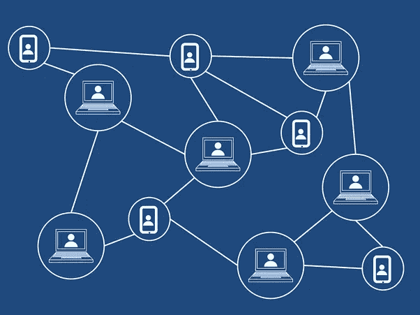

# 区块链技术及其加速供应链金融的潜力。

> 原文：<https://medium.datadriveninvestor.com/blockchain-technology-and-its-potentials-to-accelerate-supply-chain-finance-scf-c48c357f2c12?source=collection_archive---------9----------------------->

优化营运资本和提高流动性的需求推动了供应链金融在行业内的日益普及。

供应链金融(SCF)是各种融资工具的通称，用于为供应链中的各方提供融资。SCF 是指使用短期信贷来平衡买方和卖方之间的营运资金，从而将供应链总成本降至最低。企业可以利用供应链融资与供应商建立更牢固的关系，降低货币风险，并最终提高流动性。金融机构提供供应链融资解决方案，旨在通过提供高效的应付款平台来简化支付流程(Finextra ),从而改善买方的营运资本和供应商的流动性。

从供应链的角度来看，SCF 通过改善整个价值链的流动性和资本分配，为买方和供应商创造了一个双赢的局面(波帕，2013)。

今天，大多数 SCF 仍然依赖于传统的纸张密集型流程，尽管这些平台存在局限性，但一些数字化已经发生..供应链金融涉及大量的当事人和中介；因此，在收取应收账款和信贷时涉及许多挑战和风险。欺诈、转移、操纵和透明度是 SCF 缔约方面临的一些固有挑战。

区块链提供和增强安全性、透明度、效率、合规性和信任的能力可以用来推动供应链金融。区块链能够将 SCF 中涉及的文档数字化，然后与所有其他细节一起存储在供应链中所有人都可见的共享账本上。区块链也是不可变的，因为不能改变，减少了信息被篡改的几率。区块链可以以客观、分布式和均衡的方式为 SCF 平台提供动力，从而保证安全性并巩固信任。

区块链将在以下领域增强供应链融资:

1.  **验证&认证:**验证和认证对信息、数据和资源的访问和权限以及验证流程的完整性是 SCF 的关键组成部分。区块链将确保供应链各方之间认证权的有效分配和完整性，从而确保防止欺诈，如中国青岛港的仓单丑闻，犯罪分子使用虚假的仓单将金属作为多笔银行贷款的抵押品；显然，验证收据/证书的传统方式(即使通过 ERP 进行了数字化)并不能保证文件的充分安全性和完整性。
2.  **透明度、可见性&可审计性:**区块链将在信息/文档从一方移动到另一方时提供其可见性和可追溯性；通过这种方式，银行/贷方/买家知道他们融资的是什么，因此能够主动降低欺诈和信用风险。这种技术还包括智能合同，它本质上使供应链金融解决方案中的所有各方能够在一个共享的账本上进行操作。银行/金融机构可以访问智能合同，并可以在任何给定时间跟踪制造、运输、订单履行等流程。供应商和制造商以及所有其他参与者将单独更新他们的交易部分，从而在不可变的分类账记录上实现效率和“前所未有”的信任和透明度(Finextra)。
3.  **速度&加强控制:**如今，交付 SCF 解决方案的速度非常慢，并且由于系统和流程(例如提交提单、信用证、发票、货物收据验证和付款)的困难而缺乏足够的控制。基于区块链技术的智能合约可以根据设定的条件在瞬间完成所有这些工作。从启动 SCF 请求到付款所需的时间(由于银行/金融机构方面的人工活动减少)将会缩短。交易时间的减少也将导致支付时间的减少；贷款审批，降低欺诈风险。区块链技术在增加控制方面提供了更大的潜力，因为所有交易都受到链中双方或各方的监控。这种为供应链融资的方式比目前做生意的方式成本更低、效率更高。
4.  **竞争加剧&机遇:**区块链科技将提供的信任、安全和透明将吸引其他资本提供商进入供应链金融，从而加剧竞争并压低利润率。这也将引导和鼓励银行和技术提供商之间的伙伴关系，以集中资源，就像 IBM 和欧洲七大银行的情况一样。

**区块链 SCF 项目:**世界各地的供应链/贸易融资提供商已经开始采用区块链的技术来支持他们的供应链金融平台。其中一些列举如下:

1.  **马士基全球跨境区块链供应链解决方案**
2.  **简一区块链技术应用系统与 IBM 合作**
3.  **由中国电子公司点融和在线市场贷方富士康(富士康子公司)发起的连锁金融**
4.  **Mahindra 与 IBM 的通用平台**
5.  **流畅交易资产市场**
6.  **halo trade-**【http://halotrade.io/ 
7.  http://www.skuchain.com/

**我的临别赠言是，区块链技术是革命性的，并将继续为采用者提供前所未有的价值。**

**#区块链#金融#物联网#供应链#银行#数字**