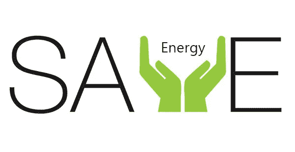
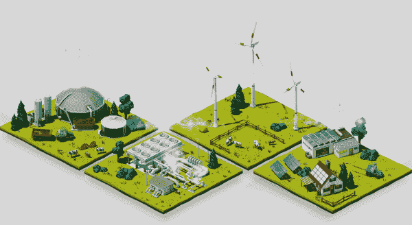

# 区块链技术在节能行业的应用

> 原文：<https://medium.datadriveninvestor.com/blockchain-technology-applied-in-energy-saving-industry-9138e12a06db?source=collection_archive---------15----------------------->

> “我想做一些对社会有益，能让世界变得更好的事情，哪怕只是一点点改变。”说出这句话的女企业家，是浙江能源科技有限公司的 CEO。

很难想象她在传统的锅炉行业，这似乎不可能与一个女人联系在一起。今年八月，我们来到了浙江省江山市的娃哈哈工厂，在那里我们找到了爱丽美工厂。摆在我们面前的是成堆的木质废料被用来加热一个在 200 摄氏度高温下运行的锅炉。水被加热成高温蒸汽，蒸汽被输送到一条银色管道，输送到娃哈哈的饮料生产线进行高温杀菌。

娃哈哈饮料生产线共有四条，其中一条可生产 12 万瓶饮料。到达当天，搬运工们忙着将一箱箱包装好的饮料装上准备发往浙南、江西等地的货车。这家娃哈哈工厂生产所需的所有能源都来自爱丽美，其锅炉系统全部是自主开发的，可以自动优化燃烧，实现自主节能，减少二氧化碳、二氧化硫和氮氧化物等排放，这帮助娃哈哈每年提高 10%的能效，每年节省价值超过 20 万美元的能源。减排二氧化碳 832.5 吨，二氧化硫 78 吨，氮氧化物 67.9 吨。

随着全球变暖越来越严重，中国政府已将节能和防治大气污染列入十九大报告。李克强总理还担任了国家应对气候变化和节能减排领导小组的组长。

像爱丽美这样的节能公司帮助工厂响应政府的号召。然而，他们的服务数据有时不能为工厂所信任，这阻碍了节能产业的发展。因此，爱丽美选择使用区块链技术来认证和验证他们的数据。区块链的透明和防篡改特性将使爱丽美的业务领先业界。

为了实现这一愿景，爱丽美需要一个稳定、易用且可扩展的区块链网络。最后，她选择了富扎美的区块链技术服务。富扎美从 2014 年开始打造公链。历时四年，研发并提出国内首个平行链架构。主链保证并行子链的安全性。你可以开发自己的 Dapp，发行代币，对平行链有部分共识。平行链设计保证了高效率、安全性和灵活性，并与主链保持连接和独立的关系。链上的开发者不必承担高昂的技术开发成本，也不用担心主链的 bug 会影响并行链的正常运行。

另外，在富扎美的公链上发放代币也是极其容易的。只需填写表单并遵循规范，您就可以发行令牌。目前，富扎美开发团队已申请了近百项区块链相关专利，拥有 200 多名成员的技术团队。

网址:[www.33.cn](http://www.33.cn)

业务联系人:33fuzamei@gmail.com

推特:@FuzameiL