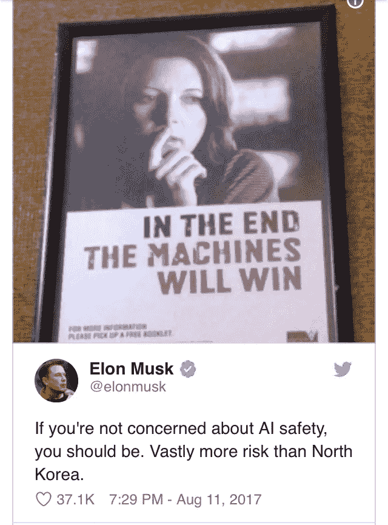

# 区块链技术和人工智能——揭开人工智能核心的神秘面纱

> 原文：<https://medium.datadriveninvestor.com/blockchain-technology-artificial-intelligence-unmasking-the-mystery-at-the-heart-of-ai-b1e930a59937?source=collection_archive---------8----------------------->

## 区块链能否解开 AI 的黑箱问题，帮助加速大规模采用？

Pixabay — [https://pixabay.com/en/users/geralt-9301/](https://pixabay.com/en/users/geralt-9301/)

花生酱和巧克力，米克和基思，蝙蝠侠和罗宾——伟大的合作伙伴——可以说是成功的婚姻。当他们的道路交汇时，神奇的事情发生了，锻造了烹饪、音乐和漫画的历史。当两种技术碰撞时，结果是突破性的创新——医疗保健和机器人，供应链和分布式账本技术，数字技术，摄影，3D 打印和医疗保健。在商业中，一个创新的想法要大规模实施，它必须解决一个特定的需求，并且能够以合理的成本复制。

## 区块链技术和人工智能

虽然人工智能领域诞生于 20 世纪 50 年代，但直到 20 世纪 90 年代和 21 世纪初，它才真正成为主流。即使在今天，在某些行业之外，人工智能的采用仍然缓慢。对于每一个进入市场的 Siri、Alexa 或商业智能算法，无数其他人都在努力寻找资金，因为成本极高，或者因为担心人工智能出错的可能性而被接受。

> “如果你不担心人工智能的安全，你应该担心。比朝鲜的风险大得多。”——埃隆·马斯克

## 是什么减缓了人工智能的采用？

新技术的广泛使用通常会通过利基消费者、军事发展和商业用途渗透到市场。

*   军事应用:军方的需求(包括像 NASA 这样隶属于空军的项目)经常推动技术发展，军方经常是新技术的早期采用者。
*   商业应用:随着技术的成熟，企业会检查技术是否(以及如何)能够提高他们的底线。
*   娱乐应用:电影、游戏甚至媒体制作设备经常寻求开发技术来刺激观众并从竞争中脱颖而出。
*   消费者应用程序:消费者技术落后于其他应用程序，因为许多生产商等待技术成熟和价格下降，然后才变得普遍。

每一层最终都会降低人工智能的采用率，特别是如果新技术需要大量的时间或金钱投入来实现的话。

当然，人工智能技术的过滤并不是采用缓慢的唯一原因。也许这些原因中最大的是“黑箱”效应或问题。

根据科学、计算和工程领域的[维基百科](https://en.wikipedia.org/wiki/Black_box) — *，一个* ***黑盒*** *是一个设备、系统或对象，可以根据其输入和输出(或传递特性)来查看，而无需了解其内部工作情况。它的实现是“不透明的”(黑色)。几乎任何东西都可以被称为黑匣子:晶体管、算法或人脑。*

AI 通过“训练”来学习。它搅动现有数据，分析数据，并根据分析结果调整程序中的设置。这些调整会在多次训练或训练中进行微调，一些人工智能会在训练中对相同的数据进行数百次甚至数千次的分析。

然而，每次分析都略有不同，AI 将使用的最终设置不一定与输入或任何特定的训练过程直接相关。这导致人工智能基于新数据产生“怪异”的精确输出。但是解释人工智能如何学会得出一个特定的结论是困难的，有时甚至是不可能的。这就是为什么他们称之为黑盒…我们知道输入和输出，但确切地说，它如何以及为什么得出输出或结论还不能完全解释。

从无人驾驶汽车到医疗诊断，实施人工智能可以拯救生命，但如果出了问题，当我们不知道人工智能如何得出一个特定的结论，一个改变生活的决定或诊断时，谁或什么应该负责？如果我们不知道怎么做，我们能信任它吗？

**什么是区块链技术？**

> “区块链是一个不朽的经济交易数字账本，可以通过编程不仅记录金融交易，还记录几乎所有有价值的东西。”
> Don & Alex Tapscott，区块链革命作者(2016)

Pixabay — [https://pixabay.com/en/users/mmi9-1424200/](https://pixabay.com/en/users/mmi9-1424200/)

## 利用区块链技术揭开人工智能的“黑箱”问题

将区块链纳入人工智能可以极大地帮助揭开黑匣子的神秘面纱。每次训练的结果都可以作为不可变的数据存储在区块链中，同时详细说明如何计算权重或结论。这将允许科学家安全地访问人工智能训练的每一点，当未来的人工智能实验出现意想不到的转折时，提供有价值的见解和帮助。

这不仅可以加速人工智能的采用，还可以从整体上改善人工智能和机器学习领域。将区块链技术融入下一代人工智能模型，可能会使它们更加准确，不那么神秘，对受益于人工智能的无数行业更加有用。

## 区块链支持的人工智能的未来

提供人工智能到底是如何被训练的途径，只是区块链科技提高人工智能采用率的一种方式。一些数据科学家已经在利用区块链的去中心化特性，将数据处理和分发分散到不同的节点，以极低的成本提供与大型超级计算机不相上下的处理速度。

还有其他的选择。区块链变体可以跟踪人工智能驱动的交易，为人工智能算法的贡献者提供激励，甚至提高敏感人工智能系统的安全性。

虽然区块链和人工智能曾被认为是计算光谱的对立两端，但未来可能会看到他们走到一起，创造出令人难以置信的东西；史无前例的蝙蝠侠和罗宾的技术合作。

奥黛丽·奈斯比特

[螺旋营销&公关](http://www.spinspirational.com)

[奥黛丽·奈斯比特在 Linkedin 上](https://www.linkedin.com/in/audrey-nesbitt-0388a52a/)

[@ audreynesbit 11 在推特上](https://twitter.com/AudreyNesbitt11)