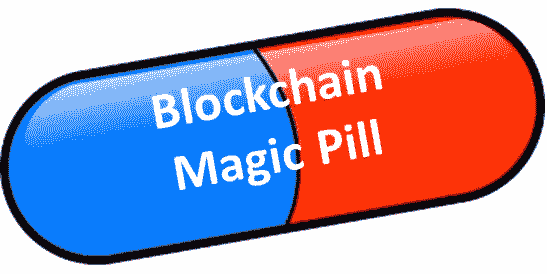

# 区块链技术可以用于全面跟踪孩子的全面成长。

> 原文：<https://medium.datadriveninvestor.com/blockchain-technology-could-be-used-for-overall-tracking-of-versatile-growth-of-a-kid-7c74b2509be?source=collection_archive---------12----------------------->

当全世界都在谈论密码和区块链，谈论编码和编程，谈论交易的验证时，重点大多放在所有这些背后的金钱利益上。事实上，进入加密技术领域，让一个人投入的每一点时间都有回报，这是一个有益的提议。然而，人类的生活方式一直以互利和最小损失理论为基础。

***1)火、轮子和纤维的发明:***

史前时期，当这个星球上的一个裸体人类发明了如何产生和控制火的时候，他可能只把它藏在自己的心里，这个发明可能已经晚了，或者灭绝了，没有人知道，现在我们能得到它。轮子的发现和纤维的发明也是如此。

一代又一代人把成就传递给下一代，并为此感到自豪和快乐，使世界变得更加美好。加密和区块链技术的融合是一个很好的倡议，人们对推进它的兴趣使我对为后代做得更好感到乐观。

***2)增加沟通隔阂和教养的多面性:***

***曾经有段时间，父母有很多时间留给他们的孩子，他们可能会适当地利用这些时间，甚至在无意识的状态下，他们已经给了他们几乎所有事情的想法。修理马达、棒球、修理家用电器、修剪草坪，这些都是定制套餐的一部分，在某些情况下，是和祖父母甚至父母一起度过的时间。***

从一个非常实际的角度来看，现在的孩子更多地生活在虚拟世界中，当然，他们没有“必须”知道所有的事情，但是，他们也没有必要对自己是谁和曾经做过什么那么自信。

***3)多个系统已经测试证明无效:***

***考虑到下一代将是一个相当虚弱、低效和“不那么”实际的一代，因为他们将不会意识到几乎 90%的日常生活任务和知识，也不会对此感兴趣，在过去几年里，已经采取了多项举措并开展了多项工作。***

然而，这些实验系统从未能够在多样化的规模上工作，并且总是因为它们的低效率和在应用的某一点或另一点上的损失而被停止。

***4)区块链技术可能是数据追踪和应用的一场革命:***

***在区块链上，可以存储大量的数据，并在需要时进行跟踪，因此人们可以轻松地跟踪表现，可以对受试者(儿童)进行神经分析，自动化程序将能够根据儿童表现出的症状和行为发出指令。***

***他成长、发展的不同阶段，结合对生理和心理应用的研究和分析，可以打上时间戳。这些时间戳迟早会在不同的情况下进一步用作参考。随着每一个模式的遵循和每一个选择的做出，将会增加一个块，在区块链上有它自己唯一的散列地址。***

***这将是一个阶段定义的系统，学业、兴趣、表现、各种验证和来自教师、教练、指导员、体能训练师的输入，以及孩子一生中经历的每一个学习过程，输入数据的分散系统将允许评估者查看最后的输入，验证和修改它以进一步改进，并提出他/她自己的意见或建议。***

***从很小的年龄开始，每个孩子都可以有自己的区块链，一旦他进入更高的年龄并参与其中，参与节点就可以被添加到其中。根据他的表现和兴趣，当局或父母将能够决定或指导他选择一个特定的兴趣领域或职业，最终，这将是一个广泛的数据库，其中将有数百万儿童的分析和结果。***

该数据库将不断增强，随着时间的推移，它将在开发和应用方面得到增强。这些改进只会使它更加有效和实用。随着人工智能在程序中的轻微参与，它将被设计成孩子将成为一名伟大的歌手、设计师、运动员、任何领域的艺术家或画家、雕塑设计师或更多。它也将指导和建议未来的努力或决策。

区块链应用程序使事情变得更有效、更好。这就是我所认为的区块链对社会的分类目的。