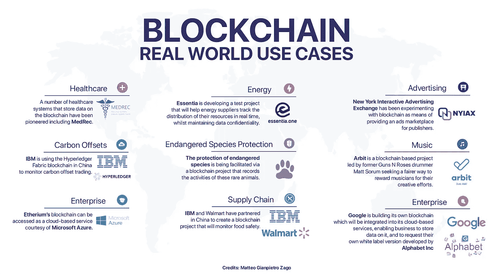

# 区块链技术 IRL:不止一个比特币

> 原文：<https://medium.datadriveninvestor.com/blockchain-technology-irl-more-than-a-bitcoin-e518c741d62e?source=collection_archive---------19----------------------->

很快变得显而易见的是，区块链技术不仅仅是比特币。在金融、医疗保健、媒体、政府和其他领域，创新应用每天都在出现。虽然一些企业可能会失败，但如果区块链证明自己像许多人预测的那样具有革命性，其他企业可能会变得家喻户晓。

最近， [CoinTelegraph](https://cointelegraph.com/news/amazon-microsofts-move-to-blockchain-centralized-companies-into-decentralized-ecosystem) 分享了关于微软和亚马逊考虑实施区块链的消息，尽管这违背了他们的核心价值观。这些巨人不能错过，因为很明显，区块链将成为未来日常生活中必不可少的一部分。

# 区块链和加密货币是一回事吗？

*加密货币是指用于在线交易的数字货币。这些钱储存在电子钱包或电脑文件中。常见的加密货币有比特币、以太坊、Ripple、莱特币等。区块链是用于转移和监控加密货币交易的基础技术。*

不久前，人们还称比特币和其他加密货币为骗局、泡沫或时尚。我们都听说过，但现在，就连政府机构、G20 等全球领导机构，以及加密货币的最大反对者之一——银行，也意识到自己需要站在这项新兴技术的前沿。

# 甚至集权巨头也在转向分权

新的采用浪潮现在来自企业。微软一直是比特币的支持者。它已经认识到区块链技术的力量及其在每个行业颠覆性应用的潜力。此外，Azure 于 5 月 7 日发布了区块链应用创建服务 Azure Blockchain Workbench。Workbench 旨在让希望创建定制区块链应用的企业通过自动化基础设施设置来加快开发过程。

另一个积极的例子是亚马逊，电子商务领域的革命者。当区块链技术真正站稳脚跟的时候，他们现在希望站在第一线。主要是，用户可以通过亚马逊网络服务(AWS)的云信息模板工具[创建他们的区块链](https://aws.amazon.com/about-aws/whats-new/2018/04/introducing-aws-blockchain-templates/)应用。AWS 副总裁杰夫·巴尔[在一篇帖子](https://aws.amazon.com/blogs/aws/get-started-with-blockchain-using-the-new-aws-blockchain-templates/)中解释道，“我与之交谈的一些人将区块链视为新货币体系的基础和促进国际支付的一种方式。其他人将区块链视为分布式账本和稳定的数据源，可以应用于物流、供应链、土地登记、众筹和其他用例。无论如何，很明显有很多有趣的可能性，我们正在努力帮助我们的客户更有效地使用这项技术”。

其他大公司也考虑以不同的形式加入区块链运动。像三星、华为等公司都意识到，面对这些机会，如果他们不迅速投入，就会被甩在后面。华为正在装载内置比特币钱包的手机；三星将利用区块链管理其全球供应链；西班牙银行集团 BBVA 成为第一家发放区块链贷款的全球银行，并且在全球范围内还会有更多银行继续增长。

> 微软和亚马逊别无选择，只能专注于区块链，因为这是未来。如果他们不这样做，他们知道这会损害他们在云计算领域的发展。看看脸书，他们看到了区块链的价值，以至于他们调动了自己的管理团队，让贝宝的前总裁参与区块链的项目。

总而言之，越来越明显的是，区块链技术将继续存在。这种兴奋正在蔓延，并在众多行业中引发一场竞赛，甚至在银行和金融领域之外也是如此。区块链技术虽然与加密货币相关，但也有许多其他行业的应用。这些应用程序正在为许多现实世界的使用而被探索和开发。

通过探索区块链和投资加密货币，您也可以成为这一运动的一部分！今天从 [CoinSmart](http://coinsmart.com) 开始，完全加拿大银行为您所有的上下坡需求。存款保证在同一天进入你的账户，法定提款在 5 个工作日内处理(尽管他们的平均时间少于 24 小时),所有账户在同一天核实(通常是立即核实)。)欲了解更多信息，请访问 coinsmart.com[或在社交网站上找到我们。](http://coinsmart.com)