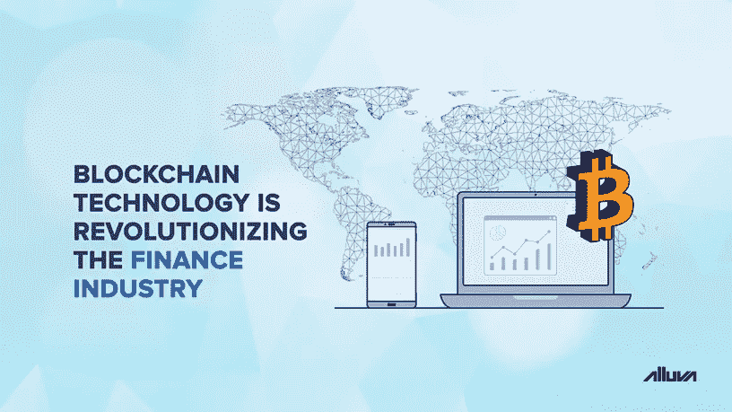
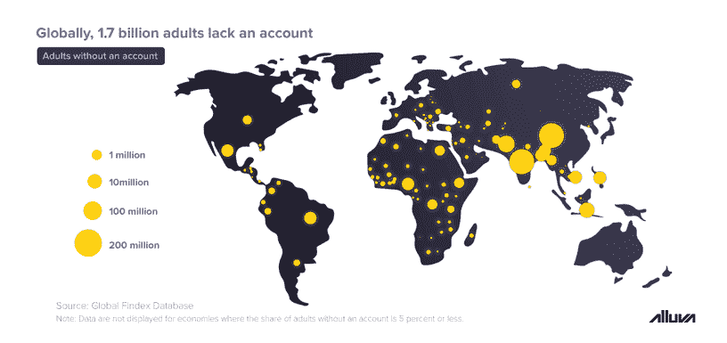

# 区块链技术正在彻底改变金融业

> 原文：<https://medium.datadriveninvestor.com/blockchain-technology-is-revolutionizing-the-finance-industry-51dee85ba92c?source=collection_archive---------4----------------------->

区块链技术具有独特的定位，可以改善传统金融业的各个方面，包括零售银行、资本市场和资产管理。正如互联网为实体购物体验提供了一次独特的升级一样，全球金融格局正处于人工智能和区块链等前沿技术带来大规模颠覆的边缘。如今，各机构也意识到，尽早采用新技术可以让他们在竞争中占据显著优势。

众所周知，费用和其他与维护相关的收费使得银行账户和任何形式的数字支付对世界上很大一部分人来说都难以为继。根据 T2 世界银行的一份报告,“大约有 17 亿成年人没有银行账户——没有金融机构的账户，也没有手机支付服务。2014 年，这个数字是 20 亿。”

 [## 2019 年十大区块链课程|数据驱动的投资者

### 渴望在区块链发展吗？你想知道区块链是如何工作的，但不知道在哪里？或者就是太多了…

www.datadriveninvestor.com](https://www.datadriveninvestor.com/2019/03/08/top-10-blockchain-courses/) 

全球金融体系目前也陷入了一系列关于用户安全和隐私的争议。然而，区块链技术试图改变这一切，以更低的成本提高机构和消费者的效率和速度。

在接下来的文章中，我们来看看这项技术已经在金融界发挥作用的一些有希望的方式。

# 跨境交易

几十年来，国际交易和汇款一直由一个名为 SWIFT 的系统处理。尽管几乎每一家主要银行都支持 SWIFT，但由于它依赖于中介和银行间关系，因此成本极高且速度缓慢。例如，两个不同国家的较小银行之间的转账，将首先必须通过现有代理行关系的较大银行进行。鉴于现在至少有四家不同的银行参与其中，汇款人或收款人还必须支付相当一部分费用。

然而，区块链不是建立在集中式结构上，可以用于以完全点对点的方式转移资产。当涉及到分散的跨境交易时，Ripple 可能是最突出的项目。Ripple 的数字资产——XRP——被银行用来近乎实时地结算银行间的交易，降低了成本，将速度提高了一个数量级，并消除了对中介的需求。

# 不可变的记录

区块链的另一个优势是该技术能够无限期存储记录。一旦某一特定信息被添加到分布式分类账中，几乎不可能以任何方式对其进行修改或删除，从而确保过去交易的完全透明。对于恶意修改区块链上的数据的攻击者或用户来说，他们需要在计算能力方面超过整个区块链网络。在更大的分散式网络(如比特币网络)的情况下，攻击者需要在硬件和其他基础设施上花费数百万美元，才能改变记录。

鉴于银行和其他金融机构目前依赖于客户端-服务器模型，它们有可能被任何有能力的个人利用的单点故障。就在今年，一名西雅图居民设法获得了属于 1 亿 Capital One 客户的敏感数据。在她将数据发布到她的公共 GitHub 账户后不久，该银行被迫发布了一份[声明](https://www.prnewswire.com/news-releases/capital-one-announces-data-security-incident-300892738.html)并减轻损失。

# 新的支付方式

2019 年早些时候，美国最大的银行摩根大通承认了区块链的优势，并宣布了 JPM 硬币，这是一种主要旨在减少跨境交易结算时间的数字货币。鉴于区块链技术能够实现实物资产和财富的虚拟化，银行业的主要参与者决定朝这一方向创新只是时间问题。

随着与美元挂钩的稳定货币 Libra 的推出，美国社交媒体巨头脸书也进入了支付领域。Libra 协会是一个由 28 个成员组成的联盟，涵盖各行各业，旨在利用代币改善全球金融包容性，并在消费者层面简化国际贸易和商业。

# 分散式应用程序

类似于互联网如何通过移动和网络应用开创了一个新的扫盲时代，区块链技术有潜力通过分散应用或 DApps 来提高金融包容性。[例如，Alluva](http://bit.ly/ext_grp1) 是一个总部位于区块链的应用程序，其目标是成为世界上最大的分析师平台。个人被激励以 Alluva 代币的形式准确预测各种资产的增长潜力，并且不需要进行任何前期投资或购买。通过这种方式，Alluva 正在提高加密货币等新兴资产类别的透明度，同时促进发展中国家的金融包容性。

要了解更多关于 Alluva 的信息并做出你的第一个预测，请点击此处查看网络应用。如果你想阅读更多关于区块链和加密货币市场的有趣内容，请关注我们的媒体简介[这里](http://bit.ly/alluva_mdm)。要与 Alluva 团队聊天，请在此加入电报组[的对话。要获得 Alluva 的最新更新，](http://bit.ly/alv_telgrp)[点击这里关注](http://bit.ly/alluva_tw)我们的 Twitter 账户。