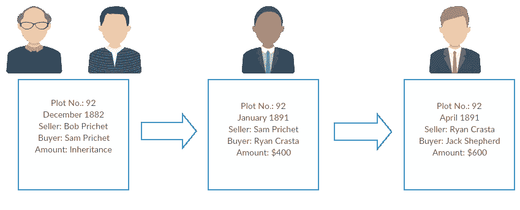
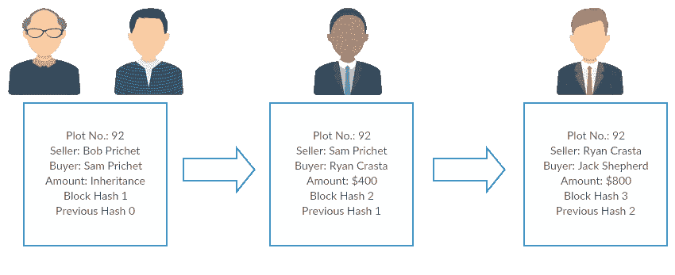
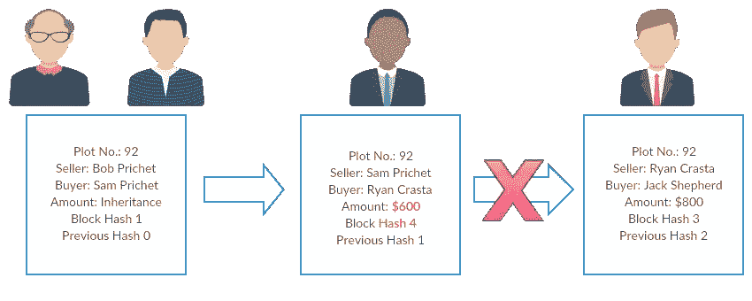

# 区块链技术:让您轻松理解

> 原文：<https://medium.datadriveninvestor.com/blockchain-technology-understanding-made-easy-for-you-98da926492ac?source=collection_archive---------7----------------------->

自 2008 年以来，人们一直在谈论区块链技术及其去中心化、分布式公共总账交易技术。但这一概念只是在加密货币中实现了同样的功能后才出现飙升。虽然加密货币的想法现在受到了挑战，但区块链的使用和实施从那时起就一直在增加。

区块链已经得到了积极的工作和研究。我们已经找到了许多方法来实施区块链，以提高许多部门的安全性和效率。但是我们对区块链到底了解多少呢？

 [## 十大区块链课程-数据驱动的投资者

### 渴望在区块链发展吗？你想知道区块链是如何工作的，但不知道在哪里？或者就是太多了…

www.datadriveninvestor.com](https://www.datadriveninvestor.com/2019/03/08/top-10-blockchain-courses/) 

## 什么是区块链？

嗯，你一定看过很多老派电影，当两方之间的金钱或其他交换被记录在一本厚厚的书里。这本被称为账本的大厚书。

[Google Images](https://images.google.com/)

双方之间的交易以非常系统的方式记录下来。这是为了确保如果有任何不符点的索赔，你所要做的就是检查分类账，你就会知道交易的完整顺序。

比如说，92 号地块属于鲍勃·普里切特所有，然后由他的儿子萨姆继承。但是 Sam 为了拿到现金，他把土地卖给了 Ryan。瑞安只是一个投资者，然后把土地卖给杰克。所有相关方之间的全部交易在分类账中记录如下-

1882 年 12 月——山姆·普里切特从鲍勃·普里切特神父手中继承了 92 号地块

1891 年 1 月——萨姆·普里切特将 92 号地块卖给瑞安·克拉斯塔——400 美元

1891 年 4 月——瑞安·克拉斯塔将 92 号地块以 800 美元的价格卖给了杰克·谢菲尔德

山姆意识到他犯了一个错误，并密谋取回他卖的土地。他去了土地办公室。他告诉保管人，这块土地是他的，而不是声称拥有者的杰克·谢菲尔德的。为了核实这一索赔，保管人检查了保存地块 92 交易的分类账。分类账告诉他，小羊羔是山姆在 1891 年 1 月卖给瑞安的，然后在 1891 年 4 月卖给杰克·谢菲尔德，因此忽略了山姆对土地的所有权。

区块链也使用相同的技术，但具有数字世界的安全性和效率。但是区块链技术为你提供了比普通账本更多的优势。

区块链最早是由[中本聪](https://en.wikipedia.org/wiki/Satoshi_Nakamoto)提出的。但是这项技术并没有马上实现。这项技术在加密货币中实现后不久。

## 区块链技术是如何工作的？

区块链由包含数据、散列函数、随机数、节点、前一个块的散列的块的顺序连接组成。

**数据—** 块中的数据取决于使用区块链技术的原因。因此，如果区块链技术被用来记录土地的历史，块中的数据将是地块编号、卖方和买方的名称以及支付的金额。如果它被用于加密货币，块数据将包括发送者和接收者的姓名以及金额。

**哈希函数—** 哈希函数的作用类似于块的指纹。每个块都由一个唯一的哈希函数表示。每个块的散列函数的大小保持不变。它将接受任何长度的数据，并创建一个固定长度的加密输出。哈希只在一个方向起作用，因此它有助于提高块的安全性。如果你试图改变块的内容，代表这个特定块的散列函数将相应地改变。

**前一个块的散列—** 如前所述，区块链由块的顺序连接组成。让我们考虑一下之前的例子-

在上面的例子中，每个块包含两个散列函数。一个代表该块，另一个代表前一个块。第一个块被称为起源块，并被表示为“0”散列值。以这种方式，每个块都链接到前一个块。这就保持了交易最初发生时的连续记录。

拥有前一个块的散列的目的是确保安全以防止黑客攻击。当有人侵入任何块来修改其内容时，该块的散列随之改变。这会导致哈希函数与下一个块不匹配，并且会断开链接。

在示例中，如果有人修改了第二个块，哈希 2 将更改为新的哈希 4。一旦进行了这种改变，包含先前散列值为 2 的下一个块将被断开，并且链被断开。

**Nonce —** 加在每个哈希函数上的数字，只能使用一次。这在身份验证协议中使用，以确保旧数据不会被重复使用和修改。

**工作证明—** 为了避免在程序块和后续程序块中应用任何错误的变更，区块链技术实施了一种称为工作证明的机制。这表明，对于应用的任何更改，都需要一定的时间来创建新块。例如，比特币需要 10 分钟来更新或向链中添加新块。因此，如果一个块被篡改，下一个块也必须被更新，这将花费很长时间。

**分布式网络—** 为了保护区块链中的数据，它使用 P2P 网络，而不是集中式受控网络。每个人都可以参加。这个 P2P 网络的成员被称为**节点。**网络的每个节点都有区块链数据的完整副本。该数据的验证由网络中的每个节点完成。P2P 网络的至少 50%的节点应该肯定地验证数据，以将块添加到链中，或者使改变成功地在任何特定块上实现。这叫做**采矿**。

**节点—** 它拥有处理任何交易所需的最少数据。它向完整节点发送查询，以防需要更多信息来继续前进。需要低存储内存。

**完整节点—** 区块链副本的完整副本。需要高存储容量。

**挖掘器—** 它们是完整的节点，监听事务并在执行工作证明后将事务添加到块中。每当一个方块被添加到链中，他们就会得到奖励。

## 我们目前在哪里使用区块链？

我们从加密货币开始，但现在区块链正在许多行业广泛使用。

**如……**

1.  跟踪电子签名欺诈
2.  电子钱包和支付网关管理
3.  艺术品的认证和鉴定
4.  钻石贸易
5.  音乐版税收藏
6.  石油和天然气交易
7.  跨境支付
8.  照片知识产权
9.  选民身份证和身份验证
10.  汽车保险数据
11.  食品供应链的透明度和可持续性

## **为什么我们没有更多地使用区块链技术？**

尽管区块链技术可能很有效，但我们不能忽视它的局限性。

他们是……

1.  难以设计
2.  难以管理
3.  扩展非常困难，并且需要高存储容量
4.  维护非常昂贵
5.  开发过程非常缓慢
6.  大量消耗能源和资源
7.  安全缺陷

由于所有这些限制，如果不花费大量资金和资源来实现标准化、安全性和更好的性能，就无法实施区块链。

**感谢您的阅读。如果你喜欢这篇文章，请随意点击👏按钮并帮助其他人找到它。**