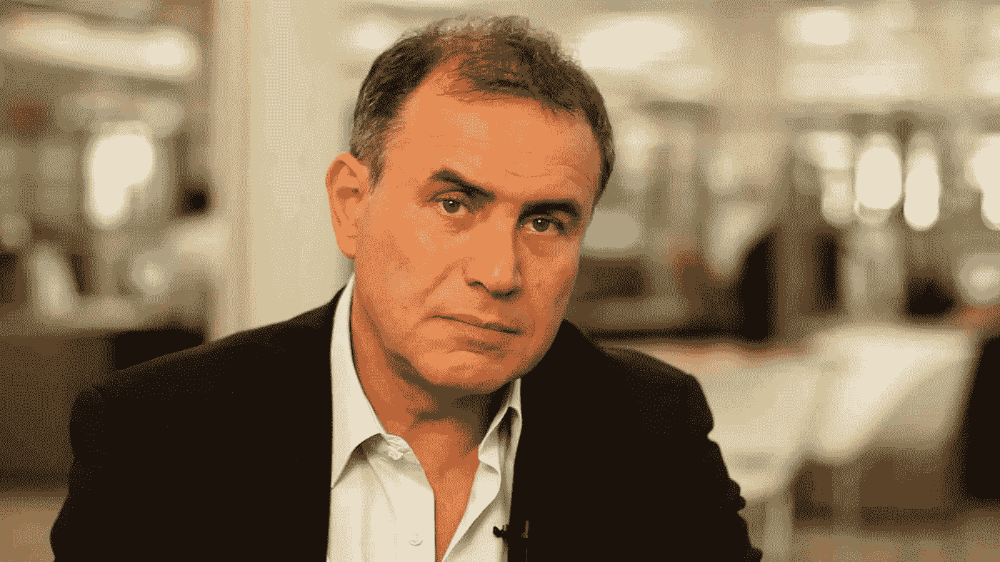

# 区块链:史上最没用最被炒作的技术？

> 原文：<https://medium.datadriveninvestor.com/blockchain-the-most-useless-and-overhyped-technology-in-history-c0fd3f0ebb2f?source=collection_archive---------6----------------------->

直言不讳的 NYU·斯特恩商学院经济学家努里埃尔·鲁比尼(又名“末日博士”)在最近的一篇文章中提出了同样的观点。

Nouriel Roubini: arch enemy of blockchain. But is there any truth in his arguments?

[**鲁比尼的文章**](https://www.project-syndicate.org/commentary/blockchain-big-lie-by-nouriel-roubini-2018-10?barrier=accesspaylog" \t "_blank) (尽管不可否认的是，从一个*集中的*角度来看，这是一种简洁、循环的讽刺)提出了很多非常好的观点。他几乎一针见血地指出了现有区块链方法固有的许多宏观缺陷——我们下一代分散化技术正在努力克服这些缺陷。

实质上，鲁比尼指出，当前的区块链根本不是真正的(所谓的)“不可信的”去中心化系统。在某种程度上，它们是有缺陷的中央集权系统，在这个系统中，最高权力掌握在——这关系到区块链的公众——鲁比尼称之为“一个匿名的卡特尔在世界独裁盗窃政权的阴影下运作”。他继续谴责被大肆吹捧的“代码即法律”是一种谬误，因此(鲁比尼认为)区块链从一开始就是相当不值得信任的系统。

嗯，事实上，鲁比尼的观察中有很多真理(这听起来可能很奇怪，因为这来自分散化的倡导者，比如我们)。你不用走很远就能找到从本质上验证鲁比尼总体立场的用例:从股东所有(但据称是“分散化”的)媒体平台到新区块链科技，一切都是从看起来可疑的公司化、本质上孤立的财团内部开发的。一些公司声称已经找到了对区块链有用的应用，这些公司实际上是*私有*，而不是*公有*，并且*集中*，而不是*分散*，因此根本就不是真正的“区块链”,这些公司给出了大量夸张的定义。

这里有一个重要的语境——这完全取决于你如何定义 T21。

让我们明确一点:正确理解和部署，去中心化*是*人类解放和解放的答案；这是毫无疑问的。

从印刷机的发明到汽车装配线，从布拉克和毕加索的立体主义到量子力学，每一个存在的人类维度和学科的历史都证明了这样一个事实，即去中心化有利于自由，而集权化有利于束缚。句号。另一方面，区块链*本身*(以及在较小程度上的其他 DLT)面临着被过度宣传的共享账本的严重指控，这与其最薄弱的环节一样有用——漏洞百出、可黑客攻击的代码以及随后由有效法令分叉的便捷“解决方案”。

让我们面对它，这两个还没有完全*广场*(是我们介入的地方)。

The weak link in current blockhains: buggy, hackable code

所以回到那个语境:当我们谈论“去中心化”时，将*技术*与*意图*分开是至关重要的——至少如果我们要在非常深的水域中导航一条清晰的前进道路的话。我们需要找到一种方法来保持去中心化的精神，同时重塑技术，以符合其背后的高尚和平等的意图。

*那就是*我们正在建立的技术——一个全新的平台，叫做 Decentr。

从本质上讲，Decentr 所克服的问题是我们的 R&D 与所有当前的区块链所认同的主要弱点:从本质上讲，区块链目前的状况是知识和技术僵化对公众共识的胜利。(真的有人想知道为什么公众不参与吗？)这意味着，当前区块链思维和应用程序中的弱点通常会被 20 多岁的白人男性亿万富翁开发者所掩盖，他们不顾一切地提高事务可伸缩性或每秒事务数(TPS)，几乎牺牲了所有其他考虑因素(在许多情况下，包括安全性)。

因此，区块链继续做着当前区块链最擅长的事情:以牺牲发展技术来造福其他所有人为代价，让 1%的富人富裕起来。

从这个角度来看，问题是不言而喻的。

如果从最广泛的角度来看，这种地方性的僵化实际上是当前区块链发展的特征，是一组不同的技术在发展——也许不是相互孤立的——而是与这种更广泛的共识相孤立的。

换句话说，继续这样下去，所有将会发生的事情就是发展将会回到我们已经拥有的有缺陷的、被操纵的网络。未来将与现在一样，只是更加分散，我们所有人都被更加密集的数据包围，这要归功于大型传统科技公司偏执的、受利润驱动的“安全”协议。一个数字化的 *1984* 在这里，思想犯罪可以被追踪(和消除)，在缺乏真正的去中心化不变性的情况下，承蒙未经审查的数字意识流的表达——实际上——在十亿千禧一代的社交帖子的密集数据雾中。恶心。

也没必要。解决办法？我们的技术根据去中心化的*原则*去中心化*数据流*，而不仅仅是*数据存储*(即 Decentr 去中心化*所有*数据的存储*和*交换*作为真正的数据经济的一部分)——用本地共识取代区块链对每项行动的全网络共识的“集中”要求。*

这种新模式确保了传统区块链的局限性——特别是对可扩展性、稳定性以及在公开的公共账本上安全存储个人和交易详细信息的关注——是我们的优势。

这是由于局部共识创建的安全协议，作为我们全新的合作博弈理论共识机制的一部分。因此，这种共识机制用 Decentr 的本地化约定证明协议取代了当前区块链的资源密集型、网络范围的工作证明和堆栈证明范例。

*，*归根结底，这就是我们所说的公众共识——我们已经开发了核心技术来实现这一共识。

简而言之，Decentr 提供的解决方案将提供技术和社会经济范式，在公众参与、反馈和协作的更广泛范围内，继续开发和部署对公众有益的去中心化应用。

“代码”可能会被证明是“法律”，但它只有在公众作为默认的无信任国家的成员参与的情况下才会起作用，而我们的新范式就是为了治理这个国家而创建的。

这是甚至努里埃尔·鲁比尼都可能落后的技术。

请随时通过我们 [**网站**](https://decentr.net/) **上的联系表格与我联系，了解有关 Decentr 的更多详情，或者您可能有的任何问题或建议。**

*原载于 2019 年 2 月 23 日*[*www.datadriveninvestor.com*](https://www.datadriveninvestor.com/2019/02/23/blockchain-the-most-useless-and-overhyped-technology-in-history/)*。*