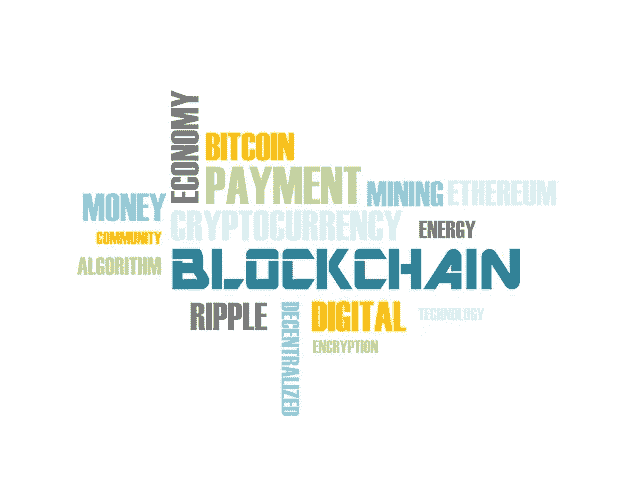

# 区块链:网络安全的巅峰？

> 原文：<https://medium.datadriveninvestor.com/blockchain-the-pinnacle-of-cyber-security-fa17dbf20ba9?source=collection_archive---------4----------------------->

想象一下，在这样一个世界里，你可以确保进行任何数量的保密货币交易，而不必时刻担心被黑客攻击。今天，您的系统或云中的一切都容易受到未经授权的访问和操纵的威胁，再多的网络安全软件或方案也无法帮助您改变这种状况。安全措施越先进，侵入方法就越好。这个世界需要一个高度安全的加密系统，这个系统对任何黑客来说都太单调乏味了。**区块链**倾向于实现这个前提的更大一部分。

B 锁链技术正是你想象中的样子。多个加密数据块相互链接，形成一个安全的信息链。你们中的一些人可能会认为这个概念很老套，这样想是很符合逻辑的。但是，区块链与所有其他数据存储和传输系统的区别在于它实现的一系列协议，包括**文字证明、哈希编码和点对点通信标准**。

区块链的概念最初是由一小组研究人员在 1991 年发明的，目的是为他们的数字文档保留一个时间戳以避免回溯。但直到 **2008** 年 [**中本聪**](https://en.wikipedia.org/wiki/Satoshi_Nakamoto) (化名)发现了区块链的各种应用，才引起了很多人的关注。与区块链一起，中本聪推出了有史以来第一种数字货币，**比特币**，使用区块链技术操纵。今天，世界各地的大多数货币交易和机密操作都使用区块链。

**分类账**是一份合同，其中保存了所有相互交易的分录。存储在银行或机构中的钱不是一个物理实体。因此，货币的存取只不过是分类账中记录条目的抄本。区块链实现了**分布式账本**的概念，其中验证和更新记录的权限提供给链中所有受信任的成员。链中任何区块的添加、删除或操作都必须得到区块链中所有节点的批准和验证。

Blockchain Representation

一个模块可以分为三个基本结构。**存储的数据，该块的哈希和前一块的哈希**。交易的必要信息存储在数据分区中。哈希是链中每个块的加密地址。存储前一个块的哈希值是为了成功地将新块附加到链中。考虑通过区块链执行的两个人之间的资金转移。在这种情况下，数据段由发送者、接收者的账户信息和交易所用的货币量组成。为交易的每个阶段生成一个唯一的散列，以提高其安全性。该散列仅可由该链的经过验证的用户访问。事务的前一阶段的散列被包括在块中以形成连续的链。

即使其中一个块被闯入，链也会终止执行。由于分散化和相互共识，人们必须准确地篡改链中的每一个块。这就是工作证明协议发挥作用的地方。任何用户提议的新块在被附加到链之前必须被 50%以上的成员授权访问。这种防火墙的复杂性使得未经授权的来源几乎不可能获得对区块链的非法访问。

**智能合约**是区块链的一个强大应用。 **Solidity** 是一种领先的编程语言，用于跨多个区块链平台执行智能合同。以太坊是一个基于区块链的开源分布式计算软件，用于实现智能合约的功能。**比特币、以太、涟漪、系绳、莱特币、EOS、Dash 等众多加密货币**借助区块链技术发挥作用。这项技术已经成功地吸引了一些投资者的注意力，从而确保了未来的巨大成功！