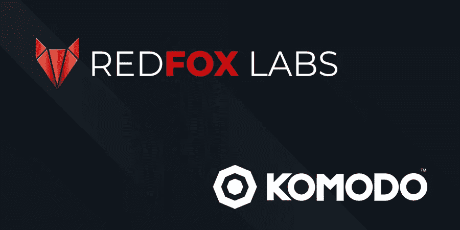
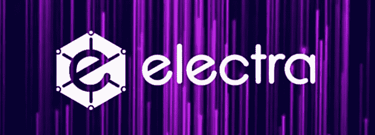

# 区块链的流行:合作的力量

> 原文：<https://medium.datadriveninvestor.com/blockchains-pop-the-power-of-partnership-f210740dbf1?source=collection_archive---------6----------------------->

## 当真正的联盟推动行业前进时

区块链项目，无论技术实力如何，如果没有一个积极参与的社区的支持，就什么都不是。没有口碑营销，世界上最好的团队、想法和产品永远不会获得真正的市场吸引力。

粉丝变成超级粉丝，成为推广和支持的冠军。当社交频道上出现问题时，会有一场提供最有用建议的比赛。

 [## 创新提醒:区块链 3.0、Terra 协议、ICO 门户和更多|数据驱动的投资者

### 尽管过去几个月加密货币的价格波动很小，但这项技术并没有停止发展…

www.datadriveninvestor.com](https://www.datadriveninvestor.com/2019/03/16/innovation-alert-blockchain-3-0-terra-protocol-an-ico-portal-more/) 

然而，就像善与恶之间永恒的斗争一样，正直的人也会误入歧途。项目支持者通常认为母熊会保护自己的幼崽。站在中间的任何事物都最好做好战斗的准备。

> 将任何形式的 FUD 带入 Telegram，该项目的忠实用户会迅速将你撕成碎片。

然而，在数字的束缚下隐藏着一种根深蒂固的爱。别误会我的意思。我不纵容秘密部落主义，狂热的支持者宣称他们最喜欢的项目是结束所有区块链的区块链。相反，早就应该进行自愿合作了。

通过 [**、最近的合作**](https://redfoxlabs.io/redfox-labs-and-electra-to-develop-new-market-opportunities/)——一份*真正的*协议，请注意——三个备受瞩目的项目走到了一起。目标？将区块链领养带给大众。

Some handshakes are all for show

# 避免谅解备忘录

臭名昭著的“谅解备忘录”——又名“可疑的握手”伙伴关系——似乎只提供了一个策划一些媒体的机会。也许我误解了术语，但这样的安排有一种强迫的真实性。

“You’re telling me that these two organizations actually truly really totally understand each other? Shocker!”

谅解备忘录是双方在各自网站上添加对方标识的便利借口。然而，从一个区块链倡导者和加密投资者的角度来看，我们应该得到更深的尊重。

不幸的是，这样的策略可能会愚弄一些新来者。但是我们大多数人现在都知道得更多了——不是吗？仅仅揭开表面之下的一点点*就会揭示出一些项目除了一些文章和照片之外，根本无意利用这种“合作关系”。*

换句话说，让我们不要在屏息等待新产品的同时脸色发青。然而，令牌的另一面是已经有肉的项目。没有必要进入深入探索的阶段，因为产品已经生产出来，并处于公开测试阶段。

今天，我将为大家重点介绍三个这样的项目。每个人都有能力取得个人成功，但合在一起，未来的创造将区块链和传统金融领域相互连接起来。

# 构建多链未来

经验丰富的区块链项目，[科莫多平台](https://medium.com/u/b142b7f68fda?source=post_page-----f210740dbf1--------------------------------)是分布在整个空间的多个分类帐的基石。例如，注重隐私的 [PirateChain](https://medium.com/u/90b633c7e2ed?source=post_page-----f210740dbf1--------------------------------) ，以及应用构建[chain zilla](https://www.chainzilla.io/)，都在科莫多 [**的保护之下，免受 51%的攻击**](https://medium.com/hackernoon/avoiding-blockchains-most-nefarious-crypto-hijackings-503a96ac2533) 。

不仅[**KMD 的适应性强的智能链框架**](https://komodoplatform.com/antara-framework/) 极大地简化了区块链的建设过程，而且该项目目前正在测试一种移动友好的分散交换(DEX)。

 [## 原子指数

### 还在摆弄半打不同的钱包来保护你的硬币安全吗？AtomicDEX 是一款安全的非托管钱包…

atomicdex.io](https://atomicdex.io/) 

科莫多创新的、可互操作的技术正在大规模普及。该项目的 AtomicDEX 旨在极大地增强安全性、流动性和数字资产交易的便利性。

# 在东南亚建立区块链企业

拿着科莫多的技术冲刺的是 [**越南的 RedFOX Labs**](https://medium.com/hackernoon/blockchains-unicorn-replicator-b9ab02cf9373) 。该项目采用的是 D.B.O.T .商业模式:设计、建造、运营、转让。

RedFOX 在成熟市场中识别独角兽企业，然后在新兴市场中复制这些企业。从构思到移交，每一项投资都是 1B+估值公司的复制品。

然而，在向外界发布产品和服务之前，该项目确保区块链谨慎地为这场秀提供动力。除非区块链提供改进，否则什么也建不成。而科莫多为整个运营提供底层技术。

现在，虽然红狐狸连锁店只有一年的历史，但是该项目的第一个区块链合资企业——Zaddex 交易所已经开始交易。

 [## 关于

### Zaddex.com 背后的团队在两个交易所和区块链领域都有丰富的经验。熟练的…

www.zaddex.com](https://www.zaddex.com/about) 

今天，Zaddex 在一个集中的模式下运作。然而，该交易所将很快过渡到 DEX，并提供 24/7 支持，同时允许交易者自行保管他们的私钥。

但是混合加密交换仅仅是个开始。从与科莫多的合作(RedFOX 的首席执行官是科莫多的总经理)和该团队在区块链内外的经验来看，我预见 RFOX 有一个光明的未来。我可以以 0.09%的准确度告诉你，0.0003%的时候，我每次都是对的……你自己算算吧！

# 实现数字化点对点支付

伊莱克特是一个社区驱动的项目，能够实现闪电般的快速、低费用交易。该项目的总体任务是让消费者有能力花掉他们的数字货币。换句话说，伊莱克特鼓励买卖他们的硬币——不仅仅是霍德林。

像大多数区块链项目一样，ECA 正在推动全球接受加密技术。现在，要让每个人都选择移动加密钱包而不是卡或现金，这将需要心态的转变。

秘密空间中最有效的心理吸引力之一是利益相关者(PoS)共识，一旦消息传出，这一特征将影响消费者情绪。

> **在 PoS 机制下，将密码放在正确的钱包中的简单行为提供了以网络本地货币支付的被动收入。**

ECA 和 Komodo 一样，通过保持硬币在整个网络中流动，为支持该项目的人提供奖励。科莫多的年利率为 5.1%，但本质上并没有操作赌注机制。伊莱克特目前的利率是 2.5%，每年减半。

现在，如果有一件事伊莱克特做得很好，那就是建立伙伴关系。 [**伊莱克特项目的网站**](https://electraproject.org/partnerships/) 列出了 14 个当前的合作伙伴，包括 RedFOX Labs。

另一个杰出的 ECA 合作伙伴是 UniFox，它是 ATM 和 POS 终端的制造商。UniFox 的目标是在未来几年内在全球推广 7 万多台机器。这种合作关系为伊莱克特提供了一个完美的平台，以促进其全球支付系统 ElectraPay 的使用。

 [## 电子支付

### 商家和消费者需要更快、更安全和用户友好的支付解决方案。

medium.com](https://medium.com/electraproject/electra-pay-2c058574deeb) 

最近与 RedFOX Labs 的合作是伊莱克特推动新收入来源计划的一部分。RFOX 正在利用他们的专业知识和科莫多的技术，将伊莱克特引向正确的方向。

# 包扎

我们大多数在区块链和 crypto 工作的人都在为这两个实体的广泛使用而努力。不可变的分布式分类账几乎没有给坏人留下藏身之地。

此外，在区块链安全技术的基础上，crypto 注定要关上操纵央行的大门。区块链和 crypto 的核心意图是在不需要依赖第三方的情况下实现个人主权。

但是，尽管 crypto 和区块链已经有十多年的历史了，教育仍然缺乏。从更加信任投票到减少电子竞技中的作弊——以及许多介于两者之间的事情——很多行业实际上都在乞求区块链升级。问题是，他们还不知道。

加快区块链的采用需要重新创造人们已经习惯使用的产品。关键是让区块链在幕后操作。

尽管底层技术很复杂，但用户体验应该正好相反。通过虚拟的*将*区块链偷偷带入熟悉的应用程序，大规模采用的大门就打开了。

科莫多、红狐实验室和伊莱克特的合作对整个行业来说是一个福音。看到高质量的项目走到一起互相帮助总是很棒的。没有谅解备忘录。不要对着镜头狡黠地笑。没有空洞签名的松散协议。

相反，这些是真正的项目，有真正的产品和实际的抱负。这些合作关系与营销无关，而是创造解决方案。

科莫多和红狐狸已经非常熟悉彼此了。然而，至少现在，伊莱克特有点像局外人。最初会有一个学习曲线，尽管大部分是平坦的。

但是一旦三位一体能够轻松地相互合作，我希望大量用户友好的产品能够出现。你知道他们说等待的人会得到什么。

# 无耻的插头

如果你喜欢这篇文章，请点击掌声。不会痛的，我保证。现在就开始尝试吧！您的支持有助于这篇文章在整个区块链世界传播。

如果你想帮助把你的加密信息传递给大众，我们来聊聊吧。即使你只想讨论你最喜欢的区块链创新，你也可以在这里找到我:blockchainauthor at Gmail

如果你特别喜欢社交，你可以随时联系 [**加密推特**](https://twitter.com/CryptoBlastoff) **。**

> **免责声明**:这不是投资或理财建议。本文中的信息主要是推测性的观点，仅供娱乐。
> 
> 在参与任何项目之前，无论是否在加密市场，都要进行自己的研究。作者持有本文提到的所有项目的原生加密货币。