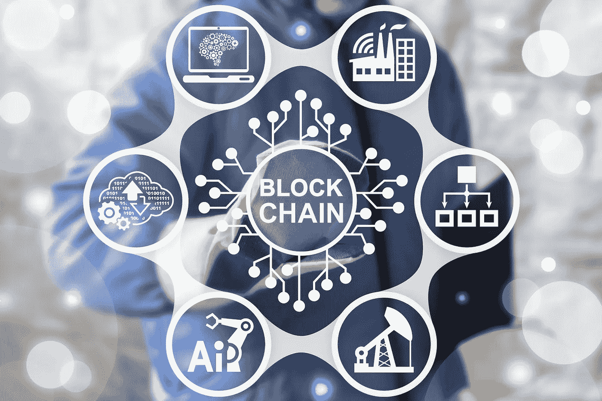
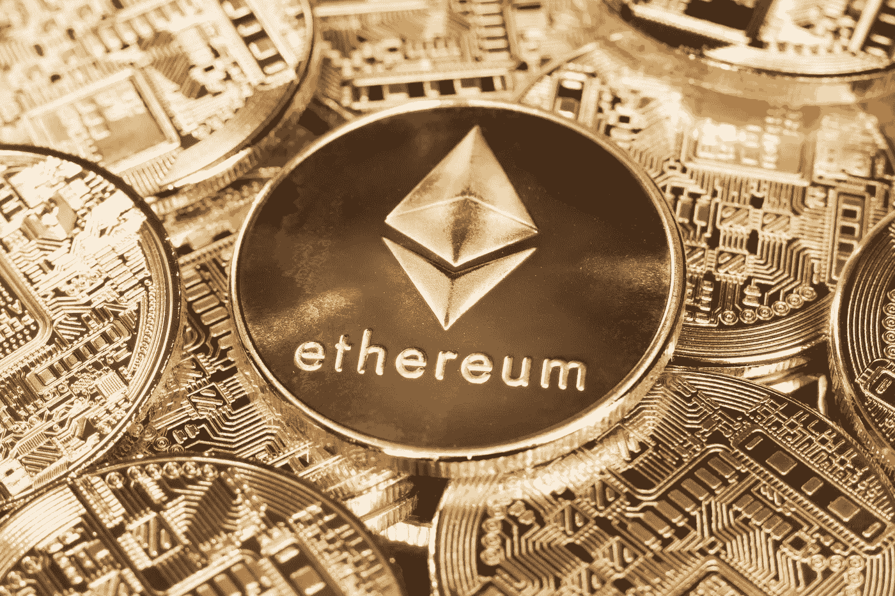

# 区块链:Uber 化物联网数据和数字资产

> 原文：<https://medium.datadriveninvestor.com/blockchains-the-uberization-of-iot-data-and-digital-assets-7e76fb6eaf8f?source=collection_archive---------10----------------------->

## 分析服务的数据市场

Blockchains are the bedrock of secure IoT data nurtured for analytics

作者:Kishore Jethanandani

数据交换是中介购买原始数据并向他们出售有分析价值的数据系列资产的地方。隐私和安全问题使企业无法创建一系列相互关联的物联网数据和数字资产池，作为人工智能的资源。来自多个来源的数据和数字资产可以在交易所购买，在那里它们可以被发现和共享，并被出售用于算法的训练。区块链，数据交换的基石，通过记录数据捕获的上下文，使 T2 的数据变得安全和易懂。

**可共享数据**

[例如，供应链](https://www.forbes.com/sites/insights-inteliot/2018/06/14/logistics-4-0-how-iot-is-transforming-the-supply-chain/#6b083655880f)将多个合作伙伴的活动相互联系起来——生产商、物流公司、批发商和零售公司。每个合伙人都有兴趣了解在*到销售点的途中*是如何变质的。他们可以根据每个人的温度控制和过程合规性数据，为任何质量下降分配责任。区块链保留供应链中整个事件序列的可追溯记录，供所有合作伙伴查看和分析，以了解腐败的原因。

麦肯锡[最近的一份报告](https://www.telecomcircle.com/wp-content/uploads/2018/08/Mckinsey-Report-on-IoT-How-to-capture-the-value-of-IoT.pdf)发现，大多数物联网数据仍基本上未被利用，因为当前用例从当前用例中提取的价值很少，当前用例跟踪单个或少数活动，当结果与预期性能不符时，这些活动会触发警报。物联网数据的战略用途，如优化运营，将更有价值。这种用例将需要企业内部以及扩展到合作伙伴的整个活动周期的数据和分析。

现实情况是，54%的受访者表示，物联网数据的利用率仅为 10%。34%的人在确定分析所需数据的上下文时遇到了挑战。

数据市场鼓励生态系统中的参与者自愿分享他们的数据以获得金钱回报。卖家愿意在合法的交易所收集数据，因为隐私法规甚至禁止他们将内部数据用于分析目的。“欧洲银行希望使用区块链来分析他们的客户数据，由于监管禁令，他们不能在内部这样做，”Jernej Adamic，联合创始人兼首席执行官 [Zenodys](https://www.zenodys.com/) 告诉我们，Zenodys 是一家总部设在荷兰、在韩国运营的数据交易所。

对区块链参与者不可改变的身份的验证说服了卖家，数据将在交易所保持安全。此外，存储在分布式账本上的数据集是可信的；任何篡改数据集的企图都会引起区块链其他人的警觉。

数据交换使用区块链来记录从多个物联网来源购买的数据。此外，他们还组织了可供分析公司使用的数据序列列表。他们还为算法、应用程序和平台等相关数字资产创建存储。

区块链的智能合约加强了数据市场参与者之间的数据和资产交换。他们排除或补充像银行这样的第三方。因此，从家庭的能量存储设备购买太阳能电力的电动汽车充电站等机器之间的自动化交易成为可能。

区块链记录传感器收集的生产、运输和交付等一系列活动的背景信息。[可见性](http://www.kaleidoinsights.com/wp-content/uploads/2018/01/KI_Report_IoTBlockchain_FINAL.pdf)的粒度级别有助于发现工厂中的机器漏洞、运输瓶颈、供应链中假冒产品的偷偷插入以及商店中的盗窃。

数据市场凭借其可信度和所售数据系列质量的一致性建立自己的品牌。“除非中介能够提供服务水平协议来保护他们免受 API 过载等故障的影响，否则公司会犹豫不决地购买数据产品，”马丁·德·绍尔斯根据他在英国研究公司的经验告诉我们，他是几本关于物联网和信息业务的书籍的作者。总部位于巴黎的数据市场[data space . io](https://www.datapace.io/)的首席执行官兼联合创始人乔治·萨利赫(George Saleh)告诉我:“智能合同有助于我们达成有条件的协议，这些协议将薪酬基于延迟和数据可用性等关键绩效指标的实现。”。

Ethereum provides the means for partners to enter into contracts without third-party intermediaries

**物联网数据的价值**

以多种方式描述的大量无定形物联网数据既无法被人工智能公司发现，也无法被其使用。它需要对数据进行描述，以向分析师传达其价值。“我们创建了一个标准分类法，称为物联网通用标签指南。描述数据的术语来自行业，是业务而不是 IT 可以理解的。它描述了诸如上下文、技术、数据来源之类的东西。具有嵌入式元数据的信令和控制层是实时数据馈送的来源。人工智能引擎的 API 可以搜索数据序列，”数据交换公司[特比宁](https://terbine.com/)的首席执行官大卫·奈特告诉我们。

整体大于为分析提供数据的多个数据系列的总和，因为数据网络效应复合了每个数据系列的价值。当分析人员可以分割几个数据源时，他们可以检查更多的场景。“数据的实时可用性是我们作为数据源提供的首要价值，”George Saleh 告诉我们。“我们的客户带来了他们的业务领域数据，并将其与来自我们平台的实时数据相结合，以获得有行动价值的见解，从而迅速采取行动，”George Saleh 补充道。

汽车行业已经是数据空间市场产生的数据的潜在客户。“汽车行业需要交通和天气状况的实时环境数据来评估司机行为的风险，”乔治·萨利赫向我们解释道。

**来自数据的服务**

当客户将可以使用数据来创造商业价值的服务概念化时，对数据的需求就会增长。Jernej Adamic 花了很多时间在大型欧洲公司，利用物联网数据设计新的应用程序。“首先，我们的欧洲客户希望自动化流程，并需要可理解的数据来实时做出运营决策，”他告诉我们。

根据 Jernej Adamic 的说法，目前欧洲公司有三个需求来源。Jernej Adamic 告诉我们:“制造业和公用事业、保险公司的预测性维护需要数据来进行风险管理，可再生能源的微型生产商需要汇总数据。Jernej Adamic 告诉我们:“我们创建了一个可视化工具，帮助我们的客户描述他们想要的服务的性质，并绘制出他们将从哪里获得数据的地图。”“我们正在培养一个开发者社区来开发应用程序，”他补充道。

Datapace 正在智能城市和电信领域寻找客户。在与诺基亚的合作中，它使用从手机信号塔收集的传感器数据来测量每个社区、街区和街道的环境状态。与目前智能城市中从路灯收集数据的做法不同，来自手机信号塔的传感器数据是细粒度的。“过敏原往往集中在几个街区。我们将这些数据出售给电信公司或由初创企业分发的智能城市，”乔治·萨利赫告诉我们。

类似地，在传感器数据的帮助下，火灾缓解当局被警告任何邻近地区的火灾风险。乔治·萨利赫推测说:“现在有了不等待 911 电话的指挥和控制系统，对火灾风险做出更快的反应是可行的。”

对于未来，Datapace 正在洽谈电信领域的业务，服务提供商正在寻求更有效地利用其昂贵的网络和频谱。“电信公司希望共享他们的网络和频率，并希望实时平衡负载。乔治·萨利赫告诉我们:“在 5G 环境中，网络切片将变得普遍。

“本地节点将负责网络容量的分配，”乔治·萨利赫补充道。乔治·萨利赫总结说:“当嵌入管理层的区块链记录网络利用率，机器直接执行负载平衡决策而无需人类协商时，决策的实施将与网络速度同步。”。

5G 将创造一个全新的从事微交易的客户群体。“增强现实是一种经常消耗少量数据的应用。大卫·奈特告诉我们:“5G 将数据处理和存储带到了蜂窝塔将托管小型数据中心并满足高频、小容量数据需求的边缘。

5G will provide the infrastructure for microtransactions of IoT data

**数据贡献奖励**

加密货币将是对区块链支持的数据交换的数据和资产贡献者进行估价和补偿的理想手段。它们将成为替代数字支付或银行系统的更快、更便宜的手段。数字支付和银行也不是机器对机器交易的可行手段，因为两者都需要人类身份。

在这个阶段，数据交易所正在临时准备更苍白版本的加密货币，以避免受到当前价值波动的冲击，或受到安全入侵的伤害。此外，加密货币和资产的二级市场不存在，这给它们的定价带来了挑战。

业界并不认为加密资产货币化的流动性二级市场的缺乏是数据交换发展现状的障碍。“二级市场是量化加密货币价值以实现货币化的一个场景。另一种方法是将支付标准编码到智能合同中，并验证来自物联网的数据。区块链有助于认证值得奖励的事件，”行业分析师、Kaleido Insights 创始合伙人杰西卡·格鲁普曼(Jessica Groopman)告诉我们，她最近与人合著了一份名为[“可信物联网](http://www.kaleidoinsights.com/wp-content/uploads/2018/01/KI_Report_IoTBlockchain_FINAL.pdf)”的报告。

公司确实采用了这种基于标准的数据评估方式。大卫·奈特告诉我们:“特比宁已经花费了相当大的努力来制作一个动态定价系统，该系统考虑了数据中 20 多个有价值的属性。”。

David Knight, CEO of Terbine says that the automobile industry is using its dynamic pricing system for data

动态定价系统引起了汽车行业的兴趣。特比宁推出了它的系统，包括定价机制，它为[美国智能交通协会](https://itsa.terbine.io/)和一些授权给自己品牌交易所的公司贴上了白标。

特比宁无法透露定价系统的有价值的属性，直到它被授予专利。我们从总部位于瑞士楚格的 Streamr 了解了定价的特征。在回复一份书面询问时，Streamr 的通信和战略主管 Shiv Malik 告诉我们，它的合作伙伴 Fysical 是如何奖励在其交易所分享数据的 1000 万手机用户的。每天数据的价值受到智能手机提供数据的活动范围的影响，无论是在家里(价值较低)还是在商业机构(价值较高)。

基于标准的数据评估并不是补偿数据交换的唯一方式。相反，加密货币可以作为图书条目。“我们有稳定的 B2B 交易硬币，完全在交易所内进行，其法定货币价值由卖方决定。用法定货币结算时，会支付净额，”乔治·萨利赫告诉我们。

加密货币支付的安全性仍然令人担忧。“我们采用了超级账本，一种分布式账本，它与以太坊融合在一起。大卫·奈特告诉我们:“我们已经将交易记录与支付(有或没有加密货币)分开，以最大限度地降低安全漏洞的风险。”。

**结论**

区块链为物联网数据的货币化开辟了一个巨大的新机会，如果不使数据销售免受安全和隐私问题的影响，这种机会很难利用。它们还通过帮助将数据放入上下文信息的角度来增加数据的分析价值。加密货币的完美实施也将使数据交换具有可扩展性。