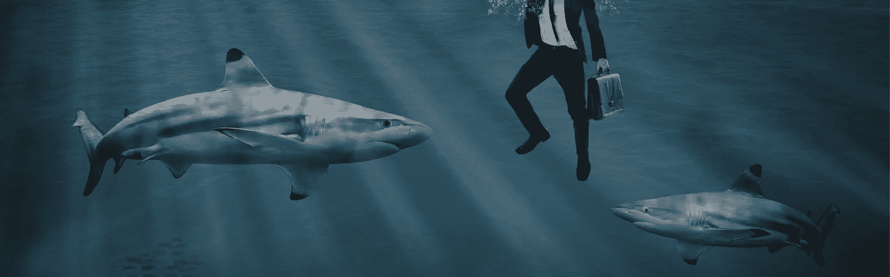

# 水中有血:你的公司正与风险投资鲨鱼同流合污的 5 个警告信号

> 原文：<https://medium.datadriveninvestor.com/blood-in-the-water-5-warning-signs-your-company-is-swimming-with-vc-sharks-1e5f39ca00f7?source=collection_archive---------21----------------------->

Don’t get caught…

你的加密初创公司已经在行业内取得了一些进展，但你正在跑出跑道。很快。

这是一个可怕的时刻:寻找风险资本的时候了。

好吧，这里有一个非常准确的例子，让你为这种体验做好准备…

有时你向风投推销一个好主意，但他们根本不明白你在说什么。

别担心。不是你。是他们。

不要误解我。我真的很喜欢风投。真的。不仅仅是和我有血缘关系的人！

风投几乎都很聪明，受过良好教育，有着令人难以置信的血统。有些人甚至努力理解你在卖什么，真心希望看到你成功。老实说，风险投资本质上是初创企业的生命线。

但有些风投就像鲨鱼。他们嗅到了水中的血腥味(也就是你对金钱的需求)，然后发起攻击。

然而，由于在这一行干了 15 年多(到了一定年龄就不算了)，目睹了数百次风险投资推介(T2 ),我很容易就能在一英里外发现风险投资鲨鱼。作为一名*内部人士*，你可能希望做好准备，知道自己在应对什么。

请继续阅读，了解你与风投鲨鱼打交道的五个迹象。

# 1.荒谬地低于-FMV 估值

如果一个风险投资者坚持认为你的公司价值 X 美元，而公司里的其他人告诉你它的价值要高得多，那么你就是在和一个明显的风险投资者打交道。

他们试图以尽可能少的钱最大化他们在你公司的所有权。这就是游戏，不是吗？

考虑到这一点，当风投告诉你公司的“公平市场价值”是多少时，不要轻易相信他们。记住，风投有强烈的经济动机去低估你的项目。期待这个。但是避免关于这个话题的辩论，因为这是一个你可能会输的话题。他们是估价专家，不是你，如果你让他们，他们会花一整天谈论你糟糕的 CAC 比率。相反，你只需告诉他们，你将让市场决定估值。没有什么比竞争更让风投资本家烦恼的了。

# 2.他们证明低于 FMV 的估值是合理的，因为他们带来了“太多东西”

VC 音高*总是*以同样的方式结束。

最后 10 分钟留给风投，让他们告诉你他们是你所在行业的“专家”，他们的“方法论”，他们的基金，他们“不可思议的董事总经理”，他们在你所在行业以前的成功，他们的人脉，以及为什么他们在他们贡献的金钱之外增加了如此多的价值。

好吧，这很公平。我也想知道这些。但是，如果风投有胆量根据其“增值”来证明其低于 FMV 的估值，那么不要走开，要跑。

以我的经验来看，除了贡献资金，风投并没有像他们希望你认为的那样增加多少价值。有些风投可能会有所帮助，但大多数都远低于这个门槛。

是的，他们有联系人。是的，这位风险投资董事总经理之前取得了令人难以置信的商业成功。但他们的人脉和行业经验通常不会转化为更多的介绍。不要过分看重风投的“增值”承诺。

# 3.他们破坏创始人的凝聚力

VC 鲨鱼很精明，能分辨出哪个联合创始人是容易被捕食的猎物。风投鲨鱼把一位联合创始人拉到一边说:

*“你明白了。但你的联合创始人显然没有。”*

如果风投把一个联合创始人拉到一边，暗示其他人没有增加价值，从而破坏了创始人的凝聚力，那就是一个大的危险信号。

当然，有时候创始团队没有意义。某些创始人可能过于执着于他们的愿景，以至于他们可能看不到全局，这阻碍了公司的规模扩大。

这些事情发生了。

但通常，风投鲨鱼会把它认为可以*控制*的联合创始人拉到一边。如果你被拉到一边，被告知你是“特别的”…快跑！破坏创始人的凝聚力会引起深远的连锁反应。它扰乱了公司的整个愿景、运营和发展轨迹。

# 4.他们直言不讳地谈论其他风投

如果你与之交谈的风投试图玷污你与之交谈的其他风投的名字，这肯定是你在和一个风投鲨鱼打交道的信号。

最近，一位风险投资人告诉我，要“小心”将另一只极负盛名的风险投资基金加入客户的资本表，因为有可疑的故事称，合伙人离开了一艘“沉船”。

这让我想起了一个不成熟的高中生唱衰竞争对手，希望能在毕业舞会上找到舞伴。想象一下，以这种心态接受风投的资本，然后试图与他们建立一种值得信赖、健康的工作关系？

声誉好的风投不需要诋毁他们的竞争对手。如果你开始听到这种胡说八道跑向另一边。

# 5.他们说你必须搬到山谷去

如果一个风投告诉你，建立总部的唯一地点是在他们的城市，请三思。是的，旧金山和纽约都是不错的地点，但它们也贵得令人望而却步。

如今，许多大都市地区拥有熟练的劳动力和成熟的基础设施来支持贵公司的发展。想想奥斯汀、迈阿密、拉斯维加斯、丹佛和洛杉矶。

这些城市中的每一个都可以让你以很小的成本获得几乎相同的人才。在当今世界，拥有分布式团队是很平常的事情。和战略。任何说你 ***【需要】*** 在任何地方*的风投都是脱离实际的，希望你在附近，这样他们就可以密切关注你在做什么。*

*快跑。*

# *这对密码法律内部人士意味着什么？*

*从风投那里可以学到很多积极的信息。这就是为什么他们的增值主张如此令人信服。当你遇到风投时，他们会了解你所在的行业，他们会认识所有合适的人来帮助你的公司成长。*

*但是*内部人士*需要意识到风险投资是被*训练成*鲨鱼的。他们认为自己是初创生态系统中的顶级捕食者，所以当他们试图根据自己的最大利益行事时，不要感到惊讶。因此，与风投合作，但要留意这些迹象，知道他们何时会把你当成小海豹。*

*用自己对市场的专业知识去主导，这是他们的*天性。你的工作是*小心谨慎地游泳，发现自我激励的谎言。***

**原载于 2019 年 2 月 12 日*[*cryptolawinsider.com*](https://cryptolawinsider.com/venture-capitalist-sharks-2/)*。**