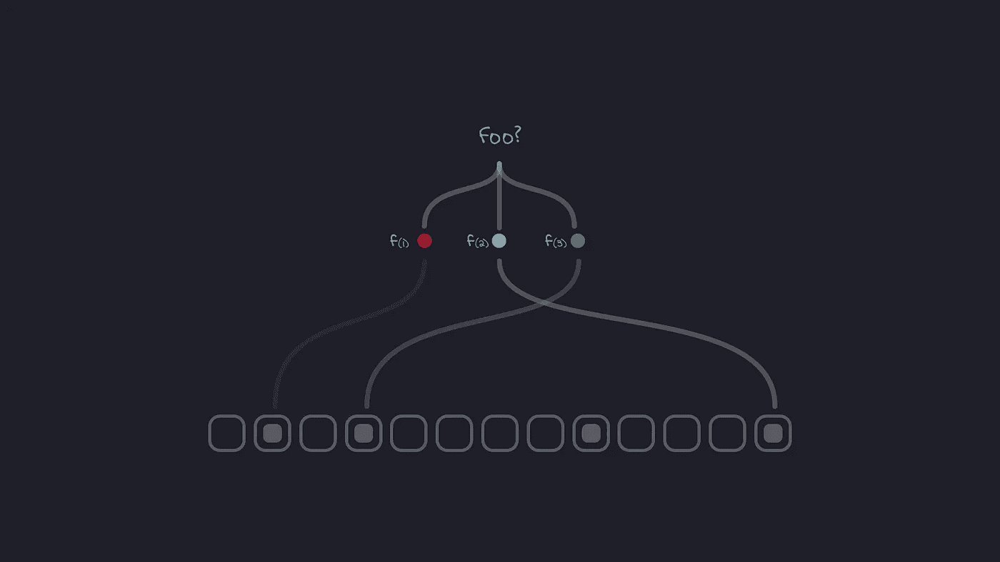
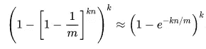

# Bloom Filter:一个简单但有趣的数据结构

> 原文：<https://medium.datadriveninvestor.com/bloom-filter-a-simple-but-interesting-data-structure-37fd53b11606?source=collection_archive---------2----------------------->



在计算中，有很多情况下，我们在存储在某处的大量数据中搜索少量数据。作为工程师，我们的工作是优化搜索，我们不断尝试寻找新的数据结构、新技术、新机制，使搜索成为低潜在和高吞吐量的操作。Bloom filter 可以帮助我们在某些用例中最小化搜索操作。它是由伯顿·霍华德·布鲁姆在 1970 年发明的。

考虑一些有助于理解这一概念的用例:

1.  假设您正在 Gmail 中创建新的电子邮件 id。Gmail 必须查明您提供的 id 是否可用。现在有一些方法可以做到。Gmail 可以扫描其数据存储(数以千计的数据库和缓存服务器)中所有现有的电子邮件 id，并找出该 id 是否已经存在。但是想象一下，Gmail 中已经存储了数十亿个电子邮件 id，在数千台服务器中扫描每个新的电子邮件 id 是否可行？大概猜测所提供的 id 的状态不是更好吗？
2.  假设你正在使用一种基于云的安全服务，这种服务可以防止你访问恶意网址。该服务可能拥有数百万恶意 URL 的数据库，可能每分钟在全球范围内满足数百万次请求。在这种情况下，在他们的数据库或缓存中搜索 url 是一个巨大的挑战——在这里使用一些近似或概率来快速确定 url 是否安全怎么样？

我只是举了两个例子来简化这个概念。试着在这些例子中找出相似之处:

I)我们试图找到某个项目是否存在于一组相似的项目中，

ii)这些情景都不需要确切的答案。可能的答案是好的。如果所提供的 gmail id 不是真的在 gmail 中，Gmail 仍然说它不可用，这对用户来说不是一个很大的问题，用户可以用另一个 id 尝试，可能在几次尝试后，用户将成功创建他/她的电子邮件 id，这不是一个无休止的循环。同样，在第二个例子中，如果云服务错误地将某个安全网站识别为恶意网站，在真正的恶意网站被识别为可访问的安全网站之前，这不是一个很大的问题。

你可能会说基于哈希/分布式哈希的解决方案可以用来解决这个问题，但是哈希需要在它的内部结构中存储实际的项目，这将消耗巨大的空间。此外，为了托管数百万到数十亿个项目，您需要在数千台服务器上分配大量空间。除非您的用例要求成员资格检查的精确结果，否则使用散列实际上是一种空间折衷的解决方案，在许多用例中实际上并不需要。

Bloom filter 在这种情况下发挥了作用。它用于检查一组项目中某个项目的成员资格。如果你问它一个项目是否存在于一个集合中，它可以给你两个答案中的任何一个——“可能存在”或“不存在”。因此，您可以清楚地看到，如果项目不存在于集合中，Bloom filter 保证成员资格检查的答案为“否”,但当项目存在于集合中时，它并不那么确定——项目存在于集合中的可能性非常高，但不一定存在。这就是为什么 Bloom filter 本质上是概率性的&这种折衷使得成员搜索也相当快。

那么它是如何工作的呢？维基百科很好地解释了[操作](https://en.wikipedia.org/wiki/Bloom_filter)。简而言之:你有一个大小为`m`的数组，其中每个单元格只包含 0 或 1。在我们的例子中假设`m = 8`，那么数组最初看起来像:`[0, 0, 0, 0, 0, 0, 0, 0]`。有`k`种非常高效的哈希函数，可以对不同的输入产生统一的结果，比如说哈希函数有——`f1, f2, f3, …, fk`。您有`n`个字符串要保存在成员集合中。现在，你通过`k`散列函数一个接一个地传递字符串，并对每个结果取`mod m`。举例:字符串是`"Bangalore”`。假设哈希函数产生以下结果:

```
str = “Bangalore”
f1(str) = 110
f2(str) = 23
f3(str) =54
....
fk(str) = 125
```

现在你对每个结果取`mod m`。在我们的例子中`m = 8`。所以:

```
100 mod 8 = 4
23 mod 8 = 7
54 mod 8 = 6
………
125 mod 8 = 5
```

上述 mod 结果总是小于`m`，它们代表数组中的位置。这个想法是将这些位置的所有单元格设置为 1，如果它还没有被设置的话。所以现在我们的数组变成:`[0, 0, 0, 0, 1, 1, 1, 1]`。我们可以对所有的`n`字符串继续进行这个过程。

现在，当我检查集合中`"Bangalore”`的成员状态时，我将通过所有这些`k`哈希函数传递字符串，哈希函数将生成相同的结果，我将获取它们的`mod m`结果，并检查相应的位置是否在数组中设置。如果所有的索引都已设置，这意味着该元素有可能存在于集合中。如果没有设置任何位置，则该元素肯定不存在于集合中。可能会出现这样的情况，数组中几乎所有的单元格都被设置为 1，因此当我们查询集合中某个项目的存在时，我们可能会错误地得到“可能存在”的结果，尽管该项目不在数组中。因此，如果大小选择不当，假阳性结果的趋势可能会增加。有一些错误率与布隆过滤器，总是有机会，你可能会得到一些假阳性结果。得到假阳性的概率是:



Courtesy: Wikipedia

您可以使用`m`、`k`、&、`n`的一些值来确定哪些值最有效，以获得最小的错误概率。

根据`n`给定`m` & `k`的适当值，布隆过滤器将产生较少的误报，并且当元素在集合中不真正存在时，它将严格地说‘否’。

布鲁姆过滤器的一些实际应用:

1.  **Cassandra 用法:** Apache Cassandra 使用磁盘上的 SSTable 数据结构来保存行。所以在百万级别上，磁盘上会有成千上万的稳定文件。当在 Cassandra 的内存表中找不到数据时，即使单位时间内有数万个读取请求，也会导致非常昂贵的磁盘 IO 操作，以某种顺序逐个搜索所有表中的相关行。因此，bloom filters 用于近似识别某个表中是否存在具有给定数据或 id 的行/列。如果结果是“可能存在”，Cassandra 在相应的表中搜索，如果没有找到该行，Cassandra 继续在其他表中搜索。所以使用 bloom filter，Cassandra 节省了大量不必要的静态扫描，从而节省了大量的磁盘 IO 操作成本。
2.  **内容推荐系统:**想象一下，某个网站向你推荐一些你以前可能没有看过的文章、新闻、视频等。所以可能有成千上万的东西可以推荐，你可能已经看到了几十或几百个推荐。所以为了跳过已经提供给你的推荐，使用了布隆过滤器。中使用布隆过滤器来避免显示重复的建议。
3.  **一点通:** Akamai &脸书使用 bloom filters 来避免缓存那些很少被搜索或者只被搜索一次的条目。只有当它们被搜索不止一次时，它们才会被缓存。可以设计几种策略来避免这种情况。
4.  **金融欺诈检测:**如果你有信用卡，你的信用卡公司知道你的消费历史——你以前交易过的供应商、供应商的类别、信用卡使用的城市等。因此，当您进行新的交易时，可以在后台执行一些规则，这些规则将决定供应商、城市或任何参数是否已被发现或可疑。布隆过滤器可以用来设计这样的策略。

使用布隆过滤器的优点:

1.  **空间效率:** Bloom filter 不存储实际项目。这样就节省了空间。它只是一个整数数组。
2.  根据使用情形，节省跨多台服务器的昂贵数据扫描。

使用 bloom filter 有一些注意事项:

1.  **删除项目:**如果您删除一个项目，或者更具体地说，从 bloom filter 中清除与某个项目相对应的设置位，也可能会删除一些其他数据，因为许多设置位可能会在多个项目之间共享。所以请记住，如果您使用布鲁姆过滤器，删除不是一个选项。插入到布隆过滤器中的内容将保留在布隆过滤器中。
2.  **插入的项目不可检索:** Bloom filters 不跟踪项目，它只是在数组中设置不同的位置。因此无法检出插入的项目。
3.  **假阳性结果:**布隆过滤器的大小必须事先知道。否则，对于小尺寸，阵列将饱和，并且假阳性结果的数量将增加。在饱和的情况下，您可以尝试设计一些策略来重置布隆过滤器或使用可扩展的布隆过滤器。如果你不断向布隆过滤器添加更多的&元素，假阳性的概率就会增加。
4.  **插入&搜索成本:**每一项都经过`k`哈希函数。因此，插入或搜索操作期间的性能也取决于所选散列函数的效率。插入元素&搜索元素需要花费`O(k)`时间，因为你运行`k`散列函数并设置或检查数组中的`k`个索引。

一些语言实现:

*   pybloom 是一个 Python 实现，一旦达到最大容量就会自动增长。
*   Java [Bloom Filter 实现](https://www.baeldung.com/guava-bloom-filter)在番石榴库中。

因此，如果您对某些错误(通常是`error ≤ 2%`)没有意见，您不需要依赖成员资格检查的准确答案，而且您希望通过预先概率性地检查元素是否可能存在来避免在磁盘或网络或任何合适的介质上进行昂贵的搜索操作，那么 bloom filter 是可行的方法。

**推荐人:**

[1][https://www . kdnugges . com/2016/08/gentle-introduction-bloom-filter . html](https://www.kdnuggets.com/2016/08/gentle-introduction-bloom-filter.html)

[https://www.jasondavies.com/bloomfilter/](https://www.jasondavies.com/bloomfilter/)

[3][http://www . mah dix . com/blog/2016/08/08/Cassandra-internals-bloom-filters/](http://www.mahdix.com/blog/2016/08/08/cassandra-internals-bloom-filters/)

[4][https://sc5 . io/posts/what-are-bloom-filters-and-why-are-why-they-used/](https://sc5.io/posts/what-are-bloom-filters-and-why-are-they-useful/)

[5][https://github . com/jaybaird/python-bloom filter/blob/master/py bloom/py bloom . py](https://github.com/jaybaird/python-bloomfilter/blob/master/pybloom/pybloom.py)

[6][https://noflufjustuff . com/blog/Billy _ newport/2010/01/bloom _ filters _ for _ efficient _ fraud _ detection _ with _ IBM _ WebSphere _ extreme _ scale](https://nofluffjuststuff.com/blog/billy_newport/2010/01/bloom_filters_for_efficient_fraud_detection_with_ibm_websphere_extreme_scale)

[https://en.wikipedia.org/wiki/Bloom_filter](https://en.wikipedia.org/wiki/Bloom_filter)