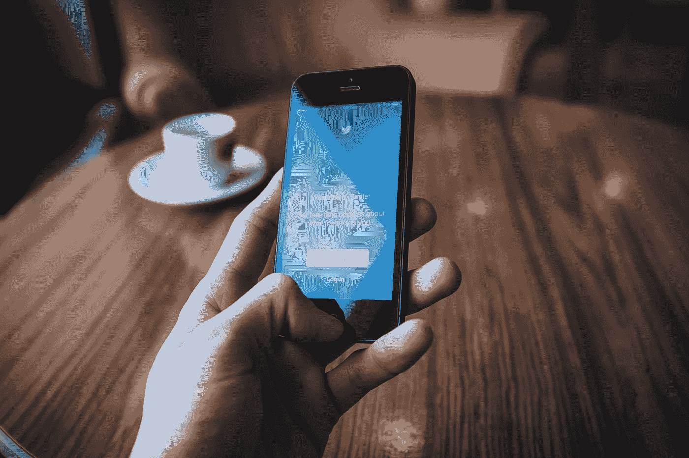
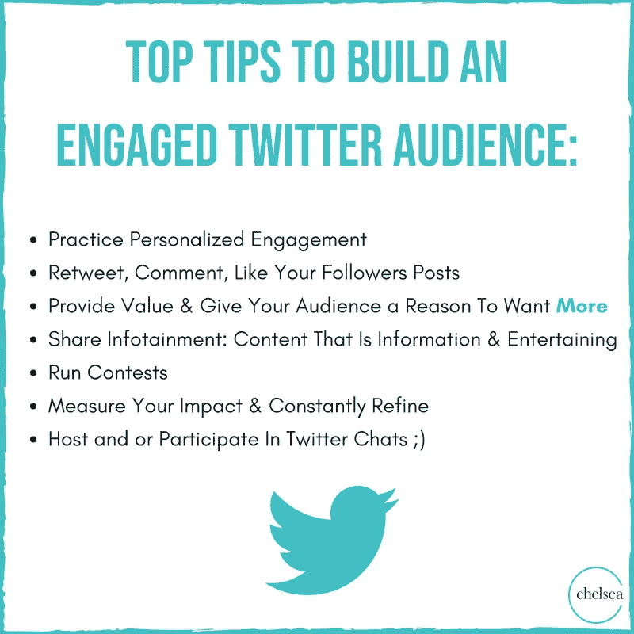
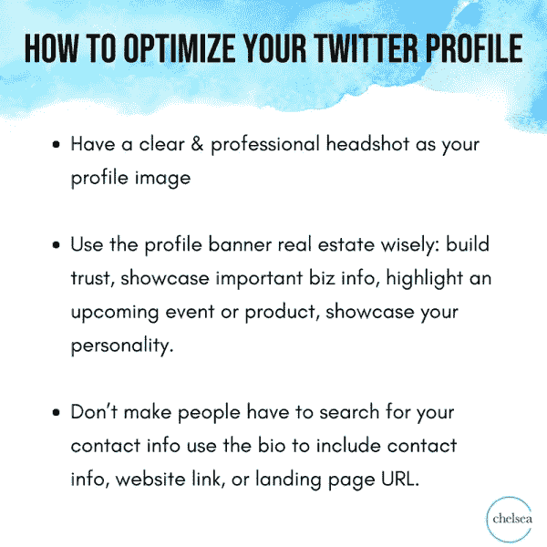
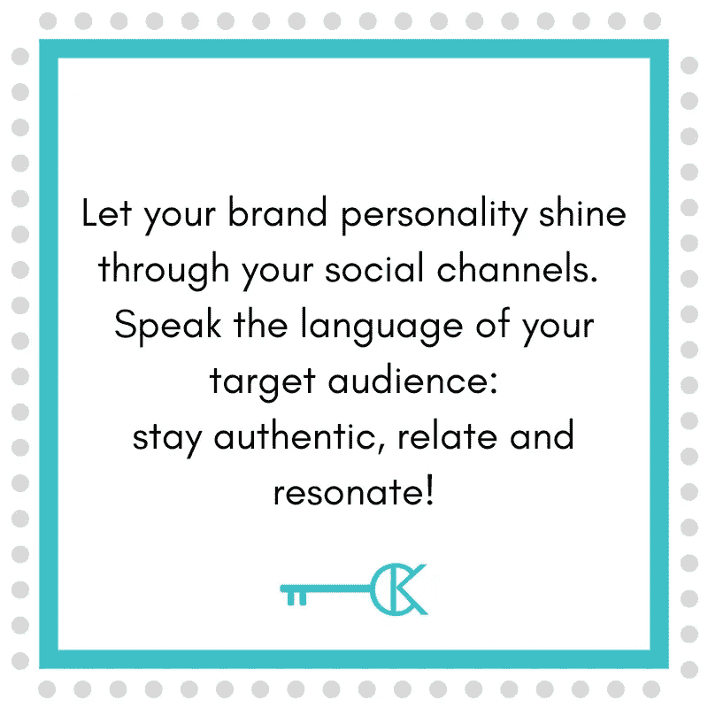

# 抓住最好的、快节奏的商业机会

> 原文：<https://medium.datadriveninvestor.com/blue-birds-fly-in-paradise-1e51a140fa45?source=collection_archive---------1----------------------->

## 那些想要在世界范围内建立联系的人对 Twitter 深信不疑

Photo by freestocks on Unsplash

不在 Twitter 上的人错过了。以在线鸡尾酒会闻名，它的超级用户是狂热的。

营销人员、新闻媒体和只想与世界各地的人联系的普通人都非常信任 Twitter。该平台是网络、销售、内容推广和客户服务的首选。

数字记者兼顾问[莎拉·伊万斯](https://twitter.com/prsarahevans)说:“Twitter 已经重新成为这个领域中一个非常强大的参与者。“我用它来连接，[分享，学习](https://medium.com/@JKatzaman/those-in-the-know-need-to-know-more-829d8ab77031?sk=b8dbda9e865e33a63e1c575e61bbdb7d)。”

埃文斯与 CNN、Mashable 和福布斯一起亮相，充分利用 Twitter 建立关系的潜力来提升她的品牌。她和同道中人——营销和品牌策略师切尔西·克罗斯特(Chelsea Krost)称赞 Twitter 是一个快节奏的社交机会。

 [## 充分利用会议连接

### 有效的营销发生在活动之前、期间和之后

medium.datadriveninvestor.com](/make-the-most-of-conference-connections-b0b17cd08037) 

埃文斯说:“我使用了像关系经理[Flock](https://twitter.com/flocknet)这样的工具，并通过直接信息建立了大量的故事。”。“如果我要去参加一个会议，我会宣传我在那里，并手策划一份我想在现场接触的人的名单。

“Twitter 对于新的商业线索也很重要，”她说。"为关键短语设置听力工具是无价的."

埃文斯指出，她的一些客户的整个媒体关系策略依赖于他们通过 Twitter 建立的联系。

“虽然每个社交平台都有利弊，但 Twitter 是一个分享信息、创建互动社区和了解行业新闻的好地方，”Krost 说。

“Twitter 已经成为各种规模的品牌与粉丝互动和分享重大进展的伟大工具，”她说。“品牌可以很容易地在 Twitter 上看到什么是趋势，以及是什么让他们的受众产生兴趣。”

Krost 补充说，Twitter 拥有 3.3 亿月活跃用户和 1.34 亿日活跃用户。

“推特上有如此多的机会，”她说。"只要走出去，加入正确的对话."

# **聊天和建立**

Krost 和 Evans 在 Twitter 上有他们喜欢的社交方式。

“我在 Twitter 上的头号策略是聊天，”Krost 说。“任何人都可以拥有观众，但拥有一个*参与的*观众是建立一个忠诚品牌部落的关键。”

埃文斯说[在 Twitter](https://medium.com/datadriveninvestor/networking-springs-from-blind-truth-dc2f31aa3a7f) 上建立关系网是“一个巨大的机会”，并给出了她的建议:

*   加入 Twitter 聊天。
*   使用第三方监听应用。
*   为您的用户名添加会议标签。
*   创建群直接消息。
*   制作[关键群体的 Twitter 列表](https://blog.markgrowth.com/lists-keep-your-engagements-on-target-75945de7281)。
*   *接合*。
*   建立他人的影响力。

 [## 无论在线还是离线，社区建设都是一个立竿见影的方法

### 击中正确的音符需要技巧，而不是昙花一现

blog.markgrowth.com](https://blog.markgrowth.com/online-and-off-community-building-is-a-quick-win-f8006bcb1958) 

埃文斯说:“知道你是在试图建立一个社区还是一个受众也很重要。“他们完全不同。什么都不需要的时候建立一个社区。”

虽然不是社交网络的首选，但有经验的人在销售方面很成功。

# 值得一去的地方

要将 Twitter 作为一个销售平台，首先要将自己树立为一个可靠、诚实、吸引人的信息来源，解决受众的痛点。有了这种街头信誉，你就可以在提供价值的同时尝试销售。

“Twitter 是一个产生潜在客户的好地方，”Krost 说。“确保[提供一些东西](https://blog.markgrowth.com/lead-magnets-attractive-ways-to-get-your-foot-in-the-door-2005d8be6f96)，例如免费的小型课程或网络研讨会、电子书、指南、备忘单或清单。”

埃文斯通常专注于“挣得的和有机的”网络，但他知道大多数人都在卖东西。在她的案例中，她从公共关系的角度看待“销售”:

*   故事放大
*   媒体投放
*   主动机会

“在一个例子中，一个客户希望被插入到一个全国性的故事中，”埃文斯说。这让她和她的客户采取了这些策略:

*   创造一个价值时刻。
*   找出四条最受欢迎的吸引人的推文。
*   加入评论。
*   参与社区活动。
*   邀请他人共享空间。

接下来，Twitter 可以被用作一个公关机会。根据 Oberlo 的数据，记者占了 Twitter 所有已验证账户的近四分之一。

“这是一个展示你专业知识的好地方，”克罗斯特说。“一定要分享最近的新闻特写、演讲片段、媒体集锦和播客。

“创建一个你想联系的记者、制片人和博客作者的名单，”她说。“这将让你与他们联系，参与他们的内容。你参与和分享得越多，你就越有可能成为他们下一个项目的关注对象。”

# **水果等待**

这是埃文斯自称的“最佳地点”，在这些地方有很多公关机会:

*   热门话题
*   标签和探索
*   有影响力的声音和报道
*   病毒推文
*   推广——或付费——推文和趋势
*   线

 [## 自信让你的世界变得更加美好

### 当你投身其中时，伟大的对话正等着你

medium.datadriveninvestor.com](/confidence-opens-your-world-to-much-better-engagements-a2b3b0c88457) 

在她看来，企业以三种方式之一建立牵引力:趋势数字提供可见性，长期数字建立社区，现场事件数字反映包容性。

"你有没有把你的热门话题和某个重要时刻联系起来？"埃文斯说。“这是一个公关机会。寻找酷的新工具，帮助你更好地利用这些机会的潜力。”

她最喜欢的工具包括 Flock、 [Squawk](https://twitter.com/prsarahevans/status/1194043737636098050?s=20%E2%80%A6) 、[点击发推](https://twitter.com/clicktotweet)和[人物传记](https://later.com/linkinbio/)中的链接。

Twitter 上最好的内容是短小精悍、引人注目的。Twitter 是真正内容的诱饵，用户用标签、图片和链接来吸引这些内容。

Krost 也有类似的内容偏好:

*   引人注目的静止图像
*   如何的
*   引用
*   行业洞察
*   文章和博客
*   产品和新版本更新

# 挤进去很多

“我们必须在讲故事、教育和简明扼要之间找到完美的平衡，”克罗斯特说。“毕竟，我们只有 280 个字符。”

埃文斯鼓励那些不熟悉或不确定[算法](https://blog.markgrowth.com/stripping-away-the-layers-of-algorithms-a5471874ca3e)的人向那些最投入的人学习。她简单地通过提问就找到了答案，并指出 82%的 Twitter 用户观看视频。许多人使用表情符号，引用事实和统计数据，发布带标签的图片并实时播放。

 [## 自由且合法地直播

### 录音时很容易违反版权保护

medium.datadriveninvestor.com](/live-stream-freely-and-legally-c313f4114a15) 

在 Twitter 上，要积极参与。不要只给人一种广播公司、卖家或垃圾邮件发送者的印象。

克罗斯特说:“确保你的[档案为个人和专业品牌曝光进行了优化。](https://blog.markgrowth.com/make-your-entire-profile-your-best-side-ddf7ae75307a)

“在所有社交渠道上让你的品牌个性发光是很重要的，”她说。“不要假装，直到你做到了。确保你的内容是真正的 T4，因为你的观众可以看出什么时候不是

Krost 遵循 Twitter 的这些规则:

*   保持推特的简短和吸引人。
*   不要买关注者。
*   参与，参与，参与。
*   不要只发布推广内容。
*   参与热门话题的讨论。
*   不要无礼。

埃文斯希望推特上的人“提供价值，就这样。”她强调了以下几点:

*   定期发微博。
*   关注新朋友。
*   建立他人的影响力。
*   有更新的传记和照片。

# **垃圾邮件制造者的罪恶**

她对那些垃圾邮件、无归属分享、大众关注或[取消关注](https://blog.markgrowth.com/profit-from-the-right-kind-of-followers-950236154bd0)以增加其算法号或从其他地方自动发帖的人表示不满。

想要使用 Twitter 作为客户服务工具的品牌应该迅速做出真实的回应。全世界都在观察和评判客户关系。

“客户体验不仅仅是销售之旅，”Krost 说。“这是一种被倾听的感觉，获得问题的答案，解决问题，感受与品牌的联系。Twitter 是完成这一切的完美平台。”

 [## 网络:如果每个人都卖，谁买？

### 把工作和娱乐混在一起会破坏联系

medium.datadriveninvestor.com](/networking-who-buys-if-everyone-sells-9b3269a041f0) 

在 Twitter 上与客户保持活跃开启了做生意的新途径。

“如果一个品牌的客户在 Twitter 上，他们提到该公司或与该公司互动，这本质上就成为了客户服务，”埃文斯说。“有时候，一个品牌的 Twitter 反响如此之好，以至于人们*不再*通过电话或电子邮件等传统途径。”

她给出了品牌可以使用 Twitter 作为客户服务工具的方法:

*   倾听
*   与客户关系管理集成
*   制定常见问题的回答矩阵
*   不使用 Twitter 直接消息机器人
*   锁定紧急和重要的更新
*   奖励参与的客户
*   改革

Krost 列举了在 Twitter 上取得成功的有影响力的品牌:

*   [Adobe](https://twitter.com/Adobe) 总是让我们了解数字世界的最新趋势，并分享他们的会议内容。
*   我喜欢作家[玛丽·弗里奥](https://twitter.com/marieforleo)以及她建立的令人惊叹的个人品牌。她的内容总是能引起共鸣，鼓舞人心。

埃文斯在推特上关注这些品牌:

*   [土坯](https://twitter.com/Adobe)。幕后参与他们的社区。
*   [Shopify](https://twitter.com/Shopify) 。a+客户支持。
*   [邮戳](https://twitter.com/Postmates)。反应极其灵敏。
*   [凯西·爱尔兰](https://twitter.com/kathyireland)言行一致的一流演员。
*   Promo.com。不断追求提供价值。

 [## 购买影响者，买家当心|数据驱动投资者

### 影响者营销是社交媒体上最热门、最敏感的话题之一。有影响力的人可以劝…

www.datadriveninvestor.com](https://www.datadriveninvestor.com/2019/07/29/shopping-for-influencers-buyer-beware/) 

未来，我希望——也期待 Twitter 在清除虚假和恶意账户方面做得更好，这些账户在过去有意或无意地增加了影响者的粉丝数量，并给他们中的许多人带来了坏名声。

“我真的很想看到 Twitter 能够编辑推文，”Krost 说。“我经常发现拼写错误，或者想编辑我的推文，但却做不到。

她说:“Twitter 将继续发展，成为即时新闻和政治更新的首选平台。”“更多有影响力的人会使用 Twitter 来提高他们的曝光率和品牌合作伙伴关系。”

**关于作者**

吉姆·卡扎曼是拉戈金融服务公司的经理，曾在空军和联邦政府的公共事务部门工作。你可以在[推特](https://twitter.com/JKatzaman)、[脸书](https://www.facebook.com/jim.katzaman)和[领英](https://www.linkedin.com/in/jim-katzaman-33641b21/)上和他联系。