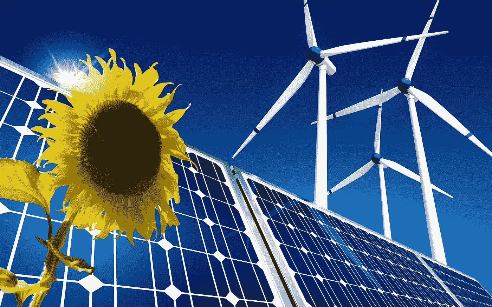
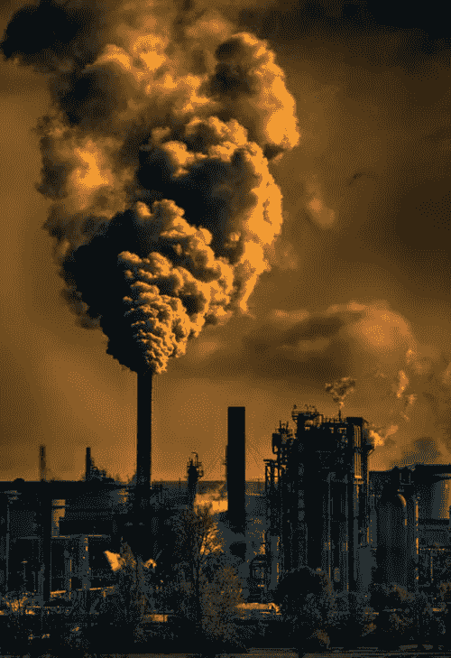
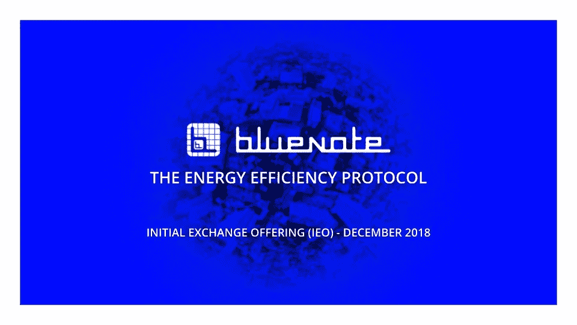

# Bluenote:区块链能效和污染根除平台。

> 原文：<https://medium.datadriveninvestor.com/bluenote-the-blockchain-energy-efficiency-and-pollution-eradication-platform-5f5ea471e90d?source=collection_archive---------22----------------------->

# 各种形式的污染

污染是将有害物质释放到自然环境中，这是我们当今环境面临的主要挑战之一；从土地、空气到水污染。每一种不同形式的污染都有其独特的原因以及对我们环境的影响。但在这些多种多样的污染物中，最有害的是那些与大气有关的污染物(空气污染)，因为它占我们呼吸的氧气的 21%。全球变暖和气候变化也因此而加剧，随着技术的进步，随之而来的是一系列新的废物处理领域，如汽车排放的烟雾、建筑物排放的温室气体以及工业废物等。在像美国和中国这样的发达经济体中，我们可以将温室气体排放的众多原因归纳为六个主要因素；交通、工业、土地利用、林业、农业和电力。

## 运输和工业

交通运输部门产生了大量的温室气体排放。我们的汽车、卡车、轮船、火车和飞机使用的化石燃料燃烧产生温室气体排放。超过 90%的用于运输的燃料是基于石油的，包括汽油和柴油，其倾向于释放诸如一氧化碳、二氧化碳、硫、二氧化氮、一氧化氮、挥发性有机物质和碳氢化合物的有毒物质。工业部门的温室气体排放主要是由于燃烧用作能源的化石燃料，以及从原材料生产商品所必需的某些化学反应产生的排放，这些化学反应随后导致气体燃烧。

## 土地利用、林业和农业

虽然陆地区域通常作为对温室气体排放的先发制人的措施，因为它从大气中吸收二氧化碳，但它本身也是温室气体排放的来源。在农业领域被记录的这类排放来自牲畜，如奶牛、农田土壤、水稻生产以及焚烧灌木和砍伐大片土地。

## 电流

商业和住宅建筑中产生的电力是温室气体排放的最大来源，因为它产生了全球温室气体排放的三分之一以上。很明显，现在建筑物最常见的两种能源是购买电力和直接消耗天然气和石油来取暖和做饭。据信，在美国和中国等国家，建筑物占一次能源消耗的 39%以上，占国内所有电力消耗的 72%。2006 年，建筑物消耗的能源比整个美国交通部门消耗的能源还多，而且美国产生的温室气体比世界上任何一个国家都多，仅次于中国。例如，根据纽约绿色银行的数据，商业房地产占纽约市所有二氧化碳排放量的 67%。

# 为什么能源对建筑估价很重要？

根据 2016 年经验交流报告，建筑业主和管理人协会对美国和加拿大的 5200 栋商业建筑进行的调查，公用事业费用平均占总运营费用的 26.7%。通过收入资本化方法，能够减少与公用事业或能源费用相关的运营费用的建筑物管理者也可以增加资产的整体价值。

电能约占建筑总能耗的 78%,是温室气体排放的主要来源。根据美国环境保护署(EPA)的数据，自 1990 年以来，随着电力需求的增长以及化石燃料成为电力生产的主要来源，电力产生的温室气体排放已经增加了大约 18%。自 1940 年以来，能源消耗率翻了两番，而人口大约翻了一番。虽然许多人认为住房单位的快速增长是这一趋势的主要原因，但也有人认为温室气体排放永远无法停止，因此只能加以控制。

在这个天然气燃烧和全球变暖持续增加的现代社会中，当我们不断寻求更好的方法来循环利用这些温室气体排放，或者更好的最合适的方法来管理能源生产和处理时，首要关注的问题是确保无污染的环境。然而，由于各种技术进步，温室气体排放的新来源每天都在增加，这一壮举变得越来越具有挑战性。

# 与房地产节能相关的问题

## 孤立的数据:

有大量无价的建筑数据库深埋在个人建筑供应商的云中，公众无法访问。诸如建筑的能源、运营和财务等数据，如果存在的话，通常被保存在一个筒仓中。由于这些限制，即使是最著名的房地产智能平台也只能局限于自己的模型、专有数据集和纯粹的假设。

## 数据隐私:

自从最近的脸书/剑桥分析丑闻以来，企业和组织越来越担心将敏感数据上传到中央供应商的云服务，因为担心数据被盗和盗用。不存在可以刺激新交易的可信的验证效率，该验证效率能够展示电网的全新市场，例如新的需求响应、峰值降低或电网平衡市场。因此，数据库所有者更加担心暴露机密数据。

## 可操作的情报:

投资于减排计划的政府或公用事业公司并不具备制定此类监管法律所需的决策工具。这些监管机构无法建立一个渠道，让公众可以看到，跟踪和分析自己不同的公民战略的效力。另一方面，需要某些分析来帮助他们确定最佳建筑策略的建筑运营商并不容易获得这些数据，因此基于他们自己的感知而不是基于经过测试和信任的标准来做出关于建筑计划的决策。

## 捕捉价值:

能源服务行业已经让建筑开发商习惯于采用专有的分析硬件和软件，通常是将软件优势作为一种辅助服务，向建筑出售多余的硬件，从而限制其客户使用自己的数据。由于这种孤立的方法，即使是当今“最智能”的建筑也受限于其供应商提供的数据池，因此无法比较和对比节能投资程序，因为他们无法跟踪类似建筑中类似工作的绩效。由于没有时间或技能自己进行高级建模，他们常常会受到供应商的摆布，这种关系在最近变得充满了不信任。至少可以说，建筑物无法跟踪其改进的财务收益，仅仅是因为它们无法实时跟踪其性能。

## 缺乏经济激励:

房地产世界是由传统金融模型驱动的，从长期来看，这些模型在节能和资产表现方面可能是也可能不是最佳实践。静态、历史或实时数据等建筑运营数据并未因其所提供的价值而获得回报。

# 什么是 Bluenote 智能协议？

Bluenote 是一家积极参与现代房地产节能的金融科技初创公司。在物联网技术和底层区块链技术的帮助下，一个房地产管理员团队和一群 it 支持者决定推出世界上第一个基于区块链的能效协议。Bluenote 专注于开发一个分散的生态系统，允许全球的建筑运营商通过分布式数据智能相互学习管理能源消耗的最佳方法，并随着时间的推移增加其资产的价值。该平台提供透明、可信的数据和数据分析功能，支持能效措施方面的投资决策。Bluenote 旨在加速采用建筑能源技术升级

# Bluenote 智能协议的优势

作为一种独特的分布式数据智能技术，Bluenote Energy efficient 协议具有真实的使用案例，它是专为能源节约和回收以及房地产经济而设计的。以下是与 Bluenote 智能协议相关的一些好处。

## -分散的节点。

相反，单个供应商自己的数据库中的建筑数据被提取出来，并通过作为 Bluenote 平台上的网络间节点的一部分的节点传送到连接到网络的数据流中。这种分散的功能允许建筑物方便地从建筑物示意图池中选择，并选择符合其喜好的任何数据，以及将其自己的数据加入池中供其他订户选择。即使在允许对其建筑物数据的这种无限制访问时，或者在购买基于任何数据的分析时，建筑物也可以将该数据保存在它们自己的节点上。例如，如果建筑物“A”采用第三方模块提供商(建筑物“B”)的分析服务，则它只是与服务提供商共享其数据流引用 ID。待交易的数据停留在建筑物“B”的节点上，该节点随后授权模块提供商访问其数据流。然后，服务提供商将启动双方都必须满足的智能合同共识协议。同样，如果建筑物选择利用模块来计算特定属性，例如验证的节能，以便参与公用事业能效计划或证书交易计划，则在 Bluenote 协议上，来自属性模块提供商的这种验证很容易处理，同时在其自己的节点上维护其数据。

## -安全进入。

Bluenote 平台保证建筑物所有者不必担心暴露他们的敏感数据。通过使用匿名协议，该平台可以允许在不暴露原始数据的情况下安全地访问数据分析。可以从建筑物的数据库原理图中提取四种数据流，包括静态数据、电表数据、自动化系统数据以及传感器数据。这些数据流中的每一个都是单独提取的，并且用唯一的标识符进行映射。关于一个建筑物的完整信息只能在组合从单个建筑物发出的各种数据流的基础上得到。因此，只有当建筑物管理员出租每个数据流的唯一密钥并进一步建立它们之间存在的连接时，才可能决定是否进一步暴露这种个人身份信息并允许第三方代理无限制访问。在该平台上，建筑物有机会自行或与能源服务公司合作选择上传什么数据、共享什么质量的数据以及如何将数据流映射到其三维结构。

## -全球分析市场。

Bluenote 生态系统引入了一个社区，该社区有可能成为数据分析和软件服务的市场中心，可以轻松连接到现有和新生的数据节点。随着建筑运营商努力保护某些机密数据，Bluenote 协议将反过来努力引发羊群效应。通过激励建筑物与社区共享它们的数据流。为了进一步支持激励计划，该建筑将获得 Bluenote BNOW 代币奖励，因为它们播种了一个细分市场。这些回报基本上是由它们在数据质量、频率、稀有性和需求方面带来的价值决定的。随着全球市场的建立，Bluenote 旨在为其社区提供一个广泛的数据库，为平台上的推荐模块提供商开放一个庞大的数据集流。

## -经过验证的性能。

在当今的房地产市场中，存在对节能措施的高度需求，因为人们认为节能措施与相关资产的性能有关。例如，能源消耗率高的商业建筑肯定会产生有害的后果，随着时间的推移，这些后果往往会降低该资产的性能。Bluenote platform 注意到了碳减排和资产财务表现之间的关系，尽管这对于外行人来说可能不重要，但对于为这类项目提供资金的机构投资者以及建筑开发商和管理人员来说，这是一个重要因素，因为它更能揭示潜在的潜在投资风险。

虽然自我维持的 Bluenote 节能协议的成功取决于它可以从建筑物中提取的数据的数量和质量，这些数据将成为网络的一部分。目前，将数据从供应商孤岛中取出并放入分布式平台的机会很少，随着建筑物中物联网技术的发展，新的机会开始出现。连接到协议的建筑物数量和数据量将取决于日常建筑物运营商或其指定人员的连接难易程度。

## 网址:

[*https://bluenote.world/?utm_source=bounty*](https://bluenote.world/?utm_source=bounty)

## *推特:*

*【https://twitter.com/bluenote_world】T5[T6](https://twitter.com/bluenote_world)*

## *脸书:*

*[*https://facebook.com/bluenote.world*](https://facebook.com/bluenote.world)*

## *白皮书:*

*[*https://blue note . world/uploads/content/blue note-white paper-04302018 . pdf*](https://bluenote.world/uploads/content/Bluenote-Whitepaper-04302018.pdf)*

## *以太钱包地址:*

*0x 275418 e94d 583899138736 B3 c 64962 FB 578 c 2086*

# *DDI 特色区块链课程:*

*   *[**认证以太坊开发者**](http://go.datadriveninvestor.com/ethdev/mb)*
*   *[**智能合约开发商**](http://go.datadriveninvestor.com/smartcontract/mb)*
*   *[**密码交易员**](http://go.datadriveninvestor.com/cryptotrader)*

***DDI 可能会从这些链接中收取会员佣金。我们感谢你一直以来的支持。**