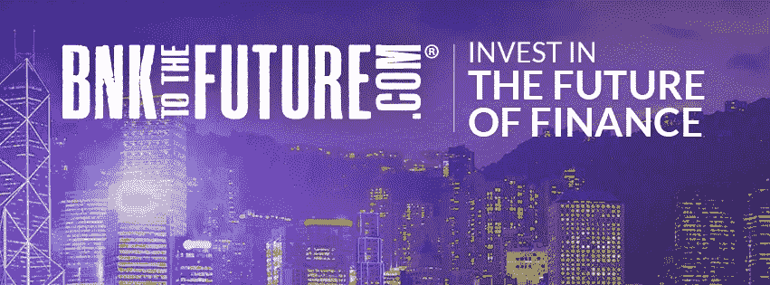
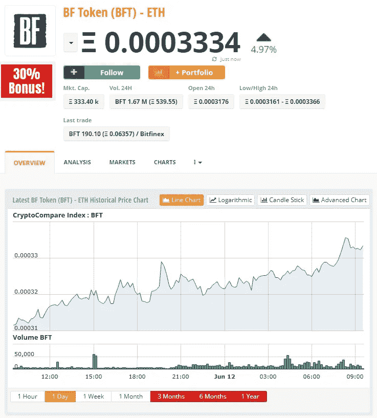
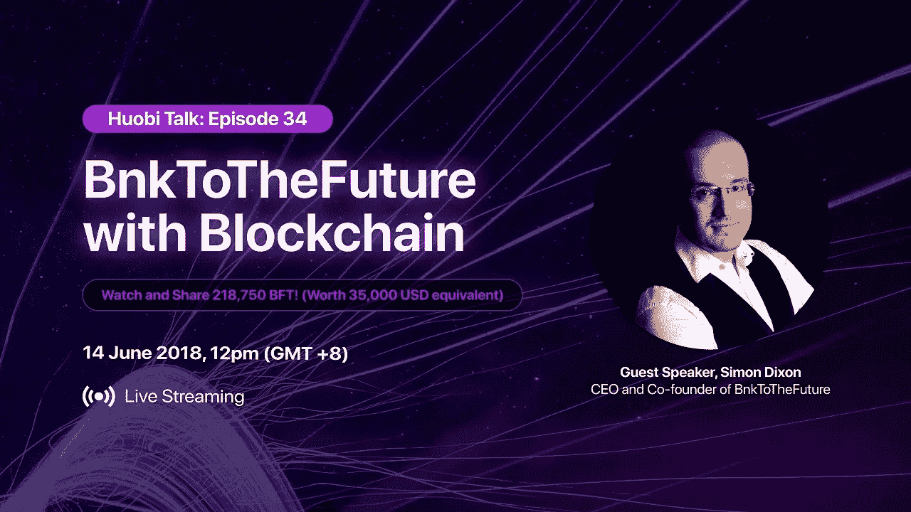
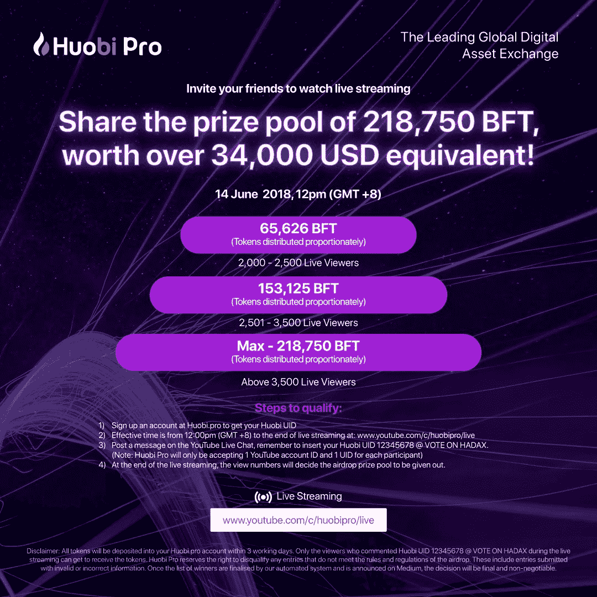

# BnkToTheFuture 和 Huobi Pro:塑造金融格局

> 原文：<https://medium.datadriveninvestor.com/bnktothefuture-and-huobi-pro-shaping-the-financial-landscape-c15618daa677?source=collection_archive---------2----------------------->

B[*nKToTheFuture*](https://bnktothefuture.com/)是一个在线投资平台，拥有超过 60，000 名专业投资者，他们与[*bnkttothefuture*](https://bnktothefuture.com/)一起投资于金融科技、金融创新、比特币和区块链公司。[*bnktothefourt*](https://bnktothefuture.com/)运行在火币 pro 交易所列出的 BF 令牌上。 [*BF Token*](https://www.youtube.com/channel/UCABkgL5rRAk61E2Qtjtqcxw) 自上市以来，在 [*火币 Pro* 中已经有了一些令人满意的表现。](https://www.huobi.br.com/en-us/topic/invited/?invite_code=da523)在整个交易期间，人民币兑美元汇率一直保持在 0.16 左右。在过去 24 小时内交易的 179 万美元中，约有价值 52.4 万美元的 BF 代币在 [*Huobi Pro*](https://www.huobi.br.com/en-us/topic/invited/?invite_code=da523) 平台上交易。这大约是 BF 代币交易量的 29%。自从 BFT 的 ICO 以来，价格出现了抛物线式的飙升，导致价格在 2018 年 5 月上涨了 100%以上，超过 0.35 美元。这一重大成功不仅展示了 [*BFT 令牌*](https://bnktothefuture.com/) 的可喜迹象，更是 [*霍比亲的*](https://www.huobi.br.com/en-us/topic/invited/?invite_code=da523) 交易所的实力，在为让 [*BFT 令牌*](https://bnktothefuture.com/) 蓬勃发展提供坚实的基础。

# 支持创业公司的成长🏢

B[*nKToTheFuture*](https://bnktothefuture.com/)*在历史上来的正是时候。金融领域和科技行业的创新几乎每天都在出现。这些初创公司中的一些拥有改变行业的想法，这些想法在未来可能会有利可图。大多数时候，这些初创公司通常没有足够的资金来创建他们的平台，以提供他们所设想的服务。*

*✅BnKToTheFuture 发现了需要资金的潜在创业公司或公司，并通过他们的平台为他们提供支持。超过 4 . 4 亿英镑已经通过 BnKToTheFuture 平台投入€，投资者投资的一些公司正在向投资者支付股息。BnkToTheFuture 帮助实现其目标的一些成功公司的两个例子是 Bitpesa 和 Factom，它们在自己的影响范围内使世界变得更美好。*

*✅Bitpesa 有一个创新的想法，通过将比特币转换成非洲本地货币，将非洲与区块链社区连接起来。可以说，非洲是世界上发展最快的大陆，这将有助于它与科技和金融的新发展接轨。bnktotherfuture 看到了 Bitpesa 的潜力，并通过 bnktotherfuture 的专业投资者帮助他们为自己的平台筹集资金。据 bnktothefourt 网站称，bnktothefourt 能够为€筹集 212 万英镑，这是 Bitpesa 的目标。Bitpesa 现在经营着一家资金转移和交换公司，允许在一个安全的平台上以更低的价格向世界任何地方转移资金。*

*它创造了巨大的✅The 机会，在非洲不同地区拥有 60 多名员工和办事处。Factom 希望建立一个平台，让世界变得更加透明。世界上有如此多的模糊之处，因此 Factom 的想法一定引起了 BnKToTheFuture 平台社区成员的共鸣。Factom 获得了该平台 300 名专业投资者的投资，他们筹集了 678.5 万€，帮助创建了一个平台，为有价值的文件提供分散存储，以执行更快的审计，并防止存储的文件丢失。平台是安全的，存储的文档是安全的。*

# *未来会发生什么🌟*

*nkToTheFuture 正计划发展和改进它所提供的服务。根据他们的路线图:*

*➤BnkToTheFuture 将开放他们的二级市场。*

*➤This 被列为他们第三季度早期的计划之一。*

*公司还计划在➤A 增设 10 个令牌化证券市场，如果主要因素允许开放的话。*

*2019 年，BnKToTheFuture 计划进行一年的战略投资，投资于各种有前途的区块链平台，这些平台将鼓励区块链技术和全球金融科技的发展。*

*2019 年以后，去中心化是 BnKToTheFuture 的主要目标。BnKToTheFuture 的目标是打破传统金融的现状，推动去中心化时代的到来。bnktotherfuture 预计将来会有关于此类创新金融平台的法规，但是，bnktotherfuture 将继续提供支持，以便在这些法规出台时，分散式系统会在更大程度上扰乱传统金融市场。*

# *霍比说话了🎥*

*H [*uobi Pro*](https://www.huobi.br.com/en-us/topic/invited/?invite_code=da523) 以其行业领先的计划而闻名，例如支持协议迁移以及其他服务。加密货币交易市场竞争激烈，脱颖而出需要不断创新、创造性的内容创作，最重要的是高效地提供基本服务。这些都是霍比遇到的。它已经在他们的 [*YouTube*](https://www.youtube.com/channel/UCABkgL5rRAk61E2Qtjtqcxw) 频道上主持了一系列被称为 [*Huobi Talk*](https://www.youtube.com/channel/UCABkgL5rRAk61E2Qtjtqcxw) 的每周互动会议，与他们在世界各地的客户和粉丝进行交流。在他们最新的 [*Huobi Talk*](https://www.youtube.com/channel/UCABkgL5rRAk61E2Qtjtqcxw) 环节中，bnktothefourt 的首席执行官 Simon Dixon 将发表他对传统银行业与区块链的比较以及比特币和 bnktothefourt 平台的看法。*

**

*未来会有更多的创业公司出现。只要创造力还在，利基市场就会被发现，服务或产品就会被提供。火币在他们的平台上列出 BF token 是一个正确的选择。它的潜力很大，尤其是在未来。BnKToTheFuture 的首席执行官 Simon Dixon 将于 6 月 15 日在*进行现场直播。**

# **霍比空投🍬**

**火币每周都会进行一次空投计划，以奖励其最忠实的用户。要想参与，您只需:**

**➤Sign 高达 [*霍比亲*](https://www.huobi.br.com/en-us/topic/invited/?invite_code=da523) *。***

**➤Make 一定要订阅 [*霍比脱口秀*](https://www.youtube.com/channel/UCABkgL5rRAk61E2Qtjtqcxw) 并在 6 月 14 日星期四下午 12 点(GMT +8)与西蒙·迪克森一起观看节目。**

**➤The 的幸运获奖者将通过 [*火币 Pro 的*](https://www.huobi.br.com/en-us/topic/invited/?invite_code=da523) [**中的**](https://medium.com/@huobipro) 和 [**推特**](https://twitter.com/Huobi_Pro) 频道以及下周的 [*节目*](https://www.youtube.com/channel/UCABkgL5rRAk61E2Qtjtqcxw) 公布。**

****

**如果你觉得这篇文章有用，并且想看我的其他作品，请一定要关注我的 medium！😎**

****