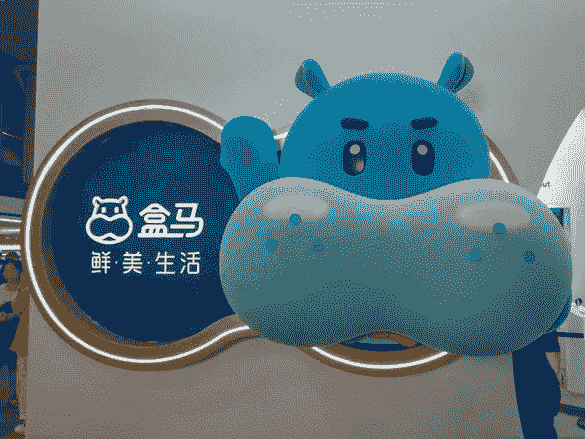
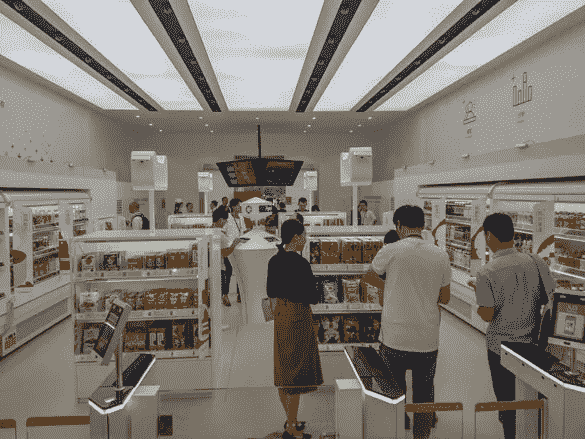
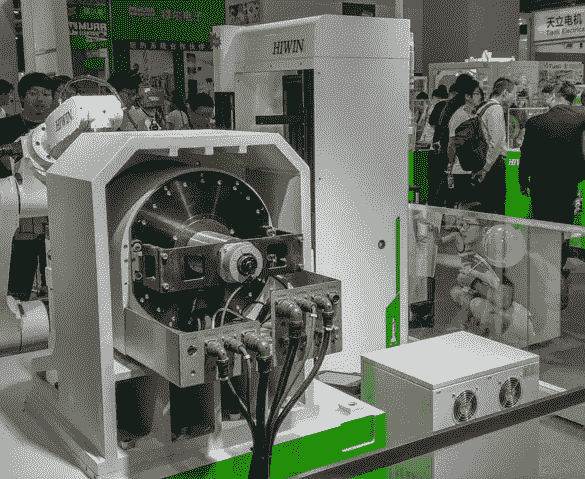

# 登上上海到杭州的 AI 列车

> 原文：<https://medium.datadriveninvestor.com/boarding-the-ai-train-from-shanghai-to-hangzhou-93ade0d9f2ae?source=collection_archive---------34----------------------->

在上海和杭州参加了一周紧张的中国国际工业博览会(China International Industry Fair)和在杭州举办的“赋能数字中国”(Empower Digital China)活动后，我很高兴能及时回到台北过中秋节。

在这两个事件中，就浮华和魅力而言，Empower Digital China 无疑是赢家。这让我想起了巅峰时期的英特尔信息技术峰会——不过是指数级的。虽然技术当然是此次活动的一个关键话题，但更重要的信息是，云、物联网和人工智能已经为大时代做好了准备。如果你还没有上火车，你最好现在就上，否则你会被独自留在车站。

给我印象最深的是阿里巴巴建立的强大生态系统，以及该公司在让传统企业轻松采用云、物联网和人工智能流程和应用程序进行运营方面表现出的强大领导力。这已经导致了马云所说的新零售的巨大增长。我确信该公司在新的生产计划中也会取得同样的成功。

最初，阿里巴巴的云、物联网和人工智能计划的重点是在中国，但用不了多久，它们就会开始在海外大规模铺开。例如，新兴市场的零售商将能够跃进到自动化商店，而不必经历将新技术和应用集成到复杂的现有遗留 IT 系统的复杂而昂贵的过程。他们还将能够利用区块链技术来改善供应链管理，并确保产品符合严格的安全标准。

英特尔通过英特尔信息技术峰会为整个电脑行业提供了强大的智力领导力。阿里巴巴通过 Empower Digital China 将这一点提升到了一个新的水平——向各种规模和类型的企业展示云、物联网和人工智能为他们带来的新机遇。

正如我在启程前提到的，中国国际工业博览会的气氛更像 CeBIT，带回了汉诺威被压抑已久的灰暗天空的记忆。尽管如此，在机器人手臂和重工业机械设备的展品中仍然充满了活力和热情。工业 4.0 列车也正整装待发，中国的传统工业基地实实在在地登上了列车。

就像那首老歌说的，你还什么都没看到。

原发布于:[https://brownbeat . net/2018/09/登上艾沪杭火车/](https://brownbeat.net/2018/09/boarding-the-ai-train-from-shanghai-to-hangzhou/)