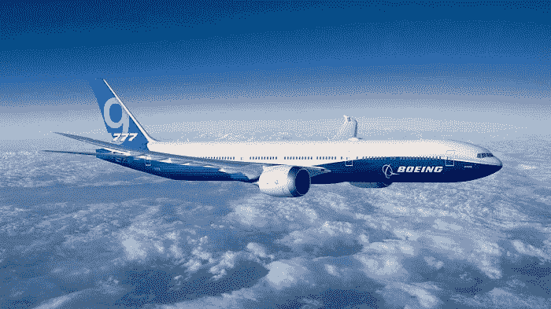
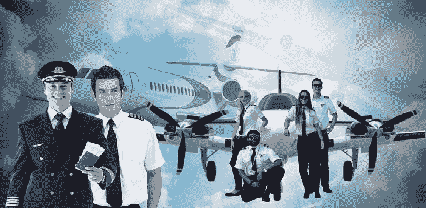

# 波音公司带来了 737 MAX 特许经营权的软件修复

> 原文：<https://medium.datadriveninvestor.com/boeing-brings-it-with-software-fix-of-the-737-max-franchise-c0765baf3a98?source=collection_archive---------23----------------------->

## 航空获得重大技术升级。

对于那些打算载着一群人在高空飞行的车辆来说，这应该是显而易见的。想想吧。这是技术真正应该在卓越、安全、效率等发展中发挥巨大作用的地方，但事实是波音公司在美国监管方面有许多困难要克服。

# 问题是波音自动飞行控制系统

谁知道人们会对*那辆*有点怀疑呢？会自己飞的飞机？谁需要飞行员？毕竟，每个人都为[自动驾驶车辆](https://vigyaa.com/@pierre/boeing-brings-it-with-software-fix-of-the-737-max-franchise-4d63b7ae/#)、[机器学习和自动化](https://vigyaa.com/@pierre/making-technology-a-natural-part-of-humanity-the-advent-of-nlg-04989361/) — [智慧城市](https://vigyaa.com/@pierre/beware-as-the-city-you-live-in-might-get-smarter-than-you-c7d8fe7b/)和[自系带运动鞋](https://vigyaa.com/@pierre/thats-one-small-step-for-man-one-giant-leap-for-smart-sneakers-c138565f/)而疯狂。但是*位面*？为什么人们对此持怀疑态度？？

 [## 危机管理乘“飞机”飞行——真相数据驱动的投资者

### 当埃塞俄比亚航空公司的一架 737 Max 飞机起飞后不久坠毁，整个国家陷入危机。最好的…

www.datadriveninvestor.com](https://www.datadriveninvestor.com/2019/03/26/crisis-management-flies-on-plane-truth/) 

天空中有一架飞机。燃烧。压力。危险。有人看**阿波罗 13 号**吗？当然，那是在太空中。但是不管怎样，人们花钱乘坐飞机，如果一个设计用来自动飞行的系统出了问题，亲爱的，我们就有麻烦了。

因此，自然会有一些困难需要克服。但总而言之，[这使得航空业成为技术进步的温床](https://vigyaa.com/@pierre/3-stories-on-the-aviation-industry-that-put-the-technology-sector-863507f4/)，而且飞行员将有相当轻松的工作来驾驶这些吸盘进出云层，以及着陆。

当然，在过去的五个月里，波音公司受到了严格的审查——因为两起致命的坠机事件。毫无疑问，华盛顿立法者想知道发生了什么，因为这些崩溃可能是由相同的自动化系统引起的。

目前，FAA(联邦航空工业)还没有批准防失速升级和其他软件修复。但是，如果波音公司继续推动它，他们会得到他们想要的。问题是:*我们*准备好登上*可能*带我们飞向一座怪山的飞机了吗？

# 这里我们有另一个故事，关于技术如何在安全中发挥重要作用

更重要的是，记住这个重要的事实:**我们的飞行员很重要**。他们不仅需要监控这些系统，还需要在必要时接管这些系统。机器自动化只能做到这一步，剩下的就要靠我们自己了。你同意吗？

额外的计算机培训:我们的飞行员不仅需要知道如何操作飞机，还需要知道如何使用复杂的计算机系统——几乎与排除故障的经验一样。考虑到他们将在数千英里的空中，计算机系统可能会随机崩溃，而他们又不能打电话给服务台并提交“罚单”，这一点就更加重要了。

# 谢天谢地，波音公司将让他们的 737(还在增加)飞行员接受计算机技术培训

再加上一些重大的修改、调整和新的最佳实践——长话短说，我们有一个从零开始发展的整个行业，这是有充分理由的。这是为了确保我们再也不会发生类似的严重事故。那是因为飞行员喝醉了或者困了而随机坠毁的日子。现在撞车事故的发生是因为技术有缺陷。

有人想去飞行吗？我还是会飞。大量的安全措施到位。我相信科技。你知道吗？ [**注册一个 VIGYAA 账户，成为一名有自己见解的技术影响者**](https://vigyaa.com/accounts/login/) ，一定要 [**查看《数据驱动投资者》了解更多见解**](http://datadriveninvestor.com) ！