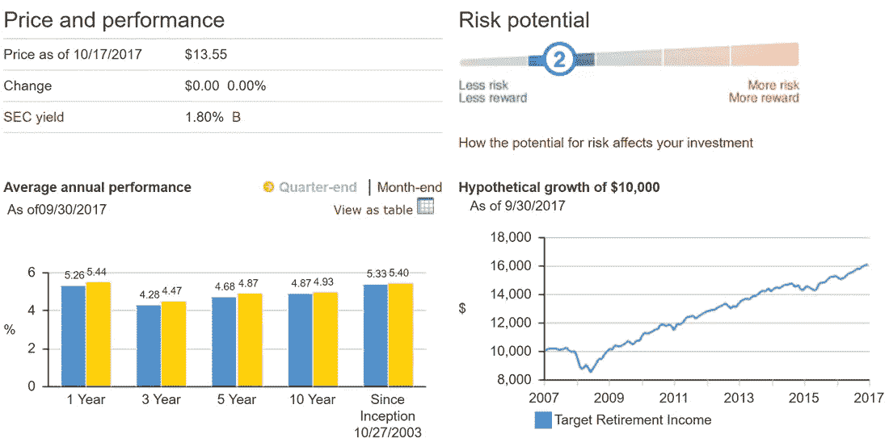
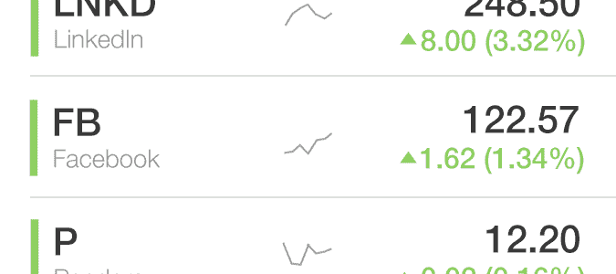
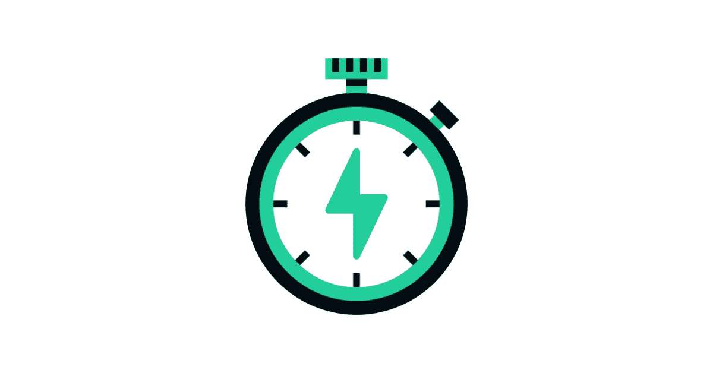

# Vanguard vs Robinhood，你的储蓄投资在哪里

> 原文：<https://medium.datadriveninvestor.com/bogles-legacy-and-robinhood-living-in-harmony-bc297baa3323?source=collection_archive---------1----------------------->

随着杰克·博格尔(Jack Bogle)最近去世，他创立的指数基金(index fund)被媒体大肆报道。然而，在过去的几年里，年轻的投资者忽略了他的投资风格，因为零成本交易应用程序的兴起掠夺了我们的游戏文化。Bogle 认为，所有人都应该通过投资股票指数基金来获得低费用和低风险的股票投资，这些基金跟踪市场而不是挑选个股。投资者慢慢接受了 Bogle 的说教，导致付钱给经纪人管理投资组合或自己选股的人数下降。我全心全意地相信博格尔是 100%正确的，所以我为什么不接受他的建议呢？

博格尔的指数基金直到上世纪 90 年代才开始获得关注，但自那以后，指数基金中的股票份额每十年翻一番以上。但最近，像 Robinhood、Webull、M1 金融、You Invest 等允许投资者免费买卖个股的“免费”交易网站一直在扩大市场份额。与 E-Trade、Merrill Edge 和其他传统交易公司相比，这似乎是一笔大买卖，这些公司向投资者收取每组股票 6-10 美元的费用。虽然免费股票交易看起来很不错，但这些新的“免费”交易网站违背了 Bogle 的最佳建议和他民主化投资的目标。

 [## 更好的预算，打造更大的|数据驱动型投资者

### 即使是专家也承认它们并不完美。从 1 到 10 的范围内，安东尼·科普曼和德尔…

www.datadriveninvestor.com](https://www.datadriveninvestor.com/2018/11/08/budget-better-to-build-bigger/) 

完全公开，我有先锋，美林边缘和罗宾汉的账户。我十几岁时在 Merrill Edge 开设了我的第一个投资账户，账户上只有不到 1000 美元，买了 5 只不同的股票，每次交易收取 7 美元。我花的 35 美元占了我账户余额的近 3.5%，我不得不再花 35 美元卖出股票，但并不是所有股票都增值了。Bogle 的公司 Vanguard 允许投资者购买指数基金，但购买大多数基金需要最低投资。直到我 25 岁左右，我才有足够的积蓄购买了一只先锋基金，又过了几年，我才把它转换成一只费用较低的先锋海军上将基金。

然而，在前进的道路上，我对先锋的简单感到厌倦。Vanguard 的整个演示非常简单，显示投资价值的图表很无聊，而且不经常更新，它们没有滚动的数字和闪烁的灯光来告诉我最新的股票市场价格和新闻。Bogle 宣扬你应该把你的钱放在指数基金里，直到你需要的时候才看，Vanguard 的网站上没有任何东西鼓励频繁访问。这可能是几年前我开始向罗宾汉投资的原因。

Robinhood 应用程序和 now 网站远比平淡无奇的 Vanguard 更令人兴奋。该公司显示每天价格波动最大的股票，让你购买加密货币，并有你拥有或添加到你的“观察名单”中的所有股票的新闻。Robinhood 甚至试图让你忽悠你的朋友开一个账户，如果你和你的朋友用你的推荐代码注册(我也有错)，就给他们免费的股票。

这些额外待遇吸引了我，鼓励我在账户上留一点钱，这样当我听到我认为可能上涨的股票时，我就可以赶紧购买。我有过一些成功(主要是 Crocs 的股票)和一些大的失败(购买通用电气)。我主要买一支股票的一两只股票，这使我避免了巨大的损失，也避免了巨大的收益。我已经开始把我对罗宾汉的访问等同于一场游戏。我甚至把它称为我的移动赌博应用程序，实际上我认为这是看待罗宾汉最恰当的方式。

如前所述，我有一个指数基金的 Vanguard 账户，我把它设置为在我拿到工资的当天自动投资。此外，我偶尔会让自己存 20-50 美元到我的 Robinhood 账户，以购买我一直关注的股票。先锋公司没有的各方面都令人兴奋。这也限制了我对我的 Vanguard 账户的关注。我几乎从不登录，我只是让它坐在那里做杰克·博格尔说我们应该做的投资。

我认为罗宾汉正试图吸引像我一样的投资者，他们想要一点股票交易的刺激，但仍将大部分资金投资于指数基金。这些数据证实了我的理论，因为 Robinhood 上的大多数交易者购买低于 50 美元的股票，平均而言，他们的账户上只有价值几千美元的股票。

对我来说，关闭我的 Robinhood 账户，将所有资金投入 Vanguard 是否更好？是的，但我认为这是两种不同的钱。我认为罗宾汉是我放在银行账户里的钱，最终会花在别的东西上。通过把钱投到罗宾汉身上，我获得了玩游戏的乐趣，满怀希望地挑选价格即将上涨的股票，并为未来的购买进行投资/储蓄。

我认为罗宾汉的好处类似于存一小笔钱去做有趣的事情，比如给自己一笔赌场、彩票、电子游戏或酒吧的零用钱。这样做很好，只要你不把它当成你的主要储蓄工具。指数基金无疑更适合这一目的。此外，我不一定支持先锋。选择一只指数基金，无论是通过富达、先锋还是其他收费最低的公司，然后不要碰它，直到你需要它，把罗宾汉或它的一个竞争对手当作你的游资。

See, I got you to read to the bottom of the story with some flashing colors.