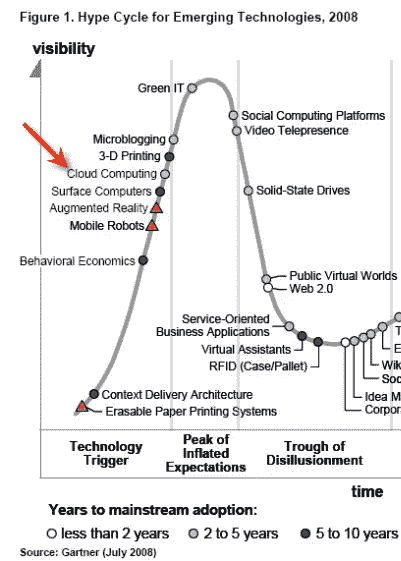
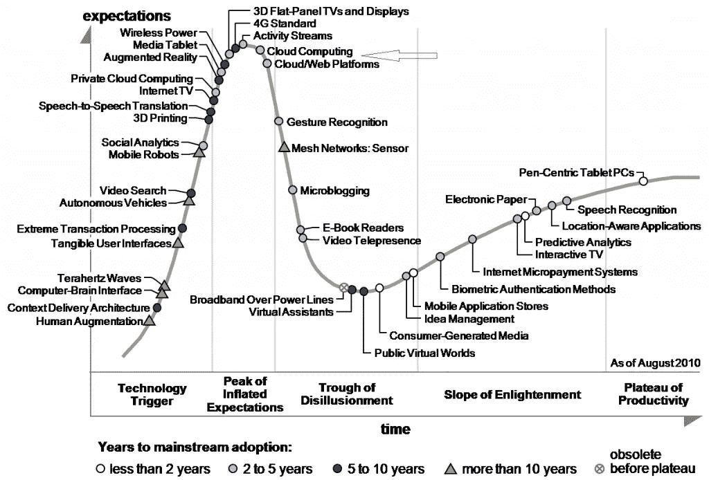
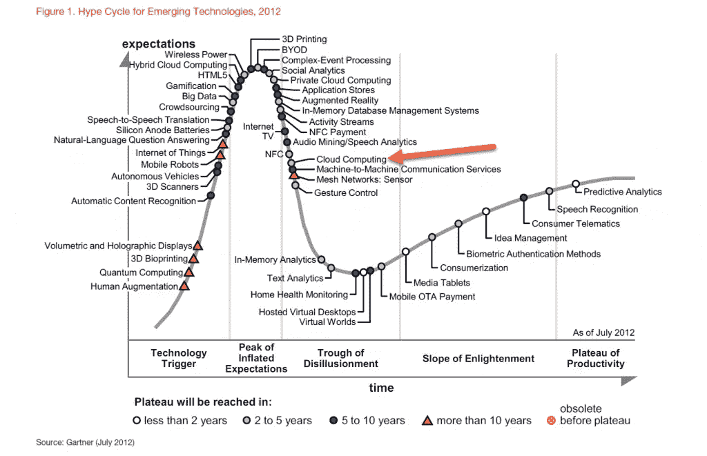
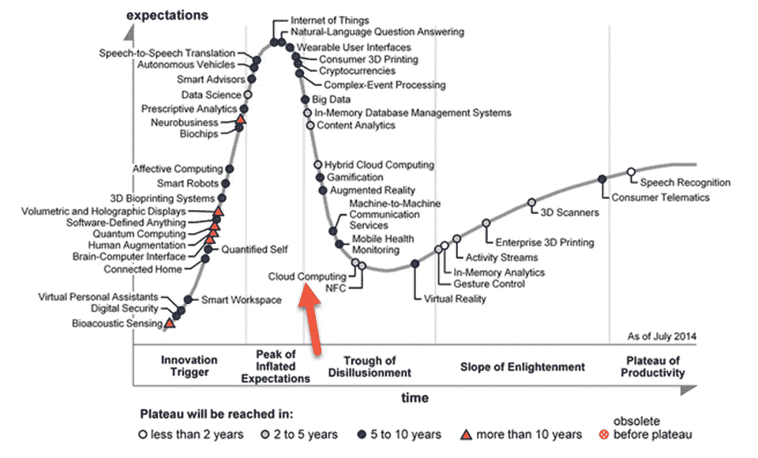
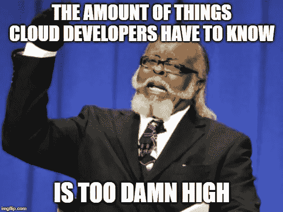

# 借助云计算推动您的职业发展

> 原文：<https://medium.datadriveninvestor.com/boost-your-career-with-cloud-computing-da2879f2216d?source=collection_archive---------8----------------------->

# 能谈谈自己吗？

几周前，我有幸在一个我不熟悉的场合发言。通常，我会谈论一些专业话题——软件架构、云计算等。，但这一次不同了。这次我被要求谈谈我自己。我的一个好朋友告诉我，他正在组织一个关于开发人员和 IT 专业人员如何通过更多地参与云计算来发展职业生涯的活动。他问我能否谈谈为什么理解云很重要，以及我个人是如何进入这个领域的。虽然我通常不是一个喜欢谈论自己的人，但我相信原因是至关重要的——让更多的开发人员和 IT 专业人员熟悉云。云是推动整个行业向前发展的现代平台，有能力改变一个人的职业生涯。所以…

# 什么是云？

## 别人的大机器

基本上，云可以被看作是别人的大机器。您只需输入信用卡号，就能获得大量的计算、存储和网络能力，而无需亲自管理构建和维护数据中心的复杂细节。然而，这是一个相当简化的观点；对于那些寻求利用云计算的人来说，云计算提供的不仅仅是简单的虚拟机。无服务器计算、数据库即服务(DaaS)、机器学习即服务等服务迅速改变了我们构建系统的方式。这些服务一方面使流程变得更加简单快捷，但另一方面也变得更加复杂，随着新服务的推出，复杂性与日俱增。这让我想到了下一个类比…

 [## 信息图:云之旅|数据驱动的投资者

### 聪明的企业领导者了解利用云的价值。随着数据存储需求的增长，他们已经…

www.datadriveninvestor.com](https://www.datadriveninvestor.com/2018/09/22/infographic-journey-to-the-clouds/) 

## 云像一大堆乐高积木

Photo by [Francis Ray](https://pixabay.com/users/painter06-3732158/)

我喜欢把云看作一堆乐高积木；每块砖都有自己的形状和颜色，你可以用各种方式将它们连接起来，创造出新的作品。这是软件架构师的工作，我发现这是我工作中最愉快的方面之一。例如，假设您想要构建一个“标准”web 应用程序，它由一个现代 SPA 前端、一个后端 API 和一个关系数据库组成。在现代云出现之前，您必须考虑如何托管应用程序、如何扩展应用程序、如何支持灾难恢复(DR)、如何更新主机操作系统等..

有了云，您可以专注于自己的应用程序代码，并使用适当的砖块来处理其他问题。在我们的例子中，我们可以为 SPA 使用 BLOB 存储，为 API 使用无服务器平台，为 DB 使用 DaaS。这些服务都为扩展、灾难恢复和基础架构维护提供了固有的解决方案，因此您不必自己想出解决方案。但是，你需要记住，这些服务有它们自己的担忧和我们需要处理的问题——但是谁说构建乐高艺术是一件容易的事情。😉

# 为什么云是一件大事？

## 速度

当我向开发人员和 IT 专业人员教授云计算时，我经常会问他们以下问题——“在你们公司，从需要计算资源到最终得到它需要多长时间？”。这个问题我得到的答案五花八门。有些报价时间长达一天。其他人提到几天。然而，一些参与者总是引用几个月范围内的答案。**月**！想象一下您自己处于一个需要几天到几个月才能获得所需计算资源的环境中？在不使用云的公司，情况往往就是这样。这反过来又会导致生产力的降低和开发人员整体幸福感的降低。

Photo by [Stain_Marylight](https://pixabay.com/users/stain_marylight-1253514/)

进入云端。在云中，对计算资源的需求会在几分钟内转化为实际的计算资源。不是几个月，不是几天，而是点击一个按钮或脚本执行的**分钟**。世界将不再是原来的样子…

## 规模

为全球数百万用户提供应用程序不是一件容易的事情；无论是从软件的角度还是从基础设施的角度。除非您的业务是建立数据中心，否则管理和维护大型数据中心可能不是您或您公司的专长。

Photo by [Peter H](https://pixabay.com/users/tama66-1032521/)

使用云，只需(再次)点击一个按钮，就可以实现高规模。当我说“规模”时，我指的是计算能力和地理范围。当然，在软件层面上，扩展应用程序以覆盖多个地理位置和数百万用户仍然很复杂。但至少有了云，你可以专注于自己的业务，而不是运行它的基础设施，这对任何企业来说都是一个动力倍增器。

## 经济学

Photo by [Gerd Altmann](https://pixabay.com/users/geralt-9301/)

云计算通常比维护自己的数据中心更便宜，因为公共云供应商利用了规模经济。然而，实践者有时会计算并发现云增加了他们的费用。虽然这可能是非常特殊的情况，但它通常包含一些疏忽。

**比较苹果和橘子**

当比较云的成本和维护数据中心的成本时，您需要确保比较可比较的东西。云计算成本考虑了两个重要因素。一个因素是事实上大多数云服务提供一个[服务水平协议](https://en.wikipedia.org/wiki/Service-level_agreement) (SLA)来保证可用性和/或持久性。在内部维护类似的 99.9%、99.99%甚至 99.999%可用性 SLA 并不是一件容易的事情，而且需要花费大量资金。大多数生产应用程序都需要 SLA。

另一个因素是维护成本。管理和维护内部数据中心需要大量 IT 人员，而云服务的成本是服务内部成本的两倍。的确，在利用云时，您仍然需要 It 专业人员，但是在这样的场景中，他们的任务有很大的不同，并且当并排比较这两种场景时，您通常需要较少的 IT 专业人员。

**汽车规模经济**

云经济的另一个(积极的)问题是自动规模经济。规划内部数据中心时，您通常需要规划容量，以满足最高的性能要求。但是，由于大多数工作负载都是季节性的，因此始终为全部容量付费是没有意义的。这种季节性的例子是白天与夜间以及工作日与周末，在这种情况下，根本没有理由一直为所有计算资源付费。

这是云真正闪耀的地方——在高峰期扩展您的计算资源，在低谷期缩减。最棒的是，只为您使用的东西付费。根据我的经验，根据您的具体工作负载，利用这种策略可以减少多达 60%的计算成本。

# 从我的角度看云的历史

## 2008 年—云开始崛起

2008 年，我是一家政府机构的软件架构师，在那里，公共云或私有云选项几乎闻所未闻。我当时的大多数生产系统都运行在物理机器上，虚拟机并不被认为是生产的真正选择。我仍然记得 IT 人员打电话给我说“服务器崩溃”的时候，意思是服务器从机架上物理崩溃…🤣

世界上的情况没有太大的不同。AWS 是两年前推出的，Azure 是年底宣布的。云似乎仍然非常遥远，这可以从以下 Gartner 对 2008 年新兴技术的炒作周期中看出。

Gartner Hype Cycle For Emerging Technologies 2008 ([Source](http://insightextractor.com/2012/03/18/gartners-hype-cycle-for-cloud-computing-2008-2011/))

## 2010 年——大肆宣传的高峰期

2010 年，我与人共同创立了 [CodeValue](https://codevalue.net/) ，这是一家专业的软件服务公司。云计算被谈论了很多，但是真正的客户几乎不想听到它。

Gartner Hype Cycle For Emerging Technologies 2010 ([Source](http://insightextractor.com/2012/03/18/gartners-hype-cycle-for-cloud-computing-2008-2011/))

在那个阶段，只有年轻的初创公司同意考虑云，而云(咨询)业务在当时还相当小。

## 2012 年——云会一直存在吗？

2012 年，大客户仍然不想听到关于云的消息。成熟度和安全性仍然是一个大问题，而虚拟机和本地服务器已经很好理解了。像所有新兴技术一样，云计算的宣传减少了，被谈论的也少了。当然，它在 IT/Dev 会议上仍然是创新的，但除此之外，我们仍然不知道它是否会流行。

Gartner Hype Cycle For Emerging Technologies 2012 ([Source](https://www.secureidnews.com/news-item/gartner-highlights-nfc-in-2012-hype-cycle-2/))

## 2014 —云的转折点

对我个人来说，2014 年是云的一个重大转折点。对于许多客户来说，云突然变得成熟了。从这个时间点开始，越来越多的用例被发现适合云。客户更乐于听到关于云的消息，云的传播与日俱增。

Gartner Hype Cycle For Emerging Technologies 2014 ([Source](https://www.forbes.com/sites/gartnergroup/2014/09/17/digital-business-technologies-dominate-gartner-2014-emerging-technologies-hype-cycle/#6d15bbbdfbb9))

## 2019 —默认为云

如今，当与客户接洽新项目时，云是默认选择。除非他们有特定的理由(比如监管)在本地运行系统，否则没有人会考虑在本地运行系统，并且它的优点被广泛接受。

这是一场真正的革命，这也是我认为每个 IT 专业人士和开发人员都应该掌握云的主要原因。

# 为什么云很难学？

所有的云平台都在以非常高的速度前进。每个专业人员需要了解的技术和服务的数量是巨大的。我曾经确信使用特定的云服务是不可能的，但在上周它实际上增加了对该场景的支持后，我才发现我的错误。

# 我的 2 美分

在云时代保持领先需要激情和奉献。我对那些想进入云领域并促进其职业发展的人的建议是从小处着手，一步一步地进步。不要被各种供应商提供的服务搞得不知所措。选择一些让你兴奋的事情，并以此为起点。使用该服务构建一个真实的项目。从我的经验来看，学习最好通过实践来完成。

另外，根据个人学习风格选择学习配件。无论你喜欢阅读书籍或博客帖子，观看在线课程或在各种在线社区提问，找到一两件能促进你的事情并采取行动，这样你就不会落后。

# 滑动甲板

我演讲的幻灯片可以在下面找到。尽情享受吧！

*原载于 2019 年 7 月 8 日*[*https://stiller . blog*](https://stiller.blog/2019/07/boost-your-career-with-cloud-computing/)*。*