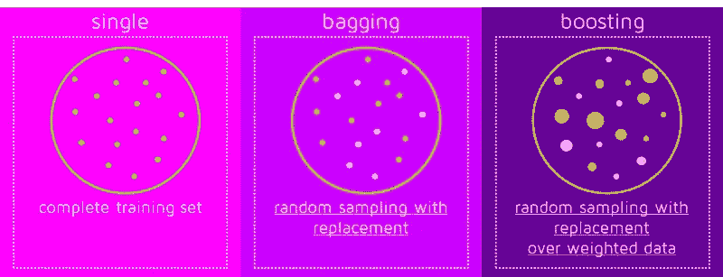
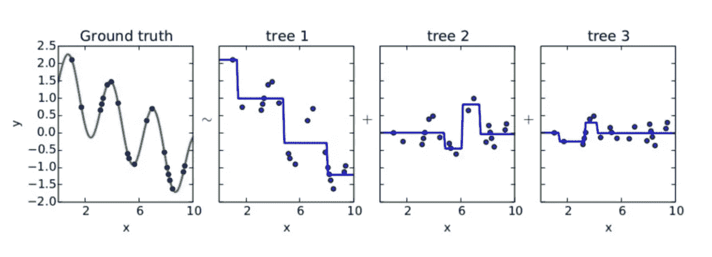
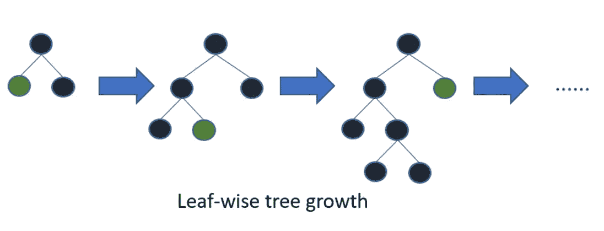
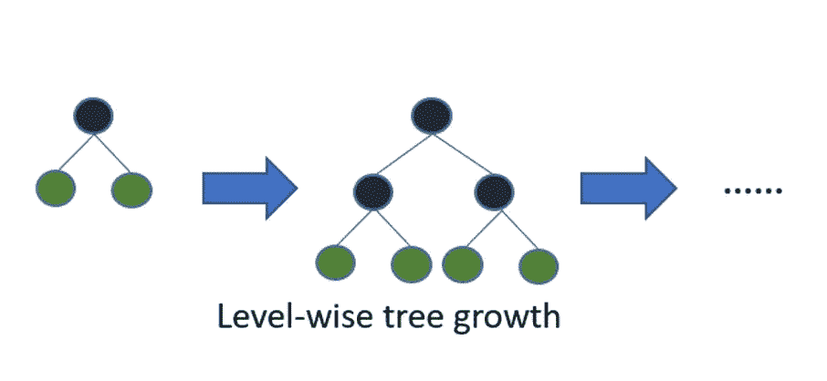

# 增强分类器的非常基本的解释

> 原文：<https://medium.datadriveninvestor.com/boosting-classifiers-e7638c41736a?source=collection_archive---------4----------------------->


Photo by [Franki Chamaki](https://unsplash.com/@franki?utm_source=medium&utm_medium=referral) on [Unsplash](https://unsplash.com?utm_source=medium&utm_medium=referral)

# **什么是助推？**

Boosting 是一种通用集成方法，通过将弱学习器转换为强学习器来改进模型预测。升压步骤:

1.  训练一个弱学习者。
2.  找出学习能力差的学生犯了哪些错误。
3.  建立另一个弱学习者，关注前一个学习者出错的地方。
4.  重复直到满足停止条件(例如，一定数量的弱学习者，模型的性能不再提高)。



Photo on [QuantDare](https://quantdare.com/what-is-the-difference-between-bagging-and-boosting/)

# 增压的类型

## 自适应增强

在 Adaboost 中，发明的第一个 Boosting 算法通过不断影响采样数据的分布来创建新的分类器，以训练下一个学习器。AdaBoosting 的步骤:

1.  袋子随机取样并替换，然后给每个数据点分配重量。
2.  当一个例子被正确分类时，它的权重会降低。当学习者做错一个例子时，权重就会增加。重量决定了该物品是否将用于训练下一个学习者。


```
# import package
from sklearn.ensemble import AdaBoostClassifierada = AdaBoostClassifier()
ada.fit(X, y)
```

Python Scikit 的参数-学习:

> **base_estimator** : object(默认= decision tree classifier(max _ depth = 1))
> 
> 构建增强系综的基本估计量。
> 
> **n_estimators** :整数(默认=50)
> 
> 增强终止时估计器的最大数量。在完美匹配的情况下，学习过程会提前停止。
> 
> **learning_rate** : float(默认值=1)
> 
> 学习率通过分配的数字缩小每个分类器的贡献。
> 
> **random_state** :整数(默认=无)

## 梯度增强

梯度增强是一种更高级的增强算法，它使用梯度下降的概念来最小化预测的误差。它根据错误最大的例子(模型出错的地方)创建下一个学习者。

梯度推进的步骤:

1.  从对数据集进行预测的弱学习者开始。
2.  找出正确和错误的例子。
3.  计算每个数据点的残差以确定每个预测的偏差程度，然后合并残差以计算总损失。
4.  使用梯度和损失作为预测值来训练下一棵树！



Photo on [Quora](https://www.quora.com/How-would-you-explain-gradient-boosting-machine-learning-technique-in-no-more-than-300-words-to-non-science-major-college-students)

绿色曲线是我们想要逼近的函数。首先将第一个模型(树 1)与目标相匹配。下一个模型(树 2)拟合第一阶段的残差；等等。最终模型是所有单个模型预测的总和。

```
# import package
from sklearn.ensemble import GradientBoostingClassifiergb = GradientBoostingClassifier()
gb.fit(X, y)
```

Python Scikit 的参数-学习:

> **learning_rate** : float(默认值=0.1)
> 
> **n_estimators** :整数(默认值=100)
> 
> 较大的数量通常会带来更好的性能。
> 
> **子样本**:浮点型(默认值=1.0)
> 
> 用于拟合单个学习者的样本分数。如果小于 1.0，方差会减少，而偏差会增加(欠拟合)。
> 
> **random_state** :整数(默认=无)

## XGBoost(极端梯度增强)

XGBoost 是梯度增强的实现，旨在提高计算速度和模型性能。XGBoost 在训练过程中跨计算机的所有 CPU 内核并行构建树。它将训练分布在一组计算机上，从而加快了计算速度。它还会自动处理丢失的值！

```
# install XGBoost
pip install xgboost# import package
import xgboost as xgbxg = xgb.XGBClassifier()
xg.fit(X, y)
```

Python Scikit 的参数-学习:

> **learning_rate** : float(默认值=1)
> 
> 最佳值介于 0.01 和 0.2 之间，包括 0.01 和 0.2。控制过度拟合。
> 
> **最大深度**:整数(默认=6)
> 
> 控制过度拟合。
> 
> **最小孩子体重**:整数(默认=1)
> 
> 类似于 min_child_leaf。控制过度拟合。
> 
> **colsample_bytree** : float(默认值=1)
> 
> 每棵树使用的特征百分比。控制速度。高值会导致过度拟合。
> 
> **子样本**:浮点型(默认=1)
> 
> 训练实例的子样本比率。控制速度。
> 
> **n_estimators** :整数(默认值=100)
> 
> 决策树的最大数量；高值会导致过度拟合。控制速度。
> 
> **random_state** :整数(默认=无)

## 光梯度推进机

[LightGBM](https://lightgbm.readthedocs.io/en/latest/) 是微软的一个梯度推进框架，使用基于树的学习算法。它像其他树算法一样垂直(逐叶)而不是水平(逐层)生长树。它会选择总体损失最大的叶子来生长。逐叶算法比逐层算法能减少更多的损失。

[](https://www.datadriveninvestor.com/2019/01/23/which-is-more-promising-data-science-or-software-engineering/) [## 数据科学和软件工程哪个更有前途？数据驱动的投资者

### 大约一个月前，当我坐在咖啡馆里为一个客户开发网站时，我发现了这个女人…

www.datadriveninvestor.com](https://www.datadriveninvestor.com/2019/01/23/which-is-more-promising-data-science-or-software-engineering/) 

LightGBM 在查找拆分值时还使用基于梯度的单侧采样(GOSS)技术，过滤数据以保留具有大梯度的所有点，并随机选择一定比例的剩余点(具有小梯度的点)。



```
# before installing LightGBM, you need to install the Python wheel
pip install wheel# install LightGBM
pip install lightgbm# import package
import lightgbm as lgblight = lgb.LGBMClassifier()
light.fit(X, y)#with categorical variables (turned into integers)
d_train = lgb.Dataset(X_train, label=y_train)# params = {'learning_rate': 0.01, 'max_depth': -1, 'n_estimators': 190, 'num_leaves': 6}mod_light_cat = lgb.train(params, d_train, categorical_feature=cat_cols)
```

Python 的参数:

> **learning_rate** : float(默认值=0.1)
> 
> 控制过度拟合。
> 
> **最大深度**:整数(默认=-1)
> 
> 树仍然以叶子的方式生长，但是调整仍然很重要。控制过度拟合。
> 
> **叶子数**:整数(默认=31)
> 
> 一棵树的叶子数量。应该比 2^max_depth.小控制过度拟合的非常重要的参数。
> 
> **min_data_in_leaf** :整数(默认值=20)
> 
> 别名=最小数据，最小子样本。控制过度拟合。
> 
> **分类 _ 特征**:对象(默认=无)
> 
> 用于定型模型的分类列索引(指定为整数)或名称(指定为字符串)的一维数组。
> 
> **feature_fraction** : float(默认值=1)
> 
> 每次迭代要采用的分类特征的分数。
> 
> **bagging_fraction** : float(默认=1)
> 
> 每次迭代使用的数据。一般用于加快训练速度，避免过度拟合。
> 
> **num_iterations** :整数(默认=100)
> 
> 要执行的升压迭代次数。控制速度。
> 
> **random_state** :整数(默认=无)

## CatBoost(分类增强)

[CatBoost](https://catboost.ai/) 是一种算法，由 Yandex 创建，在分类特征支持下对决策树库使用梯度提升。

如果您传递带有分类列的 *cat_features* 参数，它会自动对分类列进行编码。对于唯一值等于或小于在 *one_hot_max_size* 参数中传递的数量的列，它使用一次性编码。对于具有更多唯一值的列，CatBoost 使用类似于均值/目标编码的方法(用目标变量的均值替换分类值),同时减少过度拟合。你可以在这里阅读更多关于方法[的内容。](https://catboost.ai/docs/concepts/algorithm-main-stages_cat-to-numberic.html)

如果您没有传递任何东西，CatBoost 会将所有列视为数字变量。默认情况下，CatBoost 还会将所有类型为 *int* 的列视为数值，除非它们被指定为分类。

```
# install catboost
pip install catboost# import package
import catboost as cbcat = cb.CatBoostClassifier()
cat.fit(X, y)# with categories (not encoded)
categorical_cols = [ ]
cat.fit(X, y, cat_features=categorical_cols)
```

Python 的参数:

> **learning_rate** : float(默认值=0.03)
> 
> 控制过度拟合。
> 
> **深度**:整数(默认=6)
> 
> 值可以是 16 以内的任何整数。推荐值:4 到 10，包括 4 和 10。控制过度拟合。
> 
> **l2-leaf-reg** : float(默认值=3.0)
> 
> L2 正则化系数。用于叶值计算(允许任何正整数)。控制过度拟合。
> 
> **cat_features** :对象(默认=无)
> 
> 分类列索引(指定为整数)或名称(指定为字符串)的一维数组。
> 
> **one_hot_max_size** :整数(默认=不适用、10 或 2 *见下文)
> 
> 对不同值的数量小于或等于给定值(最大值= 255)的所有特征使用一个热编码。
> *默认值取决于各种条件:
> -如果在 CPU 上以成对评分模式
> 进行训练，则不适用-如果以分级模式
> 进行训练，则为 10-如果上述条件都不满足，则为 2
> 
> **rsm** :浮点型(默认值=1)
> 
> 随机子空间方法。在每个分割选择中使用的要素的百分比。控制速度。
> 
> **迭代次数**:整数(默认=1000)
> 
> 可以建造的树的最大数量；高值会导致过度拟合。控制速度。
> 
> **random_state** :整数(默认=无)