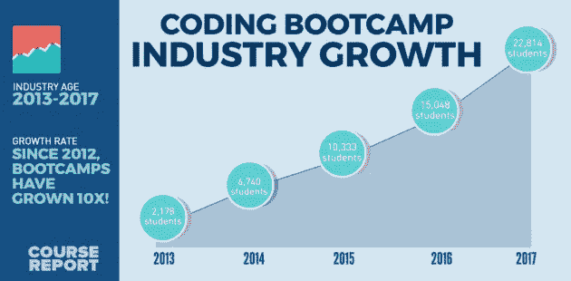

# 新手 vs 高级开发人员:编码、工作、学习

> 原文：<https://medium.datadriveninvestor.com/bootcamper-vs-junior-developer-coding-working-learning-805762da9aa3?source=collection_archive---------6----------------------->

-介绍-

编码训练营是严格的。学生们每周花 60-70 个小时在编码实验室和计算机科学讲座上——所有这些都是为了成为专业的开发人员。每天，他们都在建立自己的技术和概念储备，但由于强度大，他们并不总是能理解教室外发生的事情。这些信息和内部信息一样重要。

-开场白-

*作为对训练营行业和下一代软件工程师的致敬，我想为那些好奇的学生创造一种体验外部世界的方式；但是，因为我是那种好奇的学生，不知道什么是不知道的！所以我才请了真正的开发者来填空。接下来是“新兵训练营对”，一系列采访，所有水平和背景的开发者回答真正的新兵训练营学生的问题。*

*采访是随意的，但内容丰富。每个人都会带来一些独特的东西，并包含一些受访者的背景。此外，还会有技术部分，当然还有一些参加编码训练营后找工作的技巧。*

在本系列的第一篇文章中，我采访了我的朋友、彭博的高级开发人员 Joshua Hargeaves。声明:以下观点是约书亚·哈尔格夫斯和 ***的观点，不一定是彭博的观点。***

— — — — — — — — — — — — — — — — — — — — — — — — — — — — — —

-面试-

问:乔希，谢谢你和我坐在一起。

乔希:随时都可以，泰勒。

**问:**我认为从你对编码训练营的理解开始会比较好。作为一种商业模式和培养开发人员的机构，为什么他们在今天的环境下取得了如此大的成功？

**乔希:**嗯，所谓的“软件的秘密”之一就是大多数工作并没有那么难。大多数软件开发人员只是把别人写的代码拼凑起来。有大量的工作做着类似的简单事情，这使得它成为像训练营这样的学术模式的一个容易获得的职业。训练营似乎吸引了合适的人才，公司也渴望开发人员，这也有所帮助。

问:从这个角度来看，训练营的受欢迎程度有了很大的提高。是否存在饱和风险，或者软件开发仍然是一个很有前途的领域？

乔希:这是一个非常有前途的领域！这仍然是非常非常有竞争力的招聘。你必须付给员工很多钱，除此之外，员工愿意雇佣的人和他们实际雇佣的人之间存在巨大的技能差距。如果你想为自己建立一个未来，在那里你有一个好的生活质量，并且你没有过度工作，软件开发是一条路要走。我认为很难克服获得第一份工作的最初障碍。但是一旦你这样做了，你的工作生活，你的成长和学习都会以一种非常好的方式继续。

**问:**你对克服这个障碍有什么建议吗？你能做些什么让自己成为更好的申请人？

**乔希:**第一件事就是自己开始做。去造你想造的东西吧。大部分的学习来自于当你没有一些你正在研究的指定材料时，它来自于当你试图建立一些真实的东西并遇到真实世界的问题时。它在本质上是语言学的，因为你必须在说话之前模仿，但尝试自己说话是必要的，这样你才能推动真正的学习。当你开始编写自己的项目时，它会迫使你这样做。

问:除此之外还有什么吗？

Josh: 你可以做的另一件好事是开源贡献。有时开源项目会在它们的存储库上添加问题标签。找到一个你感兴趣的项目，看看他们的问题。基本上是人们说“这坏了，试着修好它。”你可以从阅读和研究他人的代码中学到很多东西。而且大的贡献可以以后参考。

**问:**太好了。你能告诉我你是如何开始编码的吗？

乔希:当然。我在 10 年级时编写了我的第一个程序，我们有一个信息技术班，提供两个版本:一个非常通用，另一个是为对编程感兴趣的孩子准备的。所以我们做了一个砸砖游戏——这是我的第一个程序。当我上六年级学院的时候，就像你上大学之前的两年，我学习了计算机，这不是一个很好的 A-level，但它是达到目的的一种手段。作为其中的一部分，你要做一些编程课程的工作，我有一个非常棒的老师，他有一个不寻常的计算机科学学位。他是个伟大的老师。他曾在市里的一家大银行工作，想抽出一段时间去教书。当需要决定我在大学想做什么的时候，我最终选择了计算机科学。

问:那里的 C.S .赛道怎么样？

**乔希:**我没有做典型的 C.S .赛道。当我上大学的时候，我读了 4 年的硕士课程。我们学了一些 C 语言，一些 Java 语言，一些函数式编程，一些语言工程——比如编译器是如何工作的——但是我最喜欢的事情是制作应用程序。所以当我毕业的时候，我找到了一份这样的工作。

**问:**一般来说，当你第一次开始制作应用程序时，它们是非常基础的，没有很多代码。你在课程中所做的和你在现实世界中所做的最大区别是什么？

**乔希:**最大的不同是当你自己写东西的时候，它不会变得那么乱。如果你是唯一的贡献者，你知道项目的一切。当你去开发一个生产应用时，有更多的代码和更多的东西需要理解。通常当你加入一个新团队时。前六个月左右，你仍然在学习代码库的不同区域，以及每件事都在做什么。随着时间的推移，你会对浏览代码更加得心应手，并能更有效地完成任务。

**Q** :最后一个。在科技界有什么让你真正兴奋的事情吗？

Josh:是的，目前我最感兴趣的是移动领域。对于原生移动开发，我们有 iOS，我们有 Android，我们也有一些其他平台，比如黑莓 10，我不得不在其上工作。我们有这些本地移动应用和这些不同的生态系统，以及公司、创业公司等。花这么大一笔钱在两个不同的平台上写同一个 UI。原生原语最后看起来甚至可能是一样的，但是底层的代码可能是不同的。我们在应用中使用的是 React Native。这使您可以编写 Javascript，代码在不同平台上运行并创建本地视图，并通过一个通用的样式化系统对它们进行样式化。你可以用 javascript 编写你所有的代码，你的通用业务逻辑，你的视图逻辑，然后如果你需要写一些本地代码，你可以。所以最让我兴奋的是这个平台的进一步发展。我对它如此兴奋的主要原因是因为它从开发的一个方面消除了令人难以置信的大量冗余，这允许开发人员将更多的精力放在创建伟大的产品上，而不是放在本质上相当于遵从的事情上。

**问:**乔希，感谢你的参与。

乔希:谢谢你。

-结尾-

*感谢您在百忙之中抽出时间阅读本文！“新兵训练营对”是给读者看的。这意味着我们接受问题，并努力在未来的面试中解决这些问题。如果你有一个问题想问一个真正的开发者，请在我们的一篇文章中留下你的评论，我们会尽快解决。*

感谢所有的建议。

如果您对文章的质量有任何意见、问题或批评，请发表评论。