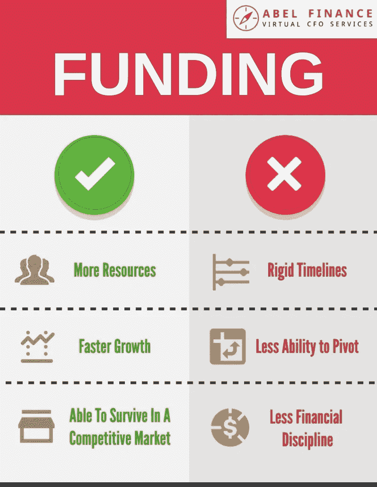
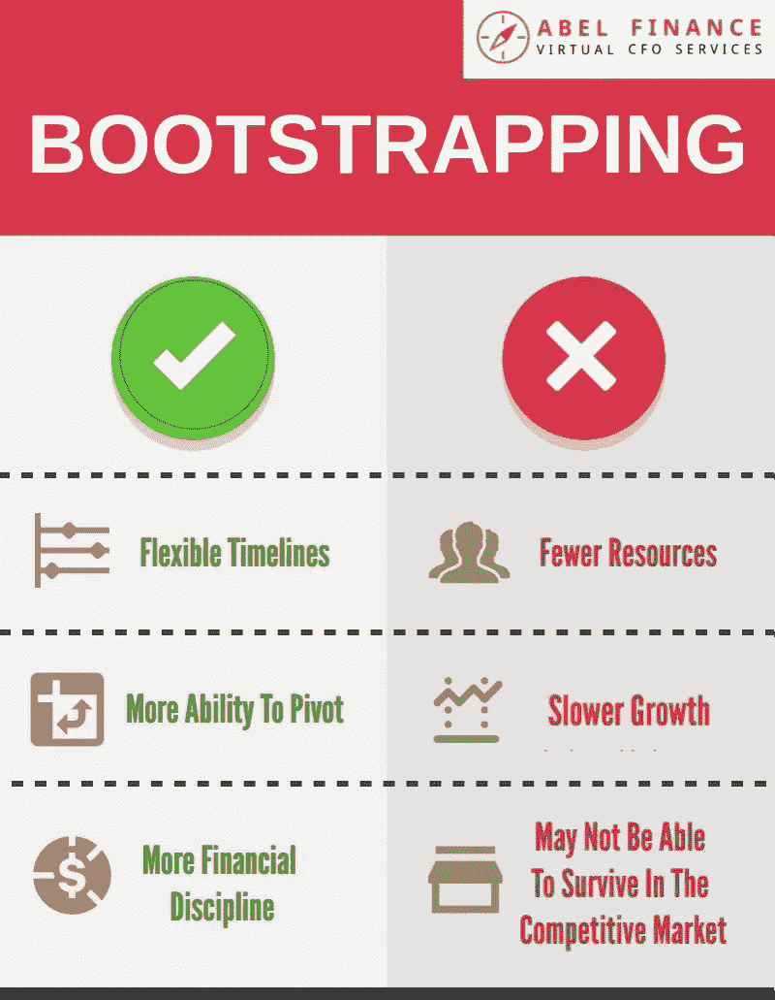

# 自助与融资:对你的 SaaS 企业来说，什么是最好的选择？

> 原文：<https://medium.datadriveninvestor.com/bootstrap-vs-funding-whats-the-best-option-for-your-saas-business-50acdd48b55b?source=collection_archive---------17----------------------->

这是一个古老的问题:你应该启动你的 SaaS 公司，还是尝试筹集资金？现在，你是否接受外部投资者的资金将对你如何构建和运营你的公司产生巨大的影响——所以这是一个不可轻易做出的关键决定。

在这篇博客文章中，我们将带你了解在选择自举还是投资时需要考虑的各种因素。我们还将权衡每个选项的利弊，并从财务角度向您介绍我们对自举和融资如何影响您的公司的看法。

 [## DDI 编辑推荐:5 本机器学习书籍，让你从新手变成数据驱动专家…

### 机器学习行业的蓬勃发展重新引起了人们对人工智能的兴趣

go.datadriveninvestor.com](http://go.datadriveninvestor.com/5ML1) 

# 什么是自举？什么是资助？

简单地说，自举指的是在不寻求外部资金的情况下创建一家公司*的行为。如果你用手头的钱和你赚的利润建立一家公司，那就是自举。*

另一方面，筹集资金是指你寻找投资者(通常是风险资本家，也称为 VC)并让他们向你的公司投资。这些投资者为你提供资本以换取股权。

要了解更多关于自举的知识，请阅读这篇[投资媒体指南](https://www.investopedia.com/terms/b/bootstrap.asp)。要了解更多关于融资对创业公司的作用，请阅读这篇[福布斯文章](https://www.forbes.com/sites/alejandrocremades/2018/12/26/how-funding-rounds-work-for-startups/#405c14f57386)。

# 你的市场青睐自举公司还是资助公司？

你所处的市场会影响你的创业和投资决策吗？当然有！

假设你处于一个竞争激烈的“赢家通吃”的市场，就像优步或 Slack，这意味着你将*必须*尽快扩大规模，成为或保持主导者。这很可能意味着你在不久的将来不会盈利，需要投资来支撑你的增长。

如果你在一个分散的市场中，许多中型企业共存，如 [Snappa](https://www.snappa.com/) 或 [Buffer](https://www.buffer.com/) ，那么融资可能是不必要的。在这种情况下，你也许可以启动自己的 SaaS 公司，自己发展壮大！

# 自助与融资:需要考虑的内部因素

在决定你是想为你的 SaaS 公司提供资金还是寻求外部资金时，有几个因素需要考虑:

*   你的目标
*   退出还是不退出？
*   增长潜力
*   控制

# 你的目标

你正在建立一个长期稳定增长的业务，还是你的目标是月球和更远？你努力实现的目标会影响你决定是启动还是寻求外部资金。对于白手起家的公司来说，目标通常是盈利。另一方面，受资助的公司倾向于以收入增长最大化为目标；这些公司希望最终成为市场领导者。

# 退出还是不退出？

首先，问问你自己，你的长期目标是继续发展你的 SaaS 公司，还是在几年后退出。如果是前者，那么自举是个不错的选择；如果你追求后者，那么筹集风投资金以更快扩大规模可能是正确的选择，因为风投通常投资的目标是在大约 3 到 10 年内退出。

# 增长潜力

接下来，想想自己想要达到什么样的成长。显然，当你启动一家公司时，你的资源是有限的，这意味着你将不得不适应较低的增长率。另一方面，如果你得到了风投的资助，你可以更快地成长并获得关注。不用说，两人都能在 40 的[法则上取得不错的成绩。(也就是说，一些人认为，当你得到资助时，你往往会缺乏财务纪律——这意味着你不会充分利用你的钱，就像如果你是自举的话你会怎么做一样。精神食粮！)](https://abel-finance.com/saas-rule-of-40/)

# 控制

接下来，当谈到所有者的自由和控制时，假设你引导你的公司，你会有更多的灵活性。如果你想推迟或提前一个项目、目标或里程碑，你可以自由地去做——没有人会质疑你。然而，当你得到资助时，时间表会变得更加结构化和僵化，你在最后一刻做出改变的空间会更小。

类似地，当你得到风投的资助时，你的能力也会受到限制。当你接受资金时，这基本上意味着你的公司不再是 100%属于你的了——在你转向、探索不同的商业模式或做任何不属于原始计划的事情之前，你必须与你的风投们协商，并获得他们的认可。如果你已经启动了你的公司，同样，你可以自由的改变你想要的一切。

# 自举与资助:权衡利弊

想权衡自举和资助的利弊，决定哪一个更合适？查看我们便捷的信息图表:

# 底线是:自举还是资助更好？

最终，自举和资助都会带来各自的好处。没有一种选择天生比另一种更好或更坏；要看哪个更符合你的情况和目标。

从财务的角度来看，有了资金，你就有了更大的扩张能力，但这也伴随着高风险和“不成功便成仁”的心态。与此同时，你看到的是一个固定的范围，你将在 5 到 10 年内退出市场。

说到自举，这让你更难扩大公司规模，但虽然你可能会增长得慢一点，但你将拥有拥有和控制整个馅饼的优势。

# 关于自举和投资你的公司的最后一句话

你应该为你的 SaaS 公司自举或筹集资金吗？只有你能决定。不过，考虑一下:即使你现在不筹集资金，也不意味着你必须永远自举——在游戏的后期有可能筹集资金。(如果你以后筹集资金，当你证明了你的产品适合市场和/或盈利能力时，你甚至可以为你的公司获得更好的估值！)

如果你正准备筹集你的种子资金，看看 ABEL Finance 筹款准备计划，这是一个 13 周的辅导计划，可以最大限度地增加你完成这轮融资的机会。

[了解更多信息](https://affpp.abel-finance.com/)

需要关于融资或自举对你的企业来说是更好的选择的建议，或者需要帮助管理你的 SaaS 企业的财务？[我们的虚拟首席财务官](https://abel-finance.com/value-virtual-cfo/)帮助您更快地发展并获得更多利润。

[预约免费咨询](https://calendly.com/abel-finance/30-min-call)

*原载于 2019 年 2 月 28 日*[*abel-finance.com*](https://www.abel-finance.com/saas-bootstrap-vs-funding/)*。*