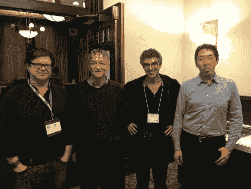
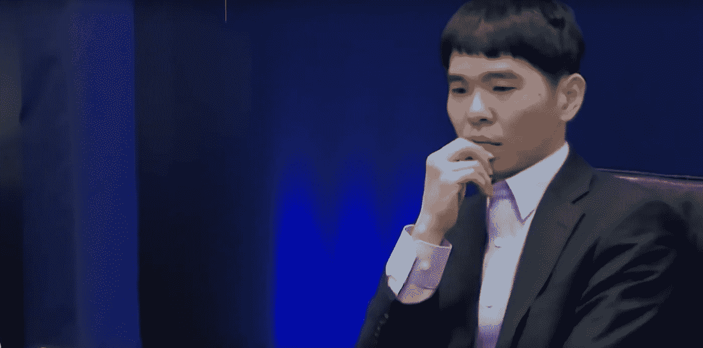
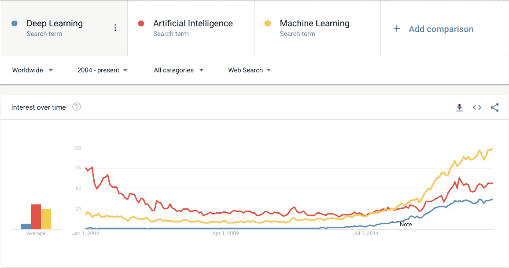
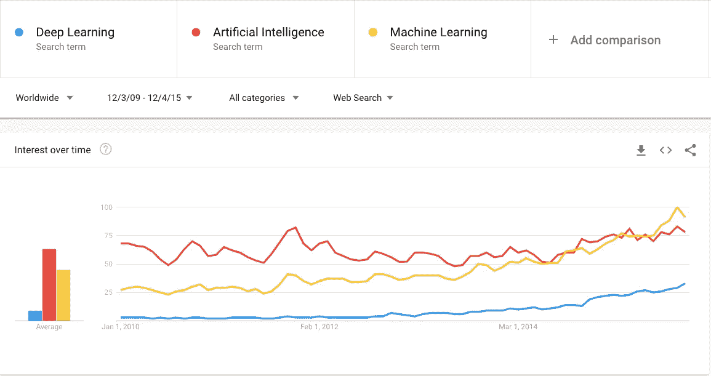
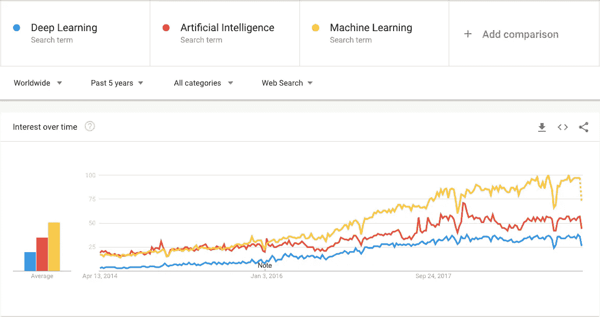
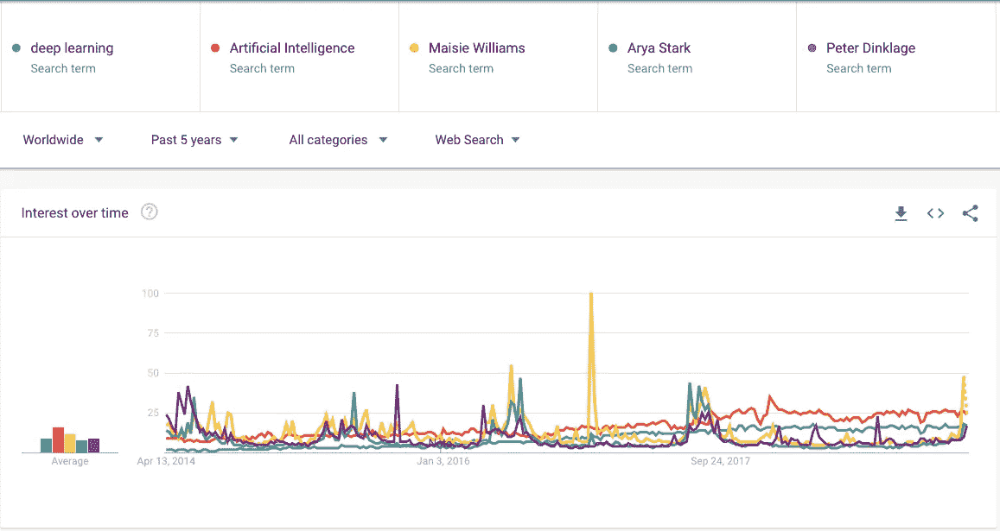
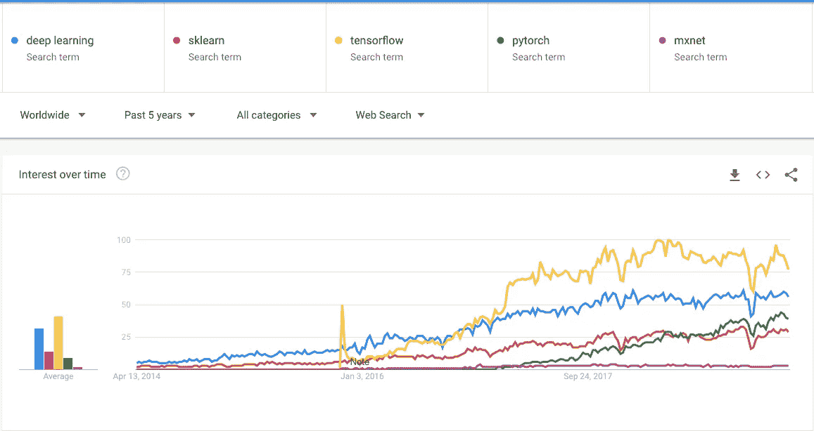
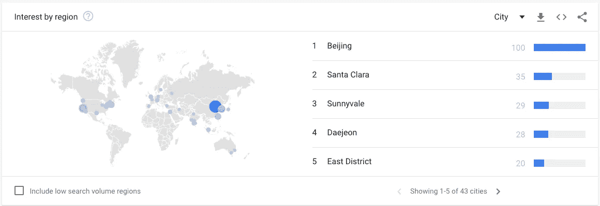

# 如何启动你的机器学习之旅

> 原文：<https://medium.datadriveninvestor.com/bootstrapping-your-machine-learning-journey-f339e011c6b6?source=collection_archive---------5----------------------->

这是正在进行的题为“学习机器学习”系列的第一篇文章。这个系列主要是通过我个人的学习之旅来激励有抱负的机器学习(ML)实践者。在这篇开篇文章中，我将给出一个关于 ML 的非技术性历史介绍，以及一个人如何引导他们的 ML 之旅。

# 完美的人工智能“模型”

忘记 XGBoosts，随机森林或者神经网络。我指的是 Alexandre Robicque，斯坦福大学人工智能专业的研究生。根据 [gq](https://www.gq.com/story/alexandre-robicquet-ysl-model) 的这篇文章，亚历山大·罗比克有一份模特兼职，2017 年，他出演了伊夫·圣罗兰(Yves Saint Laurent)的一则广告。

*Source: Screen capture from a youtube* [*ad*](https://www.youtube.com/watch?v=_-WcEBI0sD0) *(0:07) from* [*YSL*](https://www.ysl.com)

我确信这让许多 ML 从业者(包括我自己)羡慕他的头脑和肌肉。(幸运的是)我不会(错误地)进一步建议他的建模成果，但我会很高兴地分享一些关于学习机器学习技术的想法。

 [## DDI 编辑推荐:5 本机器学习书籍，让你从新手变成数据驱动专家…

### 机器学习行业的蓬勃发展重新引起了人们对人工智能的兴趣

www.datadriveninvestor.com](https://www.datadriveninvestor.com/2019/03/03/editors-pick-5-machine-learning-books/) 

为了开始这项技术，也许让我们回到人工智能的起源。

# 艾的诞生

人工智能这个术语是由 T4·约翰·麦卡锡在 1955 年创造的。然而，编写第一个人工智能程序和创造机器学习这个术语的荣誉属于与他同时代的亚瑟·李·塞缪尔。亚瑟·塞缪尔编写的人工智能程序玩跳棋，程序最终[打败了](https://www.ibm.com/ibm/history/ibm100/us/en/icons/ibm700series/impacts/)一位跳棋大师罗伯特·尼莱。

关于人工智能更详细的年表，我邀请你到这个[维基百科页面](https://en.wikipedia.org/wiki/History_of_artificial_intelligence)查看详细的时间表。或者，这篇来自《福布斯》的文章也提供了一篇极好的历史综述。

值得一提的一段历史是两次[AI winters](https://en.wikipedia.org/wiki/AI_winter)(1974-1980)和(1987-1993)的发生。这些人工智能冬天标志着人工智能研究资金的缺乏，主要是由于未满足和未实现的期望。然而，随着深度学习显示出对经济进行重大系统变革的潜力(大约从 2011 年开始)，对人工智能的兴趣和资助再次开始增长，导致了今天的人工智能现代时代。

# 艾的教父们

研究人员 Yoshua Bengio、Geoffrey Hinton 和 Yann LeCun 奠定了深度学习所需的基础。由于他们的贡献，他们被授予 2018 年[图灵奖](https://www.theverge.com/2019/3/27/18280665/ai-godfathers-turing-award-2018-yoshua-bengio-geoffrey-hinton-yann-lecun)，被广泛认为是人工智能的教父。

*Left to right: Yann LeCun, Geoff Hinton, Yoshua Bengio, Andrew Ng. Source: Taken from Andrew Ng’s Facebook page*

深度学习的技术之一，卷积神经网络(CNN)在计算机视觉领域非常成功，能够识别交通标志(2011 年)，手写(2011 年)和物体检测(2012 年吴恩达的猫检测和 2012 年 ImageNet 竞赛)。

谷歌 DeepMind 的 AlphaGo 使用了另一种被称为深度强化学习的深度学习技术，在 2016 年击败了围棋冠军 Lee Sedol。

*Source: Screen capture from a youtube* [*video*](https://www.youtube.com/watch?v=HT-UZkiOLv8) *(2:43) analysing Lee Sedol’s move*

# 绘制机器学习的发展图表

然而，对机器学习或深度学习的兴趣并没有从 2011 年开始增长。如果我们比较人工智能(AI)、机器学习(ML)和深度学习(DL)这些术语的搜索趋势，人们的兴趣在 2014 年之前基本上没有变化。

*Figure 1: Google Search Trends between DL, AI and ML (2004 to now)*

*Figure 2: Google Search Trends between DL, AI and ML (2010 to 2015)*

如果我们放大到从 2014 年到 2019 年的过去五(5)年，我们会注意到这些搜索词稳步强劲的增长趋势。有趣的是，在这段时间里，搜索术语机器学习的流行程度超过了人工智能。

*Figure 3: Google Search Trends between DL, AI and ML (2014 to now)*

请注意，这些趋势是相互关联的。因此，一个好的基准是将这些搜索词与其他全球/趋势搜索词进行比较。我选择了将搜索词深度学习和人工智能与 HBO 广受好评的[权力的游戏](https://www.hbo.com/game-of-thrones)系列中的一些角色/演员进行比较。特别是，我将它与扮演艾莉亚·史塔克的麦茜·威廉姆斯和我最喜欢的由才华横溢的彼特·丁拉基扮演的提利昂·兰尼斯特进行了比较(图 4)。

尽管《GOT》演员的峰值搜索量远高于深度学习或人工智能，但图 4 中的比较确实表明，这些搜索词确实可以与该系列主要演员的搜索词相媲美。

*Figure 4: Google Search Trends between DL, AI and GOT Characters (2014 to now)*

回到图 3，重要的是进一步探索是否有任何特定事件引发了对机器学习和深度学习的兴趣。我认为，机器学习平台的兴起是这种兴趣激增的强大催化剂之一。

# 机器学习平台的兴起

在我之前题为[澄清关于人工智能的三个误解](https://www.todayonline.com/commentary/clearing-three-misconceptions-about-ai)的专栏文章中，我写了云计算和机器学习平台的兴起如何使这些技术民主化。

如果我们在术语深度学习和一些流行的机器学习包(特别是 sklearn、tensorflow、pytorch 和 mxnet)之间进行趋势绘图。这似乎表明，这些搜索词之间有很高的相关性(而不是因果关系)。

事实上，深度学习和 sklearn 之间的相关系数是 0.952，而深度学习和 tensorflow 之间的相关系数是 0.972。注意，使用的时间段是从 2015 年 11 月 29 日到 2019 年 4 月 7 日。

*Figure 5: Google Search Trends between DL, sklearn, tensorflow, pytorch and mxnet (2014 to now)*

# 对深度学习感兴趣的地理区域

*Figure 6: Various cities that are hotspots in deep learning.*

如果我们深入到将深度学习作为关键搜索词之一的城市，前五名中有两个来自硅谷。另外三个来自亚洲，北京(中国)、大田(韩国)和东区(台湾)。由于这些数字都是相对的，有趣的是，北京是谷歌搜索深度学习百分比排名最高的城市。这意味着深度学习中来自北京(100)的搜索数量比圣克拉拉(35)、桑尼维尔(29)和大田(28)的总和还多(总相对得分为 92)。

如果你热衷于了解更多关于中国如何在人工智能竞赛中竞争的信息，我强烈推荐李开复([人工智能超级大国](https://www.amazon.com/AI-Superpowers-China-Silicon-Valley-ebook/dp/B0795DNWCF))的书。或者你可以观看[这段](https://www.youtube.com/watch?v=FYIVX5sFeZY) youtube 视频，他在视频中分享了他的一些观点。

# 我应该如何开始学习 ML？

关于应该如何学习机器学习，当代至少有两种不同的思想流派。第一种方法(杰瑞米·霍华德称之为自下而上的方法)首先关注基础数学和算法，在深入研究机器学习的概念之前，熟知统计和线性代数等概念。

第二种(自上而下)方法与此截然相反，它专注于利用前面提到的一些机器学习包，并在其中执行实践问题。只有当你在如何前进的问题上碰壁的时候，那才是你应该稍微深入研究引擎盖下的数学的时候。

事实上，我赞同后一种自上而下的教学形式。我认为成为机器学习(ML)的实践者类似于能够驾驶汽车。当我们开始学习如何驾驶时，我们不会为发动机或齿轮如何工作的细节而烦恼。使用 ML 包与此非常相似。大部分复杂性已经被抽象掉了，我们主要关心的是学习如何使用这些工具让我们从 A 点到达 b 点。

类似于开车，大量练习就能精通 ML。然而，要完全掌握这门手艺，你通常必须深入研究这些软件包是如何编写的，这也是你需要学习数学的地方。

这种自上而下的学习方式至少有两个我欣赏的优点。首先，它更加有趣和令人满意，因为它从一开始就给你解决复杂问题的满足感。其次，它把学习复杂的主题推迟到你需要的时候，确保你把宝贵的时间花在学习真正重要的概念上。

# 启动您的机器学习之旅

有大量的资源可以引导你的机器学习之旅。

如果你喜欢更结构化的方法，你当地的大学肯定会提供一些高管教育课程。另外，你也可能希望在 coursera、udacity、fast.ai 或 edx 等平台上参加一些大型开放式在线课程(MOOC)。这个[链接](https://medium.freecodecamp.org/every-single-machine-learning-course-on-the-internet-ranked-by-your-reviews-3c4a7b8026c0)提供了一些领先的(而且非常实惠的)在线课程的精彩汇编。

最后，你也可以选择通过参加一些竞争性的机器学习平台，如 [Kaggle](https://www.kaggle.com/) ，直接跳入游泳池的深水区。每当你发现自己有点卡住，前往论坛寻求帮助。学习将是陡峭的，但它是值得的。

相关的系列视频短片可以在 youtube [这里](https://www.youtube.com/playlist?list=PLsXcLJfwDnPqf8H5ttvXI8lKSMHJKWLfz)找到。

希望你能从这篇文章中学到一些东西。如果你喜欢这篇文章，请鼓掌。

作者是新加坡理工学院的助理教授。他拥有帝国理工学院的计算机科学博士学位。他还在新加坡麻省理工学院联盟(SMA)项目下获得了新加坡国立大学计算机科学硕士学位。

*本文观点仅代表作者个人，并不代表作者所属组织的官方政策或立场。作者也没有从属关系，也没有从本文提到的任何产品、课程或书籍中赚取任何介绍费。*