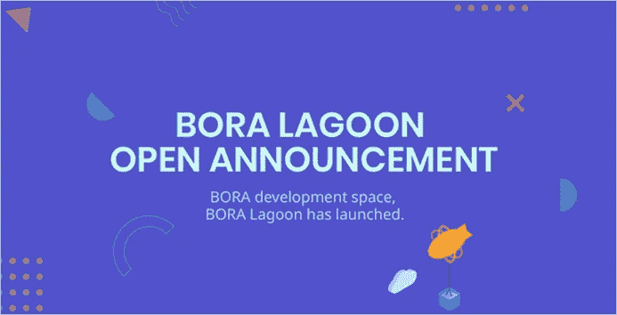

# 博拉发布公共测试网，博拉泻湖现已上线！

> 原文：<https://medium.datadriveninvestor.com/bora-releases-public-testnet-bora-lagoon-is-now-live-347e70c545d6?source=collection_archive---------17----------------------->

到现在，大多数人都会听说过比特币和区块链。尽管这项技术正在发展，并被越来越多的大公司采用，但只有一小部分人真正理解比特币和区块链背后的技术。

区块链技术可以蓬勃发展的一个领域是内容产业。然而，此时此刻，许多内容创建者和提供商在进入这一新兴技术时遇到了障碍。例如，缺乏技术理解和高昂的开发成本导致数百万内容提供商错过了区块链技术为增强用户体验提供的好处。

为了解决上述问题，BORA 项目创建了 BORA Island，这是一个分散的内容平台，允许内容提供商连接到区块链。

# **博拉项目讲解**

BORA 致力于成为一个分散的平台，通过让内容提供商更容易连接到区块链生态系统来为他们提供便利。这个平台将被称为 BORA Island，将由各种工具包组成，为开发者和内容提供商提供额外的资源和对他们自己内容的更多控制。例如，这些工具包可以促进区块链和内容服务的互连，数字资产的拥有和转移，以及需要信任的数据的存储和共享。

宝来岛 mainnet 的推出计划于 2019 年第二季度左右推出。然而，本周早些时候，该团队已经发布了博拉泻湖(博拉的测试网)。

# **博拉泻湖**

博拉泻湖是几个月的研究和开发的结果，可以被视为博拉岛平台的测试网(后面会有更多)。BORA Lagoon 允许开发人员验证和测试他们的内容，并与 BORA 团队合作改进 BORA 项目。随着团队继续开发 BORA Island 平台，BORA Lagoon 将作为开发人员的通信层。

博拉泻湖由以下特征组成:

- **博拉试验场:**这是开发者可以测试以下功能的地方:代币交易、钱包管理和在博拉岛生态系统中使用的代币交换。

-**BORA Explorer:**Explorer 允许用户在开发和测试阶段查看记录在 BORA 链中的交易信息。

- **BORA Toolkit:** 开发者/内容提供商可以在这里找到可用于测试目的的平台互操作性相关的 REST APIs。

# **博拉岛**

如前所述，最终的平台(mainnet)将被称为宝来岛(Mainnet)，并将于 2019 年第二季度推出。博拉岛可以被认为是一个可扩展的高性能平台，它采用了通过以太网连接的侧链。博拉岛平台包括以下特征:

**可扩展性:**宝来岛采用模块化结构，可以添加侧链，方便内容提供商的多样化需求。

**高性能:**通过利用权威证明(PoA)共识算法，并通过添加侧链节点来增强线性性能，BORA Island 能够达到每秒 2200 个事务(TPS)。

**隔离:**得益于模块化架构，通过最大限度地减少内容间干扰，博拉岛能够确保独立的服务环境。

**可访问性:** BORA Island 提供了符合内容提供商需求的开发环境，从简单的平台连接到基于智能合约的 Dapps 的实现。

**多样性:**通过采用两层链，实现令牌结构，结合大范围的各种数字内容，如:游戏、娱乐、健康资讯等，可以解决与佣金、业绩相关的问题。

# **波拉令牌**

宝来的生态系统由两个令牌组成，分别是宝来令牌和宝来涌浪令牌。BORA 令牌是基于 ERC20 的令牌，可用于与生态系统内部或外部的其他用户进行交易。另一方面，BORA Swell 只供 BORA 生态系统内部使用。例如，希望通过宝来岛平台上的 dApp 玩游戏或想要购买游戏中物品的用户可以使用宝来膨胀代币来实现。

# **结束语**

在我之前的关于宝来的文章中，我提到没有太多的可用信息。也许当时信息简洁的原因之一是，团队正在努力工作，以确保博拉泻湖测试网将如期推出。在玩了测试网之后，一切似乎都像他们声称的那样工作，这让我对 2019 年 Q2 期间推出博拉岛主网持积极态度。BORA 项目是一个有趣的项目，肯定是我在未来几个月关注的项目。我期待着团队的新更新；随着更多信息的出现，我将在不久的将来发布关于这个项目的新文章。

## **官方渠道**

**网址:**【https://www.boraecosystem.com/ 

**博拉泻湖测试网:**[https://bora-lagoon.com](https://bora-lagoon.com)

**电报:**https://t.me/boraofficial

**推特:**https://twitter.com/bora_ecosystem

**中等:**https://medium.com/@BORA_Ecosystem

**Reddit:**https://new.reddit.com/r/Bora_Ecosystem/

**邮件:**contact@boraecosystem.com

***免责声明*** *:本文无意作为投资建议。这只是我个人对宝来的看法。你应该总是做自己的研究#DYOR。博拉鼓励我写这篇文章，并鼓励我表达自己的观点*。

订阅我的频道: [Medium](https://medium.com/@cultcrypto) ， [Twitter](https://twitter.com/CryptoShowdown) 和 [Steemit](https://steemit.com/@cryptoshowdown) 如果你喜欢我的文章并想了解区块链、加密货币和新闻。也可以在 [LinkedIn](https://www.linkedin.com/in/donjohanson/) 上看我的文章。

如果您对本文有任何疑问，请在下面的评论区发表评论。掌声也欢迎，谢谢！

**密码摊牌**