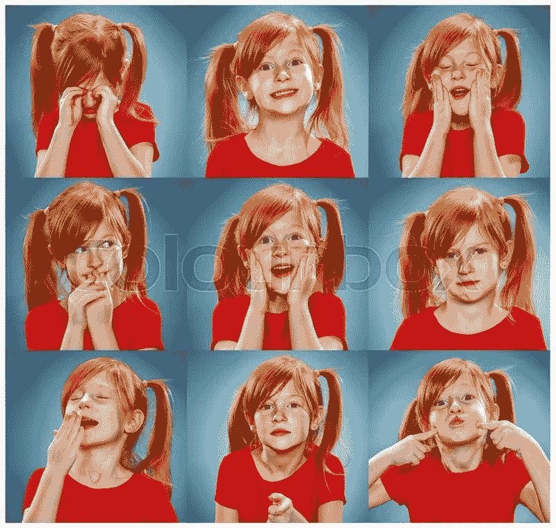

# 无聊:钩子模型再探

> 原文：<https://medium.datadriveninvestor.com/boredom-the-hook-model-revisited-7e40a9d30324?source=collection_archive---------31----------------------->

简要探讨情绪，即厌倦及其在 Hook 模型中的应用。

什么是情感？人类经验中情感的目的是什么？一般来说，我们不会深入思考我们的情绪，我们只知道我们正在经历它们，即使有时我们不知道为什么。情绪是一种信号，让我们知道我们在追求某个目标的过程中所处的位置，无论是大到完成大学学业，还是小到做一顿饭。情绪是我们在日常生活中做决定所必需的。没有它们，我们无法做出决定，我们没有对未来的完美看法来决定我们的行为应该是什么，但情绪会温和地引导我们走向“感觉”正确的方向。

有四种常见的情绪可以提醒我们某个目标的状态:快乐、愤怒、焦虑和悲伤。

1.  快乐是目标成功的标志。
2.  愤怒表明一个目标已经失败，但它有可能被恢复。
3.  悲伤表明目标完全失败，没有恢复的机会。
4.  焦虑源于对当前目标/重要目标成功的预期威胁。

无聊作为一种情绪，在整个画面中起着重要的作用。它本质上是一个改变或重新参与你当前目标的信号。无聊可能是由各种原因引起的，例如我们对时间的感知，某个情况或一组目标缺乏意义，以及在追求某些目标时上述情绪的强度减弱。

无聊通常是由于在追求某个目标的过程中，我们在某个时间点的情绪水平降低而产生的。比方说，你很高兴参加训练营，但是一旦这种情绪开始消退，你就会感到厌倦。厌倦将是你重新评估你的目标的一个信号，可能会转向新的目标。作为人类，我们不断地拾起新的目标，又放下它们。厌倦不一定意味着你已经实现了你的目标，它只是意味着让你沉迷于当前你正在努力实现的目标的情绪强度已经消退。这可能意味着你觉得你正在努力实现的目标的相对重要性在你的生活中不再那么重要——或者只是你觉得它无法实现，因此不值得追求。

我们对时间的感知也会影响我们的无聊状态。如果我们觉得某件事花了太长时间，它会把我们推向无聊的状态。这是一个可以观察到的现象，有一个实验，科学家把两组人分配到一起完成同样的任务，并在 20 分钟后评估他们的情绪。两组之间的唯一区别是，第一组的时钟被篡改，以至于 20 分钟后，时钟显示只过去了 10 分钟，而第二组的时钟显示已经过去了 30 分钟。第一组人的情绪倾向于变得无聊，不是因为某些情绪的消失，而是因为感觉到时间已经过去了，他们做了更多的工作，而时间过得如此之少。这让他们陷入厌倦状态，让他们重新评估手头任务的完成情况。第二组通常感觉比第二组好得多，因为他们觉得时间过得更快，所以他们取得了更多的成就。

无聊也可能是因为我们对自己努力实现的目标缺乏意义。我们在生活中的某些时候都会有这种感觉。上这门对我的生活没有任何影响的艺术史课有什么意义？如果我没有做任何“有意义”的事情，为 X 公司工作还有什么意义？人们选择特定工作的一个重要因素是获得一定程度的满足感，有时这可能比薪水更具决定性。原因是因为情绪在其中发挥了作用，缺乏意义或成就感会使一个人陷入厌倦的状态，从而让他们重新评估当时的目标。

情绪就像过山车一样，无聊会把你拉向与你之前经历的情绪相反的活动。这可以基于个人，有些人有持续追求高唤醒活动的倾向，如药物滥用者不断服用更高剂量的药物。但这更多是因为无聊是一种习惯，而不是一种状态。拥有太多的快乐可能是一件坏事。例如，通过测试后喝一杯庆祝酒可能是有益的，但在第四或第五杯酒后，在酒吧呆几个小时可能会让你开始厌倦，并最终焦虑到无法实现刚刚完成的目标。

我要简单提一下冷漠，因为冷漠和无聊可能会被混淆为同一件事。冷漠和厌倦之间有很大的区别，冷漠的状态与完全失去希望和标志着一种失败的情况有关，而厌倦会给你改变这种情况的动力。例如，当我和某人打乒乓球时，我开始倾斜，甚至懒得改变我的发球或截击方式，因为这种情况令人绝望。虽然我可能会一直忙于和某人比赛，即使我在某一类型的发球中失败了，但我可能会探索新的发球/截击方式，因为它们带来了新的获胜可能性。

你可能会问，作为一名软件开发人员，这对我有什么关系？这一点非常重要，因为它让我们能够洞察人类行为，而这将永远是设计应用程序时反复出现的兴趣点。我在上一篇文章中提到的挂钩模型与触发、行动、奖励和投资有关。我们可以利用我们对人类情绪的了解来理解什么应该构成一个触发器，应该存在什么奖励(如果有的话)，以及我们可以用什么方法来保持用户的投资。

利用人们的情感听起来很狡猾，但它最终可能是一个应用程序成功与否的决定性因素。如果你不了解你的用户群，那还有什么意义呢？

在应用程序设计中实现对无聊的理解的一个很好的用例是游戏。如果你让一个游戏变得太难，那么用户可能会变得厌烦，因为他们觉得他们没有能力达到赢得游戏的最终目标。另一方面，如果你把游戏做得太简单，那么用户就不会感到有挑战，也许用户参与度会下降。我们不想让用户体验悲伤，因为那意味着没有获胜的机会。你想要设计你的游戏，这样你就能在快乐、愤怒和焦虑之间保持平衡。利用一个模型，让用户感受到情绪的过山车，这似乎是让用户参与到钩子模型中的最好方法。你不希望你的用户长期处于无聊状态，因为他们会试图改变他们的目标和活动(开始使用另一个应用)，因为他们不会再认为你的应用程序有吸引力了。

*来源:*

1.  https://www.mdpi.com/2076-328X/3/3/459/htm
2.  [https://courses . lumen learning . com/way maker-psychology/chapter/emotion/](https://courses.lumenlearning.com/waymaker-psychology/chapter/emotion/)