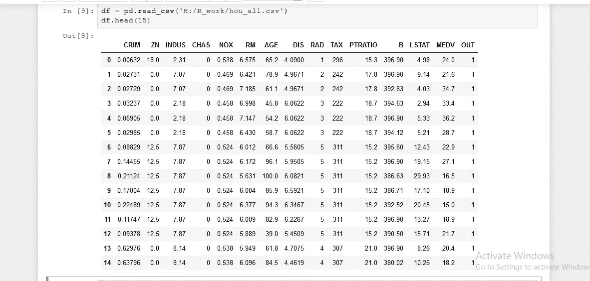
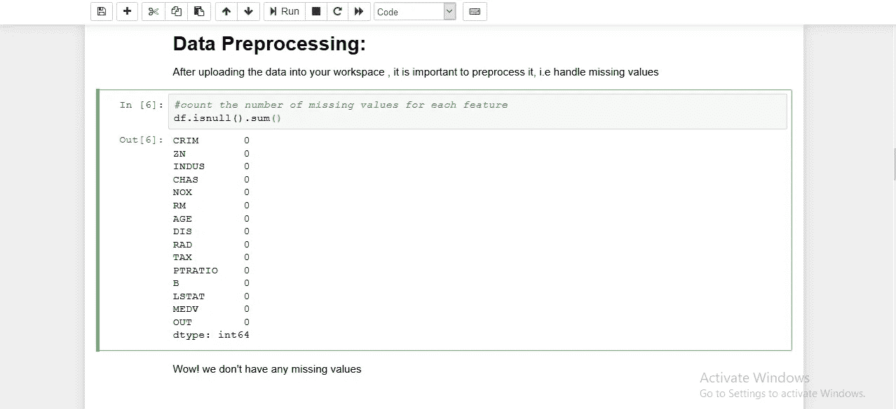
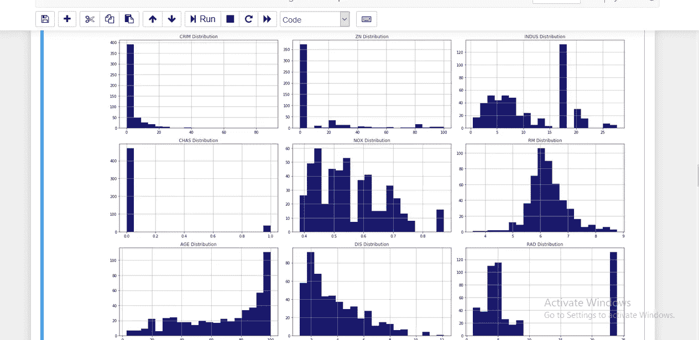
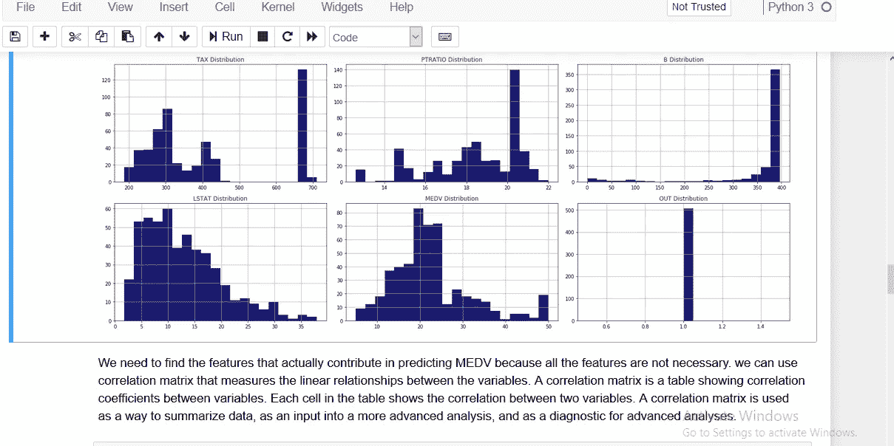
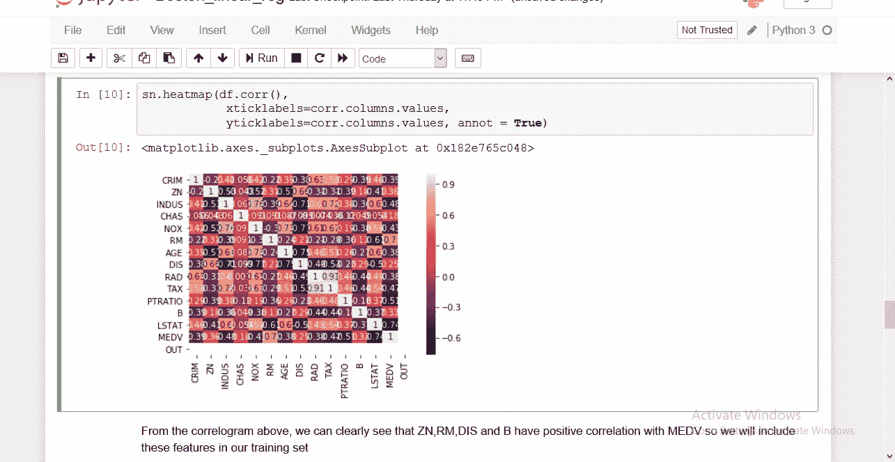
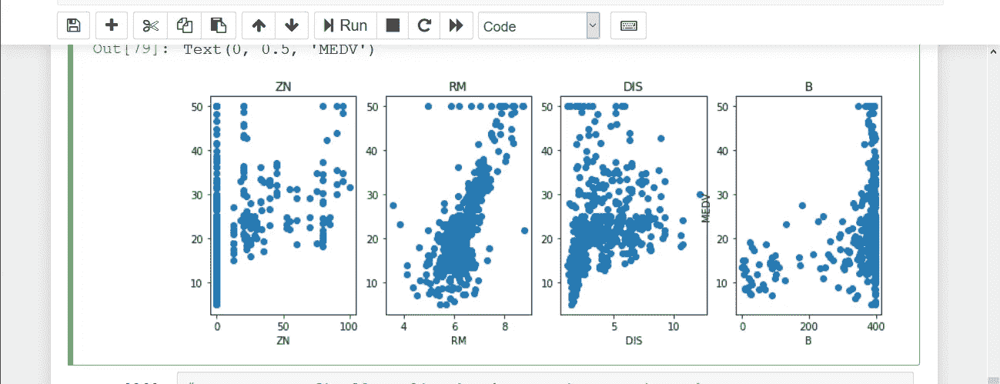

# 波士顿房价预测:线性回归

> 原文：<https://medium.datadriveninvestor.com/boston-house-cost-prediction-linear-regression-9a145effe597?source=collection_archive---------2----------------------->

[](http://www.track.datadriveninvestor.com/1B9E)

波士顿数据集是开始回归的一个好方法，如果你像我一样是初学者，并且已经熟悉一些回归概念，那么不要去经历理论部分，让我们做编码员做的事情！你可以在这里找到完整的代码和我练习用的其他 ML 代码的数据集:[https://github . com/Valkyrie 55/Machine _ learning/tree/master/Regression](https://github.com/valkyrie55/Machine_learning/tree/master/Regression)

## 波士顿住房数据集

波士顿住房数据集由波士顿不同地方的房价组成。数据集提供的信息包括犯罪(CRIM)、城镇非零售商业区(INDUS)、拥有房屋的人的年龄(age)以及许多其他属性，让我们对数据有一个粗略的了解

[](https://www.datadriveninvestor.com/2019/02/18/the-challenge-of-forex-trading-for-machine-learning/) [## 机器学习的外汇交易挑战|数据驱动的投资者

### 机器学习是人工智能的一个分支，之前占据了很多头条。人们是…

www.datadriveninvestor.com](https://www.datadriveninvestor.com/2019/02/18/the-challenge-of-forex-trading-for-machine-learning/) 

```
CRIM: Per capita crime rate by town
ZN: Proportion of residential land zoned for lots over 25,000 sq. ft
INDUS: Proportion of non-retail business acres per town
CHAS: Charles River dummy variable (= 1 if tract bounds river; 0 otherwise)
NOX: Nitric oxide concentration (parts per 10 million)
RM: Average number of rooms per dwelling
AGE: Proportion of owner-occupied units built prior to 1940
DIS: Weighted distances to five Boston employment centers
RAD: Index of accessibility to radial highways
TAX: Full-value property tax rate per $ 10,000
PTRATIO: Pupil-teacher ratio by town
B: 1000(Bk — 0.63)², where Bk is the proportion of [people of African American descent] by town
LSTAT: Percentage of lower status of the population
MEDV: Median value of owner-occupied homes in $1000s
```

在我们的数据中有 506 个观察值和 15 个没有分类的特征。一旦我们得到一个很好的拟合，我们将使用这个模型来预测位于波士顿地区的房子的货币价值。数据也可以从 scikit-learn 获得，我们可以直接从 scikit-learn 本身导入数据。让我们从这里导入一些 python 库开始。

```
import numpy as np
import pandas as pd
import matplotlib.pyplot as plt
import seaborn as sn
from sklearn.linear_model import LinearRegression
```

现在将您的数据加载到您的工作区并查看它

```
df = pd.read_csv(‘H:/R_work/hou_all.csv’)
print(df.head(5))
```



接下来，我们进行数据预处理，即将原始数据转换成可理解的格式。真实的数据通常是杂乱的，缺少值，缺少属性值，缺少感兴趣的某些属性，包含错误或异常值。有一次，我得到了一个太乱的数据(有拼写错误和大量缺失值)，花了 2-3 天才从中获得深刻见解。因此，对数据进行预处理至关重要。

```
#count the number of missing values for each feature
df.isnull().sum()
```



预处理后，我们将可视化我们的一些特征，以分析它们之间的关系。

```
def draw_plots(df, var, rows, cols):
 fig=plt.figure(figsize=(20,20))
 for i, f in enumerate(var):
 ax=fig.add_subplot(rows,cols,i+1)
 df[f].hist(bins=20,ax=ax,facecolor=’midnightblue’)
 ax.set_title(f+” Distribution”,color=’DarkRed’)

 fig.tight_layout() 
 plt.show()
draw_plots(df,df.columns,5,3)
```



我们需要找到实际上有助于预测 MEDV 的特征，因为所有的特征都不是必要的。我们可以使用相关矩阵来衡量变量之间的线性关系。相关矩阵是显示变量之间相关系数的表格。表中的每个单元格显示了两个变量之间的相关性。相关矩阵用作汇总数据的方式，作为更高级分析的输入，以及作为高级分析的诊断。

我们将使用 seaborn 绘制一张热图，以检查哪些要素与 MEDV 正相关

```
sn.heatmap(df.corr(), 
 xticklabels=corr.columns.values,
 yticklabels=corr.columns.values, annot = True)
```



该项目的基本特征是:“RM”、“ZN”、“DIS”和“B”。其余特征已被排除。我们将数据集分为要素和目标变量。并将它们分别存储在 X 和 y 变量中

```
X= df[[‘ZN’,’RM’,’DIS’,’B’]]
Y= df[‘MEDV’]
plt.figure(figsize=(12, 4))predictors = ['ZN', 'RM','DIS','B']
target = df['MEDV']for i, col in enumerate(predictors):
    plt.subplot(1, len(predictors) , i+1)
    x = df[col]
    y = target
    plt.scatter(x, y, marker='o')
    plt.title(col)
    plt.xlabel(col)
plt.ylabel('MEDV')
```



```
from sklearn.model_selection import train_test_split
from sklearn.metrics import r2_score
x_train,x_test,y_train,y_test = train_test_split(X,Y,test_size = 0.3)
reg = LinearRegression()
reg.fit(x_train,y_train)
y_pred = reg.predict(x_test)
r2_score(y_test,y_pred)>>> 0.6044393389584971
```

精确度不是很好，但足以让初学者理解回归是如何工作的，建议和反馈修改代码以获得更高的精确度是值得赞赏的。

编码快乐！