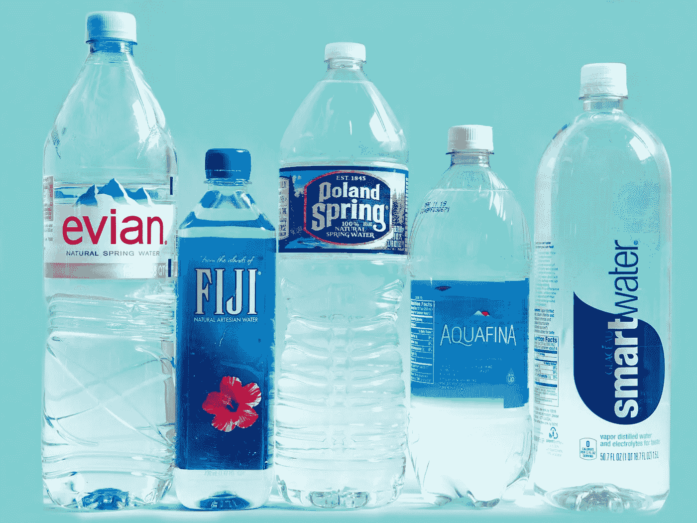

# 从澳大利亚到墨西哥的瓶装水消费

> 原文：<https://medium.datadriveninvestor.com/bottled-water-consumption-from-australia-to-mexico-2f6d4276754d?source=collection_archive---------23----------------------->

生活在地球上最干燥的有人居住的大陆上，让许多澳大利亚人敏锐地意识到水资源的匮乏和保护水资源的重要性。

这一知识——以及他们可以获得廉价优质自来水的事实——可能有助于解释为什么澳大利亚的人均瓶装水消费量与许多其他国家相比只是沧海一粟。

瑞士瑞信银行在一份报告中引用国际瓶装水协会和 T2 澳大利亚饮料委员会的数据写道，澳大利亚人平均每年消耗 28 升瓶装水，大约是美国的三分之一和西欧的四分之一。

这略高于 25 升的全球平均水平。在光谱的另一端是墨西哥，平均每个人一年要喝掉 243 升瓶装水，是美国人 107 升的两倍多。

墨西哥人信任瓶子，因为该国的自来水被认为不安全，但这不是唯一的原因。跨国饮料公司的精明广告活动在墨西哥更为有效。

其他饮用水不安全的国家消耗的瓶装水远少于拉美国家；例如，中国和香港的消费量仅为 95 升。

**《金融时报》**

艺术和金融往往不会混在一起，除非你在纽约的玛丽·布恩画廊。

本月，墨西哥裔艺术家 G.T .佩利齐(G.T. Pellizzi)在画廊举办了“金融时报”(Financial Times)展览，结合了通常被认为单调乏味的经济图表、预测工具和金融出版物，以及占星术和中国典籍等古代预测工具。

由此产生的艺术旨在表现我们预测未来的古老愿望。佩利齐的作品曾在迈阿密海滩巴塞尔艺术展、惠特尼双年展、PS1 现代艺术博物馆和巴黎蓬皮杜中心展出，他希望自己的作品能吸引更多的商人关注艺术，并挑战金融无聊的普遍观念。

这位纽约艺术家告诉《经济学人》:“金融最终是一个我们都同意承认的巨大虚构结构，在这里，发明的价值被归因于金钱和其他商品。”展览将一直开放到 3 月 1 日。

[***我的网站在这里。***](https://www.jenserikgould.com/)