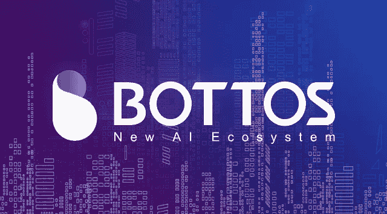
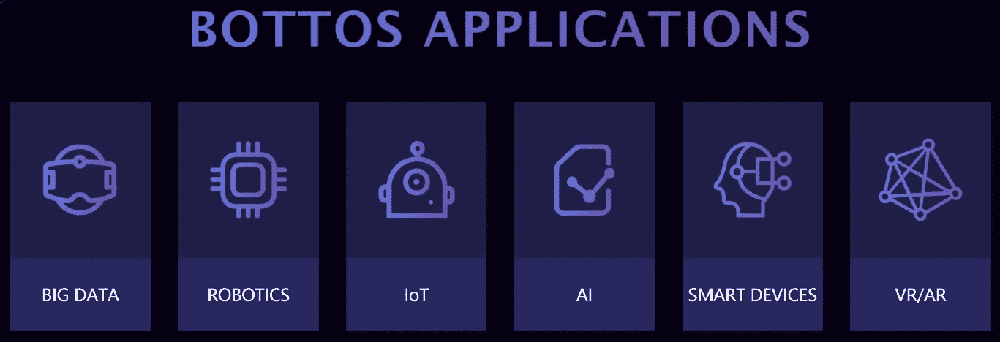
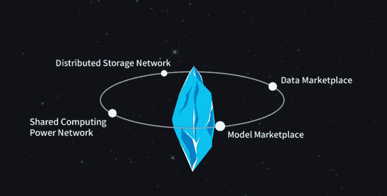
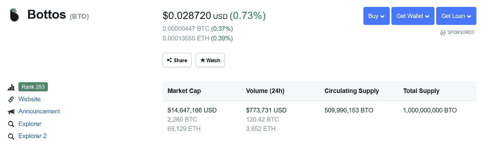
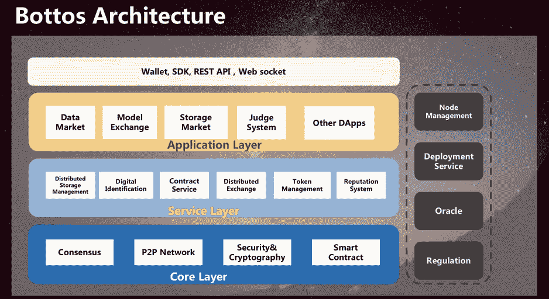
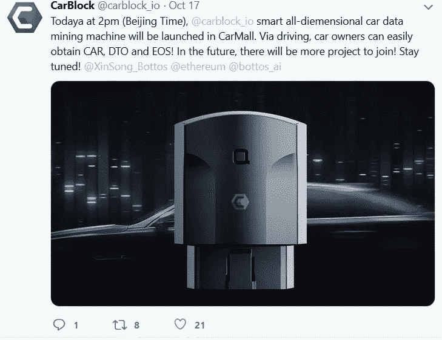
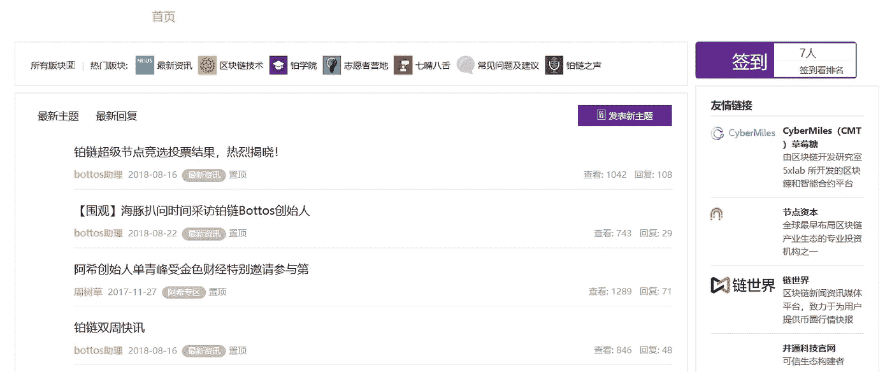
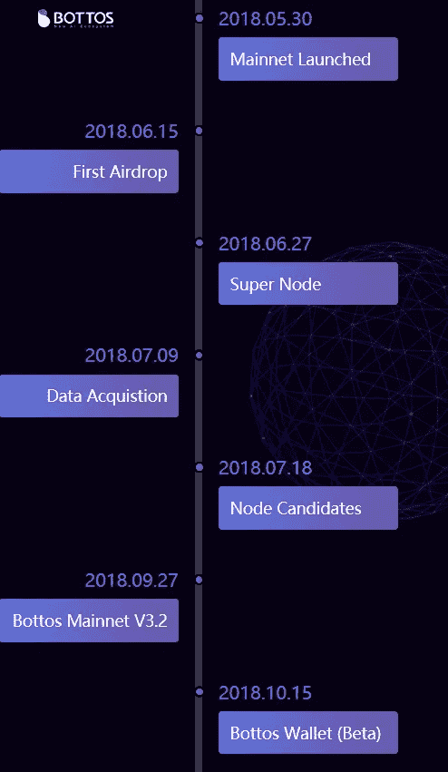
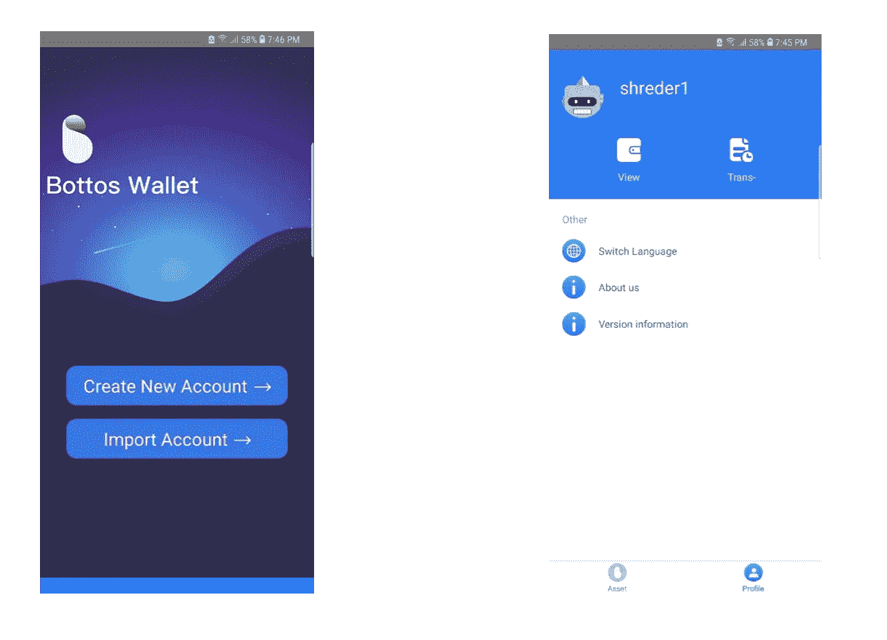
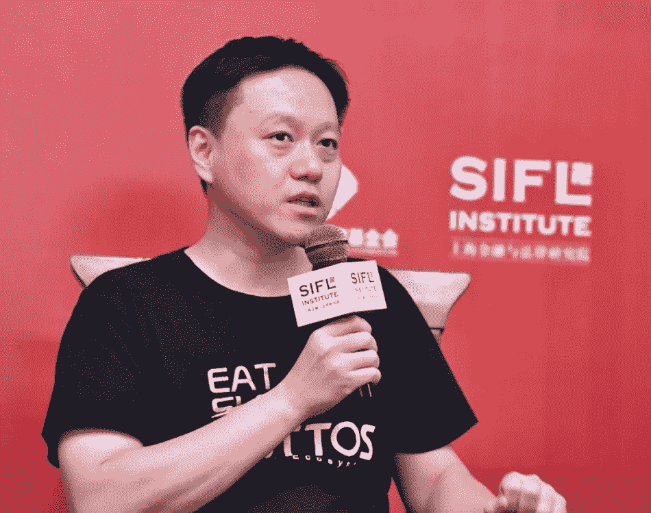

# BOTTOS AI:为数据和模型创建最大的去中心化市场

> 原文：<https://medium.datadriveninvestor.com/bottos-ai-public-chain-for-ai-agi-robotics-iot-vr-ar-4b0c6d8a4e9a?source=collection_archive---------39----------------------->

> *Bottos 暗示机器人操作系统，Bottos 暗示 BOT ATTOS(意大利语)。这两个词的组合意味着与来自世界各地的人工智能开发者一起创建一个分布式智能机器人系统。因此，博托斯诞生了。*

## Bottos 是一个中国区块链项目，旨在通过创建世界上最大的去中心化数据市场来推动下一代信息技术，如大数据、机器人、人工智能、物联网、智能设备和 VR/AR。最终，Bottos 寻求通过激励性的数据流通和模型共享，在其包容性的一体化人工智能生态系统中加速实现人工智能和人工通用智能。

# BOTTOS 应用

今天，推动这些技术的数据是科技巨头之间的地下战争，在免费应用服务的掩护下以隐形模式进行。当我们使用谷歌搜索，或使用我们的安卓智能手机，在亚马逊网上购物时，我们的用户活动会被跟踪、货币化并出售，用于未来的数字广告。Bottos 开创了数据的未来，它消除了中间人，并涉及一个开放的点对点数据共享经济。为了实现这一目标，Bottos 将激励用户分享高质量的数据，这一过程被称为数据挖掘，并通过其预设的数据定价模型，将数据提供给感兴趣的各方。Bottos 通过给用户 100%的权限来保护用户隐私。使用区块链技术作为加密数据的协议能够实现创新的分散防篡改数据存储，并进一步确保传输中的数据安全。

总的来说，这降低了共享数据的信任成本，并且为了促进数据的大规模协作，数据与不可伪造的数字签名相关联。

Bottos ecosystem

区块链技术的使用是促进 Bottos 人工智能生态系统中一切的粘合剂。智能合约以一种不可信的方式促进了从提交和奖励高质量数据到数据存储和请求访问这些数据的所有事情。在其核心，Bottos 公共链是为人工智能设计的。

有四个主要特点:

*   分散式网络中的数据共享
*   人工智能产品/dapp
*   通过数据和模型跟踪的可信度系统
*   嵌入在分散数据市场中的防篡改数据和模型寄存器

# 机器人学

Bottos 生态系统的硬件组件将扮演许多重要角色:

物联网和机器人通过采矿充当“智能硬件”

通过主链上的“通用机器人分类账”加速先进机器人的创造，用于机器人的注册和管理。只有通过安全标准认证的最先进的工作机器人才有资格获得这一资格。

为了实现这一点，Bottos 将从众筹机器人初创公司中创建一个自上而下的机器人生态系统，使初创公司能够通过插入 Bottos 生态系统来获得有价值的数据，并创建有价值的开源模型等等。

# 众卖

Bottos 已经在 2017 年底举办了他们的 ICO。token BTO 已经在 Gate.io、Bibox、Coinegg 和 L-bank 等交易所上市。历史最高市值约为 1.7 亿英镑。

# BOTTOS 建筑

Bottos 虚拟机是核心层，兼容以太坊虚拟机。

Dapps 将在 Bottos 的应用层上开发，用于人工智能、机器人、物联网等相关领域。为了进一步区分他们与平台的互动，Bottos 将开发针对这些领域的专属频道。

Bottos、社区和第三方可以在 Bottos 上开发应用程序。Bottos 上开发的第一个 Dapp 是代号为 DTO 的项目 X。

# 共识——拜占庭容错的 DPOS

Bottos 共识算法是具有拜占庭容错的 DPOS。Bottos 只支持每个用户一票。此外，选民不能委托投票，甚至不能在投票后收回选票。

通过以分散方式从 49 个候选节点中选择替代节点的算法来引导节点故障。在测试网络中，交易速度高达 4000 TPS。

# Bottos Wali 社区应用

多达 300，000 名注册用户，其中每天有 50，000 名活跃用户。支持图像挖掘和内容分发

# 创新ˌ革新

Bottos 为区块链集成了新颖的功能，例如:

便捷的账户系统:想想 HTML 和 CSS。不需要记住长串的数字和字母。

一键式节点部署

按需服务访问

灵活安全的海量存储

多值智能令牌设计

确保安全大容量存储的步骤包括:

1.  **两类节点:**

显示对所提供数据的责任的存储锁令牌

街区

2.**高度安全内容的多级数据备份**。当然，这需要额外的成本。

3.**智能数据碎片化技术** —只有用户可以获取数据并对其进行重新分组，以使其有意义。因此，即使是泄露的数据也无法解读。

4.**安全存储**。切片数据存储在世界各地的不同存储节点中。

# 路标

在 2017 年底成功完成一个 ICO 后，在技术端取得了进展。Bottos mainnet 已经启动。ERC-20 代币仍在流通，mainnet 互换尚未宣布。

Bottos 的商业应用定于今年年底在 Bottos mainnet 上发布。

# Bottos 钱包

Bottos wallet

面向 Android 和 IOS 的 Bottos wallet v1.0 测试版已经推出，支持以下功能:

*   帐户创建和导入现有密钥库
*   QR 码扫描仪和生成器
*   简单和容易的交易(用用户名发送和接收)
*   口令保护

闪电般的快速交易

[您可以通过此链接下载钱包](http://appurl.weigongju.org/23953079)
通过钱包进行的交易可以通过 [block explorer](http://139.219.133.94/#/home) 进行跟踪

# 伙伴关系

覆盖多达 50 个城市的城市合作伙伴项目。
车挡

# 组

根据 Bottos 官方博客:

Xin Song at a past conference

> Bottos 项目创始人王婷婷是中国某区块链头部项目前副总裁，人工智能机器人外骨骼 R&D 厂商尖叫科技前副总裁；联合创始人兼首席执行官宋新，美国乔治城大学 MBA，曾任德国最大的家族投资集团之一德罗格集团中国总裁，通过应用大数据和人工智能技术，帮助数十家欧洲和中国传统企业进行互联网转型和早期数字化。Bottos 联合创始人兼首席技术官王超，曾任万向、华为和中兴的 R&D 团队负责人，在分布式系统、云计算设计和研究领域工作了十多年。

立即加入 Bottos 社区:

网址:[https://bottos.org/](https://bottos.org/)

电报:[https://telegram.me/bottosglobal](https://telegram.me/bottosglobal)

推特:[https://twitter.com/bottos_ai](https://twitter.com/bottos_ai)

GitHub:[https://github.com/Bottos-project/](https://github.com/Bottos-project/)

https://www.reddit.com/r/Bottos/