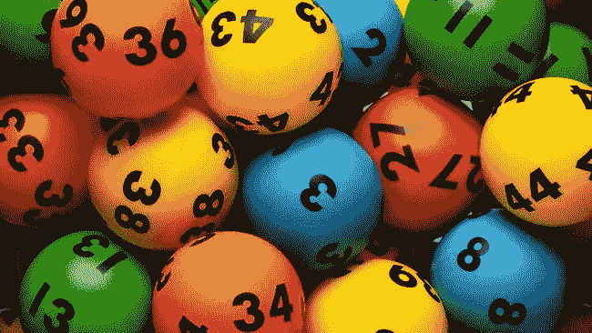

# 球碗(鲍勃) :新的开放的健身房环境

> 原文：<https://medium.datadriveninvestor.com/bowl-of-balls-bob-new-openai-gym-environment-fa4af856f58c?source=collection_archive---------6----------------------->

今天我和你们分享我为 OpenAI Gym 创建的一个新游戏环境。游戏的想法很简单:我们有一个装有编号球(从 1 到 50)的碗。
玩家随机选择两个球(初始状态)，然后计算两个球的差值。
我们的目标是让 5 和 15 之间存在这种差异。
球员有权放回两个球(最小或最大)中的一个，并得到一个新球。这最多可以做 3 次。
球差最高的玩家**获胜，在平局的情况下，球差*大于*的玩家**获胜**。**

[**Image Credit**](http://images.rapgenius.com/azb1cs7gitsp8fz7716y0zeqx.650x366x1.jpg)

# 问题定式化

既然我们知道了游戏规则，我们可以问自己:

> 我们应该丢弃哪个球？敏？麦克斯。在什么情况下可以这样做？最重要的是，我们能否建造一个能从游戏中学习并能回答我们问题的人工智能代理？

# 装置

在构建代理之前，我们需要将环境添加到 OpenAI Gym 中。为此，请下载源代码并遵循 GitHub 上的说明

 [## MHatoum1/gym_bob_env

### 开放式健身房的球碗环境。通过在…上创建帐户，为 MHatoum1/gym_bob_env 开发做出贡献

github.com](https://github.com/MHatoum1/gym_bob_env) 

# 鲍勃 vs 二十一点？

在 OpenAI 健身房现有的环境中，我注意到 21 点是最接近鲍勃的。在这里，我将简要解释允许我们将 BOB 视为一个独立环境的主要区别。

1.  **动作空间:**在 21 点中，我们有两个动作，要么打，要么站。而在 BOB 中，我们有 3 个动作:丢弃最大值、丢弃最小值和站立。
2.  **观察空间:**在 21 点中，观察由玩家当前的总和 *(32 个离散值)*、庄家的一次出牌 *(11 个离散值)*以及玩家是否持有可用的 a 点 *(2 个离散值)组成。*而在 BOB 中，我们有玩家的第一个球 *(50 个离散值)*、玩家的第二个球 *(50 个离散值)*和玩家的最大球 *(49 个离散值)*
3.  **碗 vs 套牌:**二十一点中的套牌可以重复使用，这意味着玩家可以多次获得 a(1)，从而增加获胜的机会。此外，玩家和庄家可以选择相同的卡，例如，他们手中都有一张 a。BOB 的碗是有限的，所以庄家和玩家手中必须有不同的球。如果玩家丢弃了一个球，它将被添加到球中，庄家可以捡起它。

# 其他变更

目前版本的 BOB 由一个装有 50 个球的碗组成。在游戏的新版本中，这个数字可以增加到 99。

除此之外，游戏内部实现的庄家逻辑也可以修改。目前，庄家被配置为检查球之间的差异，如果它满足获胜条件(在 5 和 15 之间)，庄家将选择停止。如果不满足获胜条件，庄家将检查最大的球，如果大于 25，则较小的球将被丢弃，否则将选择丢弃最大的球。

可以做的一个改变与获胜条件有关，我们可以使用不同于 5-15 的范围

# 未来作品

在这篇文章中，我描述了新创建的环境。在下一篇的[中，我将使用强化学习算法实现一些代理，比较它们并分享结果。我们将看看能否回答之前提出的问题。](https://medium.com/@moh.hatoum/strategizing-in-the-bowl-of-balls-game-tips-for-maximizing-your-chance-of-winning-b60c7b08f14e)

 [## 在球碗游戏中运筹帷幄:最大化你获胜机会的技巧

### 你喜欢选择和操作数字的策略游戏吗？如果是这样，你可能想给碗…

medium.com](https://medium.com/@moh.hatoum/strategizing-in-the-bowl-of-balls-game-tips-for-maximizing-your-chance-of-winning-b60c7b08f14e) 

# 最后的话

感谢您花时间阅读这篇文章。请随时分享您的意见和想法。另外，请尝试使用环境，创建代理并分享您的结果。

最后一件事，我想这是有趣的部分，我在我的一个梦里得到了这个游戏的想法(我想我应该叫它噩梦:O)。真的，我梦见了这个游戏，醒来后把它写了下来，然后开始改善环境，让我的梦想成真，:D